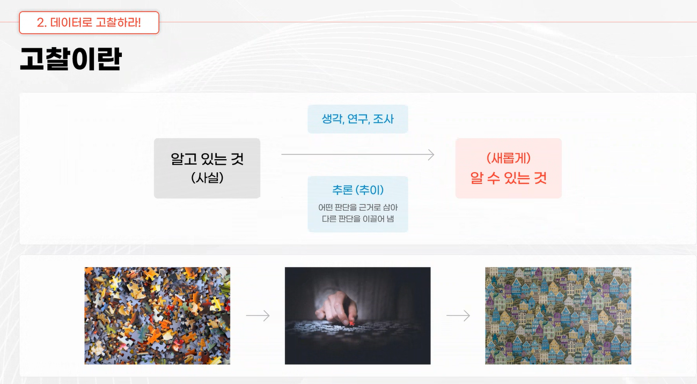

# 내가 해결해야 할 문제는? 
- situation :
- problem 3줄 요약 : 
    - 나는 잔디가 항상 잘 가꾸어졌으면 좋겠지만, 두더지가 우리집정원에 구멍을 파고있어서 스트레스가 심하다. 
    - 두더지도 행복하고 나도 행복하게 살 수 있는 방법은 없을까? 
    - 이 문제를 해결해서 옆집사람을 반대로 놀려주고싶다
    
    
## ★★★★★문제정의가 잘 못 되면 갈등이 많이 생긴다.★★★★★ 
- 다름을 인정해야한다.   

uni =  하나라는의미
verse = 우주 다양함

- universe = 다양함이 결합된 하나 or 하나의 다양한것들  => 다양한 방식으로 해석이 된다. 

### 유클리드 기하학의 논리구조
- 공리: Axiom  => verse를 uni로 만드는것!
- 정의: Definition
- 정리: Theorem
- 증명: Proof

## universe 식 문제 process
- Vertical Formulation
    - (Business Issue>Critical Issue>Data Issue)
    - 
- Horizontal Formulation
    - Business Issue=> data Y factor selection => Y의 Business Valuation => X factor selection => Y = f(x) function select
    - 

## 데이터로 문제 정의 
- 
- 선진국 진입을 데이터로 문제 정의 해보자.
- Vertical Formulation
    - Business Issue: 어떻게 선진국에 진입 할 수 있을까?
    - Critical Issue: 선진국이 되는 기준은 무엇이지? (GDP, GNP, GNI, etc)
        - UN 산하 자문기구인 '지속가능발전해법네트워크(SDSN)'에서 매년 발표하는 **세계행복보고서(World Happiness Report)**가 대표적입니다.
    - Data Issue: 현재 우리의 Data를 기준으로 선진국이 되는 기준을 만족하는가?
- Horizontal Formulation
    - Business Issue: 선진국에 포함되고 싶다. 
    - Data Y factor selection: 선진국의 기준은 무엇인가?
    - Y의 Business Valuation: 

## Issue Formulation
- V-Model
- 

## LG전자 과제 정의서 
- 고객 감동 목표 
- 

## ANSWER Engine Optimization  vs SEO 
- 

- DM(Direct Material) Optimization
    - 3정(**정리**되어있는, **정돈**되어있는partition, **정위치**고수) 5s
- 
- 온톨리지 ! organization을 잘 해야한다. 

- 

- prompt1 

- prompt 2
- 
- 

# 맥락에 맞는 데이터를 규명하라.
- 이번달 소비를 줄여주세요=> 쓸모없는 정보를 준다.=> 스팸() 으로 인식 => 실망고객 
- 국민은행 => 자본금 납입 할때 개인통장에 큰 돈이 들어오면 이상치 감지를 하고, 콜센터를 감지하고 패턴을 확인하고 전화가 온다. 보이스피싱 확인. => 충성고객 
- 

####  소비패턴 분석
- 

- 어떤 사람이 샀는가, 왜 샀는가, 왜 8월은 안샀는가를 알고싶다.
- 기존의 데이털르 사용했기때문에 core value를 알 수 없다. 
- 회사가 Data를 잘 못 다뤘기 때문에 노키아가 망했다. 
- Data 관접에서 접근한다. Bigdata를 사용방법이 노키아를 하락의 길로 미끌었다. 
- 어떻게 인간을 분석할지 방법론이 대단히 중요한 시점이다.  
- Garbage in Garbage out (GIGO) => 데이터가 잘못되면 결과도 잘못된다.

- 소비패턴을 분석하기보다는 어떤 고객이 우리의 제품을 필요로 하는것인지, 그들의 니즈(needs)를 파악하는것이 핵심이지만 소비패턴 Data는 극히적다!. 
- 자신들의 고객table을 가지고 분석한 탁상행정의 전형적인 결과이다. 
- needs Table을 만들어서 따로 관리해야할 것 같다.

## 헬로망고젤리 이고객 소비 패턴 분석

### 1. 월별 매출액 현황

| 월   | 매출액     |
|-----|-----------|
| 1월 | 1,758,788 |
| 2월 | 1,688,792 |
| 3월 | 2,519,053 |
| 4월 | 2,645,463 |
| 5월 | 1,687,612 |
| 6월 | 2,632,800 |
| 7월 | 2,609,260 |
| 9월 | 2,355,523 |
| 10월| 1,716,594 |

- **최대 매출월**: 4월(2,645,463)
- **최소 매출월**: 5월(1,687,612)
- **평균 월 매출액**: 2,179,321

### 2. 소비 패턴 인사이트

- **상반기(3~7월)에 강한 수요 집중**  
  3월~7월 동안 월 매출이 평균 대비 높게 나타나, 해당 기간에 프로모션 또는 소비자 집중 캠페인이 있었던 것으로 분석됩니다. 계절적 수요(예: 봄·여름 간식, 행사용) 가능성도 큽니다.

- **최고 매출월과 이후 급락**  
  4월에 매출이 최고치(2,645,463)에 도달 후, 5월에 급감(1,687,612)하는 변동 폭을 보임. 주기적 프로모션 또는 외부 이슈(이벤트, 물류 등) 영향일 수 있습니다.

- **하반기(9~10월) 매출 하락세**  
  9,10월 매출은 상반기 대비 낮아지는 경향이 있습니다. 이는 방학·명절 등 특수 시즌이 아니거나, 다른 상품과의 경쟁 심화 또는 재구매주기 도달 등 해석이 가능합니다.

### 3. 전문가적 관점의 추가 분석

- **고객군의 충성/충동 구매 혼재**  
  수치상 연초·상반기 집중구매가 뚜렷해, 기존 충성고객(정기구매)과 계절적 충동 소비가 혼재하는 패턴입니다.  
  실제 노벨경제학 수상자 티로르(Jean Tirole) 등이 강조한 바와 같이, 소비자는 가격·이벤트·경험 기반으로 쇼핑 패턴에 민감하게 반응합니다.

- **이벤트/프로모션 최적화 필요성**  
  매출 변동성이 높아, 소비자 선호를 지속적으로 모니터링하여 이벤트 시점, 제품군, 가격 정책을 최적화하는 것이 유효합니다.  
  맞춤형 리타겟팅, 충성 고객 전용 혜택, 장기구매 인센티브 등을 활용하면 수요를 평준화할 수 있습니다.

### 4. 실행 전략 제안

- **프로모션 타이밍 조정:** 3~7월 집중 이벤트 후 9~10월 추가 프로모션으로 비수기 보완
- **고객 세분화 마케팅:** 가격 민감고객/프리미엄 고객군별 차별화된 혜택 제공
- **소비 데이터 주기적 분석:** 월별·계절별 트렌드 정기 추적 및 KPI 도출

> 노벨상 경제학자의 '시장균형 및 소비자 심리' 이론을 근거로, 데이터 기반 맞춤 전략을 통해 **매출 변동성 관리 및 고객 충성도 제고**가 핵심 임무입니다.

## 세상을 보는 4가지 초점 
- 
- (음(수치화 가능성 無: 심리적 공간(I Space), 문화적 공간(We Space)) 양(수치화 가능성 有: 물리적공간(It Space), 시스템적 공간(Its Space)) )
- vertical로 쪼갤 수 있고(), horizontal()로 쪼갤 수 있다. 
- 1사분면과 4사분면은 쪼개져서 본다. 2사분면과 3사분면은 결합으로 본다.
- 1사분면과 2사분면은 물리적, 3사분면과 4사분면은 심리적이다. 

- 아이를 공부 잘 하게 만들기 project
     - 물리적 + Verse
        - 다양한 책을 점할 수 있는 책들을 비치해둔다. 아이의 관심사 needs를 파악해서 흥미위주의 책부터 시작한다. 
     - 시스템적 + Uni
        - 들어오자마자 흥미있는 책이 가장 눈에 먼저 보이도록 책을 비치하고, 흥미유발 시킬 수 있는 something mission을 부여한다.
     - 문화적 + Uni
        - TV를 없앤다. + 함께 책을 읽는 가족 문화를 만든다. 
     - 심리적 + Verse
        - 아이가 책을 읽으면 충분한 보상을 해준다. 
    - 상호 관련지어 해결해야한다.

- 무신사 Sales 극대화 Dimension 
    - 물리적 + Verse
        - 고객의 size등의 정보가 중요하다. 
    - 시스템적 + Uni
        - 물류, 수선센터, 평균, standard deviation, 등 
    - 문화적 + Uni
        - 집단적으로 좋아하는색, Trend, Brand Identity, 무신사 정체성. 
    - 심리적 + Verse
        - 고객의 취향이 중요하다. 
### 이사람에게 대출을 해 줘도 되는가?
- 
- gramin bank의 micro finance 예를 들어 설명해줬다! 

- 넷플릭스  Case
- 
    - 물리적 + Verse
        - 
    - 시스템적 + Uni
        - 
    - 문화적 + Uni
        - 
    - 심리적 + Verse
        - 

# 참신한 통찰로 세상을 바라보자.
- 
- 육안, 임안, 혜안 
- 육안: 관찰,산수,product
- 심안: 고찰, 미적분, process
- 혜안: 통찰, 원리, 

- Data Analysis => Raw Data, 묘사적 분석, 탐색적 분석, 통찰적 분석
- 

- 관찰을 위한 데이터 읽기
- 

- 

1. local business이다. 
2. 지리적 통계를 확인해본 결과 북부에 집중된B사는 온도관련 제품일 가능성이있다. 
3. 지리적 차이가 아니라면 기업의 평판이 북부와 남부의 매출에 기여했을 가능성이 있다.
4. 동부와 서부의 소비성향은 비슷한 것 같다. 
5. 모르겠다.

- 데이터를 다루는 다양한 기술 

- 기회 통찰 매트릭스
- 

- missing link 
- 
- 뜨게질 

- 추리해보기 실습
- 

| 팀     | 전용 구장     | 유니폼 색상 | 후원 회원 수 |
|--------|--------------|------------|--------------|
| FC     | 파랑 hint1      |    |    |
| SV     |       빨강   |    | 400명 hint2       |
| 키커스 |   흰색hint3     |  |    |

- 파란색 유니폼을 입은 FC는 중앙구장을 전용하는 팀보다 후원회원이 적다.
- SV는 후원회원이 400명이다.
- 키커스의 유니폼은 빨강색이 아니다.
- 키커스팀과 공원구장을 전용하는 팀의 후원 회원은 300명이 아니다.

- 더 알아낼 수 있는것은? 
- missing link를 찾아서 하면 된다. 

- UC berkly 성차별 이슈 
- 
- 데이터를 쪼개보면 또 다른 차별점이 나온다. 
- 

- 결합으로도 새로운 사실을 알 수 있다. 
- 
- 구단별 우승횟수와 구단별 감독수 상관관계 : ρ_12 = -1 맨유, 맨시티 

- 백화점의 매출에 영항을 주는 요인들
- 

- 귀저기의 판매(남자가 구매하러감) + 맥주 
- missing lenk를 찾는다

- 기회통찰 매트릭스 : 고찰 실습

- 사실(관찰), 원인(고찰), key insight(통찰)
- 요리 후 청소를 진행하는 고객이있다. 하루에 여러번 청소를 사용하는 고객이 10.7% 이다. 단일모드 사용 고객은 68.5%이다. 동일모드를 2회이상 반복사용하는 고객은 15.1%이다. 청소시, 2가지 모드 이상 사용고객은 31.5%이다. 

- 통찰 : Data를 통해서 알게 된 그 모든 것을 하나로 꿰어, 알고 싶은 것을 확정하고 결론 내는 과정.
- 

- 비약적 사고 : 이전에 없었던것이 새롭게 나타나는것. 
- 암모니아  
- The AHA Moment => Eureka => 사안의 본질과 의미가 온전히 드러나는 순간!

## 결과와 결론은 다르다. 
- 

- 
- CX 과정에서 Context들을 꼭 읽어보고 GPT가 할 수 없는 부분을 인간들이 보충해야한다. 

## 어떤 결론을 낼 수 있을까?

- 

- 대한민국의 지정학적 Risk에 의하여 해외에 분산투자가 할 필요가 있음. 따라서 (고찰6)해외의 부동산을 underline asset으로 하는 (관찰5) derived Financial institute investment 상품을 개발했다. 
- 관찰9 + 관찰3 을통한 비유동성 자산보다, 안정적인 수익을 획득 할 수 있는 유동성이 높은 금융상품을 보유하는것이 유리하지 않겠냐?   

- 국제정세의 급격한 변동으로 인한 실물자산의 보유량을 늘리셔야한다(금), 따라서 gold bar 의 보유를 늘리시라~ 

### 기회 통찰 매트릭스
- 
- 고객들의 pain point를 찾는것이 사실이 될 것이다. 그래서 우리는 이런문제를 해결해야겠다!! 라는 식으로 BX 프로젝트 진행
- 보고서에 반드시 나와야 할 사항이다. 한 장이 나와야한다. 

# key chart 
- V - Model 
- 기회 통찰 매트릭스 
