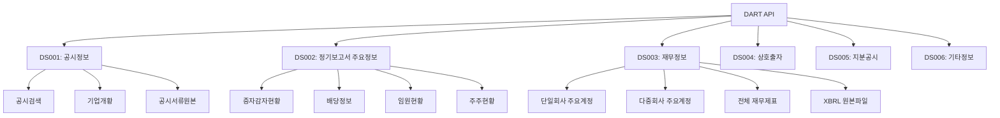
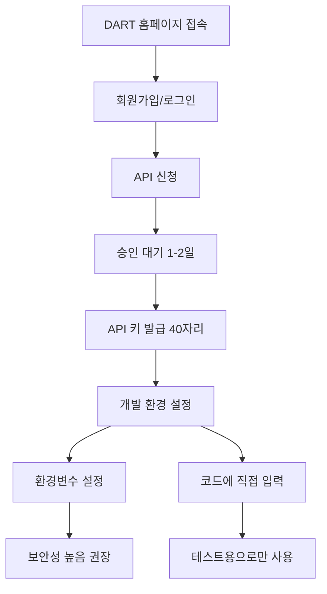
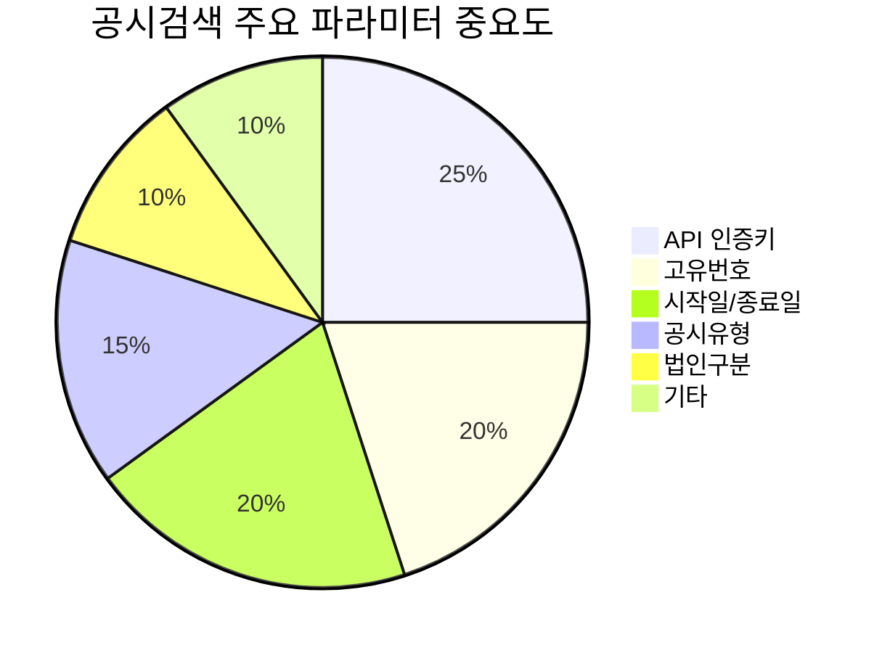
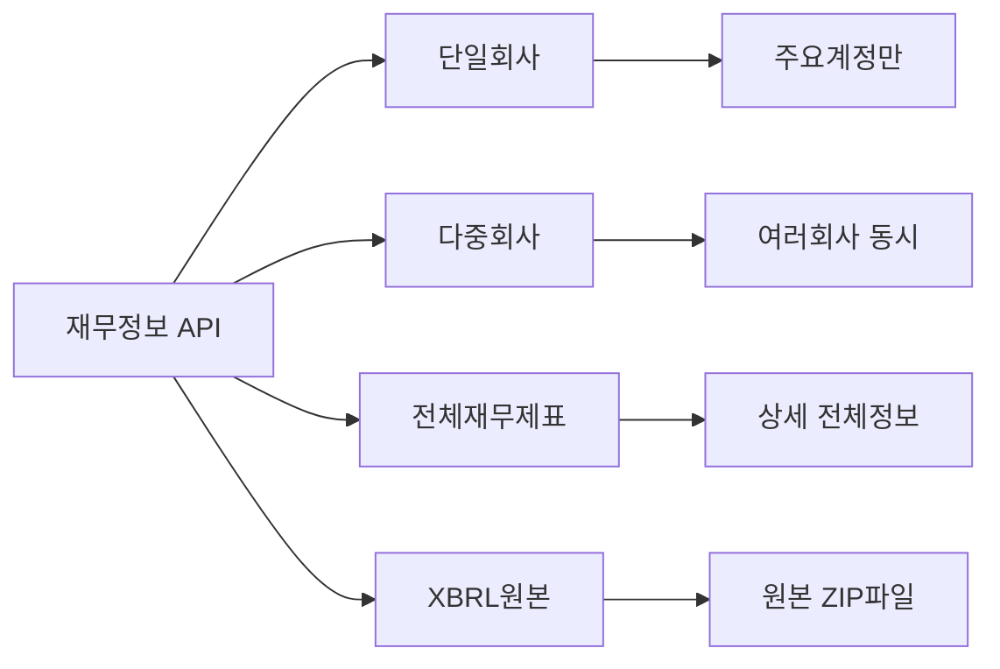
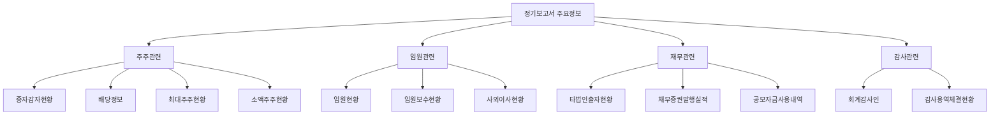
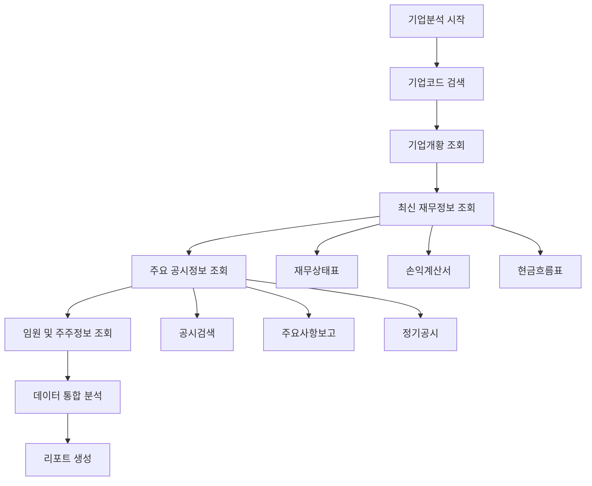
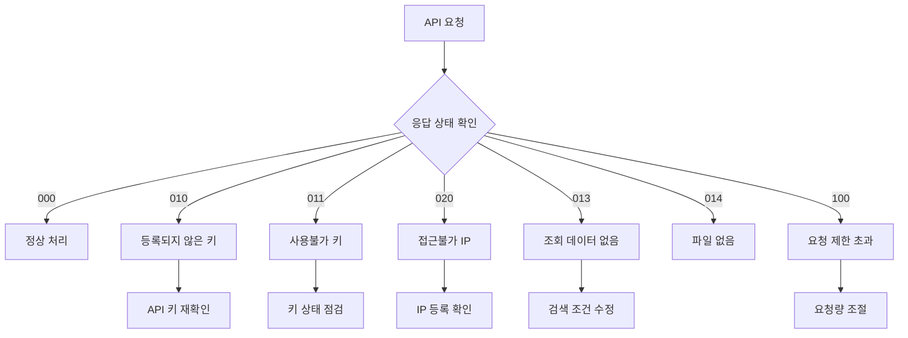
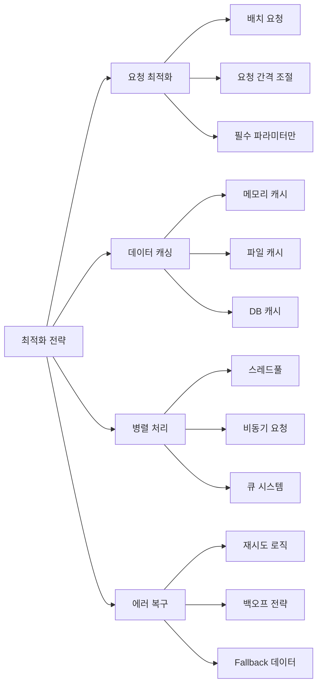

# DART 전자공시 Open API 활용 가이드

> **📊 AI Agent를 위한 DART API 정보 수집 실무 가이드**

## 📚 목차

1. [DART API 개요](#dart-api-개요)
2. [API 인증 및 설정](#api-인증-및-설정)
3. [주요 API 카테고리별 활용법](#주요-api-카테고리별-활용법)
4. [실무 활용 시나리오](#실무-활용-시나리오)
5. [Python 구현 예제](#python-구현-예제)
6. [에러 처리 가이드](#에러-처리-가이드)
7. [최적화 팁](#최적화-팁)

---

## DART API 개요

### 🎯 DART API 전체 구조



### 🔑 핵심 특징

- **Base URL**: `https://opendart.fss.or.kr/api/`
- **지원 형식**: JSON, XML, Binary(ZIP)
- **인증 방식**: API Key 기반
- **요청 제한**: 일반적으로 20,000건/일
- **데이터 범위**: 2015년 이후 정보 제공

---

## API 인증 및 설정

### 🔐 API 키 발급 및 설정



### ⚙️ 기본 설정

```python
import os
import requests
import json
from datetime import datetime, timedelta

# API 설정 (환경변수 사용 권장)
DART_API_KEY = os.getenv('DART_API_KEY', 'YOUR_API_KEY_HERE')
BASE_URL = 'https://opendart.fss.or.kr/api'

# 공통 헤더
HEADERS = {
    'User-Agent': 'Mozilla/5.0 (Windows NT 10.0; Win64; x64) AppleWebKit/537.36'
}
```

---

## 주요 API 카테고리별 활용법

### 📋 1. 공시정보 (DS001)

#### 1.1 공시검색 API



**주요 파라미터:**

| 파라미터 | 설명 | 필수 | 예시값 |
|---------|------|------|-------|
| `crtfc_key` | API 인증키 | Y | 40자리 키 |
| `corp_code` | 고유번호 | N | 00126380 (삼성전자) |
| `bgn_de` | 시작일 | N | 20240101 |
| `end_de` | 종료일 | N | 20241231 |
| `pblntf_ty` | 공시유형 | N | A(정기), B(주요사항) |
| `corp_cls` | 법인구분 | N | Y(유가), K(코스닥) |

**실무 활용 코드:**

```python
def search_disclosure(corp_code=None, start_date=None, end_date=None, 
                     disclosure_type=None, corp_cls=None, page_no=1, page_count=10):
    """
    공시 검색 함수
    """
    url = f"{BASE_URL}/list.json"
    
    params = {
        'crtfc_key': DART_API_KEY,
        'page_no': page_no,
        'page_count': min(page_count, 100)  # 최대 100건
    }
    
    # 선택적 파라미터 추가
    if corp_code:
        params['corp_code'] = corp_code
    if start_date:
        params['bgn_de'] = start_date
    if end_date:
        params['end_de'] = end_date
    if disclosure_type:
        params['pblntf_ty'] = disclosure_type
    if corp_cls:
        params['corp_cls'] = corp_cls
    
    try:
        response = requests.get(url, params=params, headers=HEADERS, timeout=30)
        response.raise_for_status()
        return response.json()
    except requests.RequestException as e:
        print(f"API 요청 오류: {e}")
        return None
```

#### 1.2 기업개황 API

```python
def get_company_info(corp_code):
    """
    기업 기본 정보 조회
    """
    url = f"{BASE_URL}/company.json"
    params = {
        'crtfc_key': DART_API_KEY,
        'corp_code': corp_code
    }
    
    try:
        response = requests.get(url, params=params, headers=HEADERS, timeout=30)
        response.raise_for_status()
        return response.json()
    except requests.RequestException as e:
        print(f"기업정보 조회 오류: {e}")
        return None
```

### 💰 2. 재무정보 (DS003)

#### 2.1 단일회사 주요계정



**보고서 코드:**

```python
REPORT_CODES = {
    '1분기': '11013',
    '반기': '11012', 
    '3분기': '11014',
    '사업보고서': '11011'
}

FS_DIVISIONS = {
    '개별': 'OFS',  # 재무제표
    '연결': 'CFS'   # 연결재무제표
}
```

**재무정보 조회 함수:**

```python
def get_financial_info(corp_code, bsns_year, reprt_code, fs_div='CFS'):
    """
    단일회사 재무정보 조회
    
    Args:
        corp_code: 고유번호 (8자리)
        bsns_year: 사업연도 (4자리)
        reprt_code: 보고서코드 (11011, 11012, 11013, 11014)
        fs_div: 개별/연결구분 (OFS/CFS)
    """
    url = f"{BASE_URL}/fnlttSinglAcnt.json"
    
    params = {
        'crtfc_key': DART_API_KEY,
        'corp_code': corp_code,
        'bsns_year': bsns_year,
        'reprt_code': reprt_code
    }
    
    try:
        response = requests.get(url, params=params, headers=HEADERS, timeout=30)
        response.raise_for_status()
        data = response.json()
        
        # 연결/개별 구분 필터링
        if data.get('list'):
            filtered_data = [item for item in data['list'] if item.get('fs_div') == fs_div]
            data['list'] = filtered_data
            
        return data
    except requests.RequestException as e:
        print(f"재무정보 조회 오류: {e}")
        return None
```

#### 2.2 다중회사 비교 분석

```python
def get_multi_company_financial(corp_codes, bsns_year, reprt_code):
    """
    여러 회사 재무정보 동시 조회 (최대 100개)
    """
    url = f"{BASE_URL}/fnlttMultiAcnt.json"
    
    # 고유번호를 콤마로 구분
    corp_codes_str = ','.join(corp_codes[:100])  # 최대 100개 제한
    
    params = {
        'crtfc_key': DART_API_KEY,
        'corp_code': corp_codes_str,
        'bsns_year': bsns_year,
        'reprt_code': reprt_code
    }
    
    try:
        response = requests.get(url, params=params, headers=HEADERS, timeout=30)
        response.raise_for_status()
        return response.json()
    except requests.RequestException as e:
        print(f"다중회사 재무정보 조회 오류: {e}")
        return None
```

### 📊 3. 정기보고서 주요정보 (DS002)

#### 3.1 주요정보 카테고리



**주요정보 조회 예제:**

```python
def get_dividend_info(corp_code, bsns_year, reprt_code):
    """배당정보 조회"""
    url = f"{BASE_URL}/alotMatter.json"
    params = {
        'crtfc_key': DART_API_KEY,
        'corp_code': corp_code,
        'bsns_year': bsns_year,
        'reprt_code': reprt_code
    }
    
    try:
        response = requests.get(url, params=params, headers=HEADERS, timeout=30)
        response.raise_for_status()
        return response.json()
    except requests.RequestException as e:
        print(f"배당정보 조회 오류: {e}")
        return None

def get_executive_info(corp_code, bsns_year, reprt_code):
    """임원현황 조회"""
    url = f"{BASE_URL}/exctvSttus.json"
    params = {
        'crtfc_key': DART_API_KEY,
        'corp_code': corp_code,
        'bsns_year': bsns_year,
        'reprt_code': reprt_code
    }
    
    try:
        response = requests.get(url, params=params, headers=HEADERS, timeout=30)
        response.raise_for_status()
        return response.json()
    except requests.RequestException as e:
        print(f"임원현황 조회 오류: {e}")
        return None
```

---

## 실무 활용 시나리오

### 🎯 시나리오 1: 종합 기업분석 시스템



```python
class DARTAnalyzer:
    def __init__(self, api_key):
        self.api_key = api_key
        self.base_url = 'https://opendart.fss.or.kr/api'
    
    def comprehensive_analysis(self, corp_code, analysis_year):
        """종합 기업분석"""
        results = {
            'company_info': None,
            'financial_data': None,
            'disclosure_data': None,
            'dividend_info': None,
            'executive_info': None
        }
        
        # 1. 기업개황
        results['company_info'] = self.get_company_info(corp_code)
        
        # 2. 최신 재무정보 (사업보고서)
        results['financial_data'] = self.get_financial_info(
            corp_code, analysis_year, '11011'
        )
        
        # 3. 최근 공시정보
        end_date = datetime.now().strftime('%Y%m%d')
        start_date = (datetime.now() - timedelta(days=90)).strftime('%Y%m%d')
        results['disclosure_data'] = self.search_disclosure(
            corp_code, start_date, end_date
        )
        
        # 4. 배당정보
        results['dividend_info'] = self.get_dividend_info(
            corp_code, analysis_year, '11011'
        )
        
        # 5. 임원정보
        results['executive_info'] = self.get_executive_info(
            corp_code, analysis_year, '11011'
        )
        
        return results
    
    def generate_analysis_report(self, results):
        """분석 리포트 생성"""
        report = []
        
        # 기업 기본정보
        if results['company_info']:
            company = results['company_info']
            report.append(f"=== {company.get('corp_name', 'N/A')} 기업분석 ===")
            report.append(f"종목코드: {company.get('stock_code', 'N/A')}")
            report.append(f"업종: {company.get('induty_code', 'N/A')}")
            report.append(f"설립일: {company.get('est_dt', 'N/A')}")
        
        # 재무정보 요약
        if results['financial_data'] and results['financial_data'].get('list'):
            report.append("\n=== 주요 재무지표 ===")
            for item in results['financial_data']['list'][:10]:  # 상위 10개
                report.append(f"{item.get('account_nm', 'N/A')}: {item.get('thstrm_amount', 'N/A')}")
        
        # 최근 공시 요약
        if results['disclosure_data'] and results['disclosure_data'].get('list'):
            report.append("\n=== 최근 주요 공시 ===")
            for item in results['disclosure_data']['list'][:5]:  # 최근 5개
                report.append(f"{item.get('rcept_dt', 'N/A')}: {item.get('report_nm', 'N/A')}")
        
        return '\n'.join(report)
```

### 🎯 시나리오 2: 경쟁사 재무비교 시스템

```python
def compare_competitors(competitor_codes, analysis_year, comparison_accounts):
    """
    경쟁사 재무 비교 분석
    
    Args:
        competitor_codes: 경쟁사 고유번호 리스트
        analysis_year: 분석년도
        comparison_accounts: 비교할 계정명 리스트
    """
    
    # 다중회사 재무정보 조회
    financial_data = get_multi_company_financial(
        competitor_codes, analysis_year, '11011'
    )
    
    if not financial_data or not financial_data.get('list'):
        return None
    
    # 회사별 재무데이터 정리
    company_data = {}
    for item in financial_data['list']:
        corp_code = item.get('corp_code')
        account_nm = item.get('account_nm')
        amount = item.get('thstrm_amount', 0)
        
        if corp_code not in company_data:
            company_data[corp_code] = {}
        
        company_data[corp_code][account_nm] = amount
    
    # 비교 분석 결과 생성
    comparison_result = []
    for account in comparison_accounts:
        account_comparison = {'account': account, 'companies': []}
        
        for corp_code in competitor_codes:
            if corp_code in company_data:
                amount = company_data[corp_code].get(account, 0)
                account_comparison['companies'].append({
                    'corp_code': corp_code,
                    'amount': amount
                })
        
        # 금액 기준 정렬
        account_comparison['companies'].sort(
            key=lambda x: float(str(x['amount']).replace(',', '') or 0), 
            reverse=True
        )
        
        comparison_result.append(account_comparison)
    
    return comparison_result
```

---

## Python 구현 예제

### 📝 완전한 DART API 클래스

```python
import os
import requests
import json
import time
from datetime import datetime, timedelta
from typing import Optional, List, Dict, Any

class DARTClient:
    """DART API 클라이언트"""
    
    def __init__(self, api_key: str):
        self.api_key = api_key
        self.base_url = 'https://opendart.fss.or.kr/api'
        self.session = requests.Session()
        self.session.headers.update({
            'User-Agent': 'DART-API-Client/1.0'
        })
        
        # 요청 제한을 위한 설정
        self.last_request_time = 0
        self.min_request_interval = 0.1  # 100ms 간격
    
    def _wait_for_rate_limit(self):
        """요청 간격 제한"""
        current_time = time.time()
        elapsed = current_time - self.last_request_time
        
        if elapsed < self.min_request_interval:
            time.sleep(self.min_request_interval - elapsed)
        
        self.last_request_time = time.time()
    
    def _make_request(self, endpoint: str, params: Dict[str, Any]) -> Optional[Dict]:
        """API 요청 실행"""
        self._wait_for_rate_limit()
        
        params['crtfc_key'] = self.api_key
        url = f"{self.base_url}/{endpoint}"
        
        try:
            response = self.session.get(url, params=params, timeout=30)
            response.raise_for_status()
            
            data = response.json()
            
            # 에러 체크
            if data.get('status') != '000':
                error_msg = data.get('message', 'Unknown error')
                print(f"API 오류: {error_msg}")
                return None
                
            return data
            
        except requests.RequestException as e:
            print(f"요청 오류: {e}")
            return None
        except json.JSONDecodeError as e:
            print(f"JSON 파싱 오류: {e}")
            return None
    
    def search_disclosure(self, corp_code: Optional[str] = None, 
                         start_date: Optional[str] = None,
                         end_date: Optional[str] = None,
                         disclosure_type: Optional[str] = None,
                         corp_cls: Optional[str] = None,
                         page_no: int = 1,
                         page_count: int = 10) -> Optional[Dict]:
        """공시검색"""
        params = {
            'page_no': page_no,
            'page_count': min(page_count, 100)
        }
        
        # 옵션 파라미터 추가
        optional_params = {
            'corp_code': corp_code,
            'bgn_de': start_date,
            'end_de': end_date,
            'pblntf_ty': disclosure_type,
            'corp_cls': corp_cls
        }
        
        for key, value in optional_params.items():
            if value is not None:
                params[key] = value
        
        return self._make_request('list.json', params)
    
    def get_company_info(self, corp_code: str) -> Optional[Dict]:
        """기업개황"""
        params = {'corp_code': corp_code}
        return self._make_request('company.json', params)
    
    def get_financial_statement(self, corp_code: str, 
                              bsns_year: str,
                              reprt_code: str,
                              fs_div: str = 'CFS') -> Optional[Dict]:
        """재무제표 조회"""
        params = {
            'corp_code': corp_code,
            'bsns_year': bsns_year,
            'reprt_code': reprt_code,
            'fs_div': fs_div
        }
        return self._make_request('fnlttSinglAcntAll.json', params)
    
    def get_multi_company_financial(self, corp_codes: List[str],
                                  bsns_year: str,
                                  reprt_code: str) -> Optional[Dict]:
        """다중회사 재무정보"""
        params = {
            'corp_code': ','.join(corp_codes[:100]),  # 최대 100개
            'bsns_year': bsns_year,
            'reprt_code': reprt_code
        }
        return self._make_request('fnlttMultiAcnt.json', params)
```

### 🔧 사용 예제

```python
# DART 클라이언트 초기화
dart_client = DARTClient('YOUR_API_KEY_HERE')

# 삼성전자 정보 조회
samsung_code = '00126380'

# 1. 기업개황
company_info = dart_client.get_company_info(samsung_code)
print(f"회사명: {company_info.get('corp_name')}")

# 2. 최근 공시 조회
recent_disclosures = dart_client.search_disclosure(
    corp_code=samsung_code,
    start_date='20240101',
    end_date='20241231',
    page_count=5
)

# 3. 재무정보 조회 (2023년 사업보고서)
financial_data = dart_client.get_financial_statement(
    corp_code=samsung_code,
    bsns_year='2023',
    reprt_code='11011'  # 사업보고서
)

# 4. 경쟁사 비교 (삼성전자 vs LG전자)
lg_code = '00401731'
competitor_analysis = dart_client.get_multi_company_financial(
    corp_codes=[samsung_code, lg_code],
    bsns_year='2023',
    reprt_code='11011'
)
```

---

## 에러 처리 가이드

### 🚨 주요 에러 코드 및 처리



**에러 처리 함수:**

```python
def handle_dart_error(response_data):
    """DART API 에러 처리"""
    if not response_data:
        return "응답 데이터가 없습니다."
    
    status = response_data.get('status', '999')
    message = response_data.get('message', 'Unknown error')
    
    error_messages = {
        '000': '정상',
        '010': 'API 키를 확인해주세요. 등록되지 않은 키입니다.',
        '011': 'API 키가 일시 중지되었습니다. 관리자에게 문의하세요.',
        '020': 'IP 주소가 등록되지 않았습니다.',
        '013': '조회된 데이터가 없습니다. 검색 조건을 확인하세요.',
        '014': '요청한 파일이 존재하지 않습니다.',
        '100': '일일 요청 제한을 초과했습니다. 내일 다시 시도하세요.',
        '101': '조회 가능한 회사 개수를 초과했습니다. (최대 100건)',
        '800': '필드값이 부적절합니다.',
        '900': '시스템 점검 중입니다.',
        '901': '정의되지 않은 오류가 발생했습니다.'
    }
    
    return error_messages.get(status, f"오류 ({status}): {message}")

# 사용 예제
def safe_api_request(dart_client, method_name, *args, **kwargs):
    """안전한 API 요청"""
    try:
        method = getattr(dart_client, method_name)
        result = method(*args, **kwargs)
        
        if not result:
            return None, "API 응답이 없습니다."
        
        if result.get('status') != '000':
            error_msg = handle_dart_error(result)
            return None, error_msg
        
        return result, "성공"
        
    except Exception as e:
        return None, f"예외 발생: {str(e)}"

# 사용법
result, message = safe_api_request(
    dart_client, 
    'get_company_info', 
    '00126380'
)

if result:
    print("성공:", result['corp_name'])
else:
    print("실패:", message)
```

---

## 최적화 팁

### ⚡ 성능 최적화 전략



### 🚀 최적화 구현

```python
import functools
import threading
import time
from concurrent.futures import ThreadPoolExecutor, as_completed
from typing import List, Tuple, Callable

class OptimizedDARTClient(DARTClient):
    """최적화된 DART API 클라이언트"""
    
    def __init__(self, api_key: str, cache_size: int = 1000):
        super().__init__(api_key)
        self.cache = {}
        self.cache_lock = threading.Lock()
        self.max_cache_size = cache_size
    
    def _get_cache_key(self, endpoint: str, params: Dict) -> str:
        """캐시 키 생성"""
        # API 키 제외하고 캐시 키 생성
        cache_params = {k: v for k, v in params.items() if k != 'crtfc_key'}
        key_str = f"{endpoint}_{json.dumps(cache_params, sort_keys=True)}"
        return key_str
    
    def _get_from_cache(self, cache_key: str) -> Optional[Dict]:
        """캐시에서 데이터 조회 (TTL: 1시간)"""
        with self.cache_lock:
            if cache_key in self.cache:
                data, timestamp = self.cache[cache_key]
                # 1시간 TTL
                if time.time() - timestamp < 3600:
                    return data
                else:
                    del self.cache[cache_key]
        return None
    
    def _set_cache(self, cache_key: str, data: Dict):
        """캐시에 데이터 저장"""
        with self.cache_lock:
            # 캐시 크기 제한
            if len(self.cache) >= self.max_cache_size:
                # 가장 오래된 항목 제거
                oldest_key = min(self.cache.keys(), 
                               key=lambda k: self.cache[k][1])
                del self.cache[oldest_key]
            
            self.cache[cache_key] = (data, time.time())
    
    def _make_request(self, endpoint: str, params: Dict[str, Any]) -> Optional[Dict]:
        """캐시 지원 요청"""
        cache_key = self._get_cache_key(endpoint, params)
        
        # 캐시 확인
        cached_data = self._get_from_cache(cache_key)
        if cached_data:
            return cached_data
        
        # API 요청
        data = super()._make_request(endpoint, params)
        
        # 성공한 응답만 캐시
        if data and data.get('status') == '000':
            self._set_cache(cache_key, data)
        
        return data
    
    def batch_company_info(self, corp_codes: List[str], 
                          max_workers: int = 5) -> Dict[str, Dict]:
        """여러 회사 정보 병렬 조회"""
        results = {}
        
        def fetch_company_info(corp_code: str) -> Tuple[str, Dict]:
            info = self.get_company_info(corp_code)
            return corp_code, info
        
        with ThreadPoolExecutor(max_workers=max_workers) as executor:
            # 모든 작업 제출
            future_to_code = {
                executor.submit(fetch_company_info, code): code 
                for code in corp_codes
            }
            
            # 결과 수집
            for future in as_completed(future_to_code):
                try:
                    corp_code, info = future.result(timeout=30)
                    results[corp_code] = info
                except Exception as e:
                    code = future_to_code[future]
                    print(f"Error fetching {code}: {e}")
                    results[code] = None
        
        return results
    
    def retry_request(self, func: Callable, max_retries: int = 3, 
                     backoff_factor: float = 1.0) -> Optional[Dict]:
        """재시도 로직이 있는 요청"""
        for attempt in range(max_retries):
            try:
                result = func()
                if result and result.get('status') == '000':
                    return result
                
                # 일시적 오류인 경우 재시도
                status = result.get('status') if result else '999'
                if status in ['100', '900', '901']:  # 요청제한, 시스템점검, 정의안됨
                    if attempt < max_retries - 1:
                        wait_time = backoff_factor * (2 ** attempt)
                        print(f"재시도 대기: {wait_time}초 (시도 {attempt + 1}/{max_retries})")
                        time.sleep(wait_time)
                        continue
                
                return result
                
            except Exception as e:
                if attempt < max_retries - 1:
                    wait_time = backoff_factor * (2 ** attempt)
                    print(f"예외로 인한 재시도: {e} (대기: {wait_time}초)")
                    time.sleep(wait_time)
                else:
                    print(f"최종 실패: {e}")
                    
        return None

# 사용 예제
optimized_client = OptimizedDARTClient('YOUR_API_KEY')

# 1. 배치 회사정보 조회
company_codes = ['00126380', '00401731', '00164779']  # 삼성전자, LG전자, 현대차
batch_results = optimized_client.batch_company_info(company_codes)

# 2. 재시도 로직 사용
reliable_result = optimized_client.retry_request(
    lambda: optimized_client.get_company_info('00126380')
)
```

### 📈 데이터 분석 도우미

```python
class DARTAnalyzer:
    """DART 데이터 분석 도우미"""
    
    @staticmethod
    def extract_key_financials(financial_data: Dict) -> Dict[str, str]:
        """주요 재무지표 추출"""
        if not financial_data or not financial_data.get('list'):
            return {}
        
        key_accounts = {
            '자산총계': '총자산',
            '부채총계': '총부채', 
            '자본총계': '총자본',
            '매출액': '매출액',
            '영업이익': '영업이익',
            '당기순이익': '당기순이익'
        }
        
        result = {}
        for item in financial_data['list']:
            account_nm = item.get('account_nm', '')
            amount = item.get('thstrm_amount', '0')
            
            for key_account, display_name in key_accounts.items():
                if key_account in account_nm:
                    result[display_name] = amount
                    break
        
        return result
    
    @staticmethod
    def calculate_financial_ratios(financials: Dict[str, str]) -> Dict[str, float]:
        """재무비율 계산"""
        ratios = {}
        
        try:
            # 문자열을 숫자로 변환 (콤마 제거)
            def to_number(value_str: str) -> float:
                if not value_str or value_str == '-':
                    return 0.0
                return float(str(value_str).replace(',', ''))
            
            assets = to_number(financials.get('총자산', '0'))
            liabilities = to_number(financials.get('총부채', '0'))
            equity = to_number(financials.get('총자본', '0'))
            revenue = to_number(financials.get('매출액', '0'))
            operating_income = to_number(financials.get('영업이익', '0'))
            net_income = to_number(financials.get('당기순이익', '0'))
            
            # 부채비율
            if equity > 0:
                ratios['부채비율'] = (liabilities / equity) * 100
            
            # 자기자본비율
            if assets > 0:
                ratios['자기자본비율'] = (equity / assets) * 100
            
            # 영업이익률
            if revenue > 0:
                ratios['영업이익률'] = (operating_income / revenue) * 100
                ratios['순이익률'] = (net_income / revenue) * 100
            
            # ROE (자기자본이익률)
            if equity > 0:
                ratios['ROE'] = (net_income / equity) * 100
            
            # ROA (총자산이익률)
            if assets > 0:
                ratios['ROA'] = (net_income / assets) * 100
            
        except (ValueError, ZeroDivisionError) as e:
            print(f"재무비율 계산 오류: {e}")
        
        return ratios
    
    @staticmethod
    def format_amount(amount_str: str) -> str:
        """금액 포맷팅 (억원 단위)"""
        try:
            if not amount_str or amount_str == '-':
                return '0억원'
            
            amount = float(str(amount_str).replace(',', ''))
            
            if amount >= 1_0000_0000:  # 1조 이상
                return f"{amount / 1_0000_0000:.1f}조원"
            elif amount >= 1_0000:  # 1억 이상
                return f"{amount / 1_0000:.1f}억원"
            else:
                return f"{amount:,.0f}원"
                
        except (ValueError, TypeError):
            return amount_str

# 분석 예제
analyzer = DARTAnalyzer()

# 재무데이터에서 주요 지표 추출
key_financials = analyzer.extract_key_financials(financial_data)
print("주요 재무지표:")
for name, amount in key_financials.items():
    formatted_amount = analyzer.format_amount(amount)
    print(f"  {name}: {formatted_amount}")

# 재무비율 계산
ratios = analyzer.calculate_financial_ratios(key_financials)
print("\n재무비율:")
for ratio_name, ratio_value in ratios.items():
    print(f"  {ratio_name}: {ratio_value:.2f}%")
```

---

## 📋 체크리스트

### ✅ 개발 전 준비사항

- [ ] DART API 키 발급 완료
- [ ] IP 주소 등록 (필요시)
- [ ] 개발 환경 설정 (Python, requests 라이브러리)
- [ ] API 사용량 제한 확인 (일 20,000건)

### ✅ 구현 시 확인사항

- [ ] API 키 보안 처리 (환경변수 사용)
- [ ] 요청 간격 제한 구현 (Rate Limiting)
- [ ] 에러 처리 로직 구현
- [ ] 캐싱 메커니즘 구현 (선택사항)
- [ ] 로깅 시스템 구현

### ✅ 운영 시 점검사항

- [ ] API 응답 상태 모니터링
- [ ] 일일 사용량 추적
- [ ] 에러 발생률 모니터링
- [ ] 성능 지표 측정 (응답시간, 처리량)
- [ ] 데이터 품질 검증

---

## 🔗 참고 링크

- **DART API 공식 문서**: https://opendart.fss.or.kr/guide/main.do
- **DART 전자공시시스템**: https://dart.fss.or.kr/
- **금융감독원**: https://www.fss.or.kr/
- **API 신청**: https://opendart.fss.or.kr/uss/umt/EgovMbRegist.do

---

## 📞 문의 및 지원

- **기술 문의**: opendart@fss.or.kr
- **시스템 장애**: 국번없이 1332 (5번 → 1번 → 1번)
- **기업공시 문의**: 국번없이 1332 (5번 → 1번 → 2,3,4,5번)

---

> **💡 AI Agent 활용 팁**
> 
> 이 가이드의 코드와 예제들을 기반으로 AI Agent가 DART API를 효과적으로 활용할 수 있습니다. 
> 특히 에러 처리, 캐싱, 재시도 로직 등은 안정적인 데이터 수집을 위해 필수적입니다.
> 
> 정기적으로 API 사용량을 모니터링하고, 필요시 Premium 계정 업그레이드를 고려하세요.