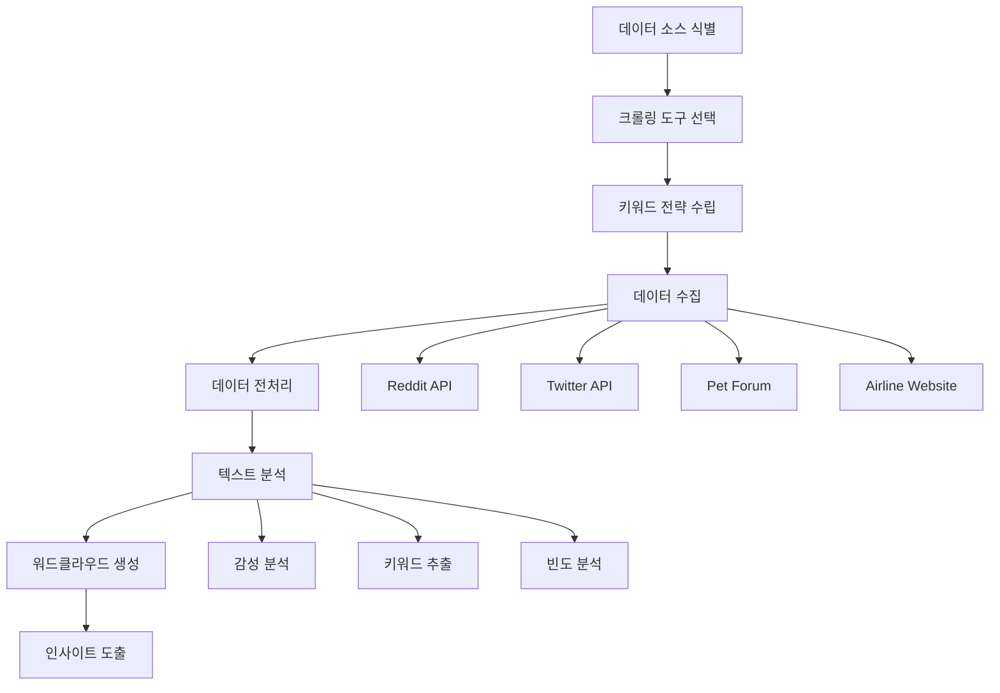
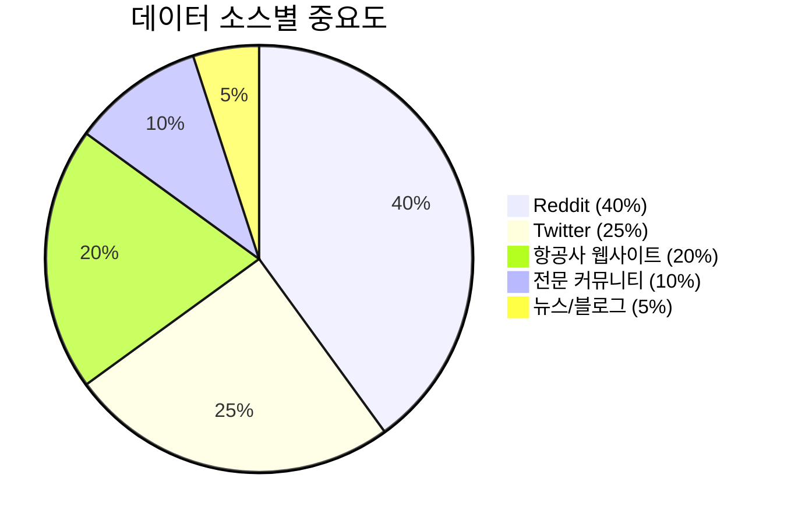
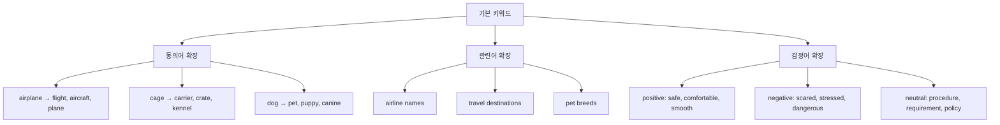
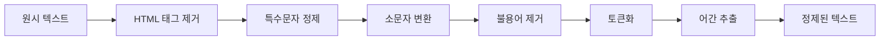
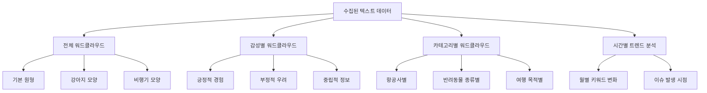
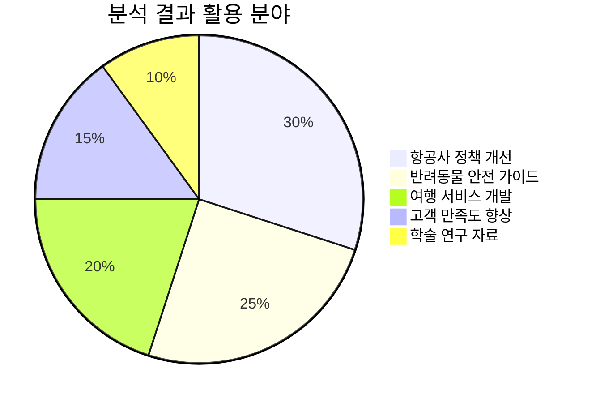
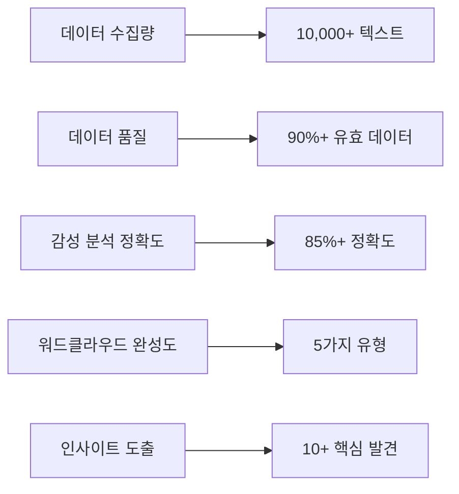

# 🐕 반려동물 항공 운송 크롤링 전략 가이드

## 📊 프로젝트 개요

**목표**: 반려동물 항공 운송 관련 정보를 크롤링하여 워드클라우드로 시각화
**핵심 키워드**: `airplane + cage + dog in cargo`
**최종 산출물**: 워드클라우드 시각화 + 감성 분석 리포트

### 🎯 크롤링 전략 개요



## 🔍 1단계: 데이터 소스 식별

### 📱 소셜미디어 플랫폼
- **Reddit**: r/dogs, r/travel, r/pets, r/AirTravel
- **Twitter**: 실시간 경험담, 항공사 멘션
- **Facebook Groups**: 반려동물 여행 그룹
- **Instagram**: 해시태그 기반 이미지+텍스트

### 🏢 전문 사이트
- **항공사 공식 웹사이트**: 
  - 대한항공, 아시아나항공, 델타항공, 아메리칸항공 등
  - 반려동물 운송 정책 페이지
- **반려동물 커뮤니티**:
  - PetTravel.com
  - BringFido.com
  - 국내 반려동물 카페

### 📰 뉴스 및 블로그
- **뉴스 사이트**: 반려동물 관련 항공 사고/정책 기사
- **여행 블로그**: 실제 경험담, 팁, 후기
- **전문 블로그**: 수의사, 펫시터 블로그



## 🛠️ 2단계: 크롤링 도구 및 기술 스택

### 🐍 Python 기반 크롤링 스택

#### 핵심 라이브러리
```python
# 웹 크롤링
import requests
import selenium
from bs4 import BeautifulSoup
import scrapy

# API 접근
import praw  # Reddit API
import tweepy  # Twitter API
import facebook  # Facebook Graph API

# 데이터 처리
import pandas as pd
import numpy as np
import re
import nltk
from textblob import TextBlob

# 시각화
import matplotlib.pyplot as plt
import wordcloud
from wordcloud import WordCloud
import seaborn as sns
import plotly.express as px

# 한국어 처리
import konlpy
from konlpy.tag import Okt, Kkma
```

#### 권장 도구별 사용 용도

| 도구 | 사용 목적 | 장점 | 단점 |
|------|-----------|------|------|
| **requests + BeautifulSoup** | 정적 웹사이트 | 간단, 빠름 | 동적 콘텐츠 한계 |
| **Selenium** | 동적 웹사이트 | JavaScript 처리 | 느림, 리소스 많이 사용 |
| **Scrapy** | 대규모 크롤링 | 효율적, 확장성 | 학습곡선 |
| **API 기반** | 소셜미디어 | 안정적, 구조화 | 제한사항 있음 |

## 🎯 3단계: 핵심 키워드 전략

### 🔤 기본 키워드 세트

#### 영어 키워드
```python
primary_keywords = [
    # 기본 조합
    "airplane cage dog cargo",
    "pet travel airplane",
    "dog flight cargo hold",
    
    # 구체적 상황
    "dog died airplane cargo",
    "pet carrier airplane requirements",
    "airline pet policy cargo",
    
    # 감정적 키워드
    "scared dog airplane",
    "pet anxiety flight",
    "dog stress cargo hold"
]

secondary_keywords = [
    "pet-friendly airline",
    "dog travel tips",
    "pet carrier size requirements",
    "airline pet fees",
    "pet travel documents",
    "dog vaccination travel"
]
```

### 🇰🇷 한국어 키워드
```python
korean_keywords = [
    "반려동물 항공기 운송",
    "강아지 화물칸",
    "펫 캐리어 항공기",
    "반려견 비행기 여행",
    "항공사 반려동물 정책",
    "펫 여행 준비물"
]
```

### 📊 키워드 확장 전략



## 💻 4단계: 크롤링 구현 전략

### 🏗️ 아키텍처 설계

```python
class PetTravelCrawler:
    """반려동물 항공 운송 전문 크롤러"""
    
    def __init__(self):
        self.reddit_client = praw.Reddit(...)
        self.twitter_client = tweepy.Client(...)
        self.selenium_driver = webdriver.Chrome()
        
        # 키워드 세트
        self.keywords = self._load_keywords()
        
        # 데이터 저장소
        self.raw_data = []
        self.processed_data = pd.DataFrame()
    
    def crawl_reddit(self, subreddits, keywords, limit=1000):
        """Reddit 크롤링"""
        pass
    
    def crawl_twitter(self, keywords, count=1000):
        """Twitter 크롤링"""
        pass
    
    def crawl_websites(self, urls, selectors):
        """일반 웹사이트 크롤링"""
        pass
    
    def process_data(self):
        """데이터 전처리"""
        pass
    
    def generate_wordcloud(self):
        """워드클라우드 생성"""
        pass
```

### 📋 단계별 구현 계획

#### Phase 1: Reddit 크롤링 (우선순위 높음)
```python
def crawl_reddit_pets():
    """Reddit 반려동물 관련 서브레딧 크롤링"""
    
    subreddits = [
        'dogs', 'pets', 'travel', 'AirTravel', 
        'petadvice', 'DogAdvice', 'flying'
    ]
    
    search_terms = [
        'dog airplane cargo',
        'pet travel flight',
        'dog died cargo hold',
        'airline pet policy'
    ]
    
    for subreddit in subreddits:
        for term in search_terms:
            # 검색 및 데이터 수집
            submissions = reddit.subreddit(subreddit).search(
                term, limit=100, sort='hot'
            )
            
            for submission in submissions:
                # 제목, 내용, 댓글 수집
                data = {
                    'title': submission.title,
                    'text': submission.selftext,
                    'score': submission.score,
                    'comments': [comment.body for comment in submission.comments],
                    'created_utc': submission.created_utc,
                    'subreddit': subreddit,
                    'search_term': term
                }
```

#### Phase 2: Twitter 크롤링
```python
def crawl_twitter_pets():
    """Twitter 반려동물 항공 운송 관련 트윗 수집"""
    
    hashtags = [
        '#pettravel', '#dogflight', '#petcargo',
        '#airlinepets', '#dogtravel', '#petsafety'
    ]
    
    keywords = [
        'dog airplane cargo OR "pet in cargo"',
        'airline pet policy OR pet travel tips',
        'dog carrier flight OR pet anxiety plane'
    ]
```

#### Phase 3: 전문 사이트 크롤링
```python
def crawl_airline_websites():
    """항공사 반려동물 정책 페이지 크롤링"""
    
    airline_urls = {
        'korean_air': 'https://www.koreanair.com/kr/ko/booking/special-services/pet-travel',
        'asiana': 'https://flyasiana.com/C/ko/contents.do?menuId=004009005000',
        'delta': 'https://www.delta.com/us/en/pet-travel-overview',
        'american': 'https://www.aa.com/i/travel/special-assistance/pets'
    }
```

## 🔄 5단계: 데이터 전처리 전략

### 📝 텍스트 정제 파이프라인



```python
class TextPreprocessor:
    """텍스트 전처리 전문 클래스"""
    
    def __init__(self, language='english'):
        self.language = language
        
        # 불용어 설정
        if language == 'english':
            self.stop_words = set(stopwords.words('english'))
            self.stemmer = PorterStemmer()
        elif language == 'korean':
            self.okt = Okt()
            self.stop_words = set(['은', '는', '이', '가', '을', '를', '에'])
    
    def clean_text(self, text):
        """기본 텍스트 정제"""
        # HTML 태그 제거
        text = re.sub(r'<[^>]+>', '', text)
        
        # URL 제거
        text = re.sub(r'http\S+|www\S+|https\S+', '', text)
        
        # 특수문자 제거 (감정표현 유지)
        text = re.sub(r'[^a-zA-Z\s!?.]', '', text)
        
        # 연속 공백 제거
        text = re.sub(r'\s+', ' ', text).strip()
        
        return text.lower()
    
    def extract_keywords(self, text, top_n=50):
        """키워드 추출 (TF-IDF 기반)"""
        pass
    
    def sentiment_analysis(self, text):
        """감성 분석"""
        blob = TextBlob(text)
        return {
            'polarity': blob.sentiment.polarity,
            'subjectivity': blob.sentiment.subjectivity,
            'sentiment': 'positive' if blob.sentiment.polarity > 0 else 'negative' if blob.sentiment.polarity < 0 else 'neutral'
        }
```

### 🏷️ 데이터 라벨링 전략

```python
def label_pet_travel_data(text):
    """반려동물 여행 관련 데이터 자동 라벨링"""
    
    categories = {
        'safety_concern': ['died', 'death', 'dangerous', 'unsafe', 'scared', 'stress'],
        'positive_experience': ['smooth', 'safe', 'comfortable', 'professional', 'caring'],
        'policy_info': ['requirement', 'policy', 'rule', 'regulation', 'document'],
        'practical_tip': ['tip', 'advice', 'recommend', 'suggest', 'experience'],
        'airline_specific': ['delta', 'american', 'korean air', 'asiana', 'united']
    }
    
    labels = []
    text_lower = text.lower()
    
    for category, keywords in categories.items():
        if any(keyword in text_lower for keyword in keywords):
            labels.append(category)
    
    return labels if labels else ['general']
```

## 🎨 6단계: 워드클라우드 시각화 전략

### 🌈 고급 워드클라우드 생성

```python
class PetTravelWordCloud:
    """반려동물 항공 운송 전문 워드클라우드 생성기"""
    
    def __init__(self):
        # 반려동물 모양 마스크 이미지
        self.dog_mask = self._load_dog_mask()
        
        # 색상 팔레트 (반려동물 친화적)
        self.color_palette = [
            '#8B4513', '#D2691E', '#F4A460', '#DEB887',  # 갈색 계열
            '#4682B4', '#87CEEB', '#B0E0E6', '#ADD8E6',  # 파란색 계열
            '#228B22', '#32CD32', '#90EE90', '#98FB98'   # 초록색 계열
        ]
    
    def create_basic_wordcloud(self, text_data, title="Pet Travel Word Cloud"):
        """기본 워드클라우드 생성"""
        
        wordcloud = WordCloud(
            width=1200, height=800,
            background_color='white',
            max_words=200,
            colormap='Set3',
            relative_scaling=0.5,
            random_state=42
        ).generate(text_data)
        
        plt.figure(figsize=(15, 10))
        plt.imshow(wordcloud, interpolation='bilinear')
        plt.title(title, fontsize=20, fontweight='bold', pad=20)
        plt.axis('off')
        plt.tight_layout()
        plt.show()
    
    def create_shaped_wordcloud(self, text_data, shape='dog'):
        """모양별 워드클라우드 생성"""
        
        if shape == 'dog':
            mask_image = self.dog_mask
        elif shape == 'airplane':
            mask_image = self._load_airplane_mask()
        
        wordcloud = WordCloud(
            width=1200, height=800,
            background_color='white',
            mask=mask_image,
            max_words=150,
            colormap='viridis',
            relative_scaling=0.3
        ).generate(text_data)
        
        return wordcloud
    
    def create_sentiment_wordcloud(self, positive_text, negative_text):
        """감성별 워드클라우드 비교"""
        
        fig, (ax1, ax2) = plt.subplots(1, 2, figsize=(20, 10))
        
        # 긍정적 워드클라우드
        pos_wc = WordCloud(
            width=600, height=400,
            background_color='white',
            colormap='Greens',
            max_words=100
        ).generate(positive_text)
        
        ax1.imshow(pos_wc, interpolation='bilinear')
        ax1.set_title('🟢 Positive Experiences', fontsize=16, color='green')
        ax1.axis('off')
        
        # 부정적 워드클라우드
        neg_wc = WordCloud(
            width=600, height=400,
            background_color='white',
            colormap='Reds',
            max_words=100
        ).generate(negative_text)
        
        ax2.imshow(neg_wc, interpolation='bilinear')
        ax2.set_title('🔴 Concerns & Issues', fontsize=16, color='red')
        ax2.axis('off')
        
        plt.tight_layout()
        plt.show()
```

### 📊 다층 시각화 전략



## 📈 7단계: 분석 및 인사이트 도출

### 🎯 핵심 분석 지표

#### 1. 키워드 빈도 분석
```python
def analyze_keyword_frequency(processed_data):
    """키워드 빈도 분석"""
    
    # 전체 키워드 빈도
    all_text = ' '.join(processed_data['cleaned_text'])
    word_freq = Counter(all_text.split())
    
    # 상위 50개 키워드
    top_keywords = word_freq.most_common(50)
    
    # 시각화
    plt.figure(figsize=(15, 8))
    words, counts = zip(*top_keywords[:20])
    plt.barh(words, counts)
    plt.title('Top 20 Keywords in Pet Air Travel Discussions')
    plt.xlabel('Frequency')
    plt.tight_layout()
    plt.show()
    
    return top_keywords
```

#### 2. 감성 분석 리포트
```python
def sentiment_analysis_report(data):
    """감성 분석 종합 리포트"""
    
    sentiment_counts = data['sentiment'].value_counts()
    
    # 감성 분포 파이차트
    plt.figure(figsize=(10, 8))
    plt.pie(sentiment_counts.values, labels=sentiment_counts.index, 
            autopct='%1.1f%%', startangle=90)
    plt.title('Sentiment Distribution in Pet Travel Discussions')
    plt.show()
    
    # 감성별 주요 키워드
    for sentiment in ['positive', 'negative', 'neutral']:
        sentiment_text = ' '.join(
            data[data['sentiment'] == sentiment]['cleaned_text']
        )
        print(f"\n{sentiment.upper()} 주요 키워드:")
        # 워드클라우드 생성
        create_sentiment_wordcloud(sentiment_text)
```

#### 3. 시간별 트렌드 분석
```python
def analyze_temporal_trends(data):
    """시간별 키워드 트렌드 분석"""
    
    # 월별 언급량 변화
    data['month'] = pd.to_datetime(data['created_date']).dt.to_period('M')
    monthly_counts = data.groupby('month').size()
    
    # 주요 사건과 연관성 분석
    crisis_keywords = ['died', 'death', 'accident', 'incident']
    crisis_data = data[data['cleaned_text'].str.contains('|'.join(crisis_keywords))]
    
    return monthly_counts, crisis_data
```

### 🔍 인사이트 도출 프레임워크



## 🚀 8단계: 자동화 및 모니터링

### ⏰ 스케줄링 전략

```python
import schedule
import time

def automated_pet_travel_monitor():
    """자동화된 반려동물 여행 모니터링 시스템"""
    
    def daily_crawling():
        """일일 크롤링 작업"""
        crawler = PetTravelCrawler()
        crawler.run_daily_collection()
        
        # 이상 징후 감지
        if crawler.detect_crisis_keywords():
            send_alert_notification()
    
    def weekly_analysis():
        """주간 분석 리포트"""
        analyzer = PetTravelAnalyzer()
        report = analyzer.generate_weekly_report()
        save_report(report)
        
        # 워드클라우드 업데이트
        update_wordcloud_dashboard()
    
    # 스케줄 설정
    schedule.every().day.at("09:00").do(daily_crawling)
    schedule.every().monday.at("10:00").do(weekly_analysis)
    
    while True:
        schedule.run_pending()
        time.sleep(3600)  # 1시간마다 체크
```

### 📊 대시보드 구현

```python
# Streamlit 기반 실시간 대시보드
import streamlit as st

def create_pet_travel_dashboard():
    """반려동물 항공 운송 모니터링 대시보드"""
    
    st.title("🐕 Pet Air Travel Monitoring Dashboard")
    
    # 실시간 키워드 트렌드
    col1, col2 = st.columns(2)
    
    with col1:
        st.subheader("📈 Real-time Keyword Trends")
        # Plotly 인터랙티브 차트
    
    with col2:
        st.subheader("💭 Live Word Cloud")
        # 실시간 워드클라우드 업데이트
    
    # 감성 분석 결과
    st.subheader("😊 Sentiment Analysis")
    # 감성 분포 차트
    
    # 알림 시스템
    if detect_crisis_alert():
        st.error("⚠️ Crisis Alert: Unusual negative sentiment detected!")
```

## 💡 9단계: 고급 분석 기법

### 🤖 머신러닝 활용

```python
# 토픽 모델링 (LDA)
from sklearn.decomposition import LatentDirichletAllocation
from sklearn.feature_extraction.text import TfidfVectorizer

def topic_modeling_analysis(texts, n_topics=5):
    """토픽 모델링을 통한 주제 분석"""
    
    vectorizer = TfidfVectorizer(max_features=1000, stop_words='english')
    tfidf_matrix = vectorizer.fit_transform(texts)
    
    lda = LatentDirichletAllocation(n_components=n_topics, random_state=42)
    lda.fit(tfidf_matrix)
    
    # 주제별 핵심 키워드 추출
    feature_names = vectorizer.get_feature_names_out()
    
    topics = []
    for topic_idx, topic in enumerate(lda.components_):
        top_keywords = [feature_names[i] for i in topic.argsort()[-10:]]
        topics.append({
            'topic_id': topic_idx,
            'keywords': top_keywords,
            'weight': topic.max()
        })
    
    return topics
```

### 🎯 예측 모델링

```python
# 위기 상황 예측 모델
from sklearn.ensemble import RandomForestClassifier

def crisis_prediction_model(historical_data):
    """위기 상황 예측 모델"""
    
    # 특성 엔지니어링
    features = [
        'negative_sentiment_ratio',
        'crisis_keyword_count',
        'social_media_volume',
        'airline_mention_frequency'
    ]
    
    # 모델 훈련
    rf_model = RandomForestClassifier(n_estimators=100)
    rf_model.fit(historical_data[features], historical_data['crisis_flag'])
    
    return rf_model
```

## 📋 10단계: 실행 체크리스트

### ✅ 프로젝트 준비 단계

- [ ] **개발 환경 구축**
  - [ ] Python 3.8+ 설치
  - [ ] 필요 라이브러리 설치 (`pip install -r requirements.txt`)
  - [ ] API 키 발급 (Reddit, Twitter)
  - [ ] 크롬 드라이버 설치

- [ ] **데이터 수집 준비**
  - [ ] 키워드 리스트 최종 검토
  - [ ] 크롤링 대상 사이트 리스트 확정
  - [ ] 수집 주기 및 볼륨 계획
  - [ ] 저장소 구조 설계

- [ ] **법적/윤리적 검토**
  - [ ] 각 사이트 robots.txt 확인
  - [ ] Terms of Service 검토
  - [ ] 개인정보 보호 정책 준수
  - [ ] 크롤링 속도 제한 설정

### 🎯 실행 단계별 체크리스트

#### Week 1: 기반 구축
- [ ] Reddit API 연동 테스트
- [ ] 기본 크롤링 파이프라인 구축
- [ ] 데이터 저장 구조 구현
- [ ] 텍스트 전처리 모듈 개발

#### Week 2: 데이터 수집
- [ ] Reddit 데이터 대량 수집
- [ ] Twitter 데이터 수집
- [ ] 항공사 웹사이트 정책 데이터 수집
- [ ] 데이터 품질 검증

#### Week 3: 분석 및 시각화
- [ ] 텍스트 전처리 및 정제
- [ ] 감성 분석 수행
- [ ] 워드클라우드 생성
- [ ] 시각화 대시보드 구축

#### Week 4: 인사이트 도출
- [ ] 토픽 모델링 분석
- [ ] 트렌드 분석
- [ ] 최종 리포트 작성
- [ ] 자동화 시스템 구축

### 📊 성공 지표 (KPI)



## 🔧 11단계: 트러블슈팅 가이드

### ⚠️ 예상 문제점 및 해결책

#### 문제 1: API 제한 및 차단
**증상**: 요청 거부, 429 에러, IP 차단
**해결책**:
- 요청 간격 조절 (time.sleep() 활용)
- 프록시 로테이션 시스템 구축
- API 키 여러 개 사용 (라운드 로빈)
- VPN 활용한 IP 변경

#### 문제 2: 동적 콘텐츠 로딩 실패
**증상**: JavaScript로 로드되는 내용 수집 불가
**해결책**:
- Selenium WebDriver 활용
- 페이지 로딩 대기 시간 증가
- 특정 요소 출현 대기 (WebDriverWait)

#### 문제 3: 텍스트 전처리 품질 저하
**증상**: 노이즈 데이터, 의미 없는 키워드
**해결책**:
- 정규표현식 패턴 개선
- 커스텀 불용어 리스트 구축
- N-gram 분석으로 의미 단위 보존

### 🛠️ 성능 최적화 팁

```python
# 멀티스레딩으로 크롤링 속도 향상
import concurrent.futures
import threading

def optimized_crawling():
    """최적화된 병렬 크롤링"""
    
    urls = get_target_urls()
    
    with concurrent.futures.ThreadPoolExecutor(max_workers=5) as executor:
        futures = {executor.submit(crawl_single_url, url): url for url in urls}
        
        for future in concurrent.futures.as_completed(futures):
            url = futures[future]
            try:
                data = future.result()
                save_crawled_data(data)
            except Exception as e:
                print(f"Error crawling {url}: {e}")
```

## 📈 12단계: 확장 계획

### 🌍 국제화 확장
- **다국어 지원**: 중국어, 일본어 키워드 추가
- **지역별 항공사**: 아시아, 유럽, 아메리카 항공사 분석
- **문화적 차이**: 지역별 반려동물 인식 차이 분석

### 🤖 AI 고도화
- **BERT 기반 감성 분석**: 더 정확한 감정 분류
- **GPT 활용 요약**: 자동 인사이트 생성
- **예측 모델링**: 위기 상황 사전 감지

### 📱 서비스화
- **모바일 앱**: 실시간 알림 서비스
- **웹 대시보드**: 인터랙티브 분석 도구
- **API 제공**: 다른 서비스와의 연동

---

## 🎯 최종 목표: "airplane + cage + dog in cargo" 워드클라우드

이 전략을 통해 다음과 같은 **최종 산출물**을 완성할 수 있습니다:

### 🏆 예상 결과물

1. **메인 워드클라우드**: 강아지 모양의 워드클라우드
   - 핵심 키워드: safety, anxiety, requirements, policy, experience
   - 색상: 반려동물 친화적 갈색/파란색 계열

2. **감성별 비교 워드클라우드**:
   - 긍정: comfortable, safe, professional, caring
   - 부정: scared, dangerous, died, stress

3. **인사이트 리포트**:
   - 항공사별 반려동물 정책 비교
   - 주요 우려사항 및 개선점
   - 반려동물 안전 여행 가이드

이 전략을 따라 단계별로 진행하시면 원하시는 **반려동물 항공 운송 관련 워드클라우드 시각화**를 성공적으로 완성할 수 있을 것입니다! 🐕✈️

---

*"데이터로 반려동물의 안전한 여행을 만들어가는 여정"* 🌟
