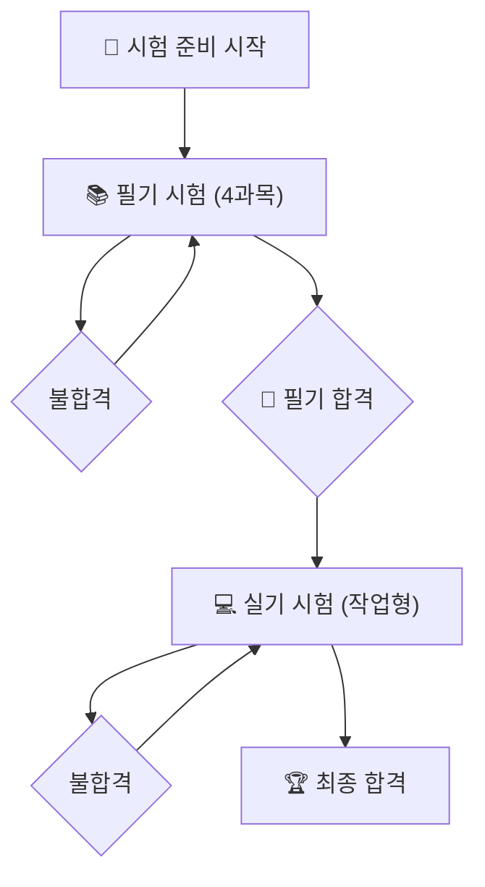

# 빅데이터분석기사 자격시험 안내

본 문서는 데이터자격검정 사이트의 정보를 기반으로 빅데이터분석기사 자격시험의 핵심 정보를 정리한 가이드입니다.

## 🏁 자격시험 개요

빅데이터분석기사(이하 '빅분기')는 대규모 데이터를 처리·분석하여 비즈니스에 활용할 수 있는 인사이트를 도출하는 전문가를 양성하기 위한 국가기술자격입니다. 시험은 필기와 실기로 구성됩니다.

## 📝 필기 시험

### 1. 시험 과목 및 문항 수

| 과목 | 주요 항목 | 문항 수 |
| :--- | :--- | :--- |
| **1과목. 빅데이터 분석 기획** | 분석 기획, 데이터 확보 및 분석 전략 수립 | 20문항 |
| **2과목. 빅데이터 탐색** | 데이터 탐색, 전처리, 시각화 | 20문항 |
| **3과목. 빅데이터 모델링** | 분석 모델 설계, 모델링, 알고리즘 활용 | 20문항 |
| **4과목. 빅데이터 결과 해석** | 모델 평가, 결과 해석 및 시각화, 활용 | 20문항 |
| **총계** | - | **80문항 (객관식)** |

- **시험 시간:** 120분 (2시간)

### 2. 합격 기준

- **과목당 40점 이상** (과락 기준)
- **전체 평균 60점 이상**

> ⚠️ 한 과목이라도 40점 미만일 경우, 총점이 60점을 넘어도 불합격 처리됩니다.

---

## 💻 실기 시험

### 1. 시험 환경 및 방식

- **시험 환경:** 클라우드 기반의 코딩 환경 (Python 또는 R 선택)
- **시험 유형:**
    - **단답형:** 특정 개념이나 함수, 결과에 대한 단답형 문제 (약 3~5문제)
    - **작업형 제1유형:** 주어진 데이터에서 특정 조건에 맞는 값을 추출하거나 변환하는 문제 (약 3문제)
    - **작업형 제2유형:** 주어진 데이터를 활용하여 데이터 전처리, 모델링, 평가까지 수행하고 결과를 제출하는 문제 (1문제)

- **시험 시간:** 180분 (3시간)

### 2. 합격 기준

- **100점 만점에 60점 이상**

---

## 🔗 공식 정보 확인

시험 일정, 원서 접수, 세부 변경사항 등 가장 정확한 정보는 반드시 아래 공식 웹사이트에서 확인하시기 바랍니다.

- **데이터자격검정 공식 웹사이트:** [https://www.dataq.or.kr](https://www.dataq.or.kr) 