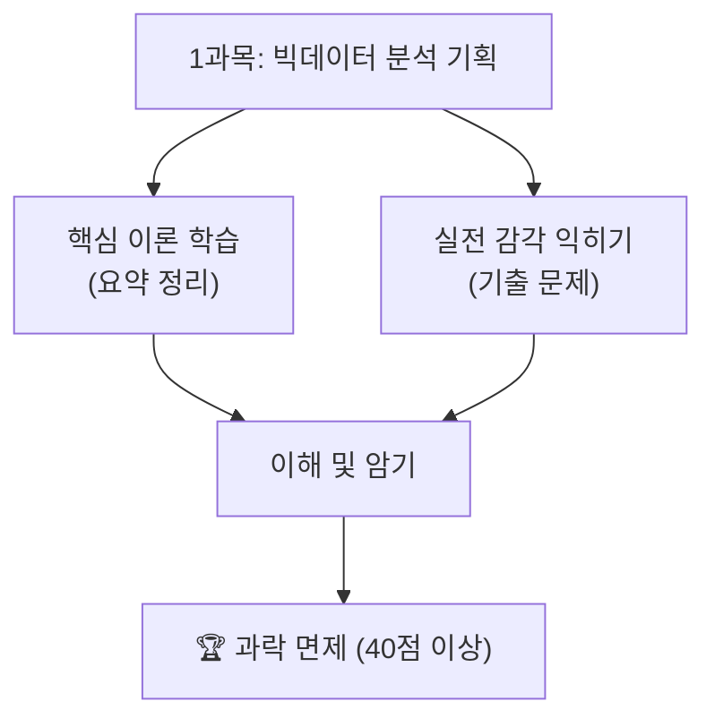

# 제1과목: 빅데이터 분석 기획

빅데이터 분석 기획은 성공적인 데이터 분석 프로젝트의 첫 단추입니다. 이 과목에서는 데이터 분석의 전체 생명주기를 이해하고, 비즈니스 목표에 맞는 분석 전략을 수립하는 방법을 학습합니다.

## 📖 수험서 기준 인덱스

### 1. 과목 개요
- **목적**: 데이터 분석 프로젝트의 초기 단계인 기획과 설계의 중요성을 이해하고, 체계적인 분석 방법론을 학습합니다.
- **중요도**: 전체 분석 과정의 방향을 설정하는 단계로, 시험에서 개념 이해와 방법론 적용 문제가 자주 출제됩니다.

### 2. 학습 목표
- 데이터 분석 방법론(KDD, CRISP-DM 등)을 이해하고 설명할 수 있다.
- 분석 과제를 정의하고, 필요한 데이터와 분석 모델을 계획할 수 있다.
- 개인정보보호 및 데이터 관련 법규를 이해하고 준수할 수 있다.

### 3. 주요 내용
- **빅데이터 분석 방법론**: KDD, CRISP-DM, SEMMA 등의 프로세스와 특징.
- **분석 과제 발굴**: Top-Down 및 Bottom-Up 접근법.
- **분석 마스터 플랜(AMP)**: 전사적 분석 과제 관리와 우선순위 평가.
- **데이터 거버넌스**: 데이터 관리 원칙, 조직, 프로세스.
- **개인정보보호**: 데이터 3법, 개인정보/가명정보/익명정보의 구분.

### 4. 학습 자료

| 학습 자료 | 바로가기 | 설명 |
| :--- | :--- | :--- |
| **핵심 요약 정리** | [Go](./요약정리/README.md) | 시험에 자주 출제되는 핵심 개념과 방법론을 정리한 문서입니다. |
| **기출 문제** | [Go](./기출문제/README.md) | 실제 시험 유형을 파악하고 실전처럼 연습할 수 있는 공간입니다. |
| **전체 로드맵** | [Go](../../README.md) | 빅데이터분석기사 전체 학습 과정으로 돌아갑니다. |

## 🎯 학습 로드맵

---
**Tip:** 분석 기획 과목은 암기할 내용이 많습니다. 각 분석 방법론의 단계별 특징을 다이어그램으로 그리며 공부하면 기억에 오래 남습니다. 