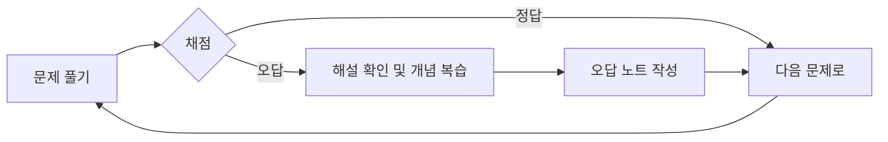

# 제1과목 기출문제

이 공간은 **빅데이터 분석 기획** 과목의 기출문제를 통해 실전 감각을 익히는 곳입니다.

## 🎯 학습 방법

1.  **시간 측정:** 실제 시험처럼 시간을 정해두고 문제를 풀어보세요.
2.  **개념 확인:** 문제를 푼 후, 정답과 해설을 확인하며 몰랐거나 헷갈렸던 개념을 [핵심 요약 정리](../요약정리/README.md) 파일에서 다시 찾아보세요.
3.  **오답 노트:** 틀린 문제는 반드시 [전체 오답 노트](../../오답노트/README.md)에 기록하여 약점을 보완하세요.

## 📁 문제 목록

> ✍️ 여기에 각 회차별 기출문제 파일이나 링크를 추가하여 관리할 수 있습니다.
>
> 예시:
>
> - `[2023년 제6회] 1과목 기출문제.md`
> - `[2022년 제5회] 1과목 기출문제.md`

---

[⬅️ 1과목 개요로 돌아가기](../README.md) 