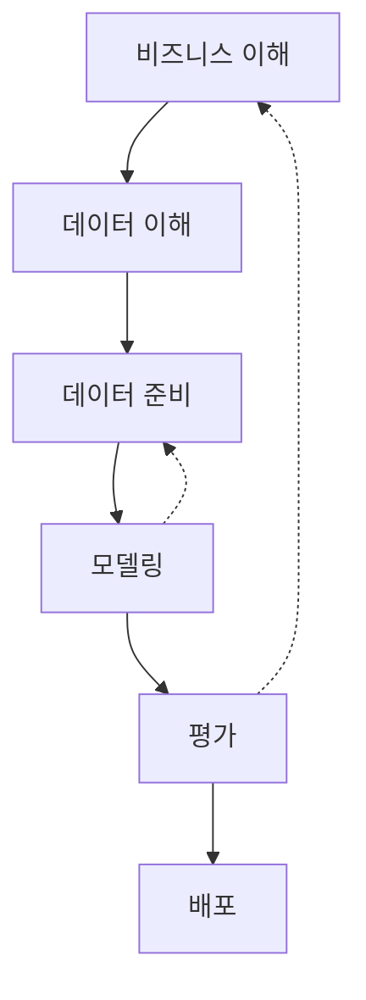
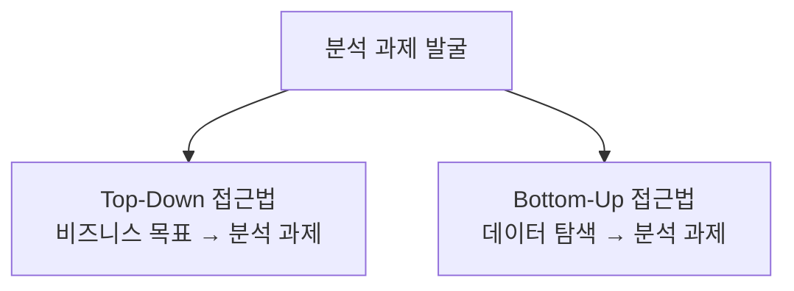

# 제1과목 핵심 요약: 빅데이터 분석 기획 (심화)

이 문서는 빅데이터 분석 기획 과목의 핵심 개념을 **체계적으로 심화 학습**할 수 있도록 구성한 자료입니다.

## 1. 빅데이터 분석 기획 개요

빅데이터 분석 기획은 데이터 분석 프로젝트의 성공을 좌우하는 첫 번째 단계로, 비즈니스 목표를 정의하고, 분석 전략을 수립하며, 데이터와 자원을 계획하는 과정을 포함합니다. 이 과목에서는 분석 방법론, 과제 발굴, 데이터 거버넌스, 개인정보보호 등 전반적인 기획 기술을 학습합니다.

| 구분 | 설명 |
| :--- | :--- |
| **목적** | 비즈니스 문제를 데이터 분석으로 해결하기 위한 전략 수립 |
| **주요 과업** | 분석 방법론 적용, 과제 정의, 데이터 준비 계획, 법적/윤리적 고려 |

---

## 2. 주요 개념

### 2.1. 빅데이터 분석 방법론

- **KDD (Knowledge Discovery in Databases)**: 데이터 마이닝 중심의 전통적 방법론으로, 데이터 선택 → 전처리 → 변환 → 마이닝 → 해석/평가의 단계를 거칩니다.
- **CRISP-DM (Cross Industry Standard Process for Data Mining)**: 가장 널리 사용되는 방법론으로, 비즈니스 이해 → 데이터 이해 → 데이터 준비 → 모델링 → 평가 → 배포의 6단계로 구성됩니다.
- **SEMMA**: SAS에서 제안한 방법론으로, 샘플링 → 탐색 → 수정 → 모델링 → 평가의 단계를 포함합니다.

### 2.2. 분석 과제 발굴

- **Top-Down 접근법**: 비즈니스 목표와 KPI를 먼저 정의하고, 이를 달성하기 위한 분석 과제를 도출합니다.
- **Bottom-Up 접근법**: 사용 가능한 데이터에서 패턴과 인사이트를 발견하여 분석 과제를 제안합니다.

### 2.3. 분석 마스터 플랜 (AMP)

- 전사적 관점에서 분석 과제를 관리하고 우선순위를 평가하는 계획입니다.
- **구성 요소**: 분석 비전, 로드맵, 과제 우선순위, 데이터 준비, 조직/역량 계획.

### 2.4. 데이터 거버넌스

- 데이터의 품질, 보안, 활용을 체계적으로 관리하기 위한 원칙과 조직, 프로세스를 정의합니다.
- **핵심 요소**: 데이터 표준화, 메타데이터 관리, 데이터 품질 관리, 데이터 보안.

### 2.5. 개인정보보호 및 법적 고려

- **데이터 3법**: 개인정보 보호법, 정보통신망법, 신용정보법.
- **데이터 유형**: 개인정보, 가명정보, 익명정보의 구분과 처리 기준.

---

## 3. 분석 방법론 시각화 (CRISP-DM 중심)

위 다이어그램은 CRISP-DM 방법론의 6단계를 보여주며, 평가 단계에서 비즈니스 이해로 돌아가거나 모델링 단계에서 데이터 준비로 돌아가는 반복적 프로세스를 점선으로 표현했습니다.

---

## 4. 분석 과제 발굴 접근법 시각화

위 다이어그램은 분석 과제 발굴의 두 가지 접근법을 비교하여 보여줍니다. Top-Down은 비즈니스 목표에서 출발하고, Bottom-Up은 데이터에서 인사이트를 도출하는 방식입니다.

---

## 5. 핵심 요약 테이블

| 개념 | 주요 내용 | 시험 포인트 |
| :--- | :--- | :--- |
| **KDD** | 데이터 마이닝 중심, 5단계 프로세스 | 각 단계의 순서와 목적 |
| **CRISP-DM** | 6단계 반복 프로세스, 산업 표준 | 비즈니스 이해와 평가의 중요성 |
| **Top-Down 접근법** | 비즈니스 목표 → 분석 과제 | KPI와 연계된 사례 문제 |
| **Bottom-Up 접근법** | 데이터 탐색 → 분석 과제 | 데이터 기반 인사이트 도출 |
| **데이터 거버넌스** | 데이터 관리 원칙과 조직 | 데이터 품질과 보안 |
| **개인정보보호** | 데이터 3법, 가명/익명 처리 | 법적 기준과 사례 적용 |

---

## 6. 학습 팁

- **방법론 비교**: 각 방법론(KDD, CRISP-DM, SEMMA)의 차이점과 적용 사례를 정리하세요.
- **사례 학습**: 실제 비즈니스 문제를 예로 들어 Top-Down과 Bottom-Up 접근법을 연습하세요.
- **법적 기준 암기**: 개인정보보호 관련 주요 용어와 기준을 반드시 암기하세요.

이 문서는 '설명(Explanation)' 유형으로, 시험에 자주 출제되는 개념을 중심으로 구성되었습니다. 추가적인 기출 문제 풀이와 함께 학습하면 더욱 효과적입니다. 