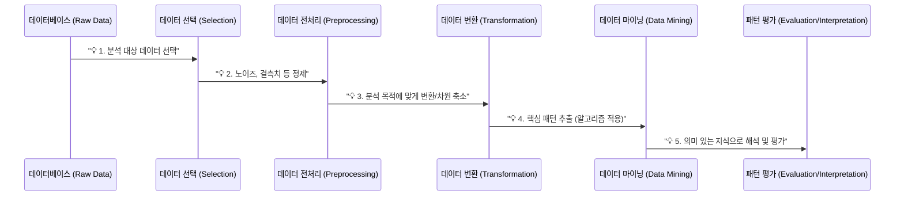
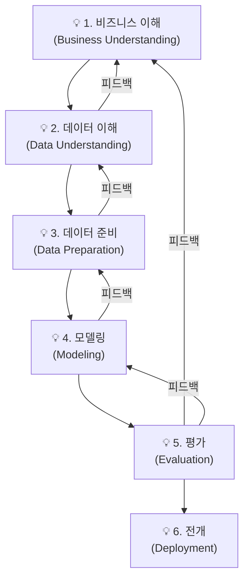
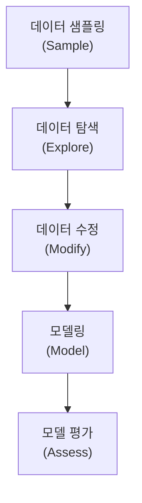
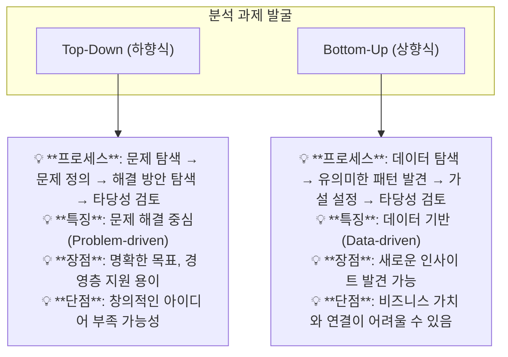
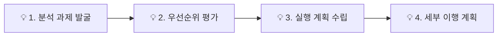
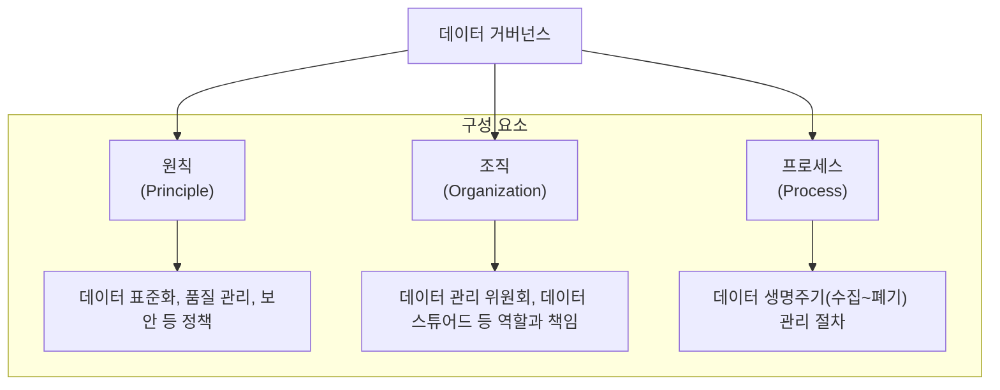

# 제1과목 핵심 요약: 빅데이터 분석 기획 (심화)

이 문서는 빅데이터 분석 기획 과목의 핵심 개념을 **체계적으로 심화 학습**할 수 있도록 구성한 자료입니다.

## 1. 빅데이터 분석 방법론

데이터 분석 프로젝트를 체계적으로 수행하기 위한 절차와 방법을 정의한 프레임워크입니다.

### 1.1. KDD (Knowledge Discovery in Databases)

데이터베이스에서 의미 있는 지식을 탐색하는 과정에 초점을 맞춘 방법론입니다.

### 1.2. CRISP-DM (Cross-Industry Standard Process for Data Mining)

산업계에서 널리 사용되는 데이터 마이닝 프로세스 모델로, 비즈니스 이해도를 강조하며 단계 간 피드백을 중시합니다.

### 1.3. SEMMA (Sample, Explore, Modify, Model, Assess)

SAS사에서 개발한 방법론으로, 데이터 마이닝의 과정을 5단계로 나누어 구체적인 분석 작업에 집중합니다.

### 1.4. 분석 방법론 비교

| 구분 | KDD | CRISP-DM | SEMMA |
| :--- | :--- | :--- | :--- |
| **목적** | 데이터베이스 내 지식 발견 | 비즈니스 문제 해결 | 데이터 마이닝 솔루션 구축 |
| **관점** | 데이터 중심 | 비즈니스 중심 | 분석 작업 중심 |
| **프로세스**| 순차적 | 순환적, 반복적 | 순차적, 반복적 |
| **특징** | 데이터 마이닝 중심 | 비즈니스 이해와 전개 강조 | 각 단계가 분석 도구와 연결 |
| **단계** | 5단계 | 6단계 (순환) | 5단계 |

---

## 2. 분석 과제 발굴 및 분석 마스터 플랜(AMP)

### 2.1. 분석 과제 발굴 방식

### 2.2. 분석 마스터 플랜 (Analytics Master Plan)

전사적 관점에서 분석 과제를 체계적으로 관리하고 실행하기 위한 중장기 계획입니다.

**수립 프로세스:**

- **우선순위 평가 기준:**
    - **전략적 중요도:** 얼마나 비즈니스 목표와 일치하는가?
    - **ROI (투자 대비 효과):** 비용 대비 예상되는 효과는 얼마인가?
    - **실행 용이성:** 데이터, 기술, 인력 측면에서 얼마나 실현 가능한가?
- **포트폴리오 사분면 분석:** 시급성과 난이도를 기준으로 과제의 우선순위를 시각적으로 결정.

---

## 3. 데이터 거버넌스 및 개인정보보호

### 3.1. 데이터 거버넌스 (Data Governance) 체계

기업의 데이터 자산을 효과적으로 관리하고 활용하기 위한 전사적 프레임워크입니다.

### 3.2. 개인정보보호

- **데이터 3법 (개정):** 개인정보보호법, 정보통신망법, 신용정보법. 데이터 활용의 길을 열어준 법 개정.
- **정보의 종류:**
    - **개인정보:** 살아있는 개인에 관한 정보로, 식별 가능한 정보.
    - **가명정보:** 추가 정보 없이는 특정 개인을 알아볼 수 없는 정보. (통계작성, 연구 등 목적 하에 동의 없이 활용 가능)
    - **익명정보:** 더 이상 특정 개인을 알아볼 수 없는 정보. (개인정보보호법 적용 X) 