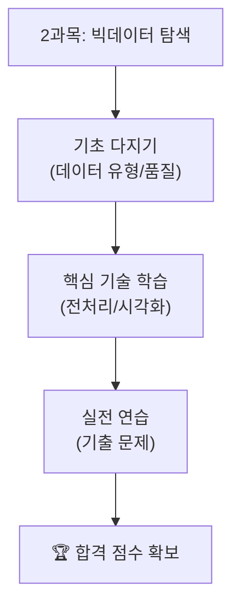

# 제2과목: 빅데이터 탐색

빅데이터 탐색은 수집된 데이터를 본격적으로 분석하기 전, 데이터의 숨겨진 구조와 특징을 파악하는 과정입니다. 이 과목에서는 데이터의 종류를 이해하고, 전처리, 요약, 시각화 등 탐색적 데이터 분석(EDA)의 핵심 기술을 학습합니다.

## 📖 수험서 기준 인덱스

### 1. 과목 개요
- **목적**: 데이터의 구조와 품질을 파악하고, 분석에 적합한 형태로 데이터를 준비하는 기술을 학습합니다.
- **중요도**: 데이터 품질이 분석 결과에 직접적인 영향을 미치므로, 시험에서 데이터 전처리와 EDA 관련 문제가 빈번히 출제됩니다.

### 2. 학습 목표
- 데이터의 유형(정성적, 정량적)과 특징을 이해하고 설명할 수 있다.
- 결측치, 이상치 등 데이터 품질 문제를 식별하고 처리할 수 있다.
- 데이터를 요약하고, 시각화를 통해 인사이트를 도출할 수 있다.
- 차원 축소, 파생 변수 생성 등 데이터 변환 기술을 적용할 수 있다.

### 3. 주요 내용
- **데이터 유형**: 정형, 반정형, 비정형 데이터의 특징과 처리 방법.
- **데이터 전처리**: 결측값, 이상값 처리, 스케일링 및 변환.
- **탐색적 데이터 분석(EDA)**: 단변량 및 다변량 분석, 상관관계 분석.
- **차원 축소**: PCA 등 고차원 데이터의 변수 축소 기법.
- **샘플링**: 데이터 추출 방법(단순 임의, 계통, 층화, 군집 추출).

### 4. 학습 자료

| 학습 자료 | 바로가기 | 설명 |
| :--- | :--- | :--- |
| **핵심 요약 정리** | [Go](./요약정리/README.md) | 데이터 전처리, EDA, 시각화 등 시험의 핵심 이론을 정리했습니다. |
| **기출 문제** | [Go](./기출문제/README.md) | 실제 시험과 유사한 데이터셋으로 연습하며 실전 감각을 키웁니다. |
| **전체 로드맵** | [Go](../../README.md) | 빅데이터분석기사 전체 학습 과정으로 돌아갑니다. |

## 🎯 학습 로드맵

---
**Tip:** 2과목은 코딩 실습이 중요합니다. Pandas, Matplotlib, Seaborn 등 Python 라이브러리를 직접 사용해보며 각 함수의 기능을 익히는 것이 효과적입니다. 