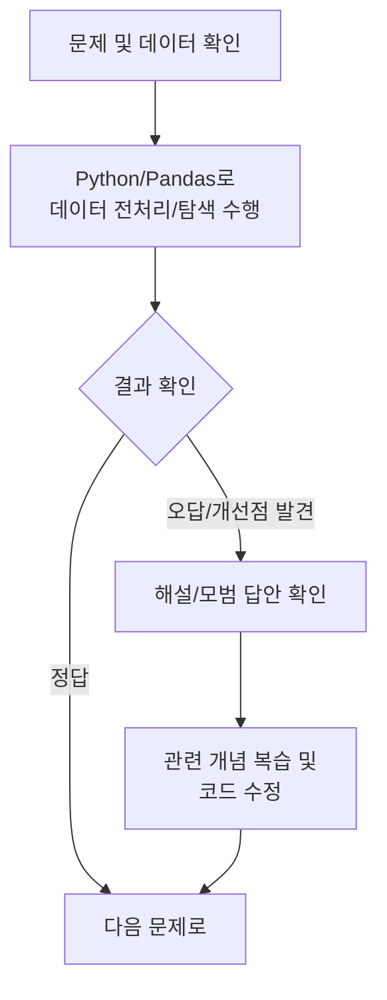

# 제2과목 기출문제

이 공간은 **빅데이터 탐색** 과목의 기출문제를 통해 실전 감각을 익히는 곳입니다. 2과목은 이론뿐만 아니라 실제 데이터 처리 능력을 요구하므로 코드와 함께 연습하는 것이 중요합니다.

## 🎯 학습 방법

1.  **문제 분석:** 문제에서 요구하는 데이터 처리 조건(결측치, 이상치, 변환 등)을 정확히 파악합니다.
2.  **코드 구현:** Pandas 등 라이브러리를 사용하여 직접 코드를 작성하며 문제를 해결합니다.
3.  **결과 비교:** 정답 코드 및 결과와 비교하며 자신의 풀이법을 점검하고 개선합니다.
4.  **개념 복습:** 막히는 부분은 [핵심 요약 정리](../요약정리/README.md)를 다시 읽으며 관련 개념을 복습합니다.

## 📁 문제 목록

> ✍️ 여기에 각 회차별 기출문제와 데이터셋 링크를 추가하여 관리하세요.
>
> 예시:
>
> - `[2023년 제6회] 2과목 기출문제.ipynb`
> - `[2022년 제5회] 2과목 기출문제.ipynb`

---

[⬅️ 2과목 개요로 돌아가기](../README.md) 