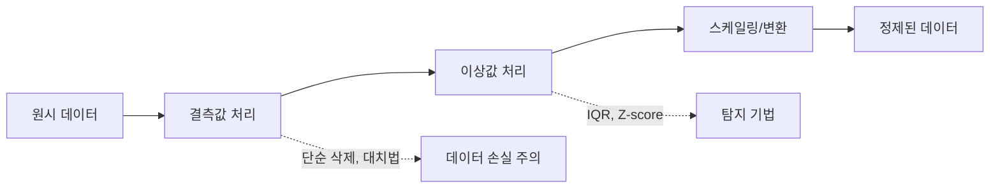
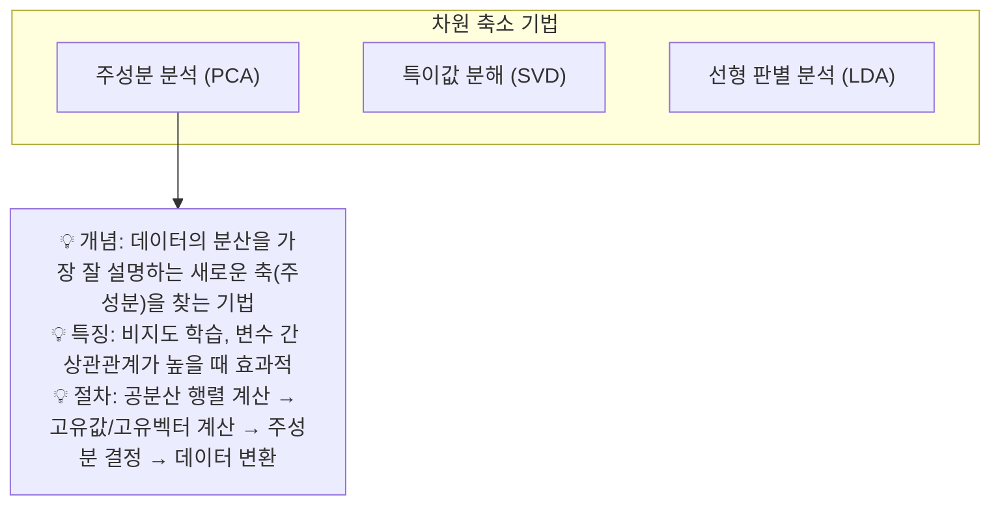

# 제2과목 핵심 요약: 빅데이터 탐색 (심화)

이 문서는 빅데이터 탐색 과목의 핵심 개념을 **체계적으로 심화 학습**할 수 있도록 구성한 자료입니다.

## 1. 데이터의 이해

### 1.1. 데이터 유형

| 구분 | 정형 데이터 (Structured) | 반정형 데이터 (Semi-structured) | 비정형 데이터 (Unstructured) |
| :--- | :--- | :--- | :--- |
| **구조** | 고정된 스키마 (행, 열) | 스키마 정보 포함, 가변적 | 스키마 없음 |
| **예시** | 관계형 데이터베이스, CSV, Excel | XML, JSON, HTML | 텍스트, 이미지, 오디오, 비디오 |
| **처리** | SQL, 정형 분석 도구 | 파싱(Parsing) 필요 | 텍스트 마이닝, 이미지 처리 등 복잡한 분석 필요 |

## 2. 데이터 전처리 (Data Preprocessing)

데이터의 품질을 높여 분석 결과의 신뢰성을 확보하는 과정입니다. "Garbage In, Garbage Out"을 방지하는 핵심 단계입니다.

### 2.1. 결측값(Missing Value) 처리

- **단순 삭제:** 결측값이 포함된 행 또는 열을 제거. 데이터 손실이 클 수 있어 신중해야 함.
- **단순 대치법:**
  - **수치형 데이터:** 평균(Mean), 중앙값(Median), 최빈값(Mode)으로 대체.
  - **범주형 데이터:** 최빈값으로 대체.
- **모델 기반 대치법:** 회귀 분석이나 머신러닝 모델을 사용하여 결측값을 예측하여 채움.

### 2.2. 이상값(Outlier) 처리

- **탐지 방법:**
  - **IQR (Interquartile Range) Rule:** `Q1 - 1.5 * IQR` 보다 작거나 `Q3 + 1.5 * IQR` 보다 큰 값. (Box Plot 시각화)
  - **Z-score:** 데이터가 정규분포를 따른다고 가정하고, Z-score가 특정 임계값(예: 3)을 초과하는 값.
  - **군집 분석 (Clustering):** DBSCAN과 같은 밀도 기반 군집 알고리즘을 사용하여 다른 데이터 포인트와 동떨어진 값을 찾음.
- **처리 방법:** 삭제, 대체 (상/하한 값으로), 또는 별도 분석.

### 2.3. 데이터 전처리 과정 시각화

데이터 전처리 과정을 더 잘 이해하기 위해 아래 다이어그램을 통해 주요 단계를 시각화하였습니다.

위 다이어그램은 데이터 전처리의 주요 단계를 보여줍니다. 원시 데이터에서 시작하여 결측값 처리, 이상값 처리, 스케일링 및 변환을 거쳐 정제된 데이터로 변환됩니다.

## 3. 피처 엔지니어링 (Feature Engineering)

모델의 성능을 향상시키기 위해 기존 변수를 조합하거나 변형하여 새로운 변수(피처)를 만드는 과정입니다.

### 3.1. 변수 선택 (Feature Selection)
- **필터 기법(Filter Method):** 통계적 척도(상관관계, 카이제곱 등)를 사용하여 모델링 전에 변수를 선택.
- **래퍼 기법(Wrapper Method):** 특정 모델의 성능을 평가 기준으로 삼아 변수 조합을 탐색. (전진선택법, 후진제거법)
- **임베디드 기법(Embedded Method):** 모델 자체에 변수 선택 기능이 내장된 경우. (Lasso, Ridge)

### 3.2. 변수 변환 및 생성
- **더미 변수화:** 범주형 변수를 0과 1로 구성된 여러 개의 변수로 변환. (One-Hot Encoding, Label Encoding)
- **파생 변수 생성:** 기존 변수들을 조합하여 새로운 의미를 갖는 변수를 생성. (예: `나이` 변수로부터 `연령대` 변수 생성)
- **스케일링:** 변수의 단위를 맞추는 작업.
  - **정규화 (Normalization):** 값을 0과 1 사이로 변환. `(x - min) / (max - min)`
  - **표준화 (Standardization):** 평균이 0, 표준편차가 1이 되도록 변환. `(x - mean) / std`

---

## 4. 탐색적 데이터 분석 (EDA) 및 차원 축소

### 4.1. 탐색적 데이터 분석 (EDA)

- **단변량 분석 (Univariate Analysis):** 변수 하나에 대한 분포 및 특성 파악.
  - **중심 경향:** 평균(Mean), 중앙값(Median), 최빈값(Mode)
  - **산포도:** 분산(Variance), 표준편차(Standard Deviation), 범위(Range)
  - **분포 형태:** 왜도(Skewness), 첨도(Kurtosis)
- **다변량 분석 (Multivariate Analysis):** 변수 간의 관계 파악.
  - **상관관계 분석 (Correlation):**
    - **피어슨 상관계수:** 두 변수 간의 선형 관계 측정. (-1 ~ 1)
    - **스피어만 상관계수:** 두 변수의 순위 사이의 관계 측정. (비선형 관계 파악 가능)

### 4.2. 차원 축소 (Dimensionality Reduction)

고차원 데이터에서 변수 간 상관관계를 줄이고 중요한 변수만 선택하여 데이터의 차원을 줄이는 기법입니다. '차원의 저주'를 해결하는 데 도움이 됩니다.

### 4.3. 샘플링 (Sampling)

- **단순 임의 추출 (Simple Random Sampling):** 모집단의 각 요소가 선택될 확률이 동일하게 추출.
- **계통 추출 (Systematic Sampling):** 모집단에 순서를 부여하고 일정한 간격(k)으로 추출.
- **층화 추출 (Stratified Sampling):** 모집단을 서로 다른 여러 그룹(계층)으로 나누고, 각 그룹에서 무작위 추출.
- **군집 추출 (Cluster Sampling):** 모집단을 여러 군집으로 나누고, 특정 군집을 무작위로 선택한 후 해당 군집 내 모든 요소 조사.
