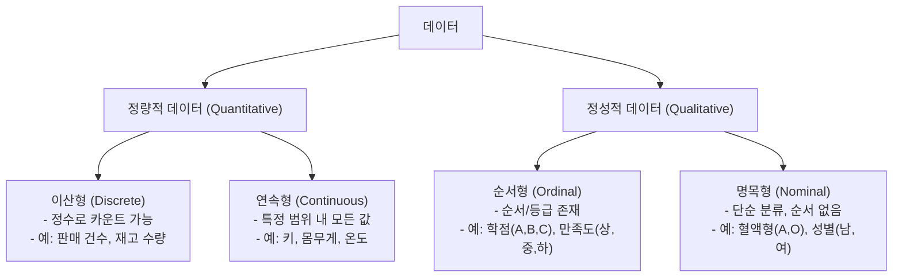
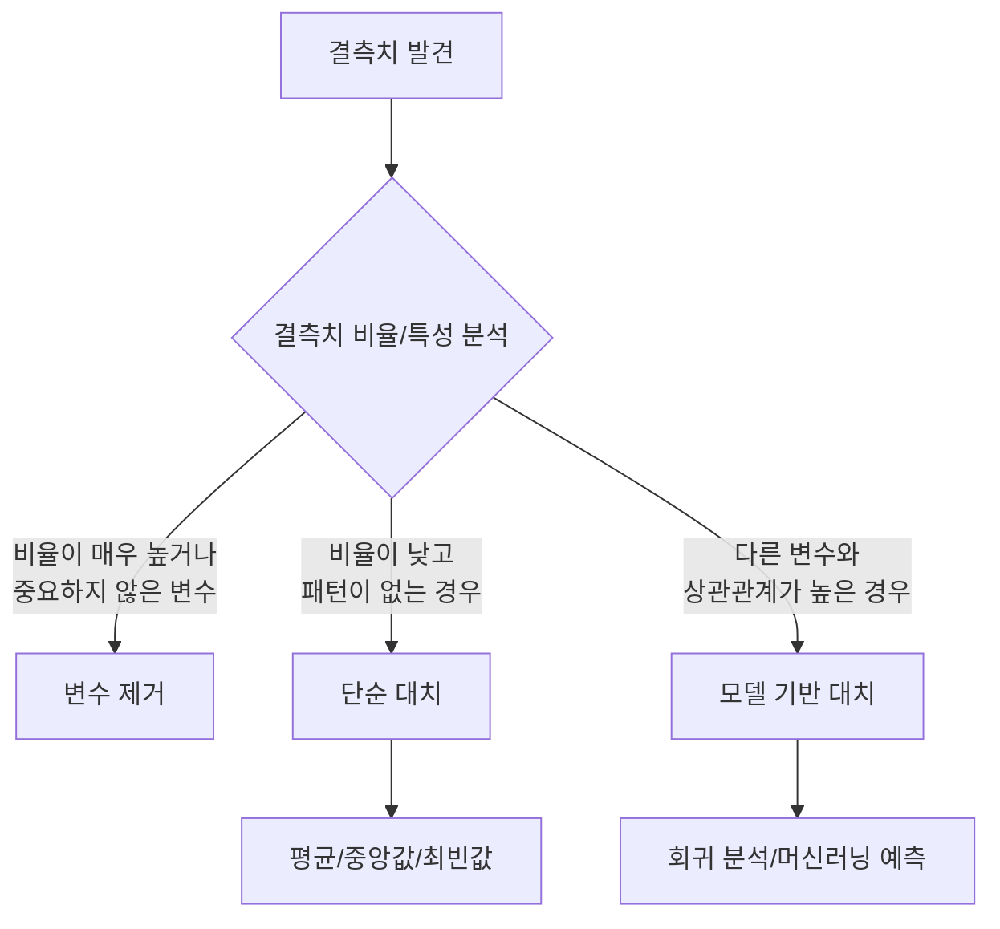
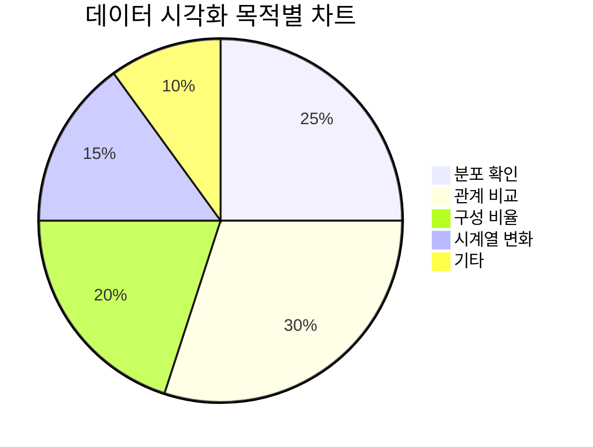

# 제2과목 핵심 요약: 빅데이터 탐색

빅데이터 탐색은 데이터에 숨겨진 의미를 찾아내고, 모델링에 적합한 형태로 데이터를 정제하는 과정입니다. 이 문서에서는 데이터 전처리, 탐색, 시각화의 핵심 기법을 요약합니다.

## 1. 데이터 유형의 이해

데이터는 크게 정량적 데이터와 정성적 데이터로 나뉩니다.

## 2. 데이터 전처리 (Preprocessing)

"Garbage In, Garbage Out". 데이터 품질이 분석 결과의 품질을 결정합니다.

### 2.1. 결측치 (Missing Value) 처리

- **단순 대치:** 가장 간단하지만, 데이터의 분포를 왜곡시킬 수 있음.
- **모델 기반 대치:** 정교하지만, 계산 비용이 높음.

### 2.2. 이상치 (Outlier) 처리

데이터의 정상적인 분포에서 크게 벗어난 값입니다.

**탐지 방법:**
1.  **시각화:** Box Plot, Scatter Plot 등으로 확인.
2.  **통계 기법:**
    - **IQR (Interquartile Range) 활용:** `Q1 - 1.5 * IQR` 보다 작거나 `Q3 + 1.5 * IQR` 보다 큰 값.
    - **Z-score 활용:** Z-score(표준점수)가 특정 임계값(예: 3)을 초과하는 값.

**처리 방법:**
- **제거:** 가장 간단하지만, 정보 손실 발생.
- **대치:** 결측치 처리와 유사하게 평균, 중앙값 등으로 대치.
- **변환:** 로그 변환 등을 통해 데이터 분포를 조정.

---

## 3. 탐색적 데이터 분석 (EDA)

데이터의 구조, 패턴, 관계를 파악하기 위해 시각화와 통계 분석을 수행하는 과정입니다.

### 3.1. 기초 통계량

| 통계량 | 설명 |
| :--- | :--- |
| **평균 (Mean)** | 모든 값을 더해 개수로 나눈 값. 이상치에 민감. |
| **중앙값 (Median)** | 데이터를 정렬했을 때 중앙에 위치하는 값. 이상치에 강건. |
| **최빈값 (Mode)** | 가장 빈번하게 나타나는 값. |
| **분산 (Variance)** | 데이터가 평균으로부터 얼마나 흩어져 있는지. |
| **표준편차 (Std. Dev)** | 분산에 제곱근을 취한 값. 원래 데이터와 단위가 같아 해석 용이. |

### 3.2. 데이터 시각화

목적에 맞는 차트를 선택하는 것이 중요합니다.

| 시각화 종류 | 목적 | 설명 |
| :--- | :--- | :--- |
| **히스토그램** | 분포 확인 | 연속형 데이터의 구간별 빈도를 막대로 표현 |
| **막대 차트** | 관계 비교 | 범주형 데이터의 크기를 비교 |
| **산점도** | 관계 비교 | 두 연속형 변수 간의 관계를 점으로 표현 |
| **박스 플롯** | 분포 확인 | 데이터의 사분위수, 이상치를 시각적으로 표현 |
| **파이 차트** | 구성 비율 | 전체에 대한 각 범주의 비율을 부채꼴로 표현 |
| **라인 차트** | 시계열 변화| 시간의 흐름에 따른 데이터 변화를 선으로 표현 |

## 4. 데이터 변환

모델링 성능을 높이기 위해 데이터를 변환하는 과정입니다.

- **정규화 (Normalization / Min-Max Scaling):** 데이터 값을 0과 1 사이의 범위로 조정. `(x - min) / (max - min)`
- **표준화 (Standardization / Z-score Scaling):** 데이터의 평균을 0, 표준편차를 1로 조정. `(x - mean) / std`
- **파생변수 생성:** 기존 변수를 조합하여 새로운 의미를 갖는 변수를 생성.
- **차원 축소:** 다차원 데이터의 변수 개수를 줄이는 기법 (예: PCA). 