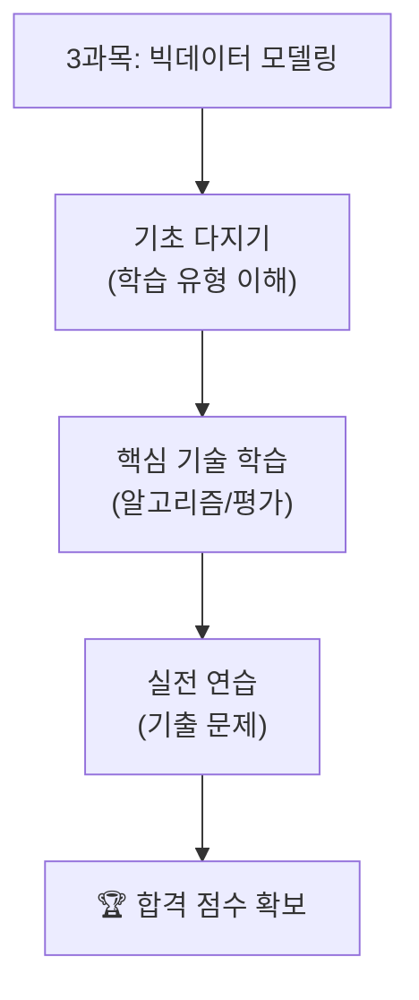

# 제3과목: 빅데이터 모델링

빅데이터 모델링은 데이터를 기반으로 예측 및 분류 모델을 설계하고 학습시키는 과정입니다. 이 과목에서는 다양한 머신러닝 알고리즘과 모델 평가 방법을 학습합니다.

## 📖 수험서 기준 인덱스

### 1. 과목 개요
- **목적**: 데이터를 이용해 예측 및 분류 모델을 설계하고, 모델 성능을 평가하는 기술을 학습합니다.
- **중요도**: 분석의 핵심 단계로, 시험에서 알고리즘 이해와 모델 평가 문제가 자주 출제됩니다.

### 2. 학습 목표
- 지도학습, 비지도학습, 강화학습의 개념과 차이를 이해할 수 있다.
- 회귀, 분류, 군집화 등 주요 알고리즘의 원리를 설명할 수 있다.
- 모델 성능 평가 지표(정확도, 정밀도, 재현율 등)를 이해하고 적용할 수 있다.
- 과적합 방지 및 하이퍼파라미터 튜닝 기법을 사용할 수 있다.

### 3. 주요 내용
- **지도학습**: 회귀(선형, 로지스틱), 분류(의사결정나무, SVM, KNN).
- **비지도학습**: 군집화(K-Means, DBSCAN), 차원 축소(PCA).
- **모델 평가**: 혼동 행렬, ROC 곡선, 교차 검증.
- **과적합 방지**: 정규화(L1, L2), 드롭아웃, 데이터 증강.
- **앙상블 기법**: 배깅(랜덤 포레스트), 부스팅(XGBoost, LightGBM).

### 4. 학습 자료

| 학습 자료 | 바로가기 | 설명 |
| :--- | :--- | :--- |
| **핵심 요약 정리** | [Go](./요약정리/README.md) | 지도학습, 비지도학습, 모델 평가 등 시험의 핵심 이론을 정리했습니다. |
| **기출 문제** | [Go](./기출문제/README.md) | 실제 시험과 유사한 데이터셋으로 연습하며 실전 감각을 키웁니다. |
| **전체 로드맵** | [Go](../../README.md) | 빅데이터분석기사 전체 학습 과정으로 돌아갑니다. |

## 🎯 학습 로드맵

---
**Tip:** 3과목은 이론과 실습의 균형이 중요합니다. Scikit-learn 등 Python 라이브러리를 활용해 직접 모델을 구현해보는 것이 효과적입니다. 