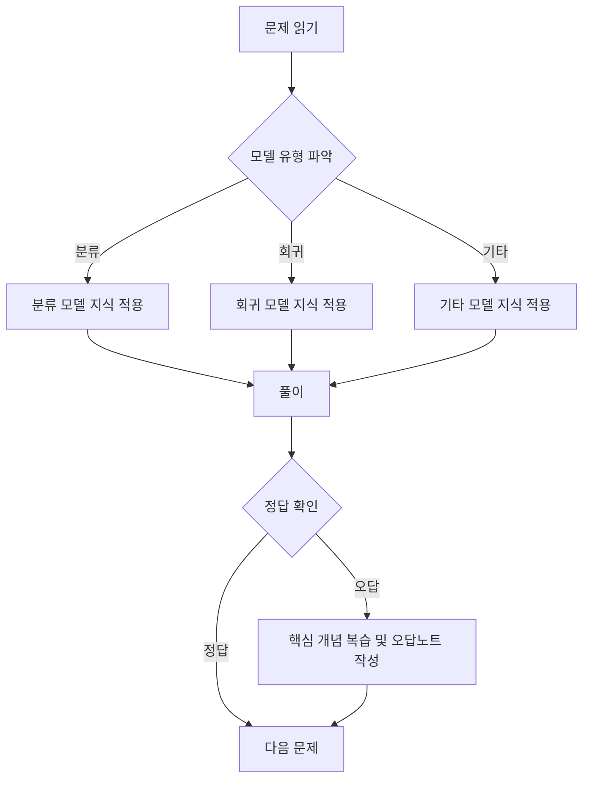

# 제3과목 기출문제

이 공간은 **빅데이터 모델링** 과목의 기출문제를 통해 다양한 분석 모델에 대한 이해도를 점검하고 높이는 곳입니다.

## 🎯 학습 방법

1.  **문제 유형 파악:** 각 문제가 어떤 모델(분류, 회귀, 군집 등)에 대해 묻고 있는지 파악합니다.
2.  **핵심 원리 적용:** 해당 모델의 원리를 떠올리며 문제를 풀어봅니다. (예: 의사결정나무의 엔트로피 계산, 연관분석의 신뢰도 계산 등)
3.  **개념 복습:** 헷갈리는 모델이나 용어는 [핵심 요약 정리](../요약정리/README.md) 문서를 통해 반드시 복습합니다.
4.  **오답 노트 활용:** 특히 자주 틀리는 모델이나 개념은 오답노트에 상세히 정리하여 약점을 극복합니다.

## 📁 문제 목록

> ✍️ 여기에 각 회차별 기출문제를 추가하여 관리하세요.
>
> 예시:
>
> - `[2023년 제6회] 3과목 기출문제.md`
> - `[2022년 제5회] 3과목 기출문제.md`

---

[⬅️ 3과목 개요로 돌아가기](../README.md) 