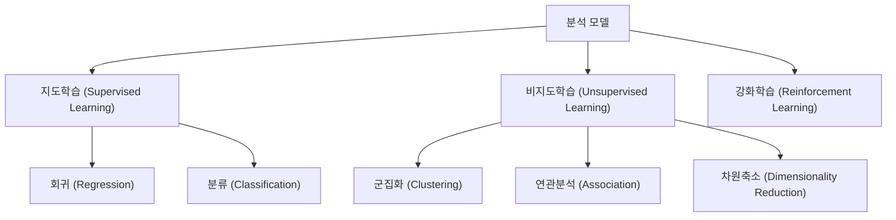
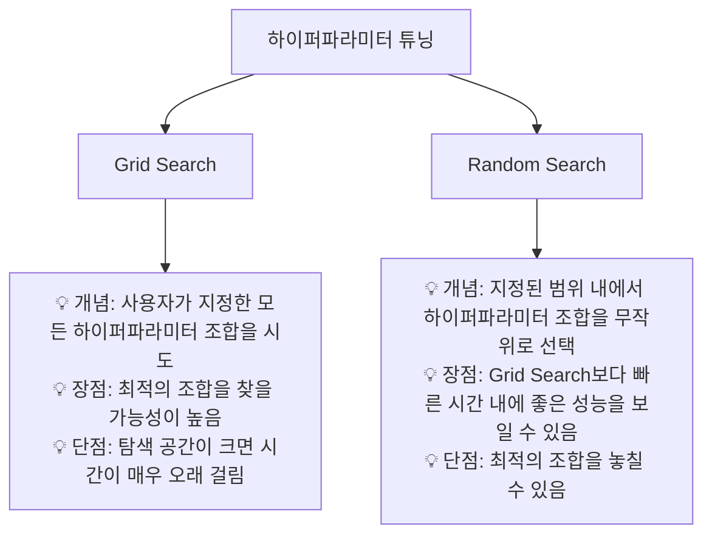
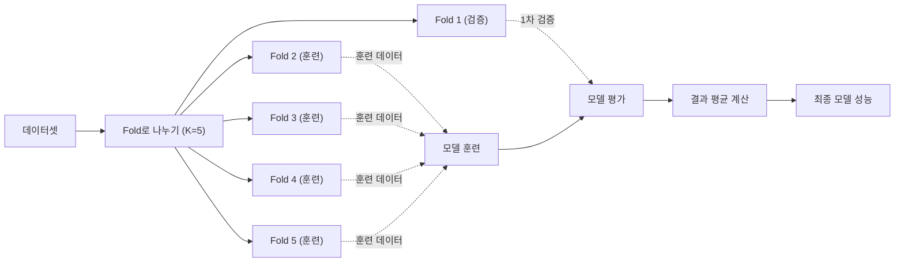

# 제3과목 핵심 요약: 빅데이터 모델링 (심화)

이 문서는 빅데이터 모델링 과목의 핵심 개념을 **체계적으로 심화 학습**할 수 있도록 구성한 자료입니다.

## 1. 분석 모델 개요

| 구분 | 지도학습 | 비지도학습 |
| :--- | :--- | :--- |
| **목표** | 결과 예측 | 데이터 내 구조 발견 |
| **데이터** | 레이블(정답)이 있는 데이터 | 레이블 없는 데이터 |
| **주요 과업**| 회귀, 분류 | 군집, 연관 규칙, 차원 축소 |

---

## 2. 지도학습 (Supervised Learning) 모델

### 2.1. 회귀 모델 (Regression)

연속적인 값을 예측하는 모델입니다.
- **선형 회귀 (Linear Regression):** 변수 간의 선형 관계를 모델링.
- **규제 (Regularization):** 모델의 과적합을 막기 위해 가중치(회귀계수)에 제약을 두는 기법.
  - **Lasso (L1):** 가중치의 절댓값에 페널티. 중요하지 않은 변수의 가중치를 0으로 만들어 변수 선택 효과.
  - **Ridge (L2):** 가중치의 제곱에 페널티. 가중치 크기를 줄여 모델을 안정화.
  - **ElasticNet:** Lasso와 Ridge를 결합한 형태.

### 2.2. 분류 모델 (Classification)

데이터를 정해진 범주(클래스)로 예측하는 모델입니다.
- **로지스틱 회귀 (Logistic Regression):** 시그모이드 함수를 사용하여 특정 클래스에 속할 확률을 예측.
- **K-최근접 이웃 (K-NN):** 새로운 데이터 주변의 K개 이웃 데이터의 클래스를 보고 다수결로 분류.
- **서포트 벡터 머신 (SVM):** 클래스 간의 경계(결정 경계)를 정의하는 모델. 마진(Margin)을 최대로 하는 경계를 찾음.
- **나이브 베이즈 (Naive Bayes):** 베이즈 정리를 기반으로 하며, 모든 변수들이 서로 독립이라고 가정.
- **의사결정나무 (Decision Tree):** 데이터의 특징에 따라 질문을 던지며 나무 구조로 분류.

---

## 3. 비지도학습 (Unsupervised Learning) 모델

### 3.1. 군집 분석 (Clustering)

- **K-평균 군집 (K-Means):**
  - **개념:** 사용자가 지정한 K개의 중심점(Centroid)을 기준으로, 각 데이터 포인트와 가장 가까운 중심점에 할당하여 군집을 형성하는 비계층적 군집.
  - **프로세스:** 중심점 초기화 → 할당 → 중심점 업데이트 반복.
- **계층적 군집 (Hierarchical Clustering):**
  - **개념:** 개별 데이터 포인트를 하나의 군집으로 시작하여, 가장 가까운 군집끼리 순차적으로 병합해 나가는 방식. (덴드로그램으로 시각화)

### 3.2. 연관 분석 (Association Rule Mining)

- **개념:** 대규모 데이터에서 항목들 간의 'IF-THEN' 형태의 연관 규칙을 발견하는 기법. (예: "기저귀를 산 고객은 맥주도 함께 구매한다")
- **핵심 지표:**
  - **지지도 (Support):** 전체 거래 중 항목 A와 B가 동시에 포함된 거래의 비율. `P(A ∩ B)`
  - **신뢰도 (Confidence):** 항목 A를 포함한 거래 중 항목 B도 함께 포함된 거래의 비율. `P(B | A)`
  - **향상도 (Lift):** A와 B가 독립적일 때와 비교하여, 두 항목이 함께 발생할 확률이 얼마나 증가했는지를 측정. `Confidence(A→B) / Support(B)`
    - `Lift > 1`: 양의 상관관계
    - `Lift = 1`: 독립
    - `Lift < 1`: 음의 상관관계

---

## 4. 앙상블 (Ensemble) 기법

여러 개의 약한 모델(Weak Learner)을 결합하여 하나의 강한 모델(Strong Learner)을 만드는 기법입니다.

| 구분 | 배깅 (Bagging) | 부스팅 (Boosting) |
| :--- | :--- | :--- |
| **핵심 아이디어**| 병렬 학습 (독립적) | 순차적 학습 (가중치 부여) |
| **데이터 샘플링**| Bootstrap 샘플링 (중복 허용) | 전체 데이터 사용 (가중치 변경) |
| **목표** | 분산 감소 (Variance Reduction) | 편향 감소 (Bias Reduction) |
| **대표 알고리즘**| 랜덤 포레스트 | AdaBoost, GBM, XGBoost, LightGBM |

- **랜덤 포레스트 (Random Forest):** 여러 개의 의사결정나무를 배깅 방식으로 결합하고, 각 나무를 학습할 때 무작위로 변수를 선택하여 다양성을 높인 모델.
- **XGBoost (eXtreme Gradient Boosting):** GBM을 병렬 처리, 규제 등 다양한 기능으로 개선하여 속도와 성능을 크게 향상시킨 모델.

---

## 5. 모델 평가 및 최적화

### 5.1. 과적합(Overfitting) 방지 및 모델 검증

- **과적합:** 모델이 학습 데이터에만 너무 잘 맞춰져서, 새로운 데이터에 대한 예측 성능이 떨어지는 현상.
- **교차 검증 (Cross-Validation):** 데이터를 여러 개의 Fold로 나누어, 일부는 학습에, 일부는 검증에 사용하는 것을 반복하여 모델의 일반화 성능을 평가.
  - **K-Fold 교차 검증:** 데이터를 K개의 Fold로 나누어 K번 검증.
  - **층화 K-Fold (Stratified K-Fold):** 불균형한 클래스 분포를 가진 데이터에서 각 Fold의 클래스 비율을 원본 데이터와 동일하게 유지.

### 5.2. 하이퍼파라미터 튜닝 (Hyperparameter Tuning)

모델의 성능을 최적화하기 위해 사용자가 직접 설정해야 하는 값(하이퍼파라미터)을 찾는 과정입니다.

### 5.3. 교차 검증 과정 시각화

교차 검증의 과정을 더 잘 이해하기 위해 아래 다이어그램을 통해 K-Fold 교차 검증의 흐름을 시각화하였습니다.

위 다이어그램은 5-Fold 교차 검증의 한 사이클을 보여줍니다. 각 Fold가 순차적으로 검증 데이터로 사용되며, 나머지 Fold는 훈련 데이터로 사용됩니다. 이 과정을 K번 반복하여 모델의 일반화 성능을 평가합니다. 