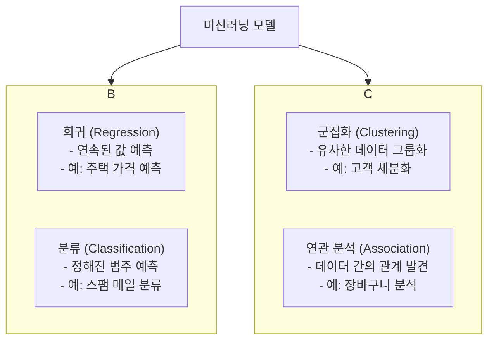
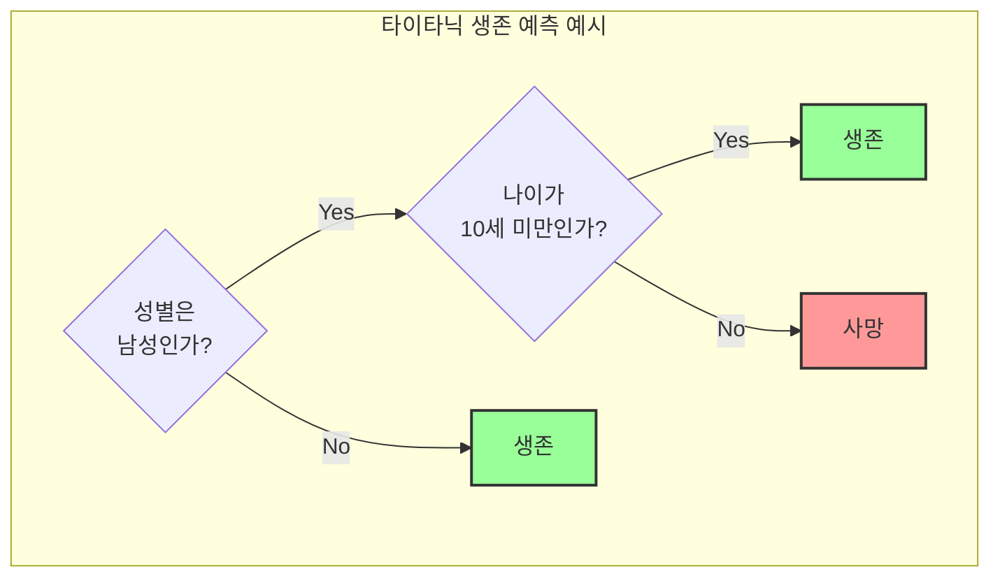
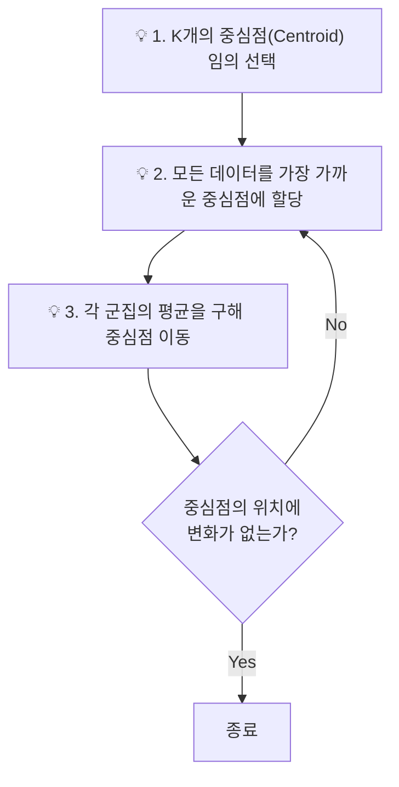
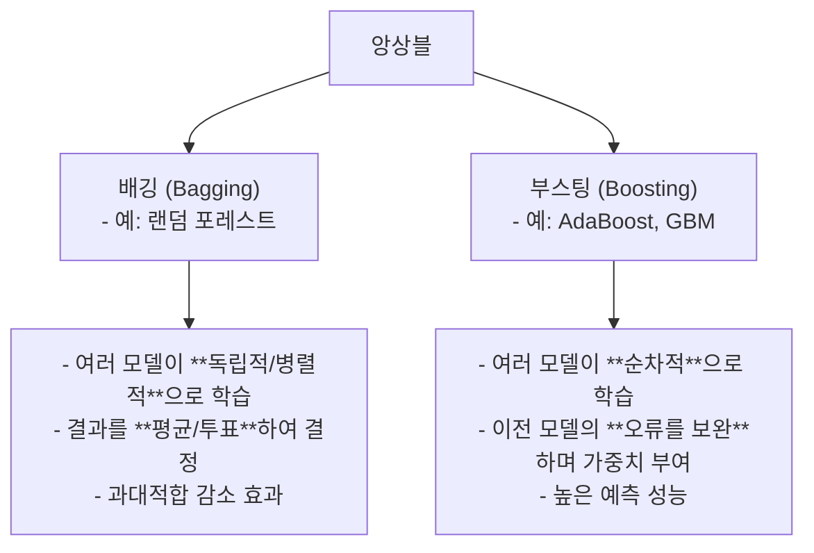

# 제3과목 핵심 요약: 빅데이터 모델링

이 문서는 빅데이터 모델링 과목의 핵심 알고리즘들을 요약 정리한 자료입니다. 각 모델의 원리와 장단점을 파악하는 데 중점을 둡니다.

## 1. 머신러닝 모델의 종류

머신러닝 모델은 크게 '정답' 데이터(Label)의 유무에 따라 지도학습과 비지도학습으로 나뉩니다.

## 2. 주요 지도학습 모델

### 2.1. 분류 (Classification) 모델 비교

| 모델명 | 주요 원리 | 장점 | 단점 |
| :--- | :--- | :--- | :--- |
| **로지스틱 회귀** | Sigmoid 함수를 이용해 확률을 계산, 경계값을 기준으로 분류 | 계산 속도 빠름, 해석 용이 | 비선형 데이터에 약함 |
| **의사결정나무** | 데이터 특징에 따라 나무 형태로 질문을 던지며 분류 | 해석 용이, 시각화 가능 | 과대적합 위험 높음 |
| **서포트 벡터 머신 (SVM)**| 데이터 간의 간격(Margin)을 최대로 하는 결정 경계를 찾음 | 분류 성능 우수, 과대적합에 강함 | 계산량 많음, 해석 어려움 |
| **K-최근접 이웃 (KNN)** | 주변의 K개 데이터의 레이블을 보고 자신의 레이블을 결정 | 구현 간단, 유연함 | 데이터가 많으면 속도 느림 |

### 2.2. 의사결정나무 (Decision Tree) 심층 분석

- **핵심 지표:** 불순도를 측정하는 **지니 계수**, **엔트로피** 등을 사용하여 최적의 분기점을 찾습니다.

---

## 3. 주요 비지도학습 모델

### 3.1. K-평균 군집화 (K-Means Clustering)

데이터를 K개의 군집으로 묶는 알고리즘입니다.

### 3.2. 연관 규칙 분석 (Association Rule)

- **Apriori 알고리즘**이 대표적입니다.
- **주요 지표:**
    - **지지도 (Support):** 전체 거래 중 항목 A와 B가 동시에 포함된 거래의 비율. `P(A∩B)`
    - **신뢰도 (Confidence):** 항목 A를 포함한 거래 중 항목 B도 포함된 거래의 비율. `P(B|A)`
    - **향상도 (Lift):** A와 B의 관계가 우연인지 아닌지를 나타내는 지표. 1보다 크면 양의 연관관계. `P(B|A) / P(B)`

---

## 4. 앙상블 (Ensemble) 학습

여러 개의 약한 모델(Weak Learner)을 결합하여 하나의 강력한 모델을 만드는 기법입니다.

## 5. 과대적합 (Overfitting) 방지

모델이 학습 데이터에만 너무 잘 맞춰져 새로운 데이터에 대한 예측 성능이 떨어지는 현상입니다.

- **방지 기법:**
    1.  **데이터 증강 (Data Augmentation):** 더 많은, 다양한 데이터를 확보.
    2.  **교차 검증 (Cross-Validation):** 데이터를 여러 fold로 나누어 검증.
    3.  **규제 (Regularization):** 모델의 복잡도에 페널티를 부과 (L1/L2 규제).
    4.  **드롭아웃 (Dropout):** 신경망에서 일부 뉴런을 학습에서 제외. 