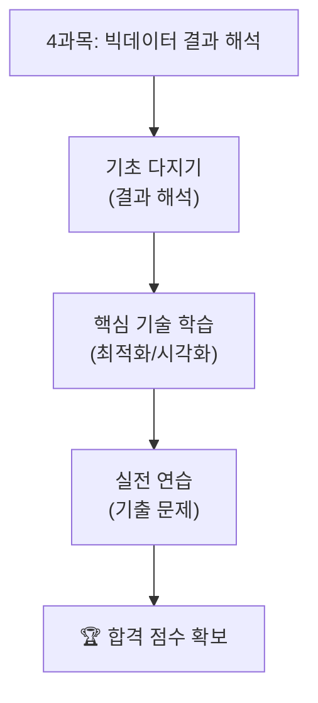

# 제4과목: 빅데이터 결과 해석

빅데이터 결과 해석은 분석 결과를 비즈니스에 적용하고, 결과를 효과적으로 전달하는 과정입니다. 이 과목에서는 모델 결과 해석, 성능 최적화, 보고서 작성 기술을 학습합니다.

## 📖 수험서 기준 인덱스

### 1. 과목 개요
- **목적**: 분석 결과를 이해하고, 비즈니스 의사결정에 활용하며, 결과를 명확히 전달하는 기술을 학습합니다.
- **중요도**: 분석의 최종 단계로, 시험에서 결과 해석과 보고서 작성 문제가 자주 출제됩니다.

### 2. 학습 목표
- 모델 결과를 해석하고, 비즈니스 인사이트를 도출할 수 있다.
- 성능 최적화 기법(하이퍼파라미터 튜닝 등)을 이해하고 적용할 수 있다.
- 분석 결과를 효과적으로 시각화하고, 보고서를 작성할 수 있다.
- 분석 결과의 한계와 윤리적 고려사항을 이해할 수 있다.

### 3. 주요 내용
- **결과 해석**: 회귀 계수 해석, 분류 모델의 확률 해석.
- **성능 최적화**: 하이퍼파라미터 튜닝(그리드 서치, 랜덤 서치), 모델 선택.
- **결과 시각화**: 혼동 행렬 시각화, ROC 곡선, 중요 변수 플롯.
- **보고서 작성**: 보고서 구조, 비즈니스 인사이트 전달.
- **윤리적 고려**: 데이터 편향, 개인정보 보호, 공정성.

### 4. 학습 자료

| 학습 자료 | 바로가기 | 설명 |
| :--- | :--- | :--- |
| **핵심 요약 정리** | [Go](./요약정리/README.md) | 결과 해석, 성능 최적화, 보고서 작성 등 시험의 핵심 이론을 정리했습니다. |
| **기출 문제** | [Go](./기출문제/README.md) | 실제 시험과 유사한 데이터셋으로 연습하며 실전 감각을 키웁니다. |
| **전체 로드맵** | [Go](../../README.md) | 빅데이터분석기사 전체 학습 과정으로 돌아갑니다. |

## 🎯 학습 로드맵

---
**Tip:** 4과목은 분석 결과를 비즈니스 언어로 번역하는 능력이 중요합니다. 보고서 작성 연습과 함께, 비즈니스 이해도를 높이는 것이 효과적입니다.
