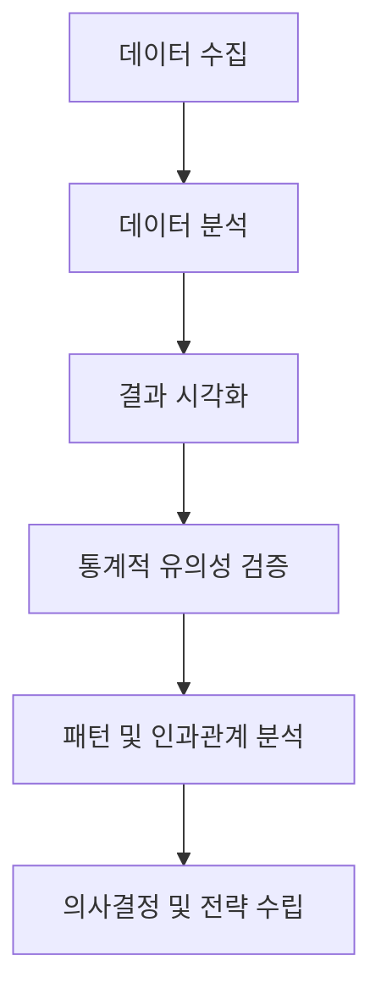
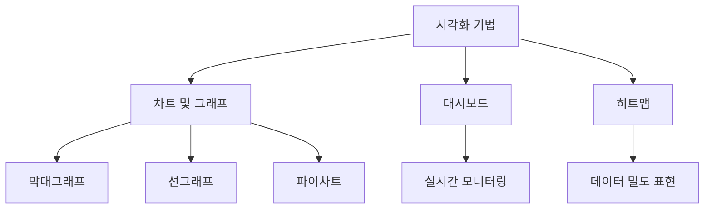

# 빅데이터 결과 해석 요약 정리 (1)

## 개요

빅데이터 결과 해석은 분석 결과를 효과적으로 해석하고, 이를 기반으로 의사결정을 내리는 과정을 다룹니다. 이 과목에서는 분석 결과의 시각화, 해석 방법, 그리고 결과를 비즈니스 전략에 연결하는 기술을 학습합니다.

## 주요 개념

### 1. **분석 결과 해석의 중요성**
- **의사결정 지원**: 분석 결과를 통해 데이터 기반 의사결정을 내리는 것이 핵심입니다.
- **비즈니스 가치 창출**: 결과 해석을 통해 비즈니스 문제를 해결하고 가치를 창출합니다.
- **커뮤니케이션**: 결과를 이해관계자들에게 효과적으로 전달하는 것이 중요합니다.

### 2. **시각화 기법**
- **차트 및 그래프**: 막대그래프, 선그래프, 파이차트 등을 활용한 데이터 표현.
- **대시보드**: 실시간 데이터 모니터링 및 의사결정 지원 도구.
- **히트맵**: 데이터 밀도와 패턴을 시각적으로 표현.

### 3. **결과 해석 방법**
- **통계적 유의성**: 결과가 통계적으로 의미 있는지 판단.
- **패턴 분석**: 데이터에서 유의미한 패턴과 트렌드를 발견.
- **인과관계 분석**: 상관관계와 인과관계를 구분하여 해석.

## 주요 내용 요약 표

| **주요 개념**            | **설명**                                                                 | **활용 예시**                     |
|--------------------------|-------------------------------------------------------------------------|-----------------------------------|
| 분석 결과 해석의 중요성  | 데이터 기반 의사결정과 비즈니스 가치 창출의 핵심                     | 매출 데이터 분석을 통한 전략 수립 |
| 시각화 기법              | 데이터를 직관적으로 표현하여 이해를 돕는 도구                        | 대시보드를 통한 실시간 모니터링   |
| 결과 해석 방법           | 통계적 유의성, 패턴, 인과관계를 분석하여 결과를 도출                 | 고객 행동 데이터에서 트렌드 발견  |

## 학습 팁

- **시각화 도구 익히기**: Tableau, Power BI 등 시각화 도구를 사용해 데이터를 효과적으로 표현하는 연습을 하세요.
- **통계 지식 강화**: 통계적 유의성과 신뢰 구간에 대한 이해를 높이세요.
- **실제 사례 분석**: 실제 비즈니스 사례를 통해 분석 결과를 해석하고 의사결정에 연결하는 연습을 하세요.
- **커뮤니케이션 연습**: 분석 결과를 비전문가에게 설명하는 연습을 통해 전달력을 높이세요.

## 시각화 자료

### 1. 분석 결과 해석 프로세스 흐름도

### 2. 시각화 기법 분류

## 추가 학습 자료

- **도서**: "The Visual Display of Quantitative Information" by Edward R. Tufte
- **온라인 강의**: Coursera의 "Data Visualization" 강의
- **웹사이트**: Tableau Public 갤러리에서 다양한 시각화 사례 탐색

이 요약 정리는 빅데이터 결과 해석의 주요 개념과 학습 팁을 중심으로 구성되었습니다. 시험 준비에 도움이 되길 바랍니다! 