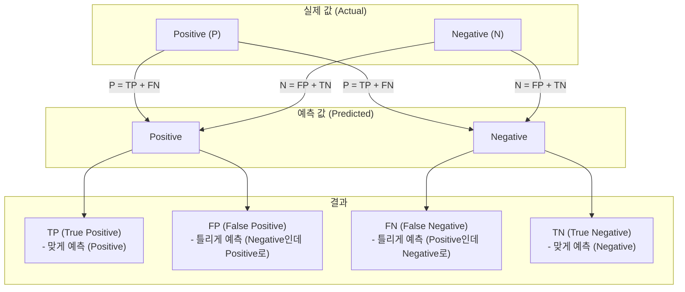
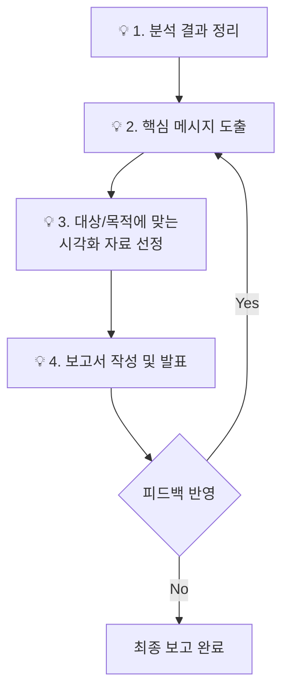

# 제4과목 핵심 요약: 빅데이터 결과 해석

이 문서는 모델의 성능을 객관적으로 평가하고, 그 결과를 올바르게 해석하기 위한 핵심 지표들을 정리한 자료입니다.

## 1. 분류 모델 평가

분류 모델의 성능은 단순히 '얼마나 맞췄는가'를 넘어, '어떻게 틀렸는가'를 파악하는 것이 중요합니다.

### 1.1. 혼동 행렬 (Confusion Matrix)

분류 모델의 예측 결과를 실제 값과 비교하여 표로 나타낸 것입니다. 모든 평가 지표의 시작점입니다.

### 1.2. 주요 평가 지표

| 지표 | 공식 | 의미 | 설명 |
| :--- | :--- | :--- | :--- |
| **정확도 (Accuracy)** | `(TP+TN)/(TP+TN+FP+FN)` | 전체 예측 중 올바르게 예측한 비율 | 가장 직관적이지만, 데이터가 불균형할 때 성능을 왜곡할 수 있음. |
| **정밀도 (Precision)** | `TP/(TP+FP)` | Positive로 예측한 것 중, 실제 Positive인 비율 | 스팸메일 분류처럼, 일반메일을 스팸으로 잘못 판단하면 안될 때 중요. |
| **재현율 (Recall)** | `TP/(TP+FN)` | 실제 Positive인 것 중, 모델이 Positive로 예측한 비율 | 암 진단처럼, 실제 환자를 놓치면 안되는 경우에 중요. (민감도라고도 함) |
| **F1-Score** | `2*(Precision*Recall)/(Precision+Recall)` | 정밀도와 재현율의 조화 평균 | 두 지표가 모두 중요할 때 사용하는 균형 잡힌 지표. |

### 1.3. ROC Curve와 AUC

- **ROC (Receiver Operating Characteristic) Curve:** 분류 모델의 임계값(Threshold) 변화에 따른 재현율(TPR)과 위양성률(FPR, 1-특이도)의 변화를 그린 곡선.
- **AUC (Area Under the Curve):** ROC 곡선 아래의 면적. 1에 가까울수록 모델의 성능이 좋음을 의미.

---

## 2. 회귀 모델 평가

회귀 모델은 실제 값과 예측 값의 '차이(오차)'를 기반으로 성능을 평가합니다.

| 지표 | 공식 | 설명 |
| :--- | :--- | :--- |
| **MAE (Mean Absolute Error)** | `(1/n) * Σ\|y - ŷ\|` | 오차의 절대값 평균. 오차의 크기를 직관적으로 파악 가능. |
| **MSE (Mean Squared Error)** | `(1/n) * Σ(y - ŷ)²` | 오차의 제곱 평균. 큰 오차에 대해 더 큰 패널티를 부여. |
| **RMSE (Root MSE)** | `sqrt(MSE)` | MSE에 제곱근을 취한 값. 원래 데이터와 단위가 같아 해석 용이. |
| **R² (결정 계수)** | `1 - (SSE/SST)` | 모델이 데이터의 분산을 얼마나 잘 설명하는지를 나타냄. 1에 가까울수록 설명력이 높음. |

---

## 3. 분석 결과의 시각화 및 보고

분석 결과를 이해관계자가 쉽게 이해할 수 있도록 전달하는 과정입니다.

- **Key Point:** '그래서 이 분석 결과가 비즈니스에 어떤 의미가 있는가?'를 항상 명확히 전달해야 합니다. 