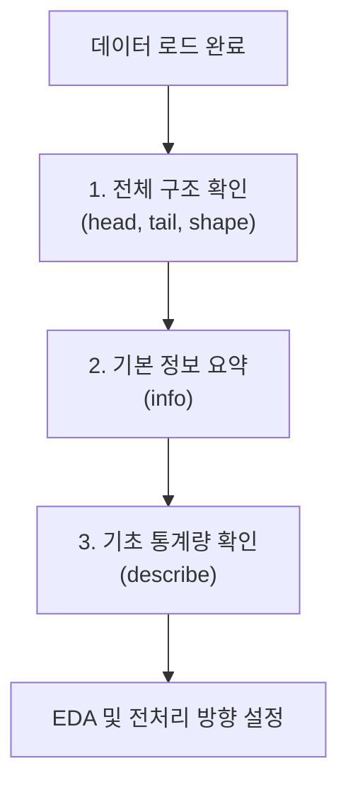

# 실무 1단계: 데이터 수집 및 확인

모든 데이터 분석의 시작은 데이터를 불러오는 것입니다. 실기 시험에서는 주로 `CSV` 형식의 파일이 주어지며, `pandas` 라이브러리의 `read_csv()` 함수를 사용하여 데이터를 `DataFrame`으로 변환하는 것이 첫 번째 과제입니다.

## 📝 1. 데이터 불러오기 (CSV)

가장 기본이 되는 코드입니다. 시험장에서는 보통 `data` 또는 `dataset` 폴더에 파일이 위치합니다.

```python
import pandas as pd

# CSV 파일을 DataFrame으로 불러오기
# 파일 경로와 인코딩(한글 포함 시)을 확인하는 것이 중요합니다.
df = pd.read_csv('./data/X_train.csv', encoding='cp949')
```

### `read_csv`의 주요 파라미터

| 파라미터 | 설명 | 예시 |
| :--- | :--- | :--- |
| `filepath_or_buffer` | 불러올 파일의 경로 | `'./data/data.csv'` |
| `sep` | 데이터의 구분자 (기본값: `,`) | `sep=','` 또는 `sep='\t'` |
| `encoding` | 파일 인코딩 형식 (한글 깨짐 방지) | `encoding='utf-8'` 또는 `encoding='cp949'`|
| `index_col` | 인덱스로 사용할 열 지정 | `index_col='ID'` |

## 🔍 2. 데이터 기본 정보 확인

데이터를 불러온 후에는 가장 먼저 데이터의 구조와 기본 정보를 파악해야 합니다. 이 과정에서 데이터의 문제점을 초기에 발견할 수 있습니다.



### 필수 확인 코드 예시

```python
# 1. 데이터 앞부분 확인 (기본값: 5줄)
print(df.head())

# 2. 데이터 뒷부분 확인
print(df.tail())

# 3. 데이터 형태(행, 열) 확인
print(df.shape)

# 4. 데이터 타입, 결측치 등 기본 정보 요약
# 데이터 전처리 방향을 잡는 데 가장 중요한 함수입니다.
print(df.info())

# 5. 수치형 데이터의 기초 통계량 확인
# 이상치 탐색의 기초 자료로 활용됩니다.
print(df.describe())

# 6. 범주형 데이터의 기초 통계량 확인
print(df.describe(include='object'))
```

---
[⬅️ 빅데이터 분석 실무 개요로 돌아가기](../README.md) 