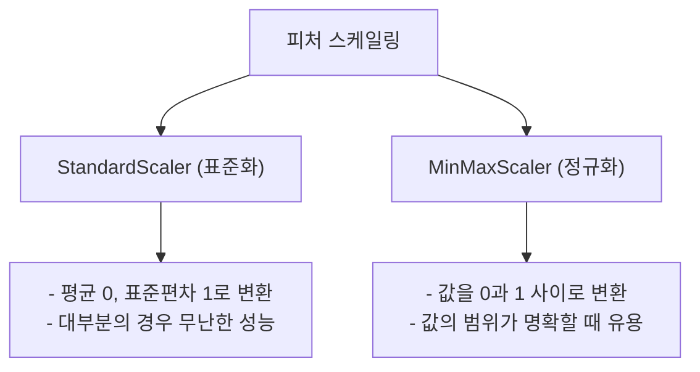

# 실무 2단계: 데이터 전처리

데이터 전처리는 모델의 성능에 가장 큰 영향을 미치는 중요한 과정입니다. "Garbage In, Garbage Out"이라는 말처럼, 정제되지 않은 데이터로는 좋은 모델을 만들 수 없습니다. 이 단계에서는 결측치, 이상치 처리, 데이터 타입 변환, 스케일링 등 다양한 기법을 학습합니다.

## 🧹 1. 결측치 (Missing Value) 처리

`df.info()`를 통해 확인된 결측치를 처리합니다.

```python
# 1. 특정 값으로 채우기
df['age'].fillna(df['age'].mean(), inplace=True) # 평균값으로 대치

# 2. 앞 또는 뒤의 값으로 채우기
df['age'].fillna(method='ffill', inplace=True) # 앞의 값으로 채움

# 3. 결측치가 있는 행 제거
df.dropna(inplace=True)
```

## 📊 2. 데이터 타입 변환

범주형 변수를 모델이 학습할 수 있는 숫자 형태로 변환하거나, 잘못된 데이터 타입을 바로잡습니다.

### 원-핫 인코딩 (One-Hot Encoding)

`pandas`의 `get_dummies()` 함수를 사용합니다.

```python
# 'gender' 컬럼을 원-핫 인코딩
df_encoded = pd.get_dummies(df, columns=['gender'], drop_first=True)
# drop_first=True : 다중공선성 방지를 위해 첫 번째 카테고리 열은 제거
```

### 라벨 인코딩 (Label Encoding)

`scikit-learn`의 `LabelEncoder`를 사용합니다.

```python
from sklearn.preprocessing import LabelEncoder

encoder = LabelEncoder()
df['city_encoded'] = encoder.fit_transform(df['city'])
```

## 📏 3. 피처 스케일링 (Feature Scaling)

변수 간의 값 범위 차이가 클 때, 모델이 값의 크기에 영향을 받지 않도록 스케일을 맞춰주는 작업입니다.



### `StandardScaler` 예시

```python
from sklearn.preprocessing import StandardScaler

scaler = StandardScaler()
# 수치형 데이터만 선택하여 스케일링 적용
numerical_features = ['age', 'income']
df[numerical_features] = scaler.fit_transform(df[numerical_features])
```

## 🔪 4. 데이터 분리 (Train/Test Split)

모델 학습 및 평가를 위해 데이터를 훈련용과 테스트용으로 분리합니다.

```python
from sklearn.model_selection import train_test_split

# 독립변수(X)와 종속변수(y) 분리
X = df.drop('target', axis=1)
y = df['target']

# 훈련용과 테스트용 데이터 분리 (보통 8:2 또는 7:3)
# stratify=y : y의 클래스 비율을 유지하며 분리 (분류 문제에서 중요)
X_train, X_test, y_train, y_test = train_test_split(
    X, y, test_size=0.2, random_state=42, stratify=y
)
```

---
[⬅️ 빅데이터 분석 실무 개요로 돌아가기](../README.md) 