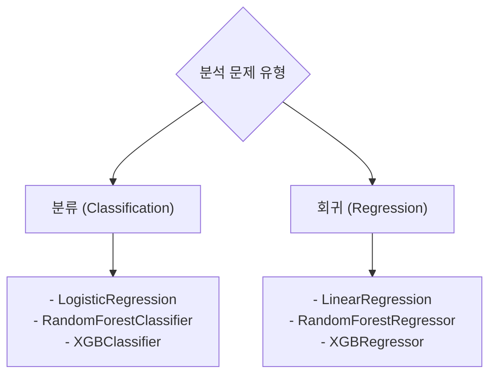

# 실무 3단계: 모델 구축 (Modeling)

데이터 전처리가 완료되면, 이제 분석 목적에 맞는 머신러닝 모델을 선택하여 구축하고 학습시킬 차례입니다. `scikit-learn` 라이브러리를 사용하면 몇 줄의 코드로 간단하게 모델을 생성하고 학습시킬 수 있습니다.

## 🤖 1. 모델 선택 및 초기화

문제 유형(분류/회귀)에 따라 적절한 모델을 선택합니다.



### 모델 초기화 코드 예시

```python
from sklearn.linear_model import LogisticRegression
from sklearn.ensemble import RandomForestClassifier
from xgboost import XGBClassifier

# 로지스틱 회귀 모델 초기화
# random_state를 설정하여 실행할 때마다 동일한 결과를 얻도록 합니다.
model_lr = LogisticRegression(random_state=42)

# 랜덤 포레스트 분류 모델 초기화
# n_estimators: 생성할 트리의 개수
model_rf = RandomForestClassifier(n_estimators=100, random_state=42)

# XGBoost 분류 모델 초기화
model_xgb = XGBClassifier(random_state=42, use_label_encoder=False, eval_metric='logloss')
```
> **Tip:** `random_state`는 모델의 재현성을 위해 설정하는 것이 좋습니다. 어떤 값을 넣어도 상관없지만, 보통 42를 관례적으로 사용합니다.

## 🏋️ 2. 모델 학습 (Fitting)

초기화된 모델에 훈련용 데이터를 넣어 학습시킵니다. `fit()` 메소드를 사용합니다.

```python
# 랜덤 포레스트 모델을 훈련 데이터로 학습
# X_train: 훈련용 독립변수, y_train: 훈련용 종속변수
model_rf.fit(X_train, y_train)
```
- `fit(X, y)`: 모델은 X(특성)와 y(정답)의 관계를 학습합니다.

## ⚙️ 3. 하이퍼파라미터 튜닝 (Optional)

모델의 성능을 더욱 끌어올리기 위해 하이퍼파라미터를 조정하는 과정입니다. `GridSearchCV`가 주로 사용됩니다.

```python
from sklearn.model_selection import GridSearchCV

# 튜닝할 하이퍼파라미터 설정
params = {
    'n_estimators': [50, 100, 200],
    'max_depth': [10, 20, 30]
}

# GridSearchCV를 사용하여 최적의 하이퍼파라미터 탐색
grid_search = GridSearchCV(
    estimator=model_rf,
    param_grid=params,
    cv=3, # 3-fold 교차 검증
    n_jobs=-1, # 모든 CPU 코어 사용
    verbose=2
)

grid_search.fit(X_train, y_train)

# 최적의 파라미터 확인
print("Best Parameters:", grid_search.best_params_)

# 최적의 파라미터로 학습된 모델
best_model = grid_search.best_estimator_
```
> ⚠️ 하이퍼파라미터 튜닝은 시간이 오래 걸리므로, 시험에서는 기본 모델로 먼저 성능을 확인한 후 시도하는 것이 좋습니다.

---
[⬅️ 빅데이터 분석 실무 개요로 돌아가기](../README.md) 