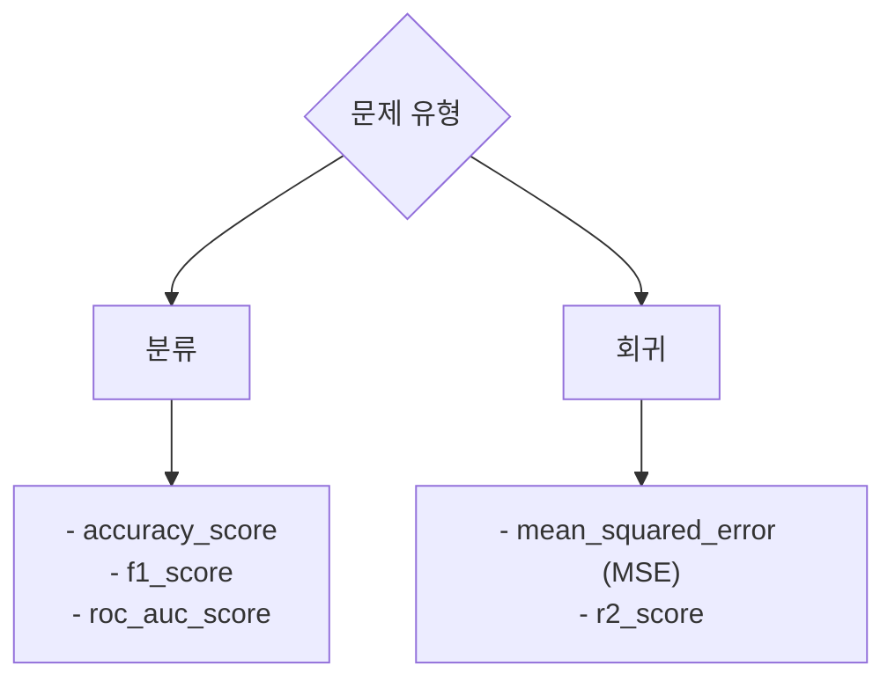

# 실무 4단계: 모델 평가 및 제출

모델 학습이 완료되었다면, 이제 모델이 얼마나 새로운 데이터에 대해 잘 예측하는지 평가하고, 최종 결과를 정해진 형식에 맞춰 제출해야 합니다.

## 📊 1. 예측 (Prediction)

학습된 모델을 사용하여 테스트 데이터의 정답(y_test)을 예측합니다.

```python
# 테스트 데이터(X_test)에 대한 예측 수행
predictions = model_rf.predict(X_test)

# 분류 문제에서 각 클래스에 대한 확률 예측
# roc_auc_score를 계산하거나, 확률값이 필요할 때 사용합니다.
# predict_proba의 결과는 [0일 확률, 1일 확률] 형태의 2차원 배열입니다.
pred_proba = model_rf.predict_proba(X_test)[:, 1] 
```

## 📈 2. 성능 평가 (Evaluation)

예측 결과(predictions)와 실제 정답(y_test)을 비교하여 모델의 성능을 측정합니다. 4과목에서 학습한 평가 지표들이 그대로 사용됩니다.



### 평가 코드 예시 (분류)

```python
from sklearn.metrics import accuracy_score, f1_score, roc_auc_score

# 정확도
accuracy = accuracy_score(y_test, predictions)
print(f"Accuracy: {accuracy:.4f}")

# F1 스코어
f1 = f1_score(y_test, predictions)
print(f"F1 Score: {f1:.4f}")

# ROC AUC 스코어
# roc_auc_score는 확률값을 필요로 합니다.
roc_auc = roc_auc_score(y_test, pred_proba)
print(f"ROC AUC Score: {roc_auc:.4f}")
```

## 📄 3. 최종 결과 제출

시험에서 요구하는 형식에 맞춰 예측 결과를 CSV 파일로 저장하여 제출합니다. 보통 `수험번호.csv`와 같은 형태로 제출을 요구합니다.

### 제출 파일 생성 예시

```python
# 1. 제출용 데이터프레임 생성
# 예를 들어, ID 컬럼과 예측 결과 컬럼이 필요하다고 가정
submission = pd.DataFrame({
    'ID': X_test.index, # 또는 별도의 ID 컬럼
    'target': predictions
})

# 2. CSV 파일로 저장
# index=False : 데이터프레임의 인덱스는 저장하지 않음
submission.to_csv('수험번호.csv', index=False)

print("제출 파일 생성이 완료되었습니다.")
```
> **Tip:** `to_csv` 함수의 `index=False` 옵션을 빠뜨리면 인덱스가 불필요하게 추가되어 오답 처리될 수 있으니 반드시 확인해야 합니다.

---
[⬅️ 빅데이터 분석 실무 개요로 돌아가기](../README.md) 