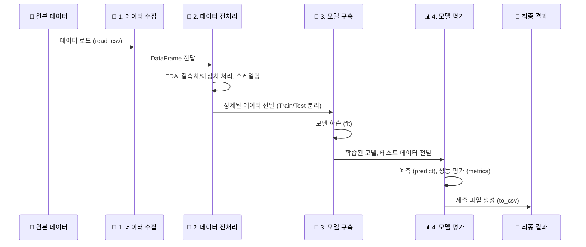

# 제1과목: 빅데이터 분석 실무

'빅데이터 분석 실무'는 실기 시험의 핵심으로, 주어진 데이터를 가지고 실제 분석 프로젝트처럼 전 과정을 수행하는 능력을 평가합니다. 작업형 제1유형과 제2유형이 모두 이 과정에 포함됩니다.

##  workflow: 데이터 분석 실무 프로세스

아래는 데이터 분석 실무의 일반적인 워크플로우입니다. 각 단계를 유기적으로 이해하는 것이 중요합니다.

## 📚 단계별 학습 가이드

각 단계별로 필요한 핵심 코드와 개념을 학습하세요.

| 학습 단계 | 바로가기 | 주요 학습 내용 |
| :--- | :--- | :--- |
| **1. 데이터 수집** | [Go](./01_데이터_수집/) | `pd.read_csv()` 함수의 주요 파라미터(sep, encoding 등) 사용법 |
| **2. 데이터 전처리** | [Go](./02_데이터_전처리/) | `fillna`, `loc`, `iloc`, `StandardScaler` 등 데이터 가공 및 변환 |
| **3. 모델 구축** | [Go](./03_모델_구축/) | `LogisticRegression`, `RandomForest`, `LinearRegression` 등 모델 초기화 및 학습(`fit`) |
| **4. 모델 평가 및 제출** | [Go](./04_모델_평가/) | `predict`, `predict_proba`, `accuracy_score`, `f1_score`, `roc_auc_score`, `to_csv` |

---
[⬅️ 실기 시험 전체 가이드로 돌아가기](../README.md) 