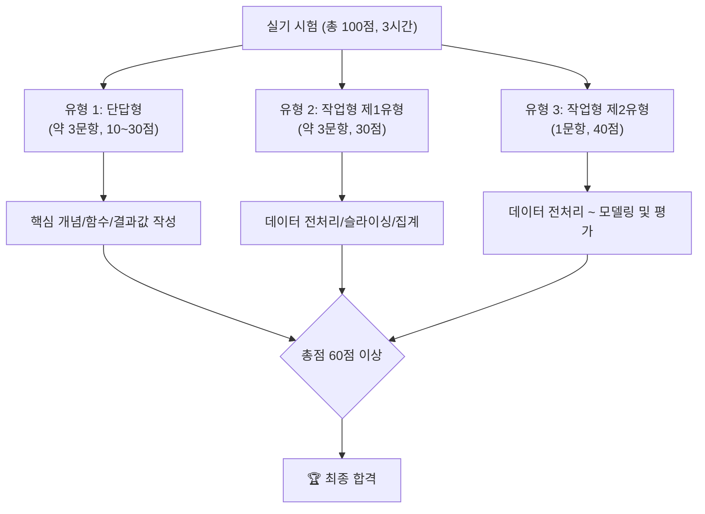

# 빅데이터분석기사 실기 시험 공략 가이드

필기 합격을 축하합니다! 이제 빅데이터분석기사 자격증 취득의 최종 관문, 실기 시험을 준비할 차례입니다.
실기 시험은 주어진 시간(3시간) 내에 클라우드 환경에서 실제 데이터를 분석하고 결과를 제출하는 작업형 시험입니다.

## 🎯 실기 시험 개요

- **시험 환경:** 웹 기반 클라우드 환경 (Python 또는 R 선택 가능, 라이브러리 제공)
- **핵심 라이브러리:**
    - **Python:** `pandas`, `numpy`, `scikit-learn` 이 3가지는 반드시 숙달해야 합니다.

## 📚 실기 학습 로드맵

실기 시험은 '데이터 분석 실무'라는 하나의 큰 흐름으로 이해하는 것이 중요합니다. 아래 로드맵에 따라 차근차근 학습을 진행하세요.

| 학습 단계 | 바로가기 | 주요 내용 | 핵심 라이브러리 |
| :--- | :--- | :--- | :--- |
| **1단계: 데이터 불러오기** | [Go](./1과목_빅데이터_분석_실무/01_데이터_수집/) | 제공된 CSV 파일을 DataFrame으로 읽어옵니다. | `pandas` |
| **2단계: 데이터 전처리** | [Go](./1과목_빅데이터_분석_실무/02_데이터_전처리/) | 결측치, 이상치 처리, 데이터 타입 변환 등을 수행합니다. | `pandas`, `numpy` |
| **3단계: 모델 구축** | [Go](./1과목_빅데이터_분석_실무/03_모델_구축/) | 분류/회귀 모델을 선택하고 학습시킵니다. | `scikit-learn` |
| **4단계: 모델 평가 및 제출** | [Go](./1과목_빅데이터_분석_실무/04_모델_평가/) | 모델 성능을 평가하고, 요구 형식에 맞게 예측 결과를 제출합니다. | `scikit-learn`, `pandas`|

### 실전 연습을 위한 추가 자료

- **[실습 코드 및 데이터셋](./실습_코드_및_데이터셋/):** 다양한 예제 코드를 직접 실행하며 연습할 수 있는 공간입니다.
- **[기출문제 복원](./기출문제_복원/):** 실제 시험과 유사한 문제를 풀어보며 실전 감각을 극대화합니다.
- **[실기 오답노트](./오답노트/):** 자주 실수하는 코드나 개념을 기록하여 약점을 보완합니다.

---

[⬅️ 전체 로드맵으로 돌아가기](../README.md) 