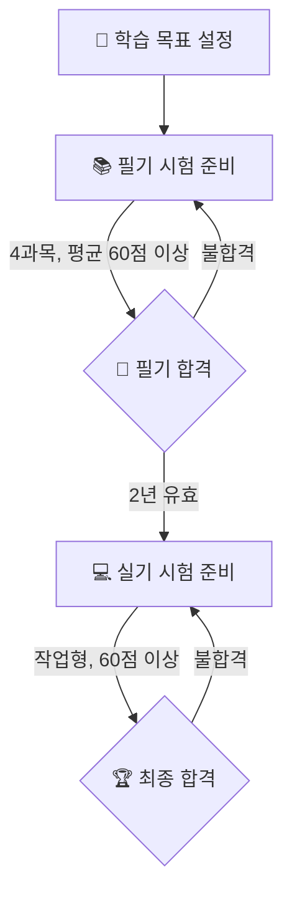
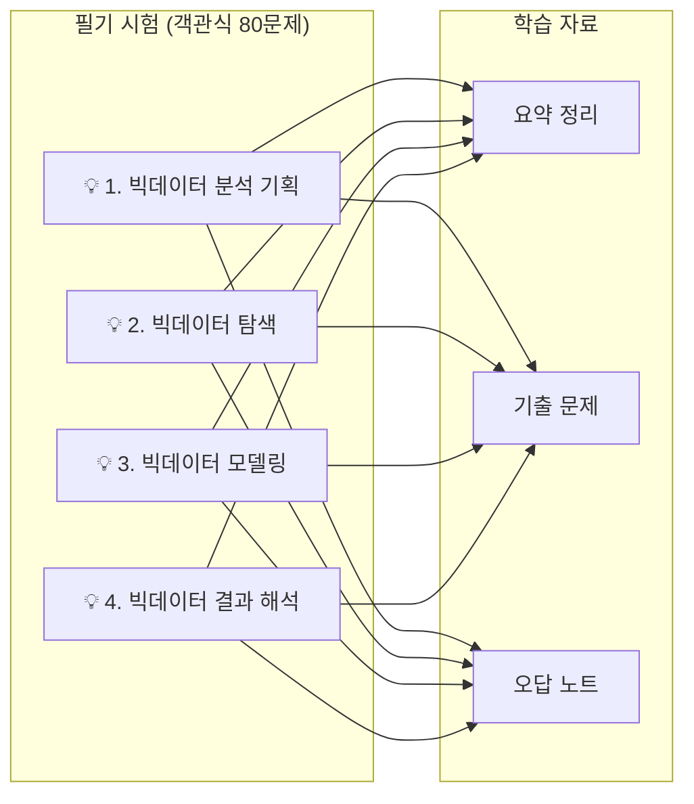
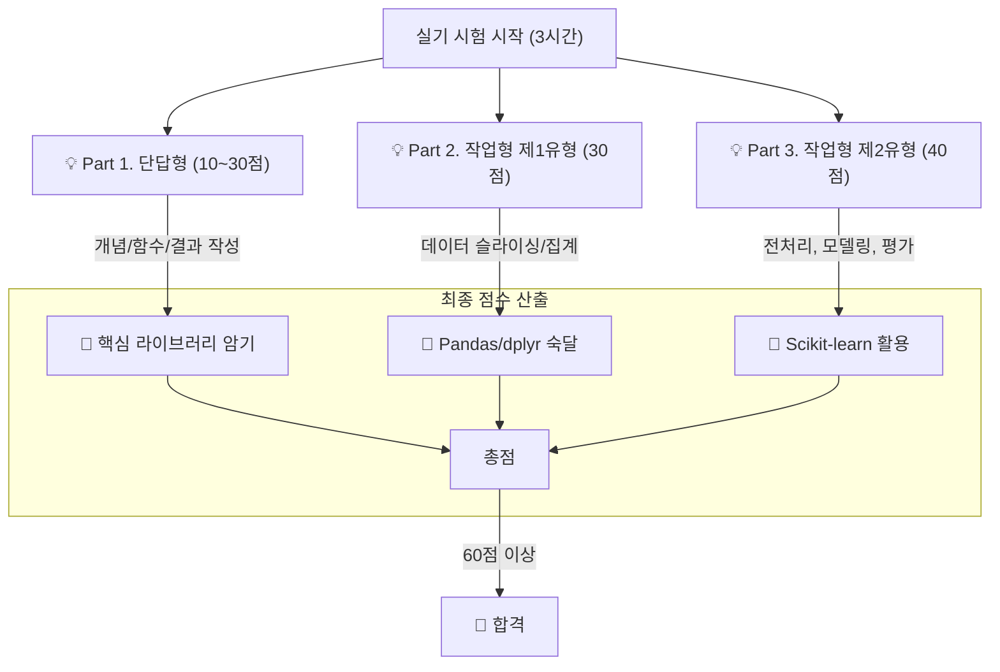

# 빅데이터분석기사 합격 로드맵

안녕하세요! 빅데이터분석기사 자격증 취득을 위한 학습 여정에 오신 것을 환영합니다.
이 문서는 필기부터 실기까지, 시험 합격에 필요한 모든 정보를 체계적으로 안내하는 여러분의 학습 나침반입니다.

## 🗺️ 전체 학습 경로

아래 다이어그램은 빅데이터분석기사 합격을 위한 전체적인 학습 단계를 보여줍니다. 각 단계를 차근차근 따라오시면 최종 합격의 기쁨을 누리실 수 있습니다.

## 📚 1단계: 필기 시험 준비 (80문항, 120분)

필기 시험은 4개의 과목으로 구성되어 있으며, 각 과목의 핵심 이론을 탄탄히 다지는 것이 중요합니다.

- **[필수]** [자격 정보 및 응시 가이드](./00_자격정보_및_응시가이드/README.md)를 먼저 읽어보세요.

### 필기 과목별 학습 전략

| 과목 | 바로가기 | 설명 |
| :--- | :--- | :--- |
| **1과목. 빅데이터 분석 기획** | [Go](./01_필기/1과목_빅데이터_분석_기획/) | 데이터 분석의 전체 프로세스를 이해하고 기획하는 능력을 평가합니다. |
| **2과목. 빅데이터 탐색** | [Go](./01_필기/2과목_빅데이터_탐색/) | 데이터를 탐색하고 정제, 변환, 시각화하는 기술을 다룹니다. |
| **3과목. 빅데이터 모델링** | [Go](./01_필기/3과목_빅데이터_모델링/) | 다양한 분석 모델을 이해하고 실제 데이터에 적용하는 과목입니다. |
| **4과목. 빅데이터 결과 해석** | [Go](./01_필기/4과목_빅데이터_결과_해석/) | 모델의 성능을 평가하고 분석 결과를 비즈니스적으로 해석하는 능력을 평가합니다. |

- **종합 연습:** [종합 기출문제](./01_필기/종합_기출문제/)
- **약점 보완:** [필기 오답노트](./01_필기/오답노트/)

## 💻 2단계: 실기 시험 준비 (작업형, 180분)

실기 시험은 클라우드 환경에서 Python 또는 R을 사용하여 실제 데이터 분석 과제를 수행하는 시험입니다. 코드 구현 능력이 핵심입니다.

### 실기 시험 유형 및 공략

| 학습 주제 | 바로가기 | 설명 |
| :--- | :--- | :--- |
| **데이터 수집** | [Go](./02_실기/1과목_빅데이터_분석_실무/01_데이터_수집/) | 시험에 제공되는 데이터를 불러오는 방법을 익힙니다. |
| **데이터 전처리** | [Go](./02_실기/1과목_빅데이터_분석_실무/02_데이터_전처리/) | 결측치, 이상치 처리, 파생변수 생성 등 데이터 가공 기술을 학습합니다. |
| **모델 구축** | [Go](./02_실기/1과목_빅데이터_분석_실무/03_모델_구축/) | 분류, 회귀 등 다양한 머신러닝 모델을 구축하는 방법을 배웁니다. |
| **모델 평가** | [Go](./02_실기/1과목_빅데이터_분석_실무/04_모델_평가/) | 모델의 성능을 평가하고, 결과를 해석하여 제출 형식에 맞게 정리합니다. |

- **코드 연습:** [실습 코드 및 데이터셋](./02_실기/실습_코드_및_데이터셋/)
- **실전 감각:** [기출문제 복원](./02_실기/기출문제_복원/)
- **약점 보완:** [실기 오답노트](./02_실기/오답노트/)

---

**여러분의 성공적인 자격증 취득을 응원합니다!** 