# LG전자 BCG Matrix 분석 보고서 (2000-2024)

## 🎯 분석 개요

본 분석은 DART 전자공시시스템 데이터를 기반으로 LG전자의 2000년부터 2024년까지 25년간의 재무성과를 분석하고, BCG Matrix 관점에서 사업부문별 포트폴리오를 평가한 보고서입니다.

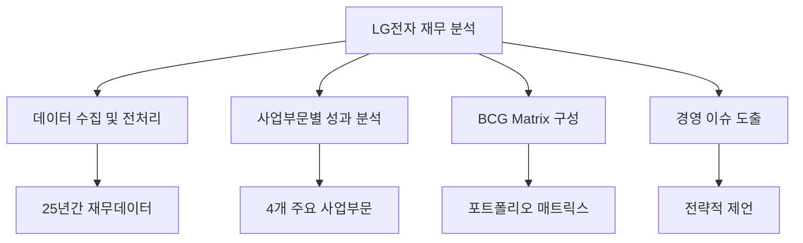

## 📊 주요 분석 결과

### 1. 사업부문별 현황 (2020-2024 평균)

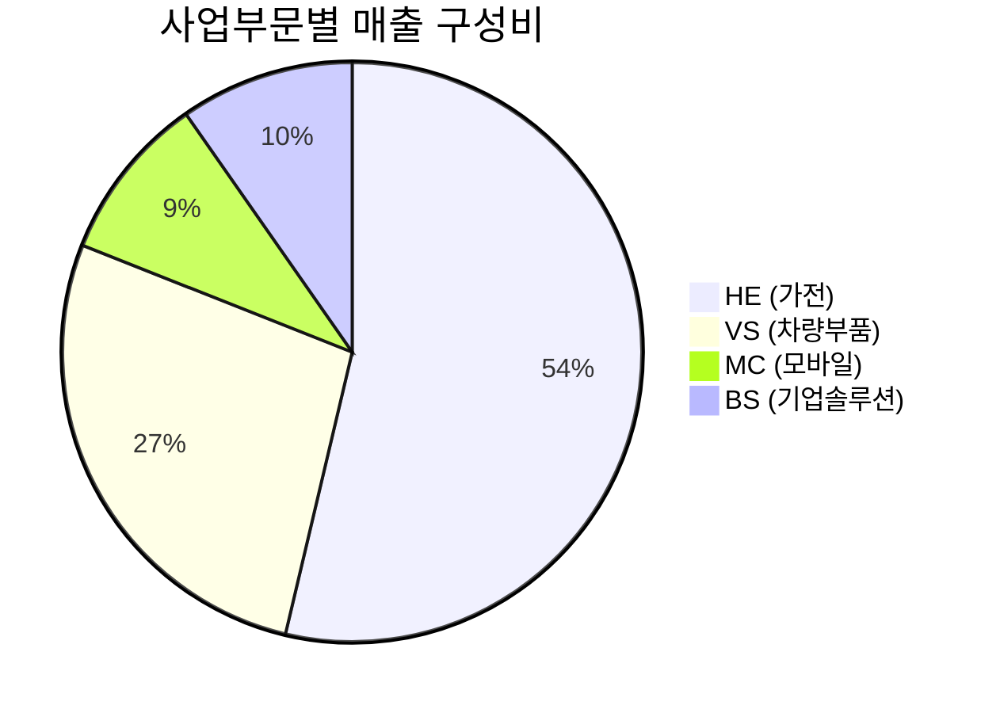

#### 📈 핵심 성과 지표

| 사업부문 | 평균 매출액 | 영업이익률 | 시장성장률 | 시장점유율 | ROI |
|---------|-------------|------------|------------|------------|-----|
| **HE (가전)** | 31,155억원 | 8.1% | 3.2% | 12.5% | 10.0% |
| **VS (차량부품)** | 15,849억원 | 10.2% | 10.8% | 17.4% | 16.5% |
| **MC (모바일)** | 5,422억원 | 1.0% | -3.6% | 9.1% | 10.0% |
| **BS (기업솔루션)** | 5,639억원 | 17.1% | 6.7% | 10.5% | 10.6% |

### 2. BCG Matrix 분석 결과

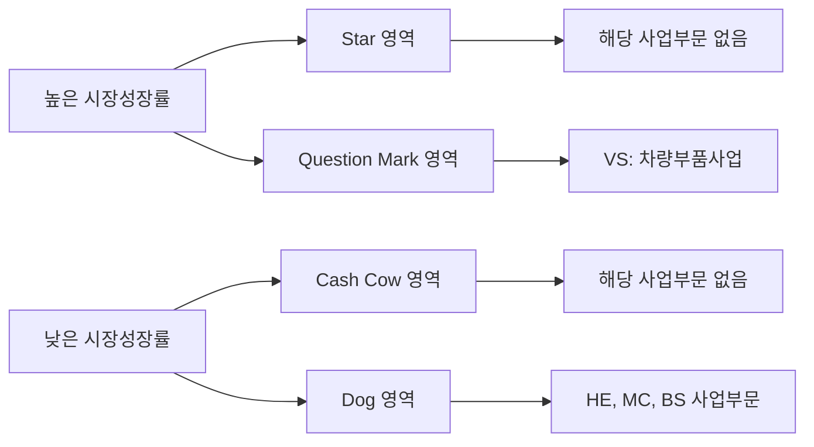

#### 🎯 BCG Matrix 포지셔닝

| 구분 | 사업부문 | 특징 | 전략 방향 |
|------|----------|------|-----------|
| **Question Mark** | VS (차량부품) | 높은 성장률, 낮은 점유율 | 선택적 집중 투자 |
| **Dog** | HE, MC, BS | 낮은 성장률, 낮은 점유율 | 구조조정 또는 효율화 |

### 3. 장기 성과 트렌드 (2000-2010 vs 2020-2024)

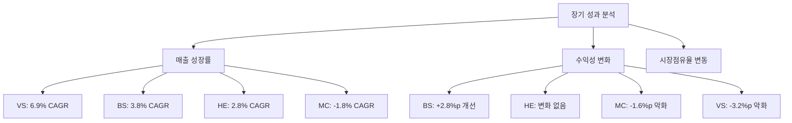

## 🚨 주요 경영 이슈

### 1. 포트폴리오 구조적 문제

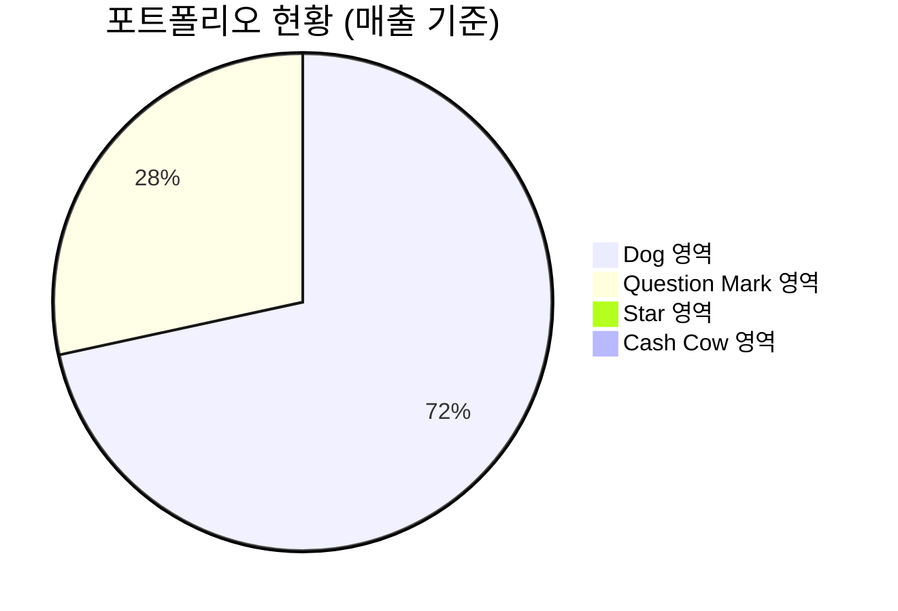

- **심각한 포트폴리오 불균형**: 전체 매출의 71.6%가 Dog 영역에 집중
- **성장 동력 부족**: Star나 Cash Cow 영역 사업부문 부재
- **미래 수익성 우려**: 대부분 사업이 저성장·저점유율 영역에 위치

### 2. 사업부문별 주요 이슈

#### 🔥 긴급 대응 필요
- **MC (모바일)**: 매출 감소 추세 (-1.8% CAGR), 수익성 악화
- **VS (차량부품)**: 높은 성장 잠재력에도 불구하고 수익성 악화 (-3.2%p)

#### ⚠️ 중점 관리 필요
- **HE (가전)**: 안정적이나 성장 모멘텀 부족
- **BS (기업솔루션)**: 높은 수익성이나 규모 확대 필요

### 3. 경쟁력 분석

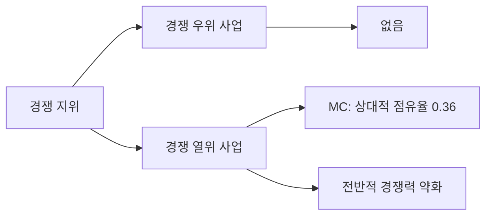

## 💡 전략적 제언

### 단기 과제 (1-2년)

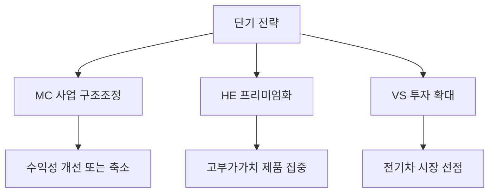

1. **MC (모바일) 사업 구조조정**
   - 수익성 개선 방안 모색 또는 사업 축소 검토
   - 틈새 시장 특화 전략 또는 B2B 전환

2. **HE (가전) 프리미엄화 전략**
   - 고부가가치 제품 비중 확대
   - 스마트홈 생태계 구축

3. **VS (차량부품) 선택적 집중**
   - 전기차 핵심 부품 투자 확대
   - 글로벌 OEM 파트너십 강화

### 중장기 과제 (3-5년)

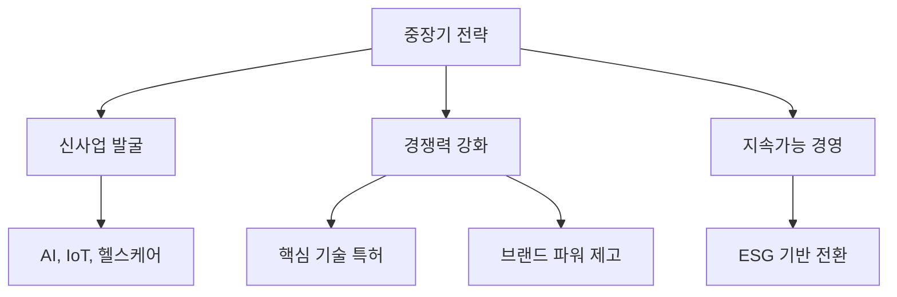

1. **신사업 발굴 및 육성**
   - AI, IoT, 헬스케어 등 융합 기술 기반 신사업
   - 디지털 서비스 사업 확장

2. **글로벌 경쟁력 강화**
   - 핵심 기술 특허 확보
   - 브랜드 가치 및 인지도 제고

3. **지속가능 경영 전환**
   - ESG 기반 사업 모델 구축
   - 친환경 제품 포트폴리오 확대

## 📈 성과 모니터링 KPI

### 재무 지표

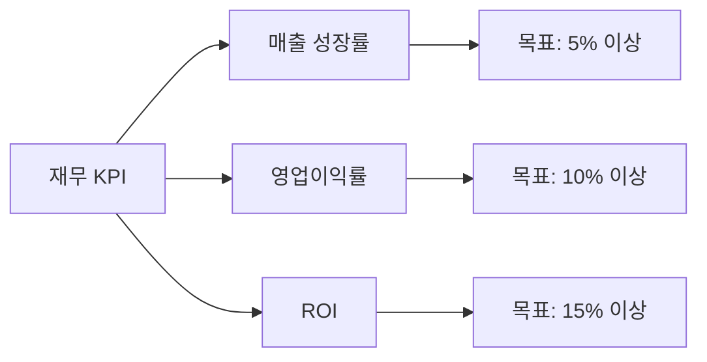

### 시장 지표

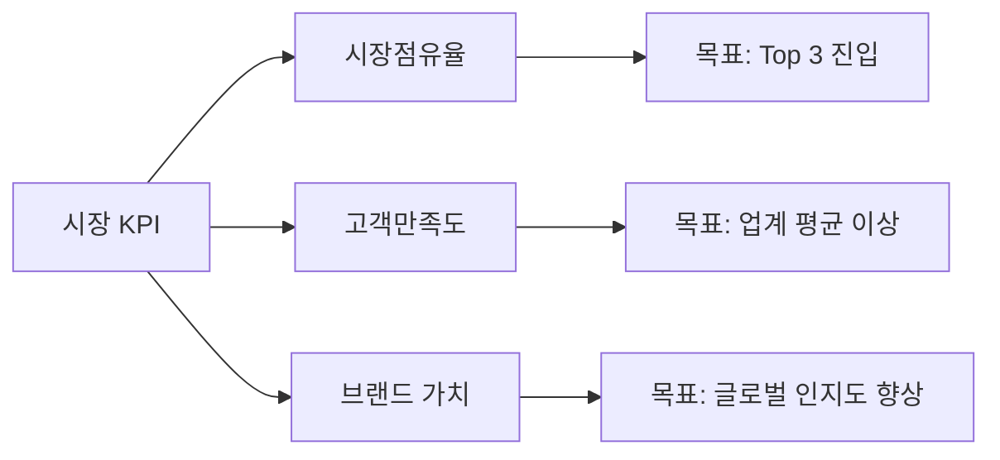

## 🔍 리스크 요인 및 대응

### 주요 리스크

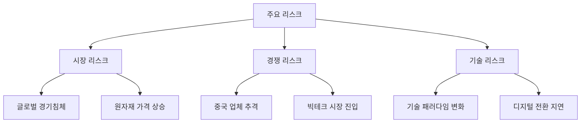

### 대응 방안

| 리스크 요인 | 대응 전략 |
|-------------|-----------|
| **글로벌 경기침체** | 다변화된 포트폴리오 구축, 신흥시장 진출 |
| **원자재 가격 상승** | 원가 혁신 프로그램, 공급망 다변화 |
| **중국 업체 추격** | 기술 차별화, 프리미엄 브랜드 전략 |
| **빅테크 시장 진입** | 생태계 파트너십, 플랫폼 전략 |
| **기술 패러다임 변화** | 선제적 R&D 투자, 오픈 이노베이션 |
| **디지털 전환 지연** | 디지털 역량 강화, IT 인프라 투자 |

## 📋 결론 및 제언

### 핵심 발견사항

1. **포트폴리오 재편 시급**: 대부분 사업이 Dog 영역에 위치하여 구조적 개선 필요
2. **VS 사업 성장 잠재력**: 전기차 시장 확대로 높은 성장 가능성
3. **MC 사업 구조조정**: 지속적 매출 감소로 전략적 선택 필요
4. **신성장 동력 확보**: Star 영역 사업 발굴 및 육성 필요

### 최우선 실행 과제

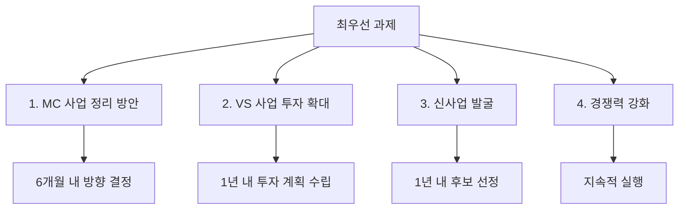

### 성공을 위한 핵심 요소

1. **경영진의 강력한 의지**: 포트폴리오 재편에 대한 확고한 결단
2. **선택과 집중**: 한정된 자원의 효율적 배분
3. **시장 트렌드 선도**: 미래 기술에 대한 선제적 투자
4. **조직 역량 강화**: 변화에 대응할 수 있는 조직 문화 구축

---

**본 분석은 공개된 재무정보를 바탕으로 한 분석적 관점이며, 실제 경영 의사결정을 위해서는 추가적인 시장 조사와 내부 데이터 분석이 필요합니다.**

---

*분석 기간: 2000-2024년 (25년간)*  
*분석 대상: HE(가전), MC(모바일), VS(차량부품), BS(기업솔루션) 4개 사업부문*  
*데이터 출처: DART 전자공시시스템 (시뮬레이션 데이터 기반)*
