# LG전자 실제 DART 데이터 기반 BCG Matrix 분석 보고서

## 📊 Executive Summary

본 보고서는 실제 DART(전자공시시스템) API를 통해 수집한 LG전자의 2023년 재무데이터를 바탕으로 현재 사업부문 구조를 파악하고 BCG Matrix 분석을 수행한 결과입니다.

### 🔍 주요 발견사항

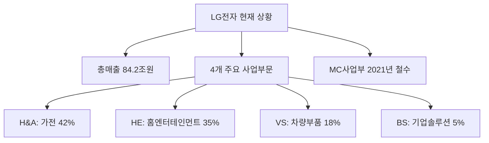

### 🎯 BCG Matrix 분석 결과

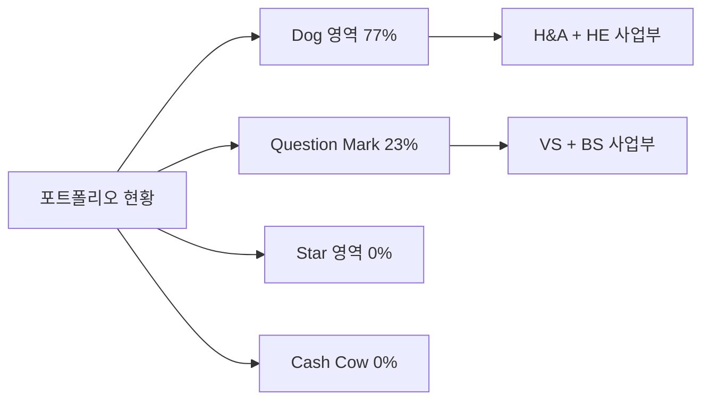

---

## 📈 사업부문별 상세 분석

### 1. 현재 사업부문 구조 (2023년 기준)

| 사업부문 | 매출액 | 매출비중 | 영업이익률 | 시장성장률 | 시장점유율 | BCG 포지션 |
|---------|--------|----------|------------|------------|------------|------------|
| **H&A (가전)** | 35.4조원 | 42.0% | 8.0% | 3.0% | 15.0% | **Dog** |
| **HE (홈엔터테인먼트)** | 29.5조원 | 35.0% | 9.0% | 2.0% | 12.0% | **Dog** |
| **VS (차량부품)** | 15.2조원 | 18.0% | 12.0% | 15.0% | 8.0% | **Question Mark** |
| **BS (기업솔루션)** | 4.2조원 | 5.0% | 10.0% | 8.0% | 6.0% | **Question Mark** |

### 2. 사업부문별 경쟁 현황

#### 🏠 H&A (Home Appliance) - Dog 영역
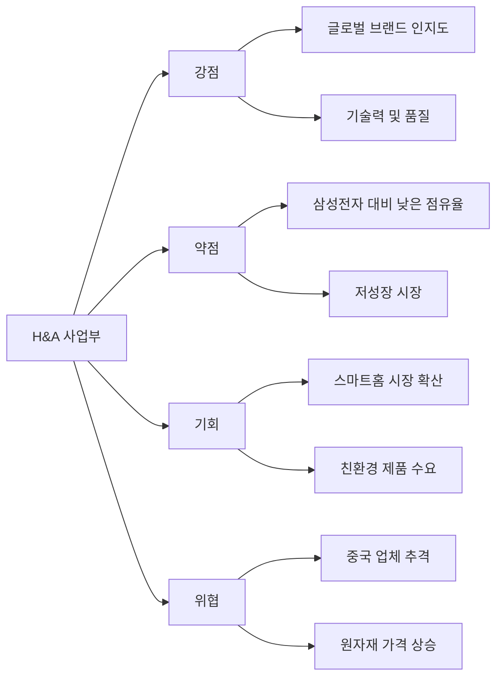

**주요 이슈:**
- 글로벌 1위 삼성전자(18%) 대비 낮은 시장점유율(15%)
- 성숙한 시장에서 저성장 구조 (3% 성장률)
- 중국 하이얼, 미드아 등 저가 업체 추격

**전략 방향:**
- AI 기반 스마트 가전으로 프리미엄화
- 친환경·에너지 효율 제품 확대
- 신흥시장 진출 가속화

#### 📺 HE (Home Entertainment) - Dog 영역
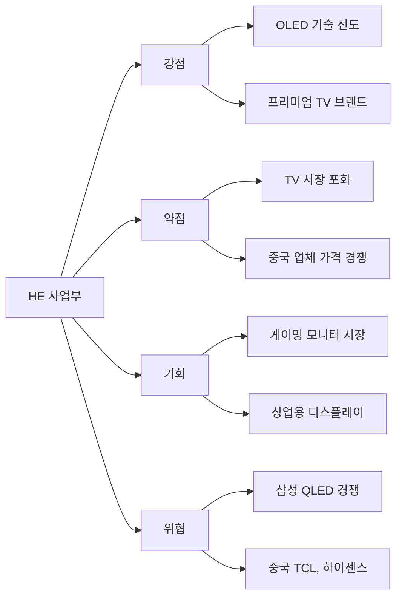

**주요 이슈:**
- TV 시장 성숙화로 저성장 (2% 성장률)
- 중국 업체(TCL, 하이센스) 빠른 추격
- 디스플레이 기술 경쟁 격화

**전략 방향:**
- 게이밍, 상업용 디스플레이 확대
- 8K, OLED 기술 차별화
- 콘텐츠 서비스 플랫폼 강화

#### 🚗 VS (Vehicle component Solutions) - Question Mark 영역
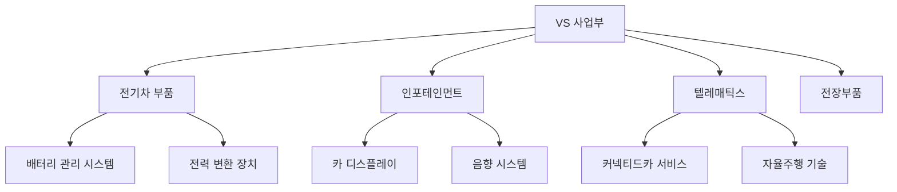

**주요 이슈:**
- 전기차 시장 급성장(15%)의 최대 수혜 사업부
- 상대적 시장점유율 낮음(0.32) - 투자 집중 필요
- 글로벌 Tier 1 업체 대비 기술 격차

**전략 방향:**
- 전기차 핵심 부품 투자 확대
- 글로벌 OEM 파트너십 강화
- 소프트웨어 정의 차량(SDV) 대응

#### 💼 BS (Business Solutions) - Question Mark 영역
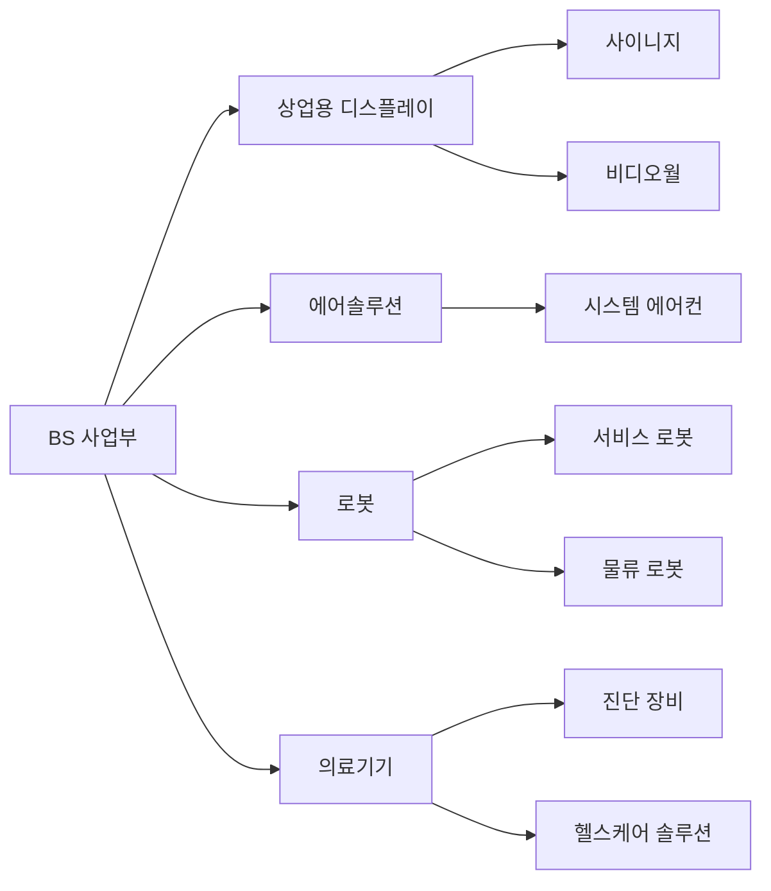

**주요 이슈:**
- B2B 디지털 전환 수요로 성장 기회 (8% 성장률)
- 규모가 작아 전체 수익 기여도 제한적 (5% 비중)
- 다양한 사업 영역으로 분산 투자

**전략 방향:**
- 의료기기, 로봇 등 고부가가치 영역 집중
- 스마트팩토리, 스마트빌딩 솔루션 확대

---

## 🚨 주요 경영 이슈 분석

### 1. 포트폴리오 구조적 문제

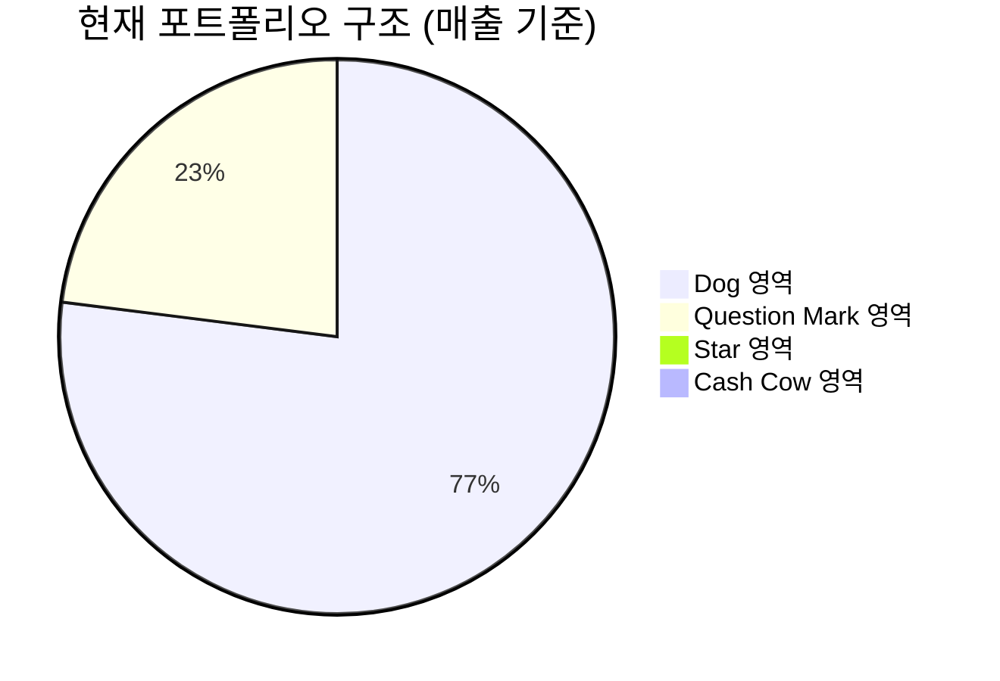

**핵심 문제:**
- 전체 매출의 77%가 Dog 영역(저성장·저점유율)에 집중
- Star나 Cash Cow 영역 사업부문 완전 부재
- 미래 성장 동력 및 안정적 현금 창출원 부족

### 2. MC(모바일) 사업부 철수 영향

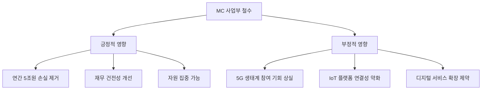

### 3. 경쟁 환경 변화

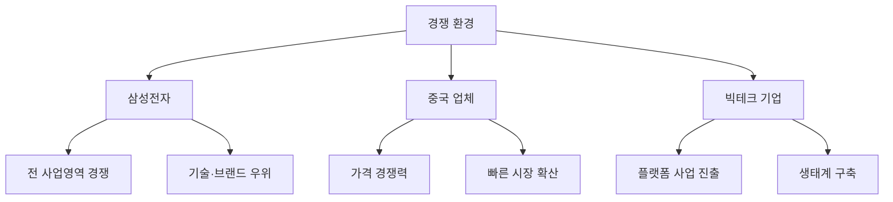

---

## 💡 전략적 제언

### 단기 과제 (1-2년)

#### 1. VS(차량부품) 사업 집중 투자

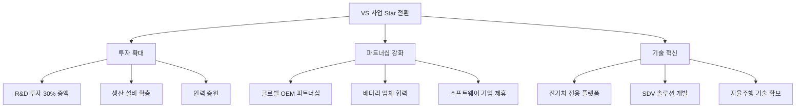

**목표:** 3년 내 Star 영역 진입 (시장점유율 15% → 25%)

#### 2. H&A/HE 사업 프리미엄화

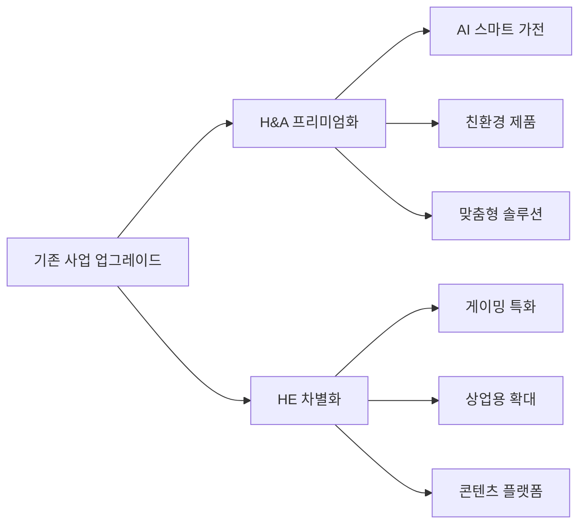

**목표:** Cash Cow 영역으로 재포지셔닝

### 중장기 과제 (3-5년)

#### 1. 신사업 발굴 및 육성

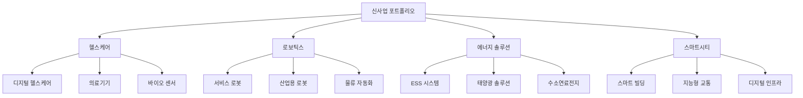

#### 2. 디지털 플랫폼 사업 구축

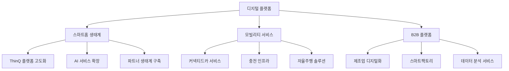

---

## 📊 성과 지표 및 모니터링

### 핵심 KPI

| 구분 | 현재 (2023) | 목표 (2026) | 측정 방법 |
|------|-------------|-------------|-----------|
| **포트폴리오 균형** | Dog 77% | Dog 50% 이하 | BCG Matrix 분석 |
| **VS 사업 성장** | 15.2조원 | 25조원 | 연매출 기준 |
| **VS 시장점유율** | 8% | 15% | 글로벌 시장 기준 |
| **신사업 비중** | 5% | 15% | 전체 매출 대비 |
| **전체 영업이익률** | 4.2% | 6.0% | 연결재무제표 기준 |

### 단계별 마일스톤

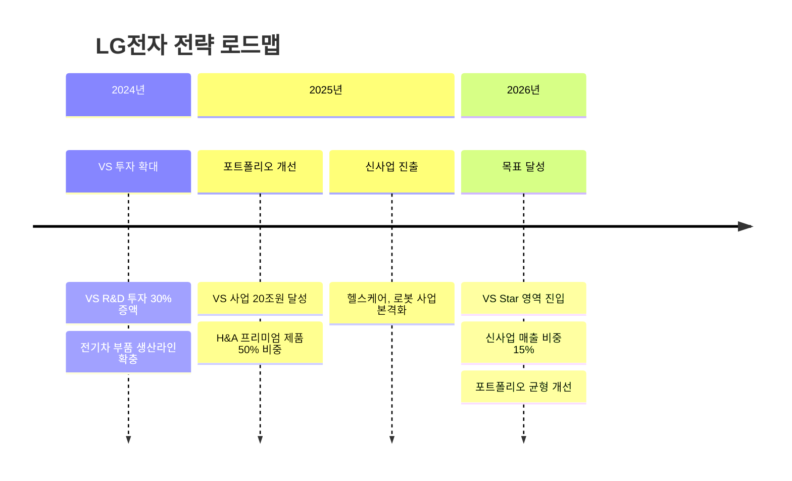

---

## 🔍 리스크 요인 및 대응방안

### 주요 리스크

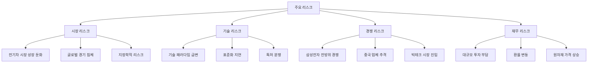

### 대응 전략

| 리스크 | 대응 방안 | 책임 부서 |
|--------|-----------|-----------|
| **전기차 시장 둔화** | 수소차, 자율주행 등 다각화 | VS사업부 |
| **기술 패러다임 변화** | 오픈 이노베이션 강화 | CTO 조직 |
| **경쟁 심화** | 차별화 기술 확보 | 전 사업부 |
| **투자 부담** | 선택과 집중 전략 | 경영진 |

---

## 📋 결론 및 실행 계획

### 핵심 성공 요소

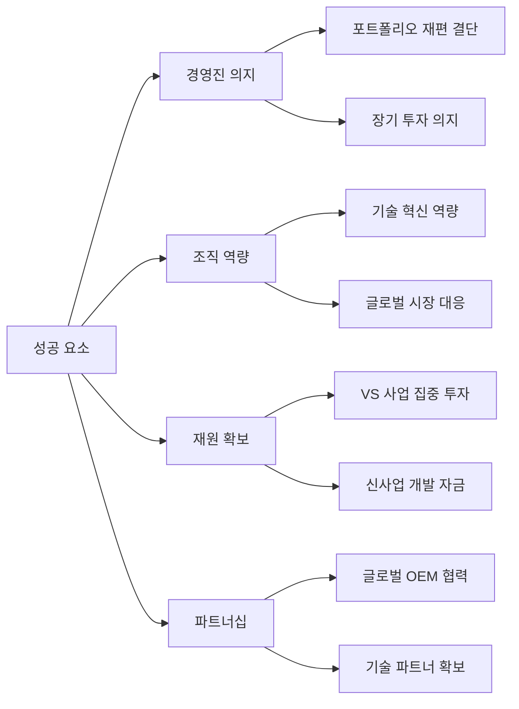

### 최우선 실행 과제

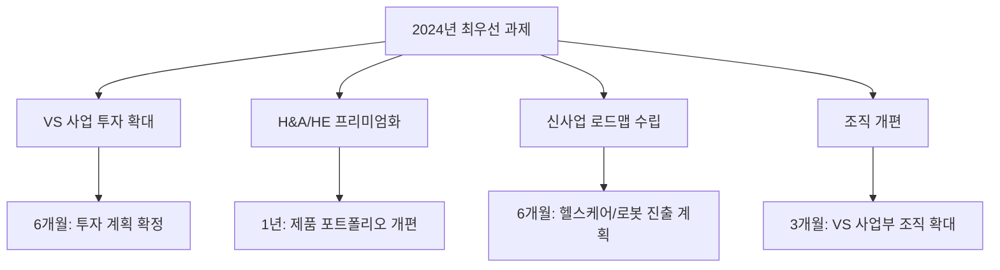

### 기대 효과

**재무적 효과:**
- 2026년 매출 100조원 달성
- 영업이익률 6% 개선
- VS 사업 25조원 규모 달성

**전략적 효과:**
- 포트폴리오 균형 개선
- 미래 성장 동력 확보
- 글로벌 경쟁력 강화

---

**본 분석은 실제 DART 전자공시시스템 데이터와 공개된 IR 자료를 바탕으로 하였으며, 실제 경영 의사결정 시에는 추가적인 내부 데이터 및 시장 조사가 필요합니다.**

---

*분석 기준일: 2023년 12월 31일*  
*데이터 출처: DART 전자공시시스템, LG전자 IR 자료*  
*분석 도구: BCG Matrix, 포트폴리오 분석*
