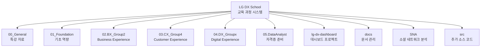
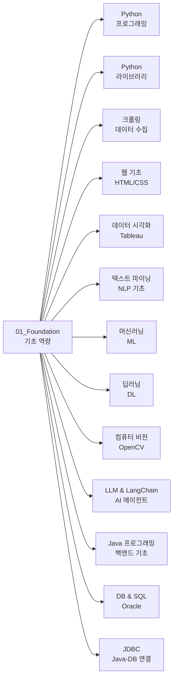
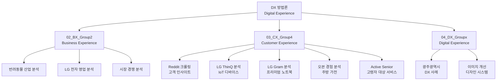
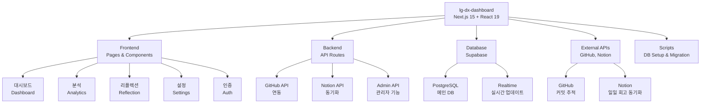
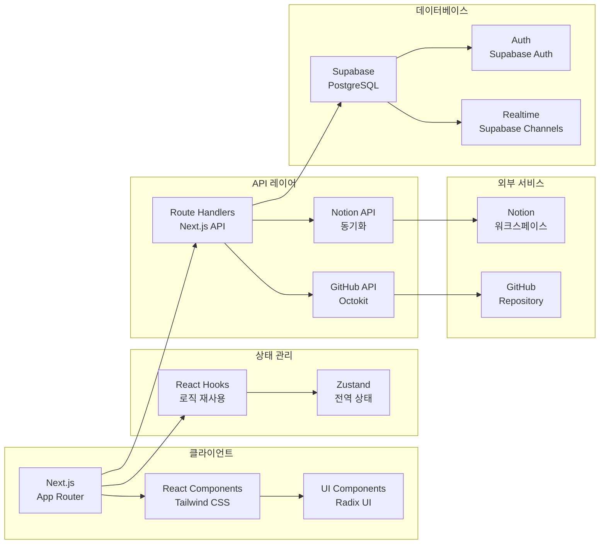
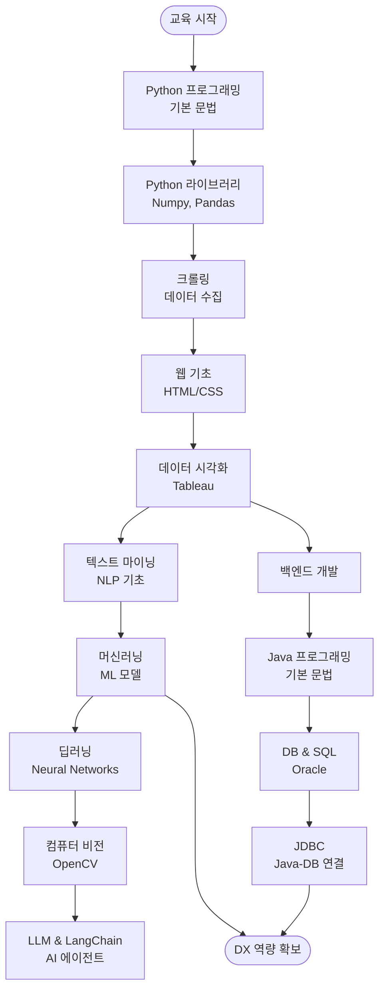
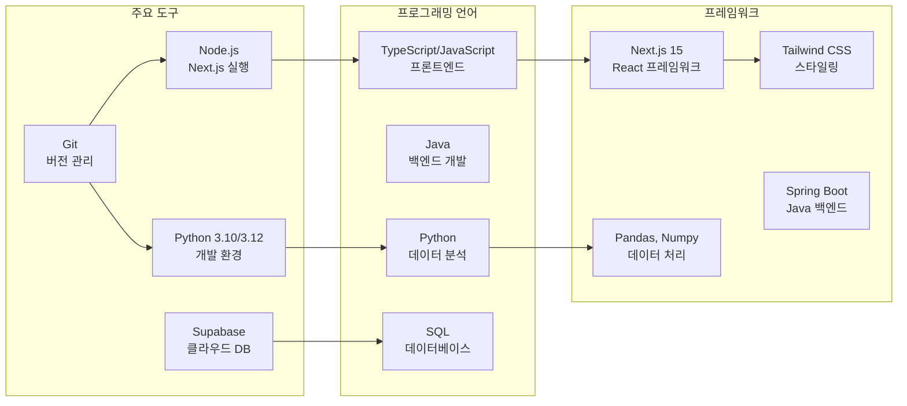
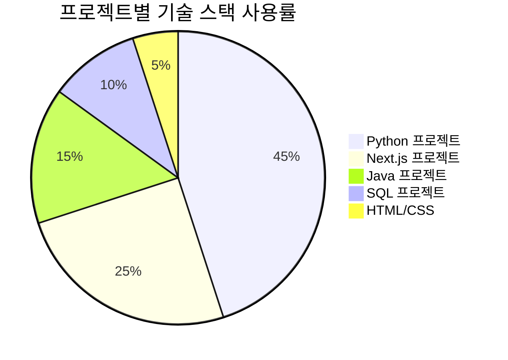
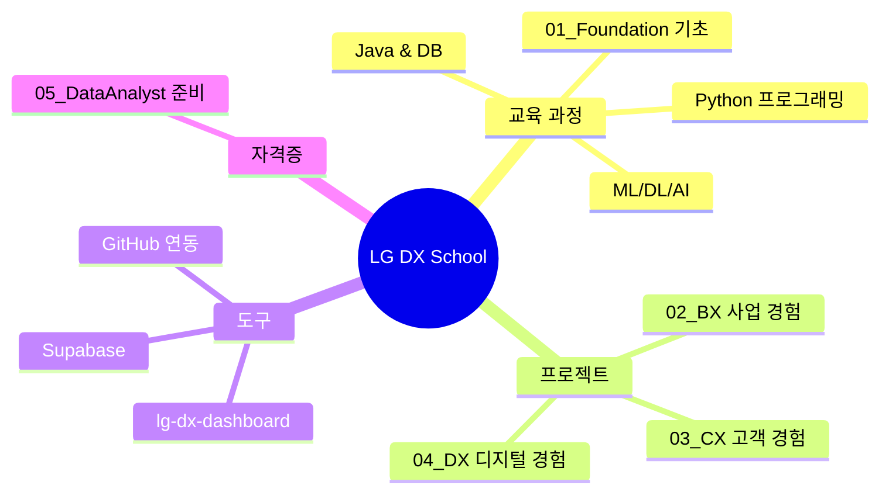
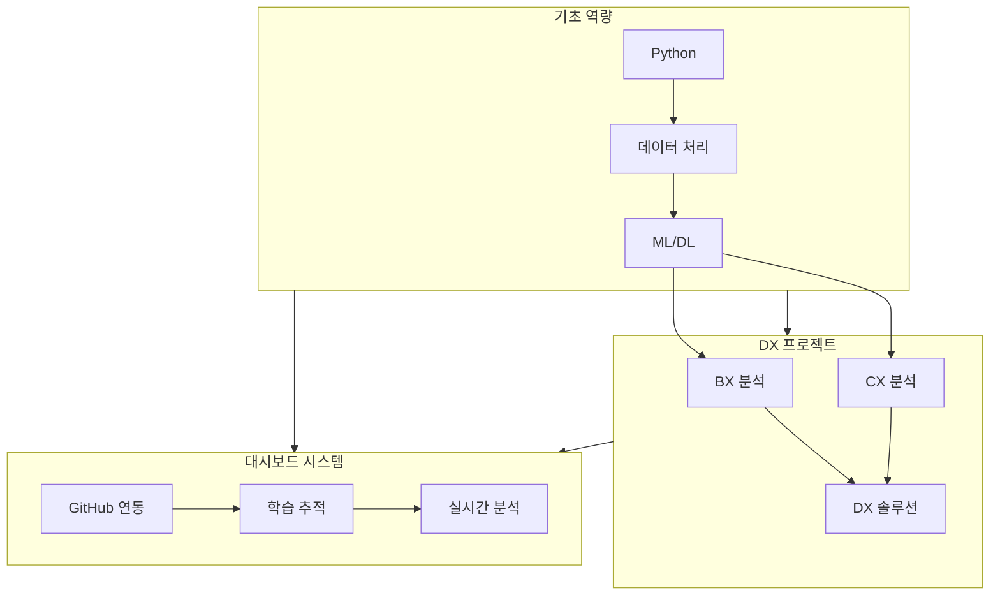

# 📊 LG DX School 프로젝트 구조

## 🏗️ 전체 프로젝트 구조 개요



## 📚 교육 과정 상세 구조

### 1. Foundation (기초 역량) 구조



### 2. DX 방법론 (BX, CX, DX) 구조



### 3. LG DX Dashboard 프로젝트 구조



### 4. Dashboard 상세 아키텍처



### 5. Foundation 학습 흐름



### 6. 프로젝트 실행 환경



## 📊 프로젝트 통계

### 기술 스택 분포



### 프로젝트 타입 분류



## 🎯 주요 컴포넌트 간 의존성



## 📁 디렉토리 구조 요약

| 디렉토리 | 목적 | 주요 내용 |
|---------|------|----------|
| `00_General` | 특강 자료 | BX/CX 특강, PM 특강 등 |
| `01_Foundation` | 기초 역량 | Python, Java, DB, ML/DL |
| `02.BX_Group2` | Business Experience | 반려동물 산업, LG 전자 분석 |
| `03.CX_Group4` | Customer Experience | Reddit, LG 제품 분석 |
| `04.DX_Groupx` | Digital Experience | 광주광역시 DX, 이미지 개선 |
| `05.DataAnalyst` | 자격증 준비 | 필기/실기 학습 자료 |
| `lg-dx-dashboard` | 대시보드 앱 | Next.js + Supabase 기반 |
| `docs` | 문서 관리 | 프로젝트 문서 |
| `SNA` | 소셜 네트워크 분석 | 네트워크 분석 프로젝트 |

## 🚀 프로젝트 실행 가이드

### Python 환경 설정

```bash
# 가상환경 생성 및 활성화
python -m venv env310
.\env310\Scripts\activate  # Windows
source env310/bin/activate  # macOS/Linux

# 패키지 설치
pip install -r requirements.txt
```

### Next.js 대시보드 실행

```bash
cd lg-dx-dashboard
npm install
npm run dev
```

### Supabase 데이터베이스 설정

```bash
cd lg-dx-dashboard
npm run setup:github
```

---

**📌 참고**: 이 문서는 LG DX School 프로젝트의 전체 구조를 시각화한 것입니다.
