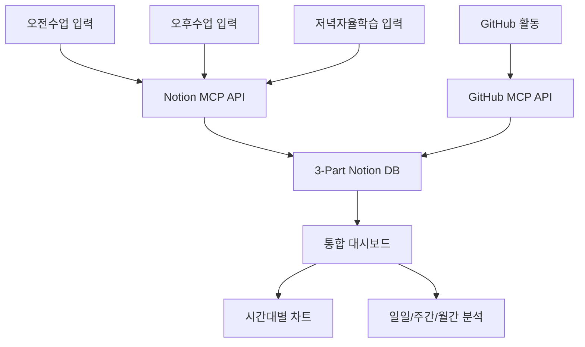
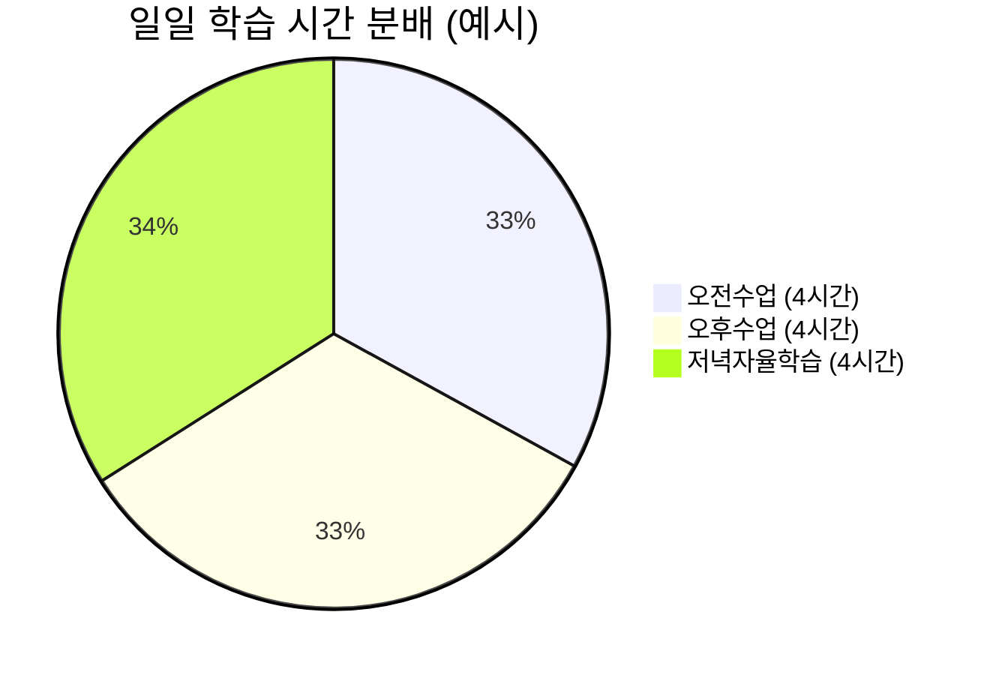
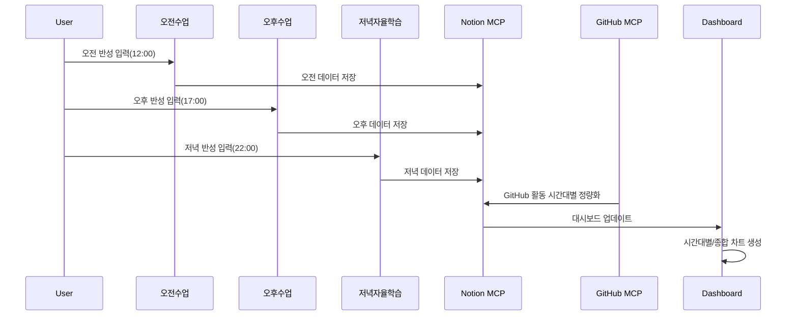
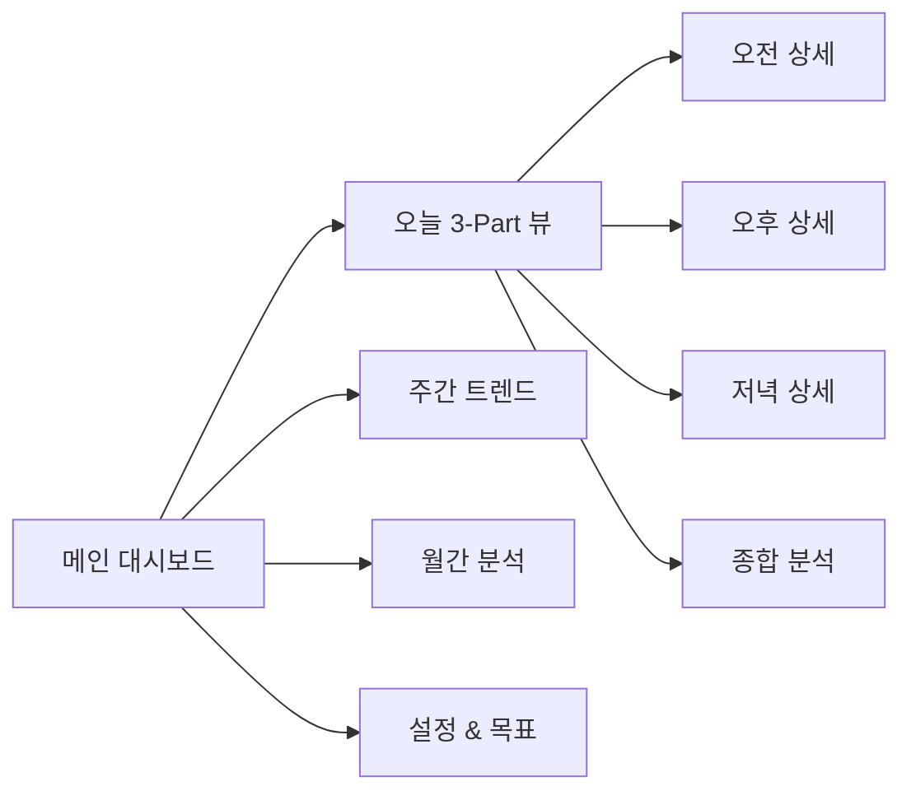

# 3-Part Daily Reflection Dashboard

## 프로젝트 개요

**오전수업, 오후수업, 저녁자율학습** 3개 시간대별로 학습 컨디션, 난이도, 학습량, GitHub 활동을 자동 기록·분석·시각화하는 Notion/Supabase/GitHub MCP 기반 일일 반성 대시보드 프로젝트입니다.

---

## 주요 기능 및 전체 구조

### 🏗️ 시스템 아키텍처


### 📊 시간대별 데이터 분석 구조


### 🔄 데이터 흐름 및 자동화 파이프라인


### 🎛️ 대시보드 네비게이션 구조


---

## 폴더 구조 및 주요 파일

```text
LG_DX_School/
├── src/                  # 주요 자동화/분석/시각화 코드
├── config/               # 시간대/과목/레이아웃 설정
├── data/                 # 임시 데이터, 백업, 분석 결과
├── logs/                 # 실행 로그
├── docs/                 # 상세 설계/분석/보고서
├── tests/                # 테스트 코드
├── requirements.txt      # Python 의존성
├── .gitignore            # Git 관리 제외 설정
├── README.md             # 프로젝트 설명서(본 파일)
```

---

## 빠른 시작

1. 저장소 클론 및 의존성 설치
   ```bash
   git clone https://github.com/positivemultiplier/LG_DX_SCHOOL.git
   cd LG_DX_SCHOOL
   pip install -r requirements.txt
   ```
2. 환경변수(.env.local) 설정
3. Notion/Supabase/GitHub MCP 연동 정보 입력
4. 주요 스크립트 실행 예시
   - `python src/notion_automation/scripts/morning_reflection.py`
   - `python src/notion_automation/scripts/afternoon_reflection.py`
   - `python src/notion_automation/scripts/evening_reflection.py`
   - `python src/notion_automation/scripts/create_3part_database.py`

---

## 주요 문서/참고자료

- [docs/daily_reflection_dashboard.md](docs/daily_reflection_dashboard.md) : 전체 시스템 설계/시각화/자동화 전략
- [docs/daily_reflection_dashboard_tasks.md](docs/daily_reflection_dashboard_tasks.md) : 단계별 태스크/로드맵/진행상황
- [docs/3Part_DB_Schema_Definition.md](docs/3Part_DB_Schema_Definition.md) : DB 스키마 상세 정의
- [docs/Phase*_Completion_Report.md](docs/) : 각 Phase별 완료 보고서

---

## 기여/협업 가이드

- Pull Request/이슈 등록 전 반드시 최신 문서/코드 확인
- 커밋 메시지: "[타입] 작업내용: 상세설명" (예: [fix] 버그 수정: 시간대별 입력 오류)
- 시각화/문서화 규정: Mermaid 차트 4개 이상 필수, 최소 스타일 적용
- 코드/문서/시각화 일관성 유지

---

## 부록: Notion-MCP 일반 활용 예시(요약)

Notion-MCP는 문서 자동화, 데이터 통합, 협업 워크플로우, 알림/승인 자동화, 보고서 생성, 외부 시스템 연동 등 다양한 업무에 활용할 수 있습니다. (상세 예시는 docs/ 참고)
