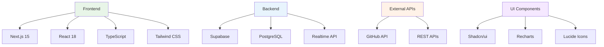
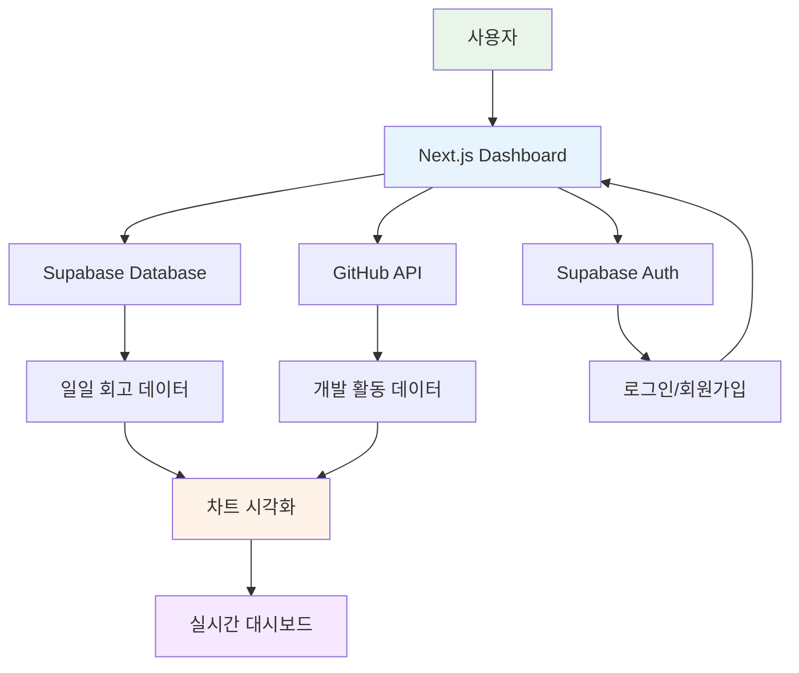
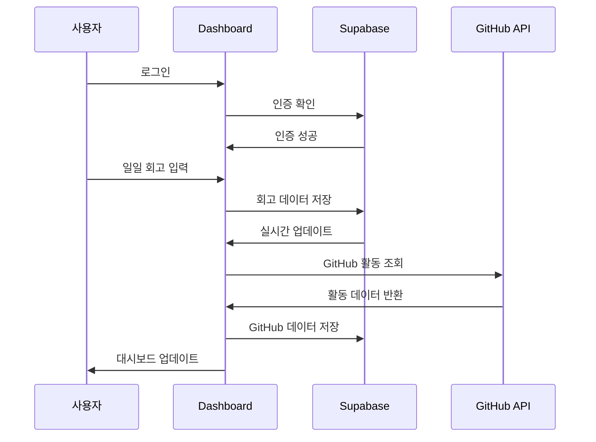
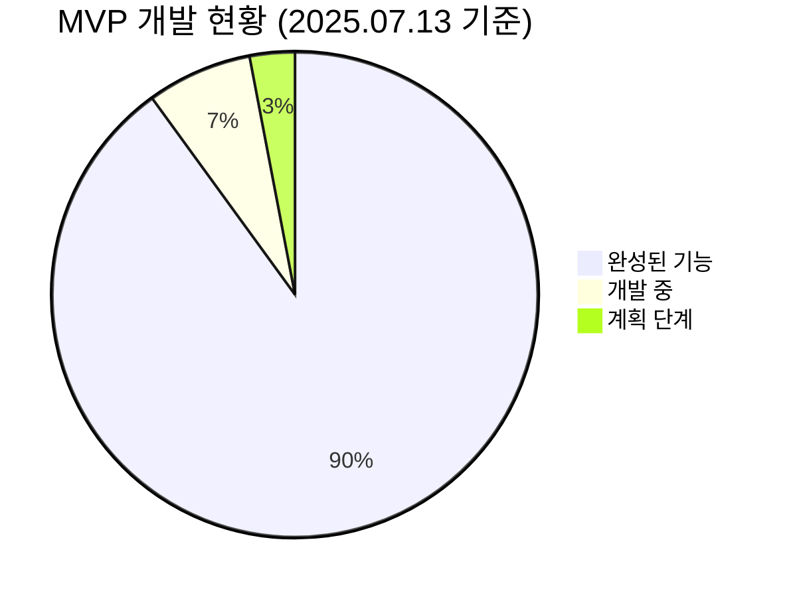

# LG DX School 프로젝트

## 🎯 프로젝트 개요

**LG DX School**은 학습자의 일일 반성과 성장을 지원하는 종합 대시보드 플랫폼입니다. **오전수업, 오후수업, 저녁자율학습** 3개 시간대별 학습 분석과 GitHub 활동 분석을 통해 개인의 학습 패턴을 시각화하고 최적화할 수 있는 솔루션을 제공합니다.

## 🚀 완성된 MVP: LG DX Dashboard

### ✨ 주요 기능
- **📊 반응형 대시보드**: Next.js 15 기반의 현대적인 웹 대시보드
- **🔐 사용자 인증**: Supabase Auth를 통한 안전한 로그인/회원가입
- **📈 실시간 데이터**: GitHub API 연동으로 실시간 개발 활동 분석
- **🌅 일일 회고**: 아침/점심/저녁 시간대별 반성 시스템
- **📊 고급 차트**: Recharts 기반 히트맵, 레이더 차트, 트렌드 분석
- **⚡ 실시간 동기화**: Supabase Realtime으로 즉시 데이터 업데이트
- **🤖 AI 코칭 인사이트**: 학습 패턴 분석 및 개인 맞춤 추천
- **📱 반응형 네비게이션**: 모바일/태블릿/데스크톱 최적화 UI
- **📈 고급 분석**: 패턴 분석, 트렌드 예측, 비교 분석

### 🔧 기술 스택


### 📱 주요 페이지
- **🏠 Dashboard**: 종합 학습 현황 및 빠른 액션
- **📊 Analytics**: 상세 데이터 분석 및 차트 시각화  
  - **📈 Insights**: AI 기반 학습 인사이트 및 패턴 분석
  - **🤖 Coach**: 개인 맞춤 코칭 및 학습 추천
- **💭 Reflection**: 시간대별 일일 회고 시스템
- **⚙️ Settings**: 개인 설정 및 GitHub 연동

---

## 🏗️ 프로젝트 구조

```text
LG_DX_SCHOOL/
├── lg-dx-dashboard/           # 🎯 완성된 MVP 대시보드
│   ├── src/
│   │   ├── app/              # Next.js App Router 페이지
│   │   ├── components/       # 재사용 가능한 컴포넌트
│   │   ├── lib/              # 유틸리티 및 설정
│   │   ├── hooks/            # 커스텀 React 훅
│   │   └── types/            # TypeScript 타입 정의
│   ├── package.json          # 프로젝트 의존성
│   └── README.md             # 대시보드 설치/실행 가이드
├── docs/                     # 📚 프로젝트 문서
├── src/                      # 🔧 자동화/분석 스크립트
├── config/                   # ⚙️ 설정 파일
├── data/                     # 📊 데이터 및 분석 결과
└── 01_Foundation/            # 📖 학습 자료
```

---

## 🚀 빠른 시작

### LG DX Dashboard MVP 실행

1. **프로젝트 클론 및 이동**
   ```bash
   git clone https://github.com/positivemultiplier/LG_DX_SCHOOL.git
   cd LG_DX_SCHOOL/lg-dx-dashboard
   ```

2. **의존성 설치**
   ```bash
   npm install
   ```

3. **환경 변수 설정**
   ```bash
   cp .env.example .env.local
   # .env.local 파일에 Supabase 및 GitHub API 키 설정
   ```

4. **개발 서버 실행**
   ```bash
   npm run dev
   ```

5. **브라우저에서 확인**
   ```
   http://localhost:3000
   ```

### 시스템 아키텍처



### 데이터 흐름



---

## 📚 주요 문서 및 리소스

### 🎯 MVP 완성 보고서
- [Phase1 완료 보고서](docs/Phase1_Complete_Final_Report.md): 기본 대시보드 구축
- [Phase2 완료 보고서](docs/Phase2_Core_Features_Complete_Report.md): 핵심 기능 구현
- [Phase3.1 완료 보고서](docs/Phase3.1_Advanced_Charts_Complete_Report.md): 고급 차트 기능
- [Phase3.2 완료 보고서](docs/Phase3.2_GitHub_API_Integration_Complete_Report.md): GitHub API 통합
- [Phase3.3 완료 보고서](docs/Phase3.3_Realtime_Features_Complete_Report.md): 실시간 기능
- [Phase4.1 완료 보고서](docs/lg-dx-dashboard-project/phase-4.1-completion-report.md): AI 코칭 및 고급 분석

### 🔧 기술 문서
- [프로젝트 개요](docs/lg-dx-dashboard-project/lg-dx-dashboard-project-overview.md): 전체 시스템 설계
- [기술 아키텍처](docs/lg-dx-dashboard-project/technical-architecture.md): 상세 기술 스택
- [데이터베이스 스키마](docs/lg-dx-dashboard-project/database-schema.md): DB 구조 정의
- [배포 가이드](docs/lg-dx-dashboard-project/deployment-operations-guide.md): 운영 및 배포

### 📊 분석 및 연구
- [3Part DB 스키마](docs/3Part_DB_Schema_Definition.md): 시간대별 데이터 구조
- [DB 검증 규칙](docs/3Part_DB_Validation_Rules.md): 데이터 품질 관리
- [DB 뷰 설계](docs/3Part_DB_Views_Design.md): 분석용 뷰 구조

---

## 📈 주요 성과 및 통계



### ✅ 완성된 기능들
- **대시보드 UI/UX**: 100% 완성
- **사용자 인증**: 100% 완성  
- **GitHub API 연동**: 100% 완성
- **일일 회고 시스템**: 100% 완성
- **실시간 데이터 동기화**: 100% 완성
- **차트 시각화**: 100% 완성
- **AI 코칭 인사이트**: 100% 완성
- **반응형 네비게이션**: 100% 완성
- **고급 분석 기능**: 100% 완성

### 🔧 기술적 성취
- **200개+ 파일** 추가로 완전한 MVP+ 구축
- **TypeScript 100%** 타입 안전성 보장
- **반응형 디자인** 모바일/데스크톱 지원
- **실시간 업데이트** Supabase Realtime 활용
- **AI 기반 분석** 패턴 인식 및 예측 엔진

---

## 🤝 기여 가이드

### 개발 참여 방법
1. **이슈 등록**: 버그 리포트나 기능 제안
2. **Fork & PR**: 코드 기여 시 표준 GitHub 워크플로우 사용
3. **문서 개선**: 오타 수정, 설명 보완 등

### 커밋 규칙
```
타입: 제목

상세 설명 (선택사항)

예시:
feat: GitHub 히트맵 차트 추가
fix: 로그인 오류 수정  
docs: README.md 업데이트
```

### 코드 스타일
- **TypeScript** 우선 사용
- **ESLint + Prettier** 설정 준수
- **컴포넌트 단위** 개발
- **테스트 코드** 작성 권장

---

## 🎯 향후 계획

### 단기 목표 (1-2개월)
- **모바일 앱** 개발 (React Native)
- **알림 시스템** 구축
- **데이터 분석** 고도화

### 중기 목표 (3-6개월)  
- **AI 학습 추천** 시스템
- **팀 협업** 기능
- **성과 예측** 모델

### 장기 목표 (6개월+)
- **교육 기관** 연동
- **오픈소스** 생태계 구축
- **글로벌 서비스** 확장

---

## 📞 연락처 및 지원

- **GitHub Issues**: 버그 리포트 및 기능 요청
- **Email**: positivemultiplier@github.com
- **Repository**: https://github.com/positivemultiplier/LG_DX_SCHOOL

---

## 📄 라이선스

이 프로젝트는 MIT 라이선스 하에 배포됩니다. 자세한 내용은 [LICENSE](LICENSE) 파일을 참조하세요.
