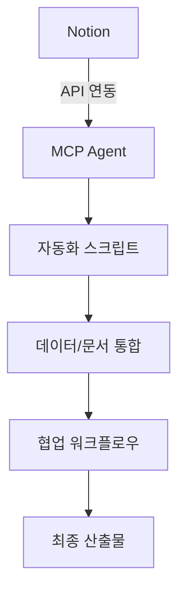
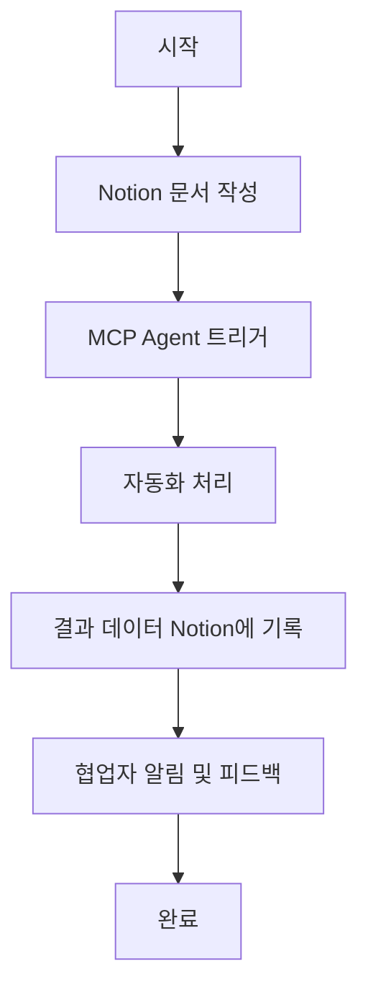
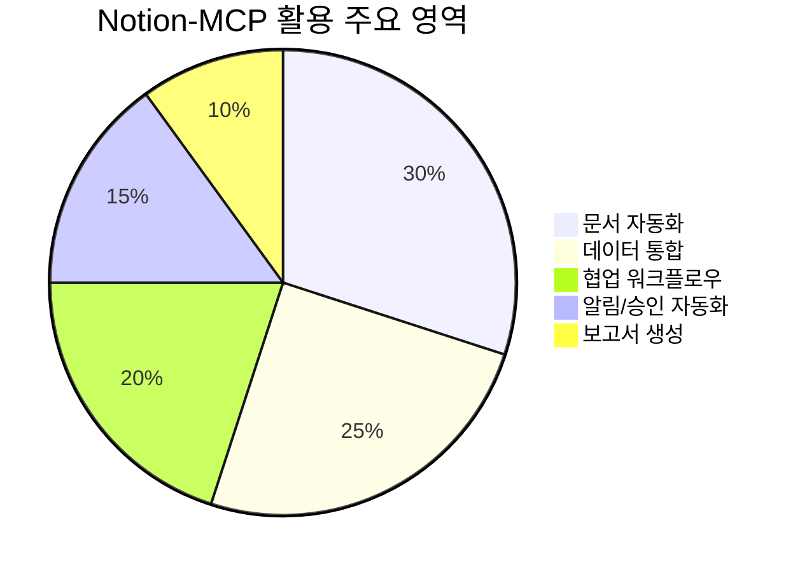
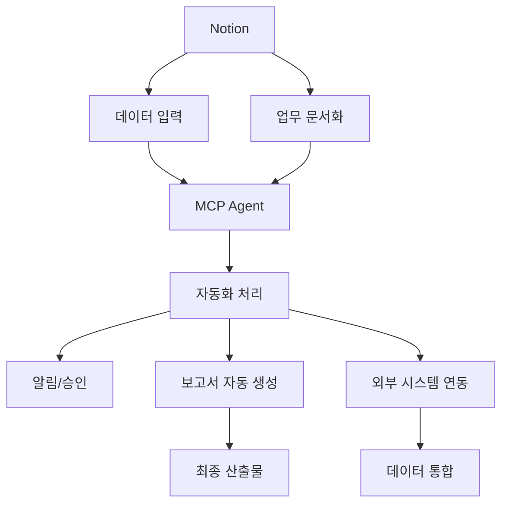
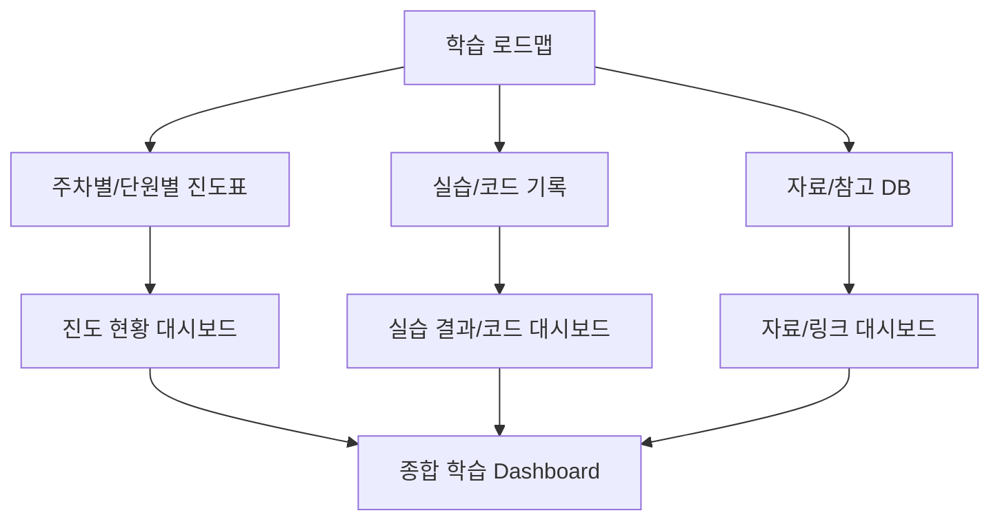
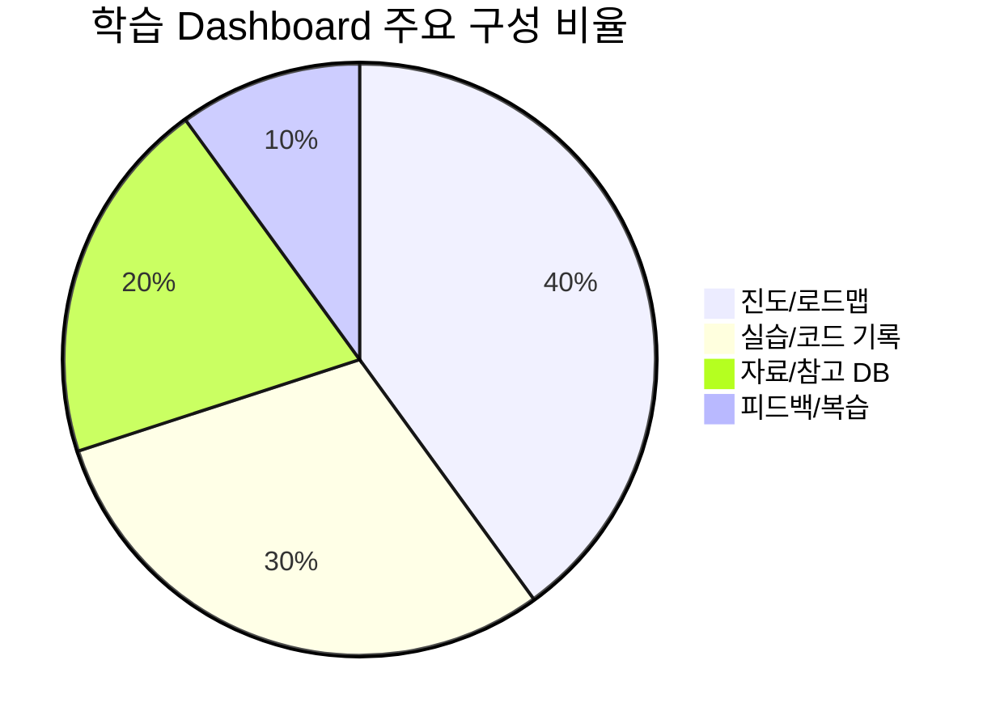

# LG_DX_School

## Notion-MCP 활용방안 가이드

### 1. 개요
Notion은 협업 문서화 및 데이터 관리 플랫폼이며, MCP(Model Context Protocol)는 다양한 시스템/에이전트와의 연동 및 자동화를 지원합니다. 두 시스템을 연계하면, 문서 기반 협업과 데이터 자동화, 워크플로우 최적화를 동시에 달성할 수 있습니다.

---

### 2. 시스템 연동 구조

**설명:** Notion에서 작성된 문서/데이터가 MCP Agent를 통해 자동화되고, 통합된 결과가 다시 협업 워크플로우로 연결되어 최종 산출물로 이어집니다.

---

### 3. 실무 활용 워크플로우

**설명:** Notion에서 문서를 작성하면 MCP Agent가 자동화 처리를 수행하고, 결과를 다시 Notion에 기록하여 협업자에게 알림 및 피드백을 제공합니다.

---

### 4. Notion-MCP로 할 수 있는 일

**Notion-MCP로 할 수 있는 주요 업무**
- **문서 자동화**: Notion에 입력된 정보를 MCP가 자동으로 가공 및 처리
- **데이터 통합**: 여러 소스의 데이터를 Notion-MCP 연동으로 통합 관리
- **협업 워크플로우**: 문서 기반 협업 프로세스 자동화(예: 승인, 피드백)
- **알림/승인 자동화**: 특정 조건 발생 시 자동 알림 및 승인 요청
- **보고서 자동 생성**: 입력된 데이터 기반 자동 보고서/산출물 생성
- **외부 시스템 연동**: ERP, 메신저, 이메일 등 다양한 외부 시스템과 연동

---

---

## [실전] 학습용 Notion-MCP Dashboard 설계 가이드

### 1. 대시보드 구조 설계

**설명:** 폴더/코드 구조에 맞춰 진도표, 실습, 자료를 각각 DB로 만들고, 이들을 통합한 종합 대시보드를 구성합니다.

---

### 2. 대시보드 주요 구성 비율

**설명:** 진도/로드맵, 실습/코드, 자료/참고, 피드백/복습 등으로 대시보드 영역을 분배합니다.

---

### 3. 실전 배치/운영 Best Practice
- **진도표 DB**: 주차/단원별, 완료여부, 메모 등 속성 추가
- **실습/코드 DB**: 실습명, 코드링크, 주요 개념, 난이도, 피드백 등
- **자료/참고 DB**: 분류, 제목, URL, 요약, 활용도 등
- **관계(Relation) 활용**: 실습-자료, 진도-실습 등 DB간 연결
- **뷰 다양화**: 표, 보드, 캘린더, 갤러리 등 다양한 뷰로 시각화
- **종합 대시보드**: 위 DB들을 Rollup/Relation으로 통합, 한눈에 학습 현황 파악

---

### 4. 실전 팁
- **템플릿화**: 반복되는 실습/학습 기록은 템플릿으로 빠르게 생성
- **상태/완료 체크박스 적극 활용**: 진행상황 한눈에 파악
- **정기적 복습/정리**: 완료된 항목은 별도 뷰로 복습
- **외부 연동**: Google Calendar, GitHub, Slack 등과 연동해 학습 효율 극대화

---

### 5. 결론
Notion-MCP 기반 학습 대시보드는 진도, 실습, 자료, 피드백을 통합 관리하며, 시각화와 자동화로 학습 효율을 극대화할 수 있습니다. 반드시 머메이드 차트 등 시각화와 함께 설계하세요.
