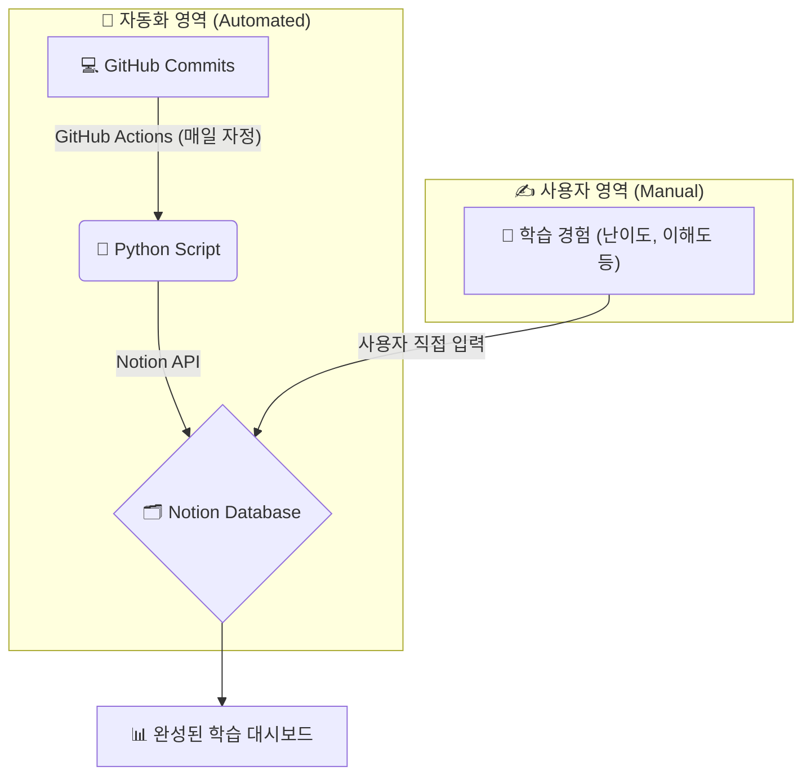
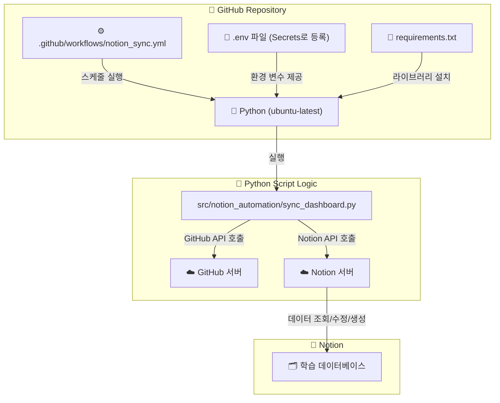
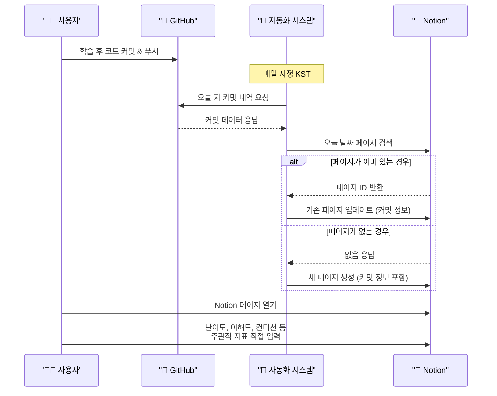
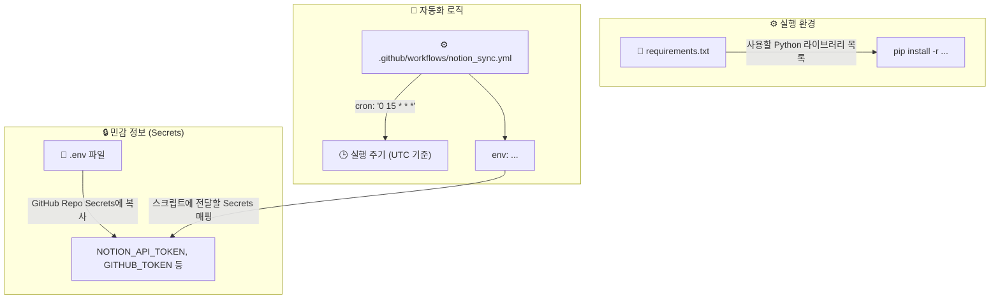
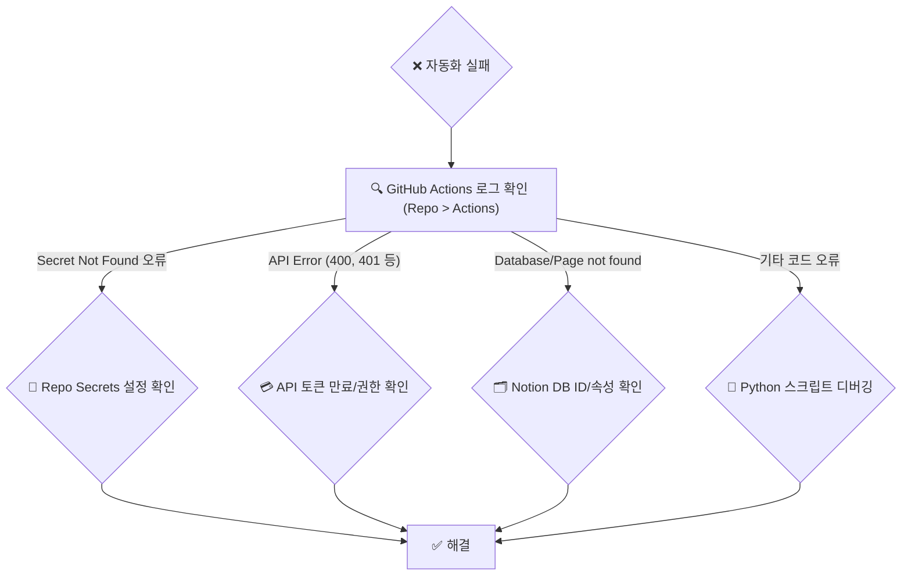

# 📊 Notion 학습 대시보드 자동화 시스템 사용 가이드

---

## 1. 개요 및 핵심 컨셉

이 시스템은 GitHub 활동을 자동으로 추적하고, 개인의 주관적인 학습 경험을 Notion에 결합하여 시각적인 학습 대시보드를 구축하는 것을 목표로 합니다.

핵심은 **자동화와 수동 입력의 조화**입니다. 시스템이 할 수 있는 일(코딩 활동 추적)은 최대한 자동화하고, 사람만 할 수 있는 일(경험 기록)은 가장 편리한 곳(Notion)에서 직접 수행합니다.

---

## 2. 시스템 아키텍처

이 시스템은 GitHub Actions, Python 스크립트, 그리고 Notion API를 중심으로 구성됩니다. 모든 설정은 프로젝트 내 파일들로 관리됩니다.

---

## 3. 사용 방법 (Workflow)

매일 다음의 간단한 절차를 따릅니다.

**핵심:**
1.  **코딩:** 평소처럼 학습하고 GitHub에 커밋/푸시합니다.
2.  **자동 기록:** 시스템이 매일 자정, 여러분의 GitHub 활동을 Notion에 자동으로 기록합니다.
3.  **수동 입력:** Notion에 생성/업데이트된 페이지를 열고, `난이도`, `이해도`, `컨디션` 등 숫자/선택 속성을 직접 입력하여 그날의 기록을 완성합니다.

---

## 4. 환경 설정 및 유지보수

시스템 설정을 변경해야 할 경우 아래 파일을 수정합니다.

-   **API 토큰 변경 시:** `.env` 파일을 수정한 후, GitHub 레포지토리의 `Settings > Secrets and variables > Actions`에서 해당 값을 업데이트해야 합니다.
-   **실행 주기 변경 시:** `notion_sync.yml` 파일의 `cron` 값을 수정합니다. (현재는 매일 UTC 15:00 = KST 00:00)
-   **새 라이브러리 추가 시:** `pip install [라이브러리명]` 후 `pip freeze > requirements.txt` 명령으로 `requirements.txt`를 업데이트합니다.

---

## 5. 문제 해결 (Troubleshooting)

자동화가 예상대로 동작하지 않을 경우 아래 순서로 확인합니다.

이 가이드가 성공적인 학습 대시보드 운영에 도움이 되기를 바랍니다!