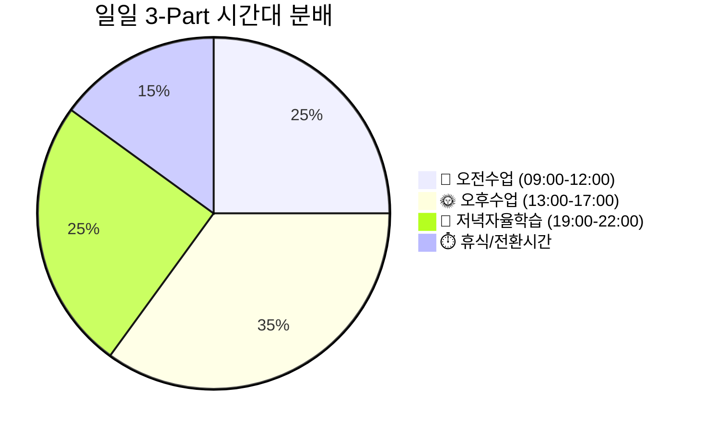
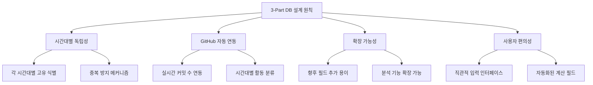
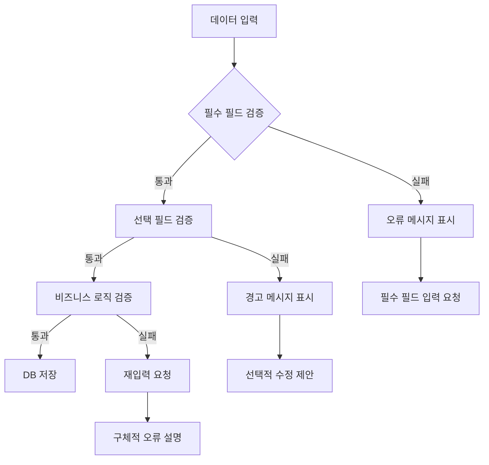
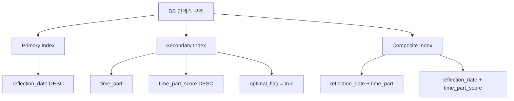
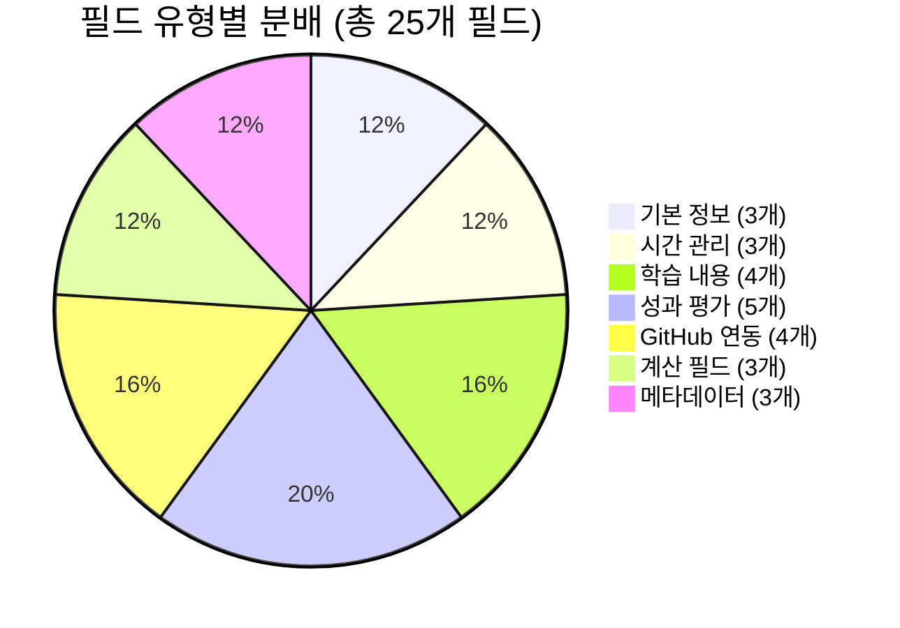

# 3-Part Daily Reflection DB 스키마 상세 정의

## 📋 개요

**오전수업**, **오후수업**, **저녁자율학습** 3개 시간대별로 구분된 일일 반성 기록을 위한 Notion 데이터베이스 스키마를 정의합니다.

**Phase 2 - Task 2.1.1**: 3-Part Daily Reflection DB 상세 속성 정의

---

## 🎯 DB 설계 원칙

### 📊 3-Part 시간대 분류 체계



### 🔧 핵심 설계 요구사항



---

## 📊 완전한 DB 스키마 정의

### 🗂️ 기본 정보 필드

#### 1. **name** (제목 - Title)
```json
{
  "type": "title",
  "format": "[{time_part}] {reflection_date}",
  "examples": [
    "🌅 오전수업 2025-07-05",
    "🌞 오후수업 2025-07-05", 
    "🌙 저녁자율학습 2025-07-05"
  ],
  "auto_generation": true,
  "description": "시간대별 반성 기록의 고유 제목"
}
```

#### 2. **reflection_date** (날짜)
```json
{
  "type": "date",
  "required": true,
  "default": "today",
  "validation": {
    "min_date": "2025-01-01",
    "max_date": "today + 7days"
  },
  "description": "반성 기록 작성 날짜"
}
```

#### 3. **time_part** (시간대 구분)
```json
{
  "type": "select",
  "options": [
    {
      "name": "🌅 오전수업",
      "color": "yellow",
      "time_range": "09:00-12:00"
    },
    {
      "name": "🌞 오후수업", 
      "color": "orange",
      "time_range": "13:00-17:00"
    },
    {
      "name": "🌙 저녁자율학습",
      "color": "blue", 
      "time_range": "19:00-22:00"
    }
  ],
  "required": true,
  "description": "3-Part 시간대 분류"
}
```

### ⏰ 시간 관련 필드

#### 4. **start_time** (시작 시간)
```json
{
  "type": "rich_text",
  "default_mapping": {
    "🌅 오전수업": "09:00",
    "🌞 오후수업": "13:00",
    "🌙 저녁자율학습": "19:00"
  },
  "format": "HH:MM",
  "validation": "^([0-1]?[0-9]|2[0-3]):[0-5][0-9]$",
  "description": "실제 학습 시작 시간"
}
```

#### 5. **end_time** (종료 시간)
```json
{
  "type": "rich_text",
  "default_mapping": {
    "🌅 오전수업": "12:00",
    "🌞 오후수업": "17:00", 
    "🌙 저녁자율학습": "22:00"
  },
  "format": "HH:MM",
  "validation": "^([0-1]?[0-9]|2[0-3]):[0-5][0-9]$",
  "description": "실제 학습 종료 시간"
}
```

#### 6. **actual_duration** (실제 학습 시간)
```json
{
  "type": "formula",
  "formula": "dateBetween(prop(\"end_time\"), prop(\"start_time\"), \"hours\")",
  "format": "number_with_commas",
  "unit": "시간",
  "description": "실제 학습한 시간 (자동 계산)"
}
```

### 📚 학습 내용 필드

#### 7. **subject** (과목/주제)
```json
{
  "type": "rich_text",
  "required": true,
  "examples": [
    "파이썬 기초 문법",
    "웹개발 프론트엔드",
    "알고리즘 문제해결",
    "데이터베이스 설계",
    "프로젝트 구현"
  ],
  "character_limit": 100,
  "description": "해당 시간대 주요 학습 과목/주제"
}
```

#### 8. **key_learning** (핵심 학습 내용)
```json
{
  "type": "rich_text",
  "required": true,
  "placeholder": "이 시간에 배운 가장 중요한 내용을 구체적으로 기록하세요",
  "character_limit": 500,
  "description": "해당 시간대 핵심 학습 성과"
}
```

#### 9. **challenges** (어려웠던 점)
```json
{
  "type": "rich_text",
  "placeholder": "어려웠던 개념이나 막혔던 부분을 기록하세요",
  "character_limit": 300,
  "description": "학습 중 어려웠던 점이나 장애물"
}
```

#### 10. **reflection** (반성/개선점)
```json
{
  "type": "rich_text",
  "placeholder": "다음에 더 잘하기 위한 구체적인 개선 방안을 적어보세요",
  "character_limit": 300,
  "description": "자기 반성 및 개선 계획"
}
```

### 📈 성과 평가 필드

#### 11. **condition** (컨디션)
```json
{
  "type": "select",
  "options": [
    {
      "name": "😊 좋음",
      "color": "green",
      "score": 3
    },
    {
      "name": "😐 보통",
      "color": "yellow", 
      "score": 2
    },
    {
      "name": "😔 나쁨",
      "color": "red",
      "score": 1
    }
  ],
  "required": true,
  "description": "해당 시간대 전반적인 컨디션"
}
```

#### 12. **difficulty** (학습 난이도)
```json
{
  "type": "number",
  "min": 1,
  "max": 10,
  "required": true,
  "default": 5,
  "scale_description": {
    "1-3": "쉬움 (기초 복습 수준)",
    "4-6": "적정 (새로운 개념 학습)",
    "7-10": "어려움 (고급 개념, 복잡한 프로젝트)"
  },
  "description": "해당 시간대 학습 내용의 난이도"
}
```

#### 13. **understanding** (이해도)
```json
{
  "type": "number", 
  "min": 1,
  "max": 10,
  "required": true,
  "default": 5,
  "scale_description": {
    "1-3": "이해 부족 (재학습 필요)",
    "4-6": "부분 이해 (추가 학습 필요)",
    "7-10": "충분한 이해 (응용 가능)"
  },
  "description": "해당 시간대 학습 내용의 이해도"
}
```

#### 14. **focus_level** (집중도)
```json
{
  "type": "select",
  "options": [
    {
      "name": "🎯 매우 집중",
      "color": "green",
      "score": 5
    },
    {
      "name": "👍 집중",
      "color": "blue",
      "score": 4
    },
    {
      "name": "😐 보통",
      "color": "yellow",
      "score": 3
    },
    {
      "name": "😴 산만",
      "color": "orange",
      "score": 2
    },
    {
      "name": "💤 매우 산만",
      "color": "red",
      "score": 1
    }
  ],
  "required": true,
  "description": "해당 시간대 집중도 수준"
}
```

### 🐱 GitHub 연동 필드 (자동 계산)

#### 15. **github_commits** (커밋 수)
```json
{
  "type": "number",
  "auto_calculated": true,
  "source": "github_mcp",
  "calculation_logic": "시간대별 커밋 타임스탬프 기준 분류",
  "update_frequency": "실시간",
  "default": 0,
  "description": "해당 시간대 GitHub 커밋 수 (자동 수집)"
}
```

#### 16. **github_prs** (Pull Request 수)
```json
{
  "type": "number",
  "auto_calculated": true,
  "source": "github_mcp",
  "calculation_logic": "PR 생성/수정 시간 기준",
  "default": 0,
  "description": "해당 시간대 PR 활동 수 (자동 수집)"
}
```

#### 17. **github_issues** (이슈 활동 수)
```json
{
  "type": "number",
  "auto_calculated": true, 
  "source": "github_mcp",
  "calculation_logic": "이슈 생성/코멘트 시간 기준",
  "default": 0,
  "description": "해당 시간대 이슈 활동 수 (자동 수집)"
}
```

#### 18. **github_activities** (GitHub 활동 상세)
```json
{
  "type": "rich_text",
  "auto_calculated": true,
  "source": "github_mcp", 
  "format": "markdown",
  "content_example": "- 14:30 - commit: 로그인 기능 구현\n- 15:45 - PR: 사용자 인증 시스템 #123\n- 16:20 - issue comment: 버그 수정 완료",
  "description": "해당 시간대 GitHub 활동 상세 내역 (자동 생성)"
}
```

### 🧮 계산 및 분석 필드

#### 19. **time_part_score** (시간대별 성과 점수)
```json
{
  "type": "formula",
  "formula": "round(((prop(\"understanding\") * 0.3) + (prop(\"focus_level\") * 0.2) + ((11 - prop(\"difficulty\")) * 0.2) + (min(prop(\"github_commits\"), 10) * 0.2) + (prop(\"actual_duration\") * 0.1)) * 10) / 10",
  "range": "0-10",
  "description": "시간대별 종합 성과 점수 (이해도 30% + 집중도 20% + 난이도 역산 20% + GitHub 활동 20% + 학습시간 10%)"
}
```

#### 20. **productivity_level** (생산성 수준)
```json
{
  "type": "formula",
  "formula": "if(prop(\"time_part_score\") >= 8, \"🚀 매우 높음\", if(prop(\"time_part_score\") >= 6.5, \"⬆️ 높음\", if(prop(\"time_part_score\") >= 5, \"➡️ 보통\", if(prop(\"time_part_score\") >= 3.5, \"⬇️ 낮음\", \"📉 매우 낮음\"))))",
  "description": "시간대별 생산성 수준 (점수 기준 자동 분류)"
}
```

#### 21. **optimal_flag** (최적 시간대 여부)
```json
{
  "type": "checkbox",
  "auto_calculated": true,
  "calculation_logic": "주간 3-Part 점수 비교 후 상위 33% 시간대 표시",
  "update_frequency": "주단위",
  "description": "개인 최적 학습 시간대 표시 (주간 분석 기준)"
}
```

### 🏷️ 메타데이터 및 태그 필드

#### 22. **tags** (태그)
```json
{
  "type": "multi_select",
  "predefined_options": [
    "개념학습", "실습", "프로젝트", "복습", "시험준비",
    "새로운도전", "협업", "발표", "멘토링", "자율학습"
  ],
  "allow_custom": true,
  "max_selections": 5,
  "description": "해당 시간대 학습 활동 태그"
}
```

#### 23. **memo** (추가 메모)
```json
{
  "type": "rich_text",
  "placeholder": "기타 특이사항이나 추가로 기록하고 싶은 내용",
  "character_limit": 200,
  "description": "자유 형식 추가 메모"
}
```

#### 24. **created_time** (생성 시간)
```json
{
  "type": "created_time",
  "format": "YYYY-MM-DD HH:mm:ss",
  "timezone": "Asia/Seoul",
  "description": "레코드 생성 시간 (자동)"
}
```

#### 25. **last_edited_time** (마지막 수정 시간)
```json
{
  "type": "last_edited_time",
  "format": "YYYY-MM-DD HH:mm:ss", 
  "timezone": "Asia/Seoul",
  "description": "레코드 마지막 수정 시간 (자동)"
}
```

---

## 🔐 데이터 검증 규칙

### 📋 필수 필드 검증



### ✅ 검증 규칙 상세

#### 1. **일관성 검증**
- `reflection_date` + `time_part` 조합은 고유해야 함 (중복 방지)
- `end_time`은 `start_time`보다 늦어야 함
- `actual_duration`은 최소 0.5시간, 최대 6시간

#### 2. **범위 검증**
- `difficulty`, `understanding`: 1-10 범위
- `focus_level`: 선택 옵션 중 하나
- 시간 필드: HH:MM 형식 준수

#### 3. **논리적 검증**
- 같은 날짜에 동일한 `time_part`는 1개만 존재
- GitHub 관련 필드는 음수 불가
- `time_part_score`는 0-10 범위

#### 4. **문자열 검증**
- `subject`: 최소 3자, 최대 100자
- `key_learning`: 최소 10자, 최대 500자
- 특수 문자 및 이모지 허용

---

## 📊 인덱스 및 뷰 설계

### 🔍 기본 인덱스



### 📑 미리 정의된 뷰

#### 1. **일별 3-Part 뷰**
```json
{
  "name": "📅 일별 3-Part 현황",
  "sort": [{"property": "reflection_date", "direction": "descending"}],
  "filter": {
    "and": [
      {"property": "reflection_date", "date": {"past_week": {}}}
    ]
  },
  "group_by": "reflection_date"
}
```

#### 2. **시간대별 성과 뷰**
```json
{
  "name": "⏰ 시간대별 성과 분석",
  "sort": [{"property": "time_part_score", "direction": "descending"}],
  "filter": {
    "property": "time_part_score",
    "number": {"greater_than": 6}
  },
  "group_by": "time_part"
}
```

#### 3. **최적 시간대 뷰**
```json
{
  "name": "🎯 최적 학습 시간대", 
  "sort": [{"property": "time_part_score", "direction": "descending"}],
  "filter": {
    "property": "optimal_flag",
    "checkbox": {"equals": true}
  }
}
```

---

## 🎯 완료 검증 기준

### ✅ Task 2.1.1 완료 조건

1. **스키마 완성도**: 25개 모든 필드 정의 완료
2. **검증 규칙**: 4개 카테고리 검증 규칙 정의
3. **인덱스 설계**: 기본 인덱스 및 3개 뷰 정의
4. **문서화**: 완전한 스키마 문서 작성

### 📊 스키마 복잡도 분석



### 🔧 기술적 고려사항

1. **Notion API 호환성**: 모든 필드 타입이 Notion API v1과 호환
2. **성능 최적화**: 자주 사용되는 필드에 인덱스 적용
3. **확장성**: 향후 필드 추가 시 기존 데이터 호환성 보장
4. **사용자 경험**: 직관적인 필드명과 설명

---

**📅 작성일**: 2025년 7월 5일  
**✍️ 작성자**: AI Assistant  
**📋 Task**: Phase 2 - Task 2.1.1  
**⏱️ 예상 소요시간**: 60분  
**📊 복잡도**: 높음 (25개 필드, 4개 검증 카테고리, 3개 뷰)
