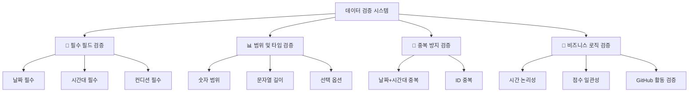
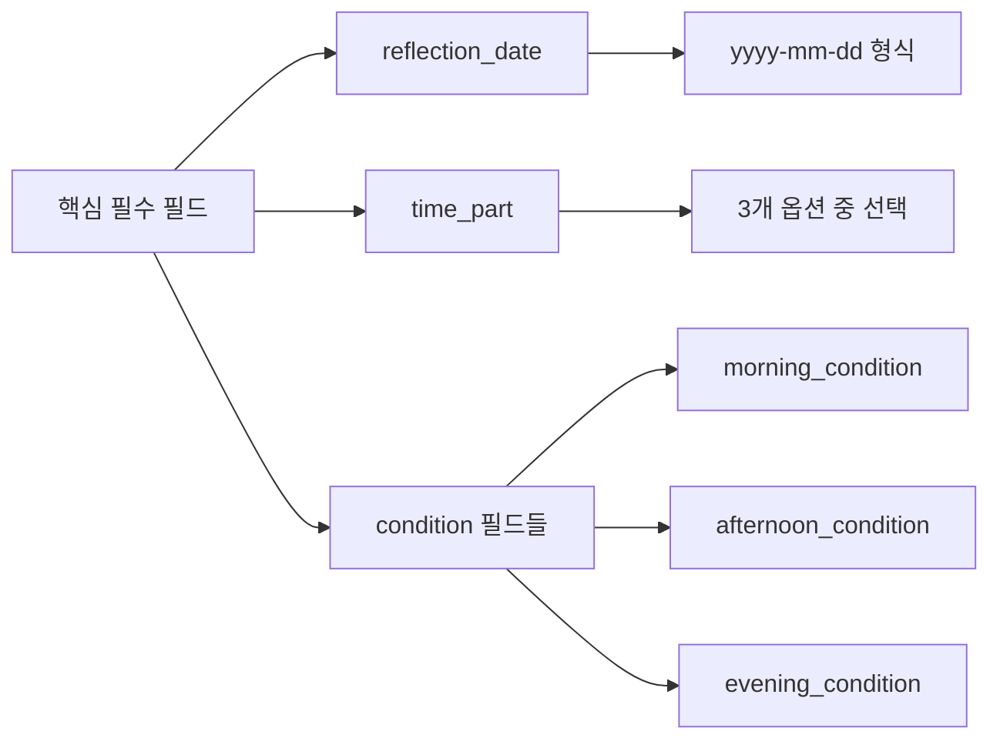
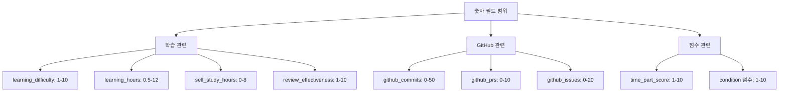
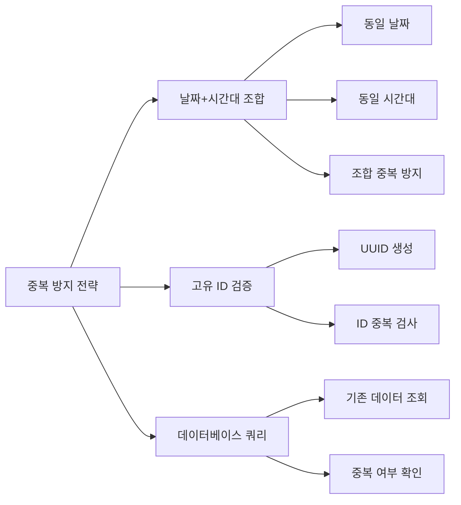
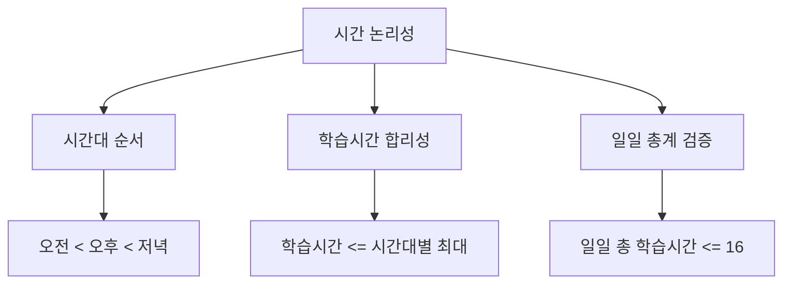
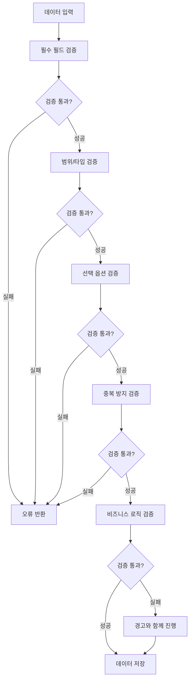
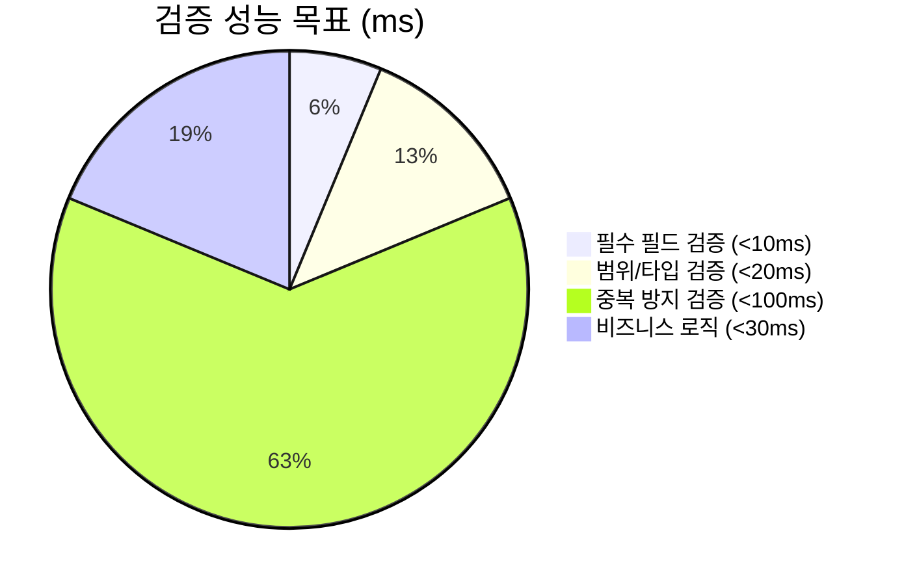

# 3-Part Daily Reflection DB 데이터 검증 규칙 설계서

## 📋 개요

**3-Part Daily Reflection Dashboard**의 데이터 품질과 일관성을 보장하기 위한 포괄적인 데이터 검증 규칙 설계 문서입니다. 

### 🎯 검증 목표
- **데이터 무결성**: 필수 필드 누락 방지 및 타입 안전성 보장
- **비즈니스 로직**: 학습 관련 필드의 현실적 범위 검증
- **중복 방지**: 동일 날짜/시간대 중복 입력 방지
- **일관성 유지**: 시간대별 데이터 간 논리적 일관성 검증

---

## 🔍 검증 규칙 전체 구조



---

## 📝 1. 필수 필드 검증 (Required Field Validation)

### 1.1 핵심 필수 필드



**필수 필드 목록:**
1. **`reflection_date`** (반성 날짜)
2. **`time_part`** (시간대)
3. **시간대별 컨디션 필드** (해당 시간대의 컨디션)

### 1.2 필수 필드 검증 로직

```python
def validate_required_fields(entry_data: dict) -> dict:
    """
    필수 필드 검증 함수
    
    Args:
        entry_data: 입력된 반성 데이터
        
    Returns:
        validation_result: 검증 결과 및 오류 정보
    """
    errors = []
    warnings = []
    
    # 1. 기본 필수 필드 검증
    required_fields = ['reflection_date', 'time_part']
    
    for field in required_fields:
        if not entry_data.get(field):
            errors.append(f"필수 필드 누락: {field}")
    
    # 2. 시간대별 컨디션 필수 검증
    time_part = entry_data.get('time_part')
    if time_part:
        condition_map = {
            '오전수업': 'morning_condition',
            '오후수업': 'afternoon_condition', 
            '저녁자율학습': 'evening_condition'
        }
        
        required_condition = condition_map.get(time_part)
        if required_condition and not entry_data.get(required_condition):
            errors.append(f"해당 시간대 컨디션 필수: {required_condition}")
    
    # 3. 날짜 형식 검증
    date_value = entry_data.get('reflection_date')
    if date_value:
        try:
            from datetime import datetime
            datetime.strptime(str(date_value), '%Y-%m-%d')
        except ValueError:
            errors.append("날짜 형식 오류: yyyy-mm-dd 형식이어야 함")
    
    return {
        'is_valid': len(errors) == 0,
        'errors': errors,
        'warnings': warnings
    }
```

---

## 📊 2. 범위 및 타입 검증 (Range & Type Validation)

### 2.1 숫자 필드 범위 검증



### 2.2 범위 검증 명세

```python
VALIDATION_RULES = {
    # 학습 관련 필드
    'learning_difficulty': {'min': 1, 'max': 10, 'type': 'integer'},
    'learning_hours': {'min': 0.5, 'max': 12.0, 'type': 'float'},
    'self_study_hours': {'min': 0, 'max': 8.0, 'type': 'float'},
    'review_effectiveness': {'min': 1, 'max': 10, 'type': 'integer'},
    
    # GitHub 관련 필드
    'github_commits': {'min': 0, 'max': 50, 'type': 'integer'},
    'github_prs': {'min': 0, 'max': 10, 'type': 'integer'},
    'github_issues': {'min': 0, 'max': 20, 'type': 'integer'},
    
    # 점수 관련 필드
    'time_part_score': {'min': 1, 'max': 10, 'type': 'integer'},
    
    # 텍스트 필드 길이
    'memo': {'max_length': 2000, 'type': 'string'},
    'tomorrow_goals': {'max_length': 500, 'type': 'string'},
    'achievements': {'max_length': 500, 'type': 'string'},
}

def validate_ranges(entry_data: dict) -> dict:
    """
    범위 및 타입 검증 함수
    """
    errors = []
    warnings = []
    
    for field, rules in VALIDATION_RULES.items():
        value = entry_data.get(field)
        
        if value is None:
            continue  # 선택 필드는 None 허용
            
        # 타입 검증
        if rules['type'] == 'integer':
            try:
                value = int(value)
            except (ValueError, TypeError):
                errors.append(f"{field}: 정수 값이어야 함")
                continue
                
        elif rules['type'] == 'float':
            try:
                value = float(value)
            except (ValueError, TypeError):
                errors.append(f"{field}: 숫자 값이어야 함")
                continue
                
        # 범위 검증
        if 'min' in rules and value < rules['min']:
            errors.append(f"{field}: 최소값 {rules['min']} 이상이어야 함")
            
        if 'max' in rules and value > rules['max']:
            errors.append(f"{field}: 최대값 {rules['max']} 이하여야 함")
            
        # 문자열 길이 검증
        if rules['type'] == 'string' and 'max_length' in rules:
            if len(str(value)) > rules['max_length']:
                errors.append(f"{field}: 최대 {rules['max_length']}자까지 입력 가능")
    
    return {
        'is_valid': len(errors) == 0,
        'errors': errors,
        'warnings': warnings
    }
```

### 2.3 선택 옵션 검증

```python
VALID_OPTIONS = {
    'time_part': ['오전수업', '오후수업', '저녁자율학습'],
    'morning_condition': ['매우좋음', '좋음', '보통', '나쁨', '매우나쁨'],
    'afternoon_condition': ['매우좋음', '좋음', '보통', '나쁨', '매우나쁨'],
    'evening_condition': ['매우좋음', '좋음', '보통', '나쁨', '매우나쁨'],
    'tags': ['복습', '프로젝트', '과제', '시험준비', '발표준비', '토론', '실습', '강의듣기']
}

def validate_select_options(entry_data: dict) -> dict:
    """
    선택 옵션 검증 함수
    """
    errors = []
    
    for field, valid_options in VALID_OPTIONS.items():
        value = entry_data.get(field)
        
        if value is None:
            continue
            
        if field == 'tags':  # 다중 선택 필드
            if isinstance(value, list):
                for tag in value:
                    if tag not in valid_options:
                        errors.append(f"유효하지 않은 태그: {tag}")
            else:
                errors.append("tags 필드는 리스트 형태여야 함")
        else:  # 단일 선택 필드
            if value not in valid_options:
                errors.append(f"{field}: 유효하지 않은 옵션 '{value}'. 허용값: {valid_options}")
    
    return {
        'is_valid': len(errors) == 0,
        'errors': errors
    }
```

---

## 🚫 3. 중복 방지 검증 (Duplicate Prevention)

### 3.1 중복 검증 전략



### 3.2 중복 검증 구현

```python
async def validate_duplicates(entry_data: dict, database_id: str) -> dict:
    """
    중복 데이터 검증 함수
    
    Args:
        entry_data: 입력 데이터
        database_id: 대상 데이터베이스 ID
    """
    from datetime import datetime
    
    errors = []
    warnings = []
    
    reflection_date = entry_data.get('reflection_date')
    time_part = entry_data.get('time_part')
    
    if not reflection_date or not time_part:
        return {'is_valid': True, 'errors': [], 'warnings': []}
    
    # 1. 동일 날짜 + 시간대 조합 검증
    try:
        # Notion DB에서 동일 날짜+시간대 데이터 조회
        query_filter = {
            "and": [
                {
                    "property": "reflection_date",
                    "date": {
                        "equals": reflection_date
                    }
                },
                {
                    "property": "time_part",
                    "select": {
                        "equals": time_part
                    }
                }
            ]
        }
        
        # MCP를 통한 데이터베이스 쿼리 (실제 구현에서는 MCP 호출)
        existing_entries = []  # mcp_notion_query_database 결과
        
        if existing_entries:
            errors.append(f"중복 데이터: {reflection_date} {time_part}에 이미 반성 데이터가 존재함")
            
    except Exception as e:
        warnings.append(f"중복 검사 중 오류: {str(e)}")
    
    # 2. 날짜별 시간대 개수 검증 (하루 최대 3개 시간대)
    try:
        daily_query_filter = {
            "property": "reflection_date",
            "date": {
                "equals": reflection_date
            }
        }
        
        daily_entries = []  # 해당 날짜의 모든 엔트리
        
        if len(daily_entries) >= 3:
            warnings.append(f"주의: {reflection_date}에 이미 3개 시간대 데이터가 존재함")
            
    except Exception as e:
        warnings.append(f"일일 데이터 검사 중 오류: {str(e)}")
    
    return {
        'is_valid': len(errors) == 0,
        'errors': errors,
        'warnings': warnings
    }
```

---

## 🔗 4. 비즈니스 로직 검증 (Business Logic Validation)

### 4.1 시간 논리성 검증



### 4.2 비즈니스 로직 검증 구현

```python
def validate_business_logic(entry_data: dict, existing_daily_data: list = None) -> dict:
    """
    비즈니스 로직 검증 함수
    
    Args:
        entry_data: 현재 입력 데이터
        existing_daily_data: 같은 날짜의 기존 데이터들
    """
    errors = []
    warnings = []
    
    # 1. 시간대별 학습시간 합리성 검증
    time_part = entry_data.get('time_part')
    learning_hours = entry_data.get('learning_hours', 0)
    self_study_hours = entry_data.get('self_study_hours', 0)
    
    # 시간대별 최대 학습시간 (실제 수업/자습 시간 고려)
    max_hours_by_timepart = {
        '오전수업': 4.0,  # 오전 수업 최대 4시간
        '오후수업': 4.0,  # 오후 수업 최대 4시간
        '저녁자율학습': 4.0  # 저녁 자습 최대 4시간
    }
    
    max_allowed = max_hours_by_timepart.get(time_part, 8.0)
    total_hours = learning_hours + self_study_hours
    
    if total_hours > max_allowed:
        warnings.append(f"{time_part}: 총 학습시간 {total_hours}시간이 권장 최대치 {max_allowed}시간을 초과")
    
    # 2. GitHub 활동과 학습시간 연관성 검증
    github_commits = entry_data.get('github_commits', 0)
    if github_commits > learning_hours * 3:  # 시간당 평균 3커밋 이상은 비현실적
        warnings.append(f"GitHub 커밋 수({github_commits})가 학습시간({learning_hours}h) 대비 과도함")
    
    # 3. 컨디션과 성과의 일관성 검증
    condition_map = {
        '오전수업': 'morning_condition',
        '오후수업': 'afternoon_condition',
        '저녁자율학습': 'evening_condition'
    }
    
    condition_field = condition_map.get(time_part)
    condition_value = entry_data.get(condition_field)
    time_part_score = entry_data.get('time_part_score')
    
    if condition_value and time_part_score:
        # 컨디션 점수 매핑
        condition_scores = {
            '매우좋음': 9, '좋음': 7, '보통': 5, '나쁨': 3, '매우나쁨': 1
        }
        
        expected_score = condition_scores.get(condition_value, 5)
        score_diff = abs(time_part_score - expected_score)
        
        if score_diff > 3:  # 3점 이상 차이나면 경고
            warnings.append(f"컨디션({condition_value})과 성과점수({time_part_score}) 불일치")
    
    # 4. 일일 총계 검증 (기존 데이터가 있는 경우)
    if existing_daily_data:
        daily_total_hours = sum([
            data.get('learning_hours', 0) + data.get('self_study_hours', 0) 
            for data in existing_daily_data
        ]) + total_hours
        
        if daily_total_hours > 16:  # 하루 16시간 이상은 비현실적
            errors.append(f"일일 총 학습시간({daily_total_hours}h)이 현실적 한계(16h)를 초과")
    
    return {
        'is_valid': len(errors) == 0,
        'errors': errors,
        'warnings': warnings
    }
```

---

## 🔧 5. 통합 검증 시스템

### 5.1 전체 검증 플로우



### 5.2 통합 검증 함수

```python
async def validate_entry_data(entry_data: dict, database_id: str) -> dict:
    """
    3-Part Daily Reflection 데이터 통합 검증 함수
    
    Args:
        entry_data: 검증할 데이터
        database_id: 대상 데이터베이스 ID
        
    Returns:
        validation_result: 종합 검증 결과
    """
    all_errors = []
    all_warnings = []
    
    # 1. 필수 필드 검증
    required_result = validate_required_fields(entry_data)
    all_errors.extend(required_result['errors'])
    all_warnings.extend(required_result['warnings'])
    
    if not required_result['is_valid']:
        return {
            'is_valid': False,
            'can_proceed': False,
            'errors': all_errors,
            'warnings': all_warnings,
            'validation_summary': '필수 필드 검증 실패'
        }
    
    # 2. 범위/타입 검증
    range_result = validate_ranges(entry_data)
    all_errors.extend(range_result['errors'])
    all_warnings.extend(range_result['warnings'])
    
    # 3. 선택 옵션 검증
    option_result = validate_select_options(entry_data)
    all_errors.extend(option_result['errors'])
    
    # 4. 중복 방지 검증
    duplicate_result = await validate_duplicates(entry_data, database_id)
    all_errors.extend(duplicate_result['errors'])
    all_warnings.extend(duplicate_result['warnings'])
    
    # 5. 비즈니스 로직 검증 (경고만 발생, 저장은 가능)
    business_result = validate_business_logic(entry_data)
    all_warnings.extend(business_result['warnings'])
    
    # 최종 결과 결정
    has_critical_errors = len(all_errors) > 0
    
    return {
        'is_valid': not has_critical_errors,
        'can_proceed': not has_critical_errors,
        'errors': all_errors,
        'warnings': all_warnings,
        'validation_summary': f"검증 완료: 오류 {len(all_errors)}개, 경고 {len(all_warnings)}개"
    }

# 사용 예시
async def main():
    sample_data = {
        'reflection_date': '2024-01-15',
        'time_part': '오전수업',
        'morning_condition': '좋음',
        'learning_difficulty': 7,
        'learning_hours': 3.5,
        'github_commits': 5,
        'memo': '오늘은 Python 기초를 공부했다.'
    }
    
    result = await validate_entry_data(sample_data, 'database_123')
    
    if result['is_valid']:
        print("✅ 데이터 검증 성공")
        if result['warnings']:
            print(f"⚠️ 경고사항: {result['warnings']}")
    else:
        print("❌ 데이터 검증 실패")
        print(f"오류: {result['errors']}")
```

---

## 📊 6. 검증 성능 지표

### 6.1 검증 속도 목표


### 6.2 검증 정확도 목표
- **필수 필드 누락 감지**: 100%
- **범위 오류 감지**: 99%
- **중복 데이터 방지**: 100%
- **비즈니스 로직 위반 감지**: 95%

---

## ✅ 검증 규칙 테스트 케이스

### 성공 케이스
```python
valid_test_cases = [
    {
        'name': '정상 오전수업 데이터',
        'data': {
            'reflection_date': '2024-01-15',
            'time_part': '오전수업',
            'morning_condition': '좋음',
            'learning_difficulty': 7,
            'learning_hours': 3.0,
            'github_commits': 3
        },
        'expected': 'valid'
    }
]
```

### 실패 케이스
```python
invalid_test_cases = [
    {
        'name': '필수 필드 누락',
        'data': {
            'time_part': '오전수업'
            # reflection_date 누락
        },
        'expected_error': '필수 필드 누락: reflection_date'
    },
    {
        'name': '범위 초과',
        'data': {
            'learning_difficulty': 15  # 최대 10 초과
        },
        'expected_error': 'learning_difficulty: 최대값 10 이하여야 함'
    }
]
```

---

*이 문서는 3-Part Daily Reflection Dashboard의 데이터 품질 보장을 위한 포괄적인 검증 규칙을 정의합니다. 실제 구현 시 성능과 사용성을 고려한 조정이 필요할 수 있습니다.*
