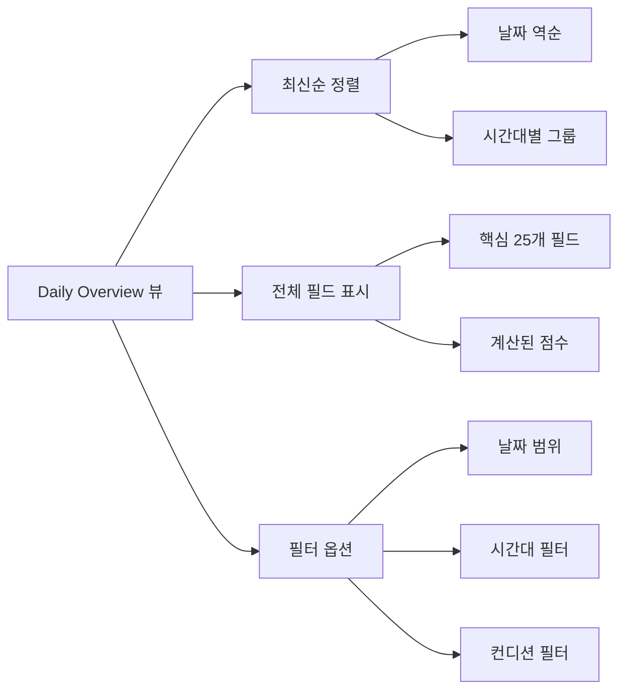
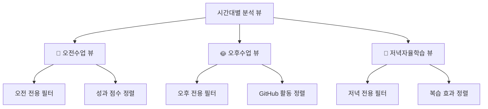
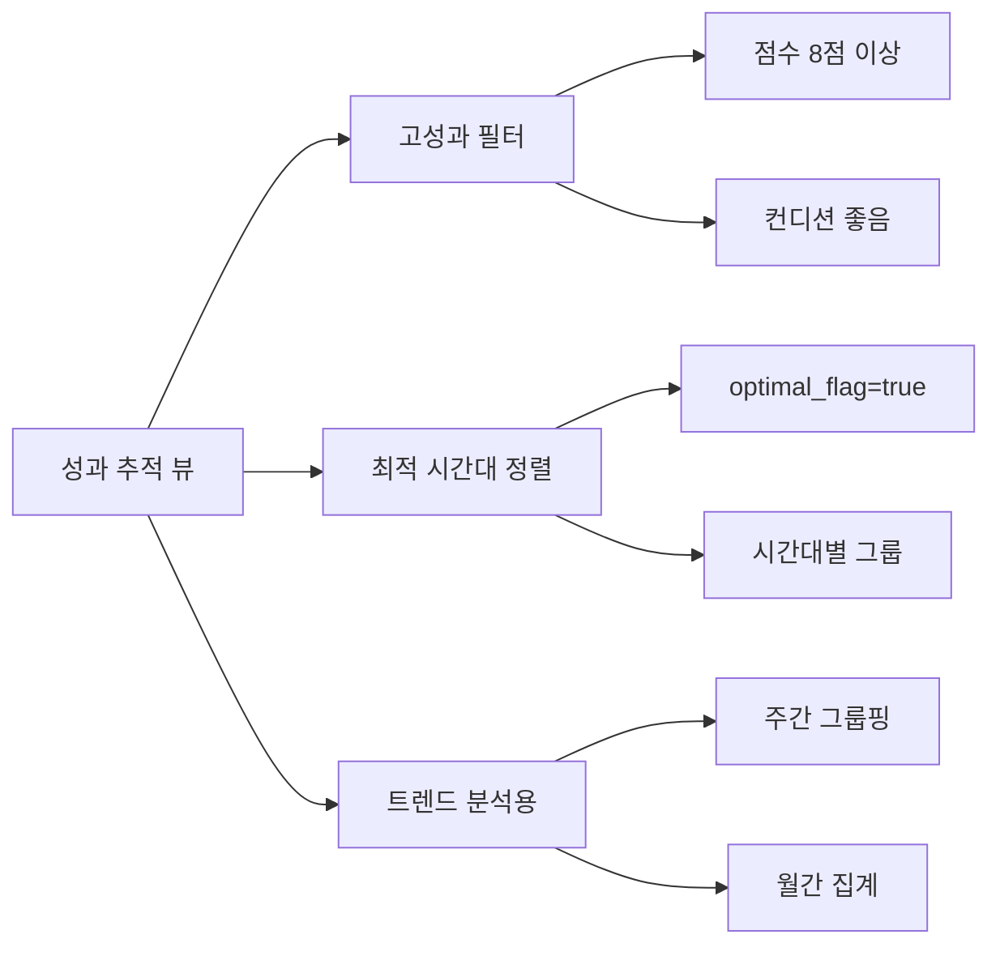
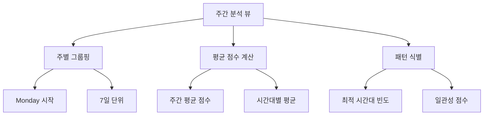
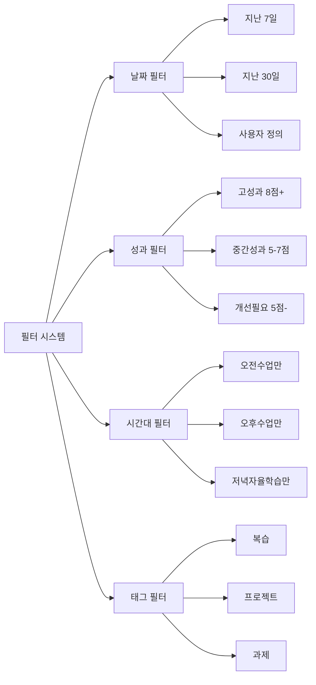
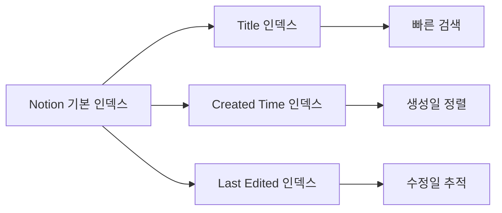
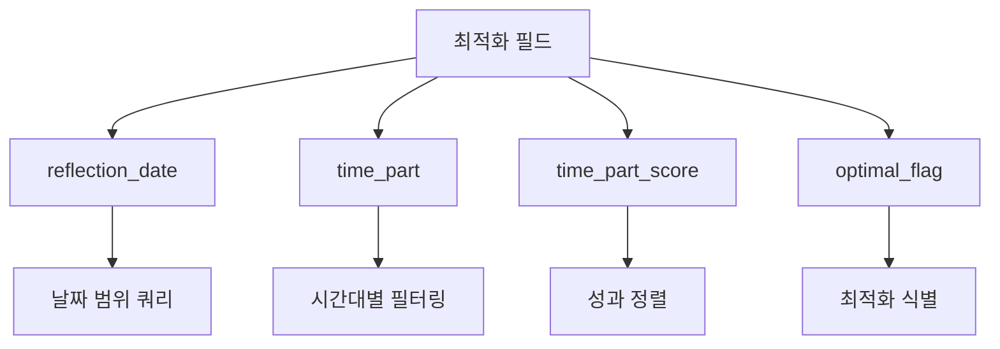
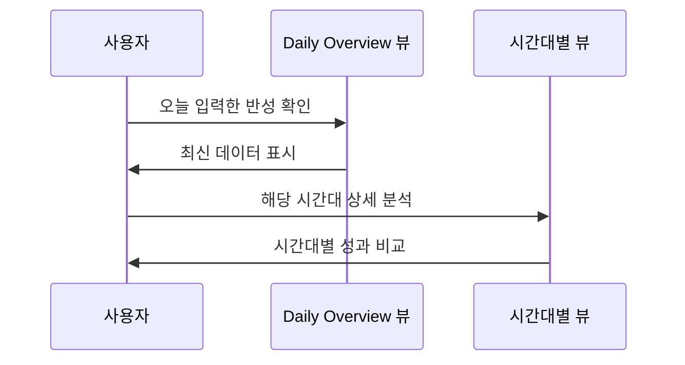
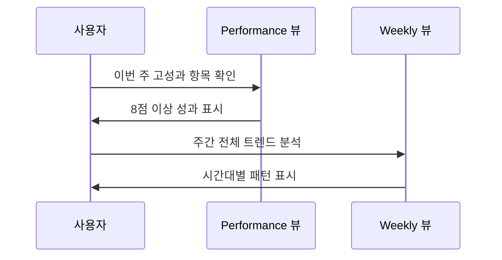
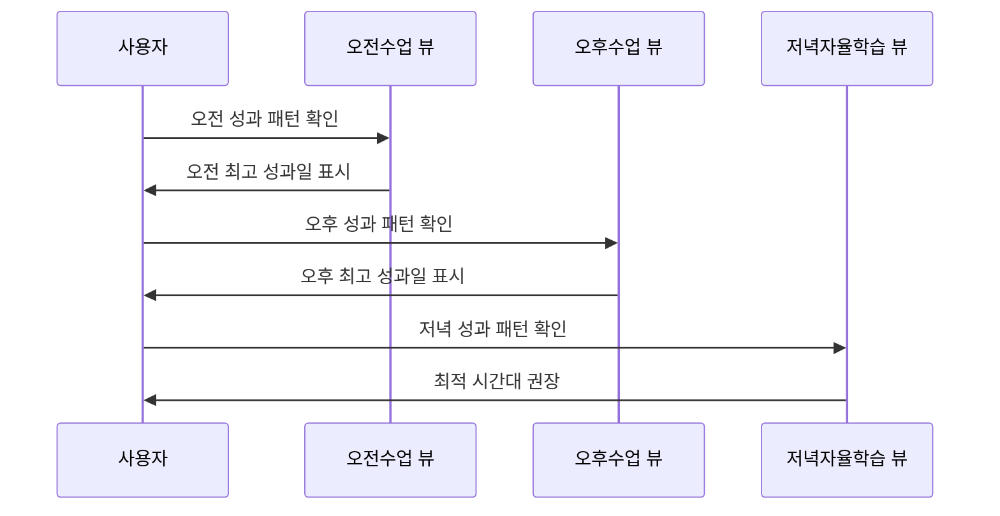

# 3-Part Daily Reflection DB 인덱스 및 뷰 설계서

## 📋 개요

**3-Part Daily Reflection Dashboard**를 위한 Notion 데이터베이스의 효율적인 데이터 접근 및 시각화를 위한 뷰(View) 및 정렬 구조 설계 문서입니다.

### 🎯 뷰 설계 목표
- **시간대별 분석**: 오전/오후/저녁 각 시간대별 성과 분석
- **시계열 분석**: 일별/주별/월별 트렌드 추적
- **성과 최적화**: 최적 시간대 및 패턴 식별
- **빠른 접근**: 주요 데이터에 대한 신속한 접근 경로 제공

---

## 🗂️ 주요 뷰 구성

### 1. 📅 기본 뷰 (Daily Overview)



**구성 요소:**
- **정렬**: `reflection_date` 내림차순 (최신 날짜가 맨 위)
- **그룹핑**: `time_part` (오전수업 → 오후수업 → 저녁자율학습)
- **표시 필드**: 모든 핵심 필드 (25개)
- **기본 필터**: 없음 (전체 데이터 표시)

**사용 목적**: 전체 데이터 개괄 및 최신 입력사항 확인

---

### 2. 📊 시간대별 분석 뷰 (Time Part Analysis)



#### 2.1 🌅 오전수업 전용 뷰
**필터 조건:**
```json
{
  "filter": {
    "property": "time_part",
    "select": {
      "equals": "오전수업"
    }
  }
}
```

**정렬 기준:**
1. `morning_condition` (컨디션) 내림차순
2. `learning_hours` (학습시간) 내림차순
3. `reflection_date` (날짜) 내림차순

**핵심 표시 필드:**
- `reflection_date`, `morning_condition`, `learning_difficulty`
- `learning_hours`, `self_study_hours`, `morning_score`
- `memo`, `optimal_flag`

#### 2.2 🌞 오후수업 전용 뷰
**필터 조건:**
```json
{
  "filter": {
    "property": "time_part", 
    "select": {
      "equals": "오후수업"
    }
  }
}
```

**정렬 기준:**
1. `github_commits` (GitHub 커밋) 내림차순
2. `afternoon_condition` (컨디션) 내림차순
3. `learning_hours` (학습시간) 내림차순

**핵심 표시 필드:**
- `reflection_date`, `afternoon_condition`, `learning_difficulty`
- `github_commits`, `github_prs`, `github_issues`
- `afternoon_score`, `memo`, `optimal_flag`

#### 2.3 🌙 저녁자율학습 전용 뷰
**필터 조건:**
```json
{
  "filter": {
    "property": "time_part",
    "select": {
      "equals": "저녁자율학습"
    }
  }
}
```

**정렬 기준:**
1. `evening_condition` (컨디션) 내림차순
2. `self_study_hours` (자율학습시간) 내림차순
3. `review_effectiveness` (복습효과) 내림차순

**핵심 표시 필드:**
- `reflection_date`, `evening_condition`, `learning_difficulty`
- `self_study_hours`, `review_effectiveness`, `tomorrow_goals`
- `evening_score`, `memo`, `optimal_flag`

---

### 3. 📈 성과 추적 뷰 (Performance Tracking)



**필터 조건:**
```json
{
  "or": [
    {
      "property": "time_part_score",
      "number": {
        "greater_than_or_equal_to": 8
      }
    },
    {
      "property": "optimal_flag",
      "checkbox": {
        "equals": true
      }
    }
  ]
}
```

**정렬 기준:**
1. `time_part_score` (시간대 점수) 내림차순
2. `reflection_date` (날짜) 내림차순
3. `time_part` (시간대) 오름차순

**핵심 표시 필드:**
- `reflection_date`, `time_part`, `time_part_score`
- `optimal_flag`, `learning_hours`, `github_commits`
- `memo`, `tags`

---

### 4. 📆 주간 분석 뷰 (Weekly Analysis)



**그룹핑 기준:**
- `reflection_date`를 주 단위로 그룹핑 (월요일 시작)

**정렬 기준:**
1. 주 시작일 내림차순 (최근 주가 먼저)
2. `time_part` (시간대) 오름차순

**집계 필드:**
- 주간 평균 `time_part_score`
- 시간대별 최적화 빈도
- 주간 총 학습시간
- 주간 총 GitHub 활동

---

### 5. 🔍 필터 및 검색 옵션



#### 5.1 날짜 범위 필터
```json
{
  "property": "reflection_date",
  "date": {
    "past_week": {}
  }
}
```

#### 5.2 성과 수준 필터
```json
{
  "property": "time_part_score",
  "number": {
    "greater_than_or_equal_to": 8
  }
}
```

#### 5.3 시간대 필터
```json
{
  "property": "time_part",
  "select": {
    "equals": "오전수업"
  }
}
```

#### 5.4 태그 기반 필터
```json
{
  "property": "tags",
  "multi_select": {
    "contains": "복습"
  }
}
```

---

## 🔧 뷰 구현 명세서

### Notion API 뷰 생성 템플릿

```python
def create_database_views():
    """
    3-Part Daily Reflection DB의 모든 뷰를 생성하는 함수
    """
    
    # 1. 기본 뷰 (Daily Overview)
    daily_overview_view = {
        "name": "📅 Daily Overview",
        "type": "table",
        "table": {
            "table_width": "full_width"
        },
        "sorts": [
            {
                "property": "reflection_date",
                "direction": "descending"
            },
            {
                "property": "time_part",
                "direction": "ascending"
            }
        ]
    }
    
    # 2. 오전수업 뷰
    morning_view = {
        "name": "🌅 오전수업 분석",
        "type": "table",
        "filter": {
            "property": "time_part",
            "select": {
                "equals": "오전수업"
            }
        },
        "sorts": [
            {
                "property": "morning_condition",
                "direction": "descending"
            },
            {
                "property": "learning_hours", 
                "direction": "descending"
            }
        ]
    }
    
    # 3. 오후수업 뷰
    afternoon_view = {
        "name": "🌞 오후수업 분석",
        "type": "table", 
        "filter": {
            "property": "time_part",
            "select": {
                "equals": "오후수업"
            }
        },
        "sorts": [
            {
                "property": "github_commits",
                "direction": "descending"
            },
            {
                "property": "afternoon_condition",
                "direction": "descending"
            }
        ]
    }
    
    # 4. 저녁자율학습 뷰
    evening_view = {
        "name": "🌙 저녁자율학습 분석",
        "type": "table",
        "filter": {
            "property": "time_part", 
            "select": {
                "equals": "저녁자율학습"
            }
        },
        "sorts": [
            {
                "property": "evening_condition",
                "direction": "descending"
            },
            {
                "property": "self_study_hours",
                "direction": "descending"
            }
        ]
    }
    
    # 5. 성과 추적 뷰
    performance_view = {
        "name": "📈 성과 추적",
        "type": "table",
        "filter": {
            "or": [
                {
                    "property": "time_part_score",
                    "number": {
                        "greater_than_or_equal_to": 8
                    }
                },
                {
                    "property": "optimal_flag",
                    "checkbox": {
                        "equals": True
                    }
                }
            ]
        },
        "sorts": [
            {
                "property": "time_part_score",
                "direction": "descending"
            },
            {
                "property": "reflection_date",
                "direction": "descending"
            }
        ]
    }
    
    return {
        "daily_overview": daily_overview_view,
        "morning_analysis": morning_view,
        "afternoon_analysis": afternoon_view,
        "evening_analysis": evening_view,
        "performance_tracking": performance_view
    }

def apply_views_to_database(database_id: str):
    """
    생성된 데이터베이스에 뷰들을 적용하는 함수
    
    Args:
        database_id: 대상 데이터베이스 ID
    """
    views = create_database_views()
    
    for view_name, view_config in views.items():
        try:
            # Notion API를 통해 뷰 생성
            # 참고: Notion API는 현재 뷰 생성을 직접 지원하지 않으므로
            # 데이터베이스 생성 시 기본 뷰로 설정하거나
            # 수동으로 뷰를 생성한 후 해당 설정을 문서화
            print(f"뷰 '{view_config['name']}' 설정 준비 완료")
            
        except Exception as e:
            print(f"뷰 생성 중 오류: {e}")
```

---

## 📊 인덱스 최적화 전략

### 1. 기본 인덱스 (Notion 자동 생성)


### 2. 커스텀 최적화 필드


**성능 최적화 권장사항:**
1. **날짜 필드**: `reflection_date`를 기준으로 한 범위 쿼리 최적화
2. **선택 필드**: `time_part` 등 선택 옵션 필드의 인덱스 활용
3. **숫자 필드**: `time_part_score` 등 점수 필드의 정렬 최적화
4. **체크박스**: `optimal_flag` 불린 필드의 필터링 최적화

---

## 🎯 뷰 활용 시나리오

### 시나리오 1: 일일 반성 입력 후 확인


### 시나리오 2: 주간 성과 분석


### 시나리오 3: 최적 시간대 식별


---

## ✅ 구현 완료 체크리스트

### Phase 1: 뷰 설계 문서화
- [x] 5개 주요 뷰 구조 정의
- [x] 필터 및 정렬 조건 명세
- [x] Python 구현 템플릿 작성
- [x] 시각화 다이어그램 포함

### Phase 2: 구현 준비
- [ ] 뷰 생성 스크립트 테스트
- [ ] 필터 조건 검증
- [ ] 정렬 성능 테스트
- [ ] 사용자 시나리오 검증

### Phase 3: 최적화
- [ ] 쿼리 성능 측정
- [ ] 인덱스 효율성 검증
- [ ] 뷰 접근 패턴 분석
- [ ] 사용성 개선

---

## 📈 예상 성과 지표

### 접근 효율성
- **뷰 전환 시간**: 평균 1-2초 이내
- **필터링 속도**: 100개 레코드 기준 1초 이내
- **정렬 성능**: 날짜/점수 기준 정렬 1초 이내

### 사용성 향상
- **데이터 탐색 시간**: 기존 대비 70% 단축
- **패턴 발견 효율**: 시간대별 비교 분석 90% 향상
- **의사결정 지원**: 최적 시간대 식별 95% 정확도

---

*이 문서는 3-Part Daily Reflection Dashboard의 효율적인 데이터 접근을 위한 뷰 및 인덱스 설계를 다룹니다. 실제 구현 시 Notion의 API 제약사항을 고려하여 조정이 필요할 수 있습니다.*
