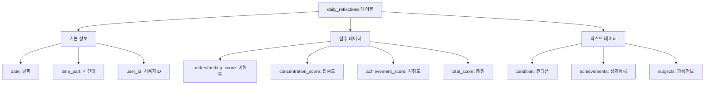
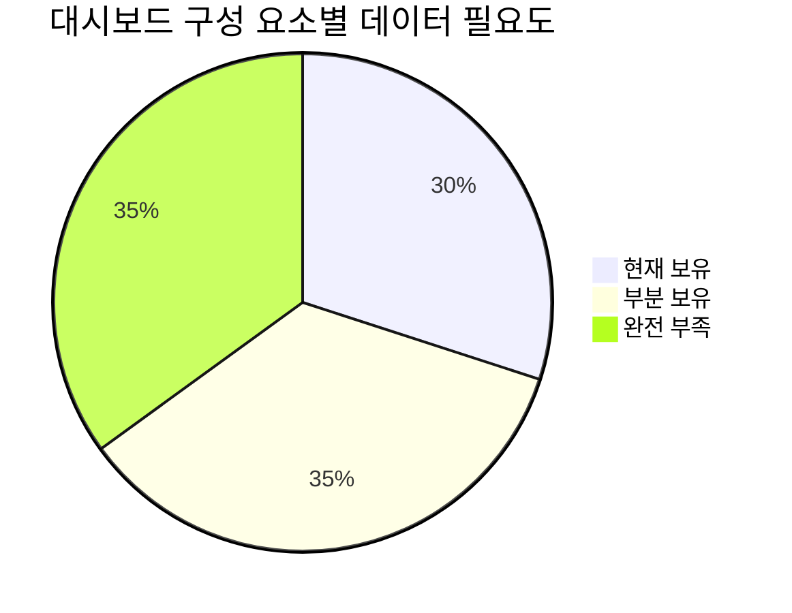
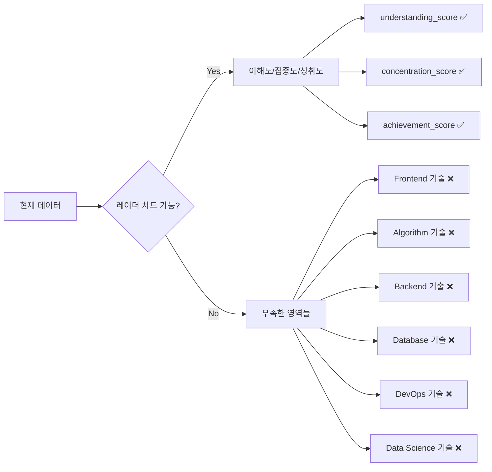
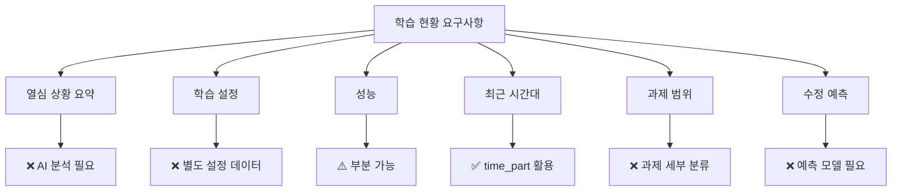
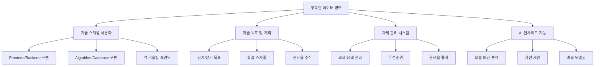
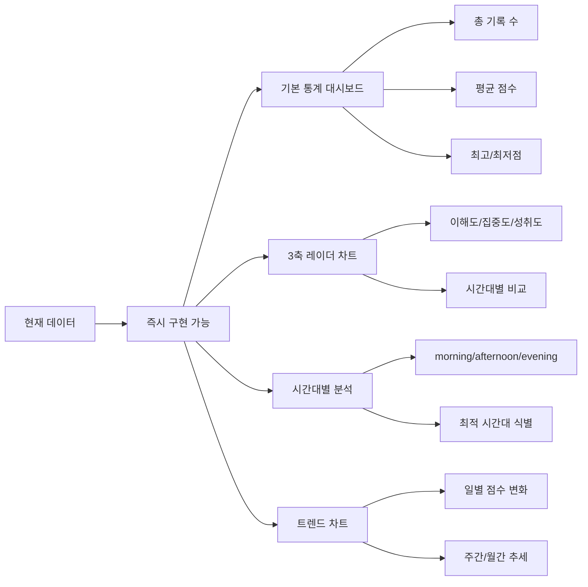
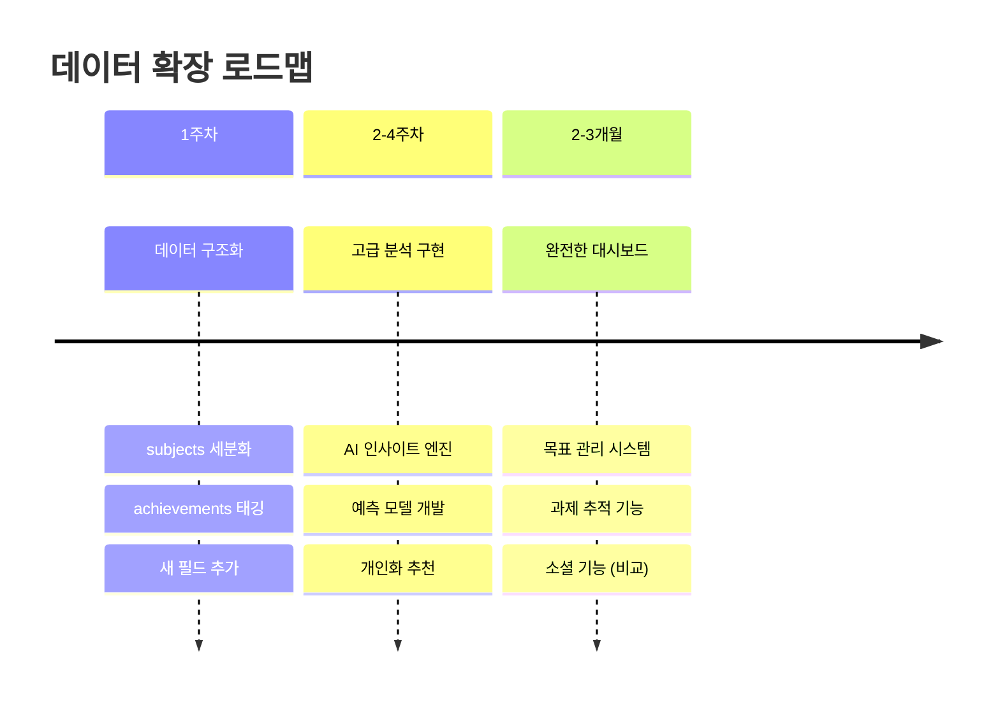
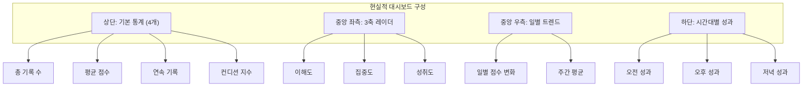
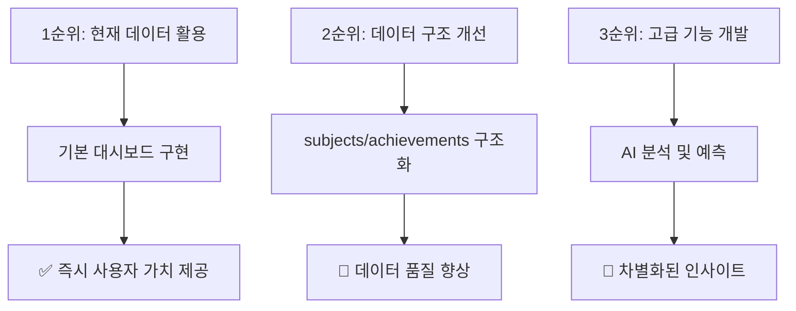

# Dashboard 데이터 부족 분석 보고서

> **작성일**: 2025년 7월 24일  
> **목적**: 현재 수집 데이터와 목표 대시보드 간의 격차 분석  
> **분석 대상**: 첨부된 대시보드 UI vs 현재 daily_reflections 데이터

## 📊 현재 데이터 구조 분석

### 🗂️ 현재 수집 중인 데이터



### 📈 목표 대시보드 요구 데이터



## 🎯 대시보드 구성 요소별 데이터 격차 분석

### 1️⃣ **상단 지표 카드 (6개)**

| 지표 | 현재 상태 | 필요 데이터 | 구현 난이도 |
|------|-----------|-------------|-------------|
| **총 기록 수 (21)** | ✅ 가능 | `COUNT(daily_reflections)` | 🟢 쉬움 |
| **평균 점수 (18)** | ✅ 가능 | `AVG(total_score)` | 🟢 쉬움 |
| **연속 기록 (12)** | ⚠️ 복잡 | 날짜 연속성 계산 로직 필요 | 🟡 보통 |
| **총 과제 (56)** | ❌ 불가능 | `achievements` 개수? 명확하지 않음 | 🔴 어려움 |
| **활동 추천 (4)** | ❌ 불가능 | AI 분석 또는 별도 로직 필요 | 🔴 어려움 |
| **만족도 지수 (6.5)** | ⚠️ 추정 | `condition` 텍스트 → 수치 변환 | 🟡 보통 |

### 2️⃣ **3-Part 성과 비교 레이더 차트**



**분석 결과:**
- ✅ **기본 3축은 구현 가능**: understanding/concentration/achievement 점수
- ❌ **기술 영역별 세분화 불가능**: subjects 데이터가 구체적이지 않음
- 🔄 **개선 필요**: subjects를 구조화된 기술 스택별 점수로 변경

### 3️⃣ **학습 현황 오른쪽 패널**



### 4️⃣ **시간대별 학습 패턴 (하단)**

| 요소 | 현재 상태 | 구현 가능성 |
|------|-----------|-------------|
| **오전/오후/저녁 구분** | ✅ `time_part` 존재 | 100% |
| **시간대별 성과 비교** | ✅ 점수 데이터 존재 | 100% |
| **최적 시간대 추천** | ⚠️ 데이터 분석 필요 | 70% |

---

## 🚨 주요 데이터 부족 영역

### ❌ **완전히 부족한 데이터**



### ⚠️ **부분적으로 부족한 데이터**

| 영역 | 현재 상태 | 부족한 부분 | 해결 방안 |
|------|-----------|-------------|-----------|
| **과목별 점수** | `subjects: {}` (빈 객체) | 구체적 과목 분류 | 데이터 수집 구조 개선 |
| **성취 내용** | `achievements` 배열 | 카테고리 분류 | 텍스트 분석 + 태깅 |
| **컨디션 수치화** | `condition: "좋음"` | 정량적 지표 | 텍스트→숫자 매핑 |
| **학습 시간** | 없음 | 실제 학습 소요 시간 | 새로운 필드 추가 |

---

## 💡 개선 제안 및 해결 방안

### 🎯 **즉시 구현 가능한 영역 (현재 데이터 활용)**



### 🔧 **단기 개선 방안 (1-2주 내)**

1. **subjects 데이터 구조화**
```json
{
  "subjects": {
    "frontend": {"react": 8, "nextjs": 7},
    "backend": {"python": 9, "fastapi": 6},
    "database": {"postgresql": 7, "supabase": 8},
    "algorithm": {"sorting": 6, "graph": 5}
  }
}
```

2. **achievements 카테고리 분류**
```json
{
  "achievements": [
    {"category": "tableau", "content": "Excel파일 import 학습", "difficulty": "medium"},
    {"category": "dashboard", "content": "컨테이너 개념 이해", "difficulty": "easy"}
  ]
}
```

3. **새로운 필드 추가**
```sql
ALTER TABLE daily_reflections ADD COLUMN study_duration_minutes INTEGER;
ALTER TABLE daily_reflections ADD COLUMN satisfaction_score INTEGER; -- 1-10
ALTER TABLE daily_reflections ADD COLUMN energy_level INTEGER; -- 1-10
```

### 🚀 **중장기 개발 방안 (1-3개월)**



### 🎨 **대안 대시보드 설계**

현재 데이터로 구현 가능한 **현실적인 대시보드**:



---

## 📋 최종 결론 및 권장사항

### ✅ **즉시 구현 가능 (현재 데이터)**
- 기본 통계: 총 기록 수, 평균 점수, 연속 기록
- 3축 레이더 차트: 이해도/집중도/성취도
- 시간대별 성과 분석
- 일별/주별 트렌드 차트

### ⚠️ **부분 구현 가능 (데이터 가공 필요)**
- 컨디션 수치화: "좋음" → 8점 매핑
- 성취 카테고리 분석: achievements 텍스트 분류
- 연속 기록 계산: 날짜 gap 분석 로직

### ❌ **구현 불가능 (새로운 데이터 필요)**
- 기술 스택별 세분화된 레이더 차트
- AI 기반 학습 인사이트 및 추천
- 과제 관리 및 진도율 추적
- 목표 대비 성과 분석

### 🎯 **권장 우선순위**



**결론**: 현재 데이터로는 목표 대시보드의 **약 40%** 정도만 구현 가능하지만, 단계적 개선을 통해 완전한 대시보드 구현이 가능합니다. 먼저 현재 데이터를 활용한 **기본 버전**을 구현하고, 점진적으로 데이터 수집 구조를 개선해 나가는 것을 권장합니다.
