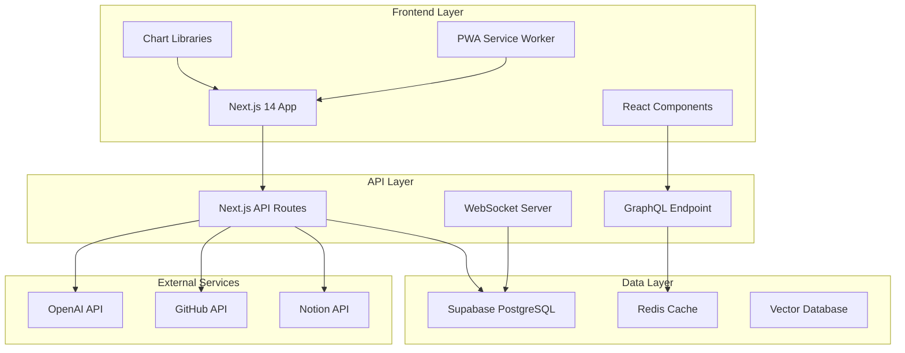

# Dashboard 기술 구현 가이드

> **작성일**: 2025년 7월 24일  
> **목적**: Dashboard 업그레이드를 위한 구체적인 기술 구현 방법 제시  
> **대상**: 개발팀 및 기술 의사결정자

## 🏗️ 아키텍처 설계

### 📐 시스템 아키텍처 개요



### 🔧 핵심 기술 스택 상세

| 기술 영역 | 현재 | 업그레이드 | 이유 |
|-----------|------|------------|------|
| **Frontend** | React 18 | Next.js 14 + TypeScript | SSR, 성능 최적화 |
| **UI 라이브러리** | 기본 CSS | Tailwind + shadcn/ui | 개발 속도, 일관성 |
| **차트** | 기본 | Chart.js + D3.js | 고급 시각화 |
| **상태 관리** | useState | Zustand + TanStack Query | 전역 상태, 캐싱 |
| **데이터베이스** | Supabase | Supabase + Redis | 현재 유지 + 캐싱 |

---

## 📊 고급 시각화 구현

### 🎨 차트 컴포넌트 아키텍처

```typescript
// types/dashboard.ts
export interface ChartConfig {
  type: 'line' | 'bar' | 'radar' | 'heatmap' | 'scatter';
  data: ChartData;
  options: ChartOptions;
  responsive: boolean;
  interactive: boolean;
}

export interface LearningMetrics {
  date: string;
  understanding_score: number;
  concentration_score: number;
  achievement_score: number;
  total_score: number;
  subjects: Record<string, number>;
}
```

### 📈 실시간 차트 업데이트 시스템

```typescript
// components/charts/RealtimeChart.tsx
'use client';

import { useEffect, useState } from 'react';
import { Line } from 'react-chartjs-2';
import { useSupabaseRealtime } from '@/hooks/useSupabaseRealtime';

export function RealtimeChart({ userId }: { userId: string }) {
  const [chartData, setChartData] = useState<ChartData>();
  
  // Supabase 실시간 구독
  const { data, isLoading } = useSupabaseRealtime(
    'daily_reflections',
    `user_id=eq.${userId}`,
    {
      onInsert: (payload) => {
        // 새 데이터 실시간 반영
        updateChartData(payload.new);
      },
      onUpdate: (payload) => {
        // 업데이트된 데이터 반영
        updateChartData(payload.new);
      }
    }
  );

  const chartOptions = {
    responsive: true,
    interaction: {
      mode: 'index' as const,
      intersect: false,
    },
    scales: {
      x: {
        display: true,
        title: {
          display: true,
          text: '날짜'
        }
      },
      y: {
        display: true,
        title: {
          display: true,
          text: '점수'
        },
        suggestedMin: 0,
        suggestedMax: 10
      }
    },
    plugins: {
      tooltip: {
        callbacks: {
          afterLabel: (context) => {
            // 커스텀 툴팁 정보
            return `총점: ${context.parsed.y}/30`;
          }
        }
      }
    }
  };

  return (
    <div className="w-full h-96 p-4">
      <Line data={chartData} options={chartOptions} />
    </div>
  );
}
```

### 🔥 히트맵 구현 (학습 패턴 시각화)

```typescript
// components/charts/LearningHeatmap.tsx
import { Calendar, momentLocalizer } from 'react-big-calendar';
import moment from 'moment';

const localizer = momentLocalizer(moment);

export function LearningHeatmap({ data }: { data: LearningMetrics[] }) {
  const events = data.map(item => ({
    title: `점수: ${item.total_score}`,
    start: new Date(item.date),
    end: new Date(item.date),
    resource: {
      score: item.total_score,
      color: getColorByScore(item.total_score)
    }
  }));

  const eventStyleGetter = (event: any) => {
    return {
      style: {
        backgroundColor: event.resource.color,
        borderRadius: '4px',
        opacity: 0.8,
        color: 'white',
        border: '0px',
        display: 'block'
      }
    };
  };

  return (
    <div className="h-96">
      <Calendar
        localizer={localizer}
        events={events}
        startAccessor="start"
        endAccessor="end"
        eventPropGetter={eventStyleGetter}
        views={['month']}
        defaultView="month"
      />
    </div>
  );
}

function getColorByScore(score: number): string {
  if (score >= 25) return '#4caf50'; // 높음
  if (score >= 20) return '#ff9800'; // 중간
  return '#f44336'; // 낮음
}
```

---

## 🤖 AI 인사이트 엔진

### 🧠 학습 패턴 분석 시스템

```typescript
// lib/ai/learningAnalyzer.ts
export class LearningAnalyzer {
  private openai: OpenAI;
  
  constructor() {
    this.openai = new OpenAI({
      apiKey: process.env.OPENAI_API_KEY,
    });
  }

  async analyzeLearningPattern(userId: string): Promise<LearningInsights> {
    // 최근 30일 데이터 수집
    const recentData = await this.getLearningData(userId, 30);
    
    // AI 분석 요청
    const analysis = await this.openai.chat.completions.create({
      model: "gpt-4",
      messages: [
        {
          role: "system",
          content: `당신은 학습 패턴 분석 전문가입니다. 
          제공된 학습 데이터를 바탕으로 다음을 분석해주세요:
          1. 학습 효율성이 높은 시간대
          2. 취약한 학습 영역
          3. 학습 동기 변화 추이
          4. 개선 권장사항`
        },
        {
          role: "user",
          content: JSON.stringify(recentData)
        }
      ],
      temperature: 0.3,
    });

    return this.parseAIResponse(analysis.choices[0].message.content);
  }

  async generatePersonalizedRecommendations(
    userId: string, 
    currentGoals: string[]
  ): Promise<Recommendation[]> {
    const insights = await this.analyzeLearningPattern(userId);
    
    return [
      {
        type: 'study_time',
        title: '최적 학습 시간',
        description: `${insights.optimalStudyTime}에 학습하면 집중도가 ${insights.concentrationImprovement}% 향상됩니다.`,
        priority: 'high',
        actionable: true
      },
      {
        type: 'weak_area',
        title: '집중 학습 영역',
        description: `${insights.weakAreas.join(', ')} 영역의 추가 학습을 권장합니다.`,
        priority: 'medium',
        actionable: true
      }
    ];
  }
}
```

### 📊 예측 모델링 구현

```typescript
// lib/ai/predictionModel.ts
export class LearningPredictionModel {
  async predictLearningOutcome(
    userId: string,
    targetDate: Date
  ): Promise<PredictionResult> {
    const historicalData = await this.getHistoricalData(userId);
    
    // 선형 회귀 모델 적용
    const model = this.trainLinearRegression(historicalData);
    
    const prediction = model.predict([
      this.extractFeatures(historicalData, targetDate)
    ]);

    return {
      predictedScore: prediction[0],
      confidence: this.calculateConfidence(model, historicalData),
      factors: this.identifyKeyFactors(model),
      recommendations: this.generateRecommendations(prediction[0])
    };
  }

  private trainLinearRegression(data: LearningMetrics[]): LinearRegressionModel {
    // TensorFlow.js 또는 ML5.js 사용
    const features = data.map(d => [
      d.understanding_score,
      d.concentration_score,
      this.getDayOfWeek(d.date),
      this.getTimeOfDay(d.date)
    ]);
    
    const labels = data.map(d => d.total_score);
    
    // 모델 훈련 로직
    return this.trainModel(features, labels);
  }
}
```

---

## 🎯 개인화 시스템

### 🎨 커스터마이징 가능한 대시보드

```typescript
// components/dashboard/CustomizableDashboard.tsx
'use client';

import { DragDropContext, Droppable, Draggable } from '@hello-pangea/dnd';
import { useState } from 'react';

interface DashboardWidget {
  id: string;
  type: 'chart' | 'metric' | 'insight' | 'goal';
  title: string;
  component: React.ComponentType<any>;
  size: 'small' | 'medium' | 'large';
  position: { x: number; y: number };
}

export function CustomizableDashboard({ userId }: { userId: string }) {
  const [widgets, setWidgets] = useState<DashboardWidget[]>([]);
  const [isEditMode, setIsEditMode] = useState(false);

  const handleDragEnd = (result: any) => {
    if (!result.destination) return;

    const newWidgets = Array.from(widgets);
    const [reorderedWidget] = newWidgets.splice(result.source.index, 1);
    newWidgets.splice(result.destination.index, 0, reorderedWidget);

    setWidgets(newWidgets);
    saveDashboardLayout(userId, newWidgets);
  };

  return (
    <div className="dashboard-container">
      <div className="dashboard-header">
        <h1>개인 대시보드</h1>
        <button 
          onClick={() => setIsEditMode(!isEditMode)}
          className="edit-btn"
        >
          {isEditMode ? '완료' : '편집'}
        </button>
      </div>

      <DragDropContext onDragEnd={handleDragEnd}>
        <Droppable droppableId="dashboard" direction="vertical">
          {(provided) => (
            <div 
              {...provided.droppableProps}
              ref={provided.innerRef}
              className="dashboard-grid"
            >
              {widgets.map((widget, index) => (
                <Draggable 
                  key={widget.id} 
                  draggableId={widget.id} 
                  index={index}
                  isDragDisabled={!isEditMode}
                >
                  {(provided) => (
                    <div
                      ref={provided.innerRef}
                      {...provided.draggableProps}
                      {...provided.dragHandleProps}
                      className={`widget widget-${widget.size}`}
                    >
                      <widget.component userId={userId} />
                    </div>
                  )}
                </Draggable>
              ))}
              {provided.placeholder}
            </div>
          )}
        </Droppable>
      </DragDropContext>
    </div>
  );
}
```

### 🎯 지능형 목표 설정 시스템

```typescript
// lib/goals/smartGoalSystem.ts
export class SmartGoalSystem {
  async suggestGoals(userId: string): Promise<Goal[]> {
    const userProfile = await this.getUserProfile(userId);
    const learningHistory = await this.getLearningHistory(userId);
    
    const suggestions = await this.analyzeAndSuggest(userProfile, learningHistory);
    
    return suggestions.map(suggestion => ({
      id: generateId(),
      title: suggestion.title,
      description: suggestion.description,
      type: suggestion.type,
      targetValue: suggestion.targetValue,
      currentValue: 0,
      deadline: suggestion.deadline,
      milestones: this.generateMilestones(suggestion),
      difficulty: suggestion.difficulty,
      personalizedReason: suggestion.reason
    }));
  }

  async trackGoalProgress(goalId: string): Promise<GoalProgress> {
    const goal = await this.getGoal(goalId);
    const currentData = await this.getCurrentUserData(goal.userId);
    
    const progress = this.calculateProgress(goal, currentData);
    
    // 목표 달성도에 따른 동기부여 메시지
    const motivationMessage = this.generateMotivationMessage(progress);
    
    return {
      goalId,
      percentage: progress.percentage,
      remainingTime: progress.remainingTime,
      onTrack: progress.onTrack,
      motivationMessage,
      nextMilestone: progress.nextMilestone,
      recommendations: progress.recommendations
    };
  }
}
```

---

## 🔄 실시간 데이터 동기화

### ⚡ WebSocket 기반 실시간 업데이트

```typescript
// lib/realtime/websocketManager.ts
export class WebSocketManager {
  private ws: WebSocket | null = null;
  private reconnectAttempts = 0;
  private maxReconnectAttempts = 5;

  connect(userId: string) {
    this.ws = new WebSocket(`${process.env.NEXT_PUBLIC_WS_URL}?userId=${userId}`);

    this.ws.onopen = () => {
      console.log('WebSocket 연결 성공');
      this.reconnectAttempts = 0;
    };

    this.ws.onmessage = (event) => {
      const data = JSON.parse(event.data);
      this.handleRealtimeUpdate(data);
    };

    this.ws.onclose = () => {
      console.log('WebSocket 연결 종료');
      this.attemptReconnect(userId);
    };

    this.ws.onerror = (error) => {
      console.error('WebSocket 오류:', error);
    };
  }

  private handleRealtimeUpdate(data: RealtimeUpdate) {
    switch (data.type) {
      case 'LEARNING_DATA_UPDATE':
        this.notifySubscribers('learning_update', data.payload);
        break;
      case 'GOAL_PROGRESS_UPDATE':
        this.notifySubscribers('goal_update', data.payload);
        break;
      case 'INSIGHT_GENERATED':
        this.notifySubscribers('insight_update', data.payload);
        break;
    }
  }

  subscribe(event: string, callback: (data: any) => void) {
    // 이벤트 구독 로직
  }
}
```

### 🔄 Supabase 실시간 구독 훅

```typescript
// hooks/useSupabaseRealtime.ts
import { useEffect, useState } from 'react';
import { supabase } from '@/lib/supabase';

export function useSupabaseRealtime<T>(
  table: string,
  filter?: string,
  callbacks?: {
    onInsert?: (payload: any) => void;
    onUpdate?: (payload: any) => void;
    onDelete?: (payload: any) => void;
  }
) {
  const [data, setData] = useState<T[]>([]);
  const [isLoading, setIsLoading] = useState(true);

  useEffect(() => {
    // 초기 데이터 로드
    const loadInitialData = async () => {
      let query = supabase.from(table).select('*');
      
      if (filter) {
        query = query.filter(...filter.split('='));
      }
      
      const { data: initialData, error } = await query;
      
      if (!error && initialData) {
        setData(initialData);
      }
      
      setIsLoading(false);
    };

    loadInitialData();

    // 실시간 구독 설정
    const subscription = supabase
      .channel(`${table}_changes`)
      .on(
        'postgres_changes',
        {
          event: '*',
          schema: 'public',
          table: table,
          filter: filter
        },
        (payload) => {
          switch (payload.eventType) {
            case 'INSERT':
              setData(prev => [...prev, payload.new as T]);
              callbacks?.onInsert?.(payload);
              break;
            case 'UPDATE':
              setData(prev => 
                prev.map(item => 
                  (item as any).id === payload.new.id ? payload.new as T : item
                )
              );
              callbacks?.onUpdate?.(payload);
              break;
            case 'DELETE':
              setData(prev => 
                prev.filter(item => (item as any).id !== payload.old.id)
              );
              callbacks?.onDelete?.(payload);
              break;
          }
        }
      )
      .subscribe();

    return () => {
      subscription.unsubscribe();
    };
  }, [table, filter]);

  return { data, isLoading };
}
```

---

## 📱 PWA 및 모바일 최적화

### 📲 Progressive Web App 설정

```typescript
// next.config.js
const withPWA = require('next-pwa')({
  dest: 'public',
  register: true,
  skipWaiting: true,
  runtimeCaching: [
    {
      urlPattern: /^https:\/\/api\./i,
      handler: 'NetworkFirst',
      options: {
        cacheName: 'api-cache',
        expiration: {
          maxEntries: 32,
          maxAgeSeconds: 24 * 60 * 60 // 24 hours
        }
      }
    }
  ]
});

module.exports = withPWA({
  // Next.js config
});
```

### 📱 반응형 차트 컴포넌트

```typescript
// components/charts/ResponsiveChart.tsx
import { useEffect, useState } from 'react';

export function ResponsiveChart({ data, type }: ChartProps) {
  const [dimensions, setDimensions] = useState({ width: 0, height: 0 });
  const [isMobile, setIsMobile] = useState(false);

  useEffect(() => {
    const updateDimensions = () => {
      setDimensions({
        width: window.innerWidth,
        height: window.innerHeight
      });
      setIsMobile(window.innerWidth < 768);
    };

    updateDimensions();
    window.addEventListener('resize', updateDimensions);

    return () => window.removeEventListener('resize', updateDimensions);
  }, []);

  const chartOptions = {
    ...baseChartOptions,
    responsive: true,
    maintainAspectRatio: false,
    plugins: {
      ...baseChartOptions.plugins,
      legend: {
        display: !isMobile, // 모바일에서는 범례 숨김
        position: isMobile ? 'bottom' : 'top'
      }
    },
    scales: {
      x: {
        ticks: {
          maxTicksLimit: isMobile ? 5 : 10 // 모바일에서 틱 수 제한
        }
      }
    }
  };

  return (
    <div className={`chart-container ${isMobile ? 'mobile' : 'desktop'}`}>
      <Chart data={data} options={chartOptions} type={type} />
    </div>
  );
}
```

---

## 🚀 성능 최적화

### ⚡ 코드 분할 및 지연 로딩

```typescript
// components/dashboard/LazyLoadedComponents.tsx
import dynamic from 'next/dynamic';
import { Suspense } from 'react';

// 차트 컴포넌트 지연 로딩
const AdvancedChart = dynamic(() => import('./AdvancedChart'), {
  loading: () => <ChartSkeleton />,
  ssr: false
});

// AI 인사이트 컴포넌트 지연 로딩
const AIInsights = dynamic(() => import('./AIInsights'), {
  loading: () => <InsightSkeleton />
});

export function Dashboard() {
  return (
    <div className="dashboard">
      <Suspense fallback={<DashboardSkeleton />}>
        <div className="chart-section">
          <AdvancedChart />
        </div>
        <div className="insights-section">
          <AIInsights />
        </div>
      </Suspense>
    </div>
  );
}
```

### 🔄 데이터 캐싱 전략

```typescript
// lib/cache/cacheManager.ts
export class CacheManager {
  private redis: Redis;
  
  constructor() {
    this.redis = new Redis(process.env.REDIS_URL);
  }

  async cacheUserData(userId: string, data: any, ttl: number = 3600) {
    const key = `user:${userId}:data`;
    await this.redis.setex(key, ttl, JSON.stringify(data));
  }

  async getCachedUserData(userId: string): Promise<any | null> {
    const key = `user:${userId}:data`;
    const cached = await this.redis.get(key);
    return cached ? JSON.parse(cached) : null;
  }

  async invalidateUserCache(userId: string) {
    const pattern = `user:${userId}:*`;
    const keys = await this.redis.keys(pattern);
    if (keys.length > 0) {
      await this.redis.del(...keys);
    }
  }
}
```

---

## 🛡️ 보안 및 데이터 프라이버시

### 🔐 데이터 암호화

```typescript
// lib/security/encryption.ts
import crypto from 'crypto';

export class DataEncryption {
  private algorithm = 'aes-256-gcm';
  private secretKey = process.env.ENCRYPTION_KEY;

  encrypt(text: string): { encrypted: string; iv: string; authTag: string } {
    const iv = crypto.randomBytes(16);
    const cipher = crypto.createCipher(this.algorithm, this.secretKey);
    cipher.setAAD(Buffer.from('dashboard', 'utf8'));
    
    let encrypted = cipher.update(text, 'utf8', 'hex');
    encrypted += cipher.final('hex');
    
    const authTag = cipher.getAuthTag();
    
    return {
      encrypted,
      iv: iv.toString('hex'),
      authTag: authTag.toString('hex')
    };
  }

  decrypt(encryptedData: { encrypted: string; iv: string; authTag: string }): string {
    const decipher = crypto.createDecipher(this.algorithm, this.secretKey);
    decipher.setAAD(Buffer.from('dashboard', 'utf8'));
    decipher.setAuthTag(Buffer.from(encryptedData.authTag, 'hex'));
    
    let decrypted = decipher.update(encryptedData.encrypted, 'hex', 'utf8');
    decrypted += decipher.final('utf8');
    
    return decrypted;
  }
}
```

### 🛡️ API 보안

```typescript
// middleware/auth.ts
import { NextRequest, NextResponse } from 'next/server';
import jwt from 'jsonwebtoken';

export async function authMiddleware(request: NextRequest) {
  const token = request.headers.get('authorization')?.replace('Bearer ', '');
  
  if (!token) {
    return NextResponse.json({ error: 'Unauthorized' }, { status: 401 });
  }

  try {
    const decoded = jwt.verify(token, process.env.JWT_SECRET!) as any;
    
    // Rate limiting
    const rateLimitKey = `rate_limit:${decoded.userId}`;
    const requestCount = await redis.incr(rateLimitKey);
    
    if (requestCount === 1) {
      await redis.expire(rateLimitKey, 60); // 1분 윈도우
    }
    
    if (requestCount > 100) { // 분당 100회 제한
      return NextResponse.json({ error: 'Rate limit exceeded' }, { status: 429 });
    }
    
    // 사용자 정보를 헤더에 추가
    const response = NextResponse.next();
    response.headers.set('x-user-id', decoded.userId);
    
    return response;
  } catch (error) {
    return NextResponse.json({ error: 'Invalid token' }, { status: 401 });
  }
}
```

---

## 📈 모니터링 및 분석

### 📊 사용자 행동 분석

```typescript
// lib/analytics/userTracking.ts
export class UserAnalytics {
  private mixpanel: Mixpanel;
  
  constructor() {
    this.mixpanel = require('mixpanel').init(process.env.MIXPANEL_TOKEN);
  }

  trackEvent(userId: string, event: string, properties: Record<string, any>) {
    this.mixpanel.track(event, {
      distinct_id: userId,
      ...properties,
      timestamp: new Date().toISOString()
    });
  }

  trackPageView(userId: string, page: string, duration?: number) {
    this.trackEvent(userId, 'Page View', {
      page,
      duration,
      user_agent: navigator.userAgent,
      screen_resolution: `${screen.width}x${screen.height}`
    });
  }

  trackFeatureUsage(userId: string, feature: string, action: string) {
    this.trackEvent(userId, 'Feature Usage', {
      feature,
      action,
      session_id: this.getSessionId()
    });
  }

  async generateUsageReport(userId: string): Promise<UsageReport> {
    // Mixpanel API를 통한 사용자 행동 분석
    const events = await this.mixpanel.query({
      event: ['Page View', 'Feature Usage'],
      where: `properties["distinct_id"] == "${userId}"`,
      from_date: '2025-07-01',
      to_date: '2025-07-31'
    });

    return {
      totalSessions: events.length,
      averageSessionDuration: this.calculateAverageSessionDuration(events),
      mostUsedFeatures: this.identifyMostUsedFeatures(events),
      usagePattern: this.analyzeUsagePattern(events)
    };
  }
}
```

### 🚨 에러 모니터링

```typescript
// lib/monitoring/errorTracking.ts
export class ErrorTracker {
  static captureException(error: Error, context?: Record<string, any>) {
    // Sentry 또는 다른 에러 추적 서비스 사용
    console.error('Dashboard Error:', error);
    
    // 에러 데이터베이스에 로깅
    this.logError({
      message: error.message,
      stack: error.stack,
      timestamp: new Date().toISOString(),
      context,
      userId: context?.userId,
      userAgent: navigator.userAgent
    });
  }

  static async logError(errorData: ErrorLogData) {
    try {
      await supabase.from('error_logs').insert(errorData);
    } catch (loggingError) {
      console.error('Failed to log error:', loggingError);
    }
  }
}
```

---

## 🚀 배포 및 DevOps

### 🐳 Docker 컨테이너화

```dockerfile
# Dockerfile
FROM node:18-alpine AS base

WORKDIR /app
COPY package*.json ./
RUN npm ci --only=production

FROM node:18-alpine AS build
WORKDIR /app
COPY package*.json ./
RUN npm ci
COPY . .
RUN npm run build

FROM base AS runtime
COPY --from=build /app/.next ./.next
COPY --from=build /app/public ./public

EXPOSE 3000
CMD ["npm", "start"]
```

### 🔄 CI/CD 파이프라인

```yaml
# .github/workflows/deploy.yml
name: Deploy Dashboard

on:
  push:
    branches: [main]

jobs:
  test:
    runs-on: ubuntu-latest
    steps:
      - uses: actions/checkout@v3
      - uses: actions/setup-node@v3
        with:
          node-version: 18
      - run: npm ci
      - run: npm run test
      - run: npm run lint
      - run: npm run type-check

  build-and-deploy:
    needs: test
    runs-on: ubuntu-latest
    steps:
      - uses: actions/checkout@v3
      - uses: actions/setup-node@v3
        with:
          node-version: 18
      - run: npm ci
      - run: npm run build
      - uses: vercel/action@v1
        with:
          vercel-token: ${{ secrets.VERCEL_TOKEN }}
          vercel-org-id: ${{ secrets.VERCEL_ORG_ID }}
          vercel-project-id: ${{ secrets.VERCEL_PROJECT_ID }}
```

---

이 기술 구현 가이드는 Dashboard 업그레이드를 위한 구체적인 코드 예시와 아키텍처를 제공합니다. 각 섹션은 실제 구현 가능한 코드와 함께 모범 사례를 포함하고 있어, 개발팀이 바로 적용할 수 있도록 구성되었습니다.

**다음 단계로 어떤 부분을 더 자세히 다루고 싶으신가요?**
