# Dashboard 기능 업그레이드 로드맵 분석

> **작성일**: 2025년 7월 24일  
> **목적**: LG DX School 대시보드의 체계적인 기능 향상 방안 제시  
> **범위**: 현재 상태 분석부터 미래 비전까지의 종합적 로드맵

## 📊 현재 대시보드 상태 분석

### 🎯 기존 기능 현황

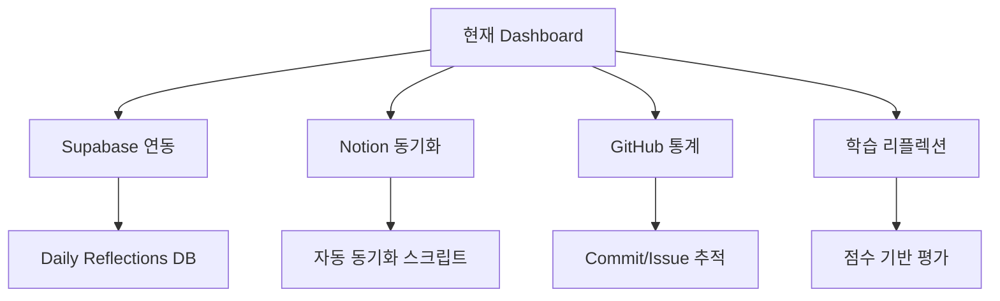

### ⚡ 현재 강점

1. **데이터 통합**: Supabase-Notion-GitHub 삼중 연동 구조
2. **자동화**: MCP 도구를 활용한 실시간 데이터 동기화
3. **사용자 경험**: 직관적인 리플렉션 입력 시스템
4. **시각화**: Tableau 연동을 통한 데이터 분석 기능

### 🚨 현재 한계점

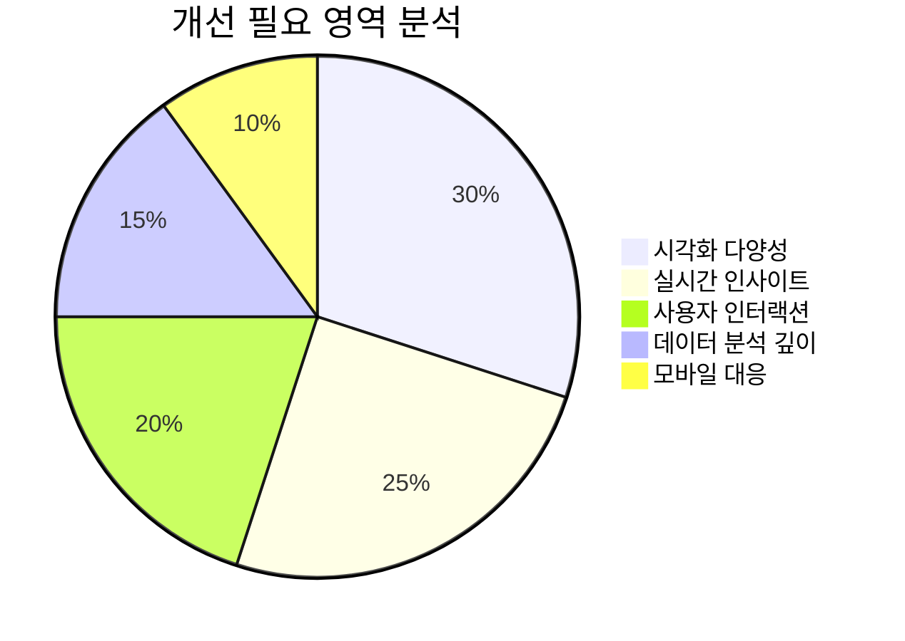

---

## 🚀 1단계: 핵심 기능 강화 (Phase 1)

### 📈 고급 시각화 구현

#### 1.1 동적 차트 라이브러리 도입

**추천 기술 스택:**
- **Chart.js** 또는 **D3.js**: 인터랙티브 차트
- **Recharts**: React 기반 반응형 차트
- **ApexCharts**: 모던한 차트 라이브러리

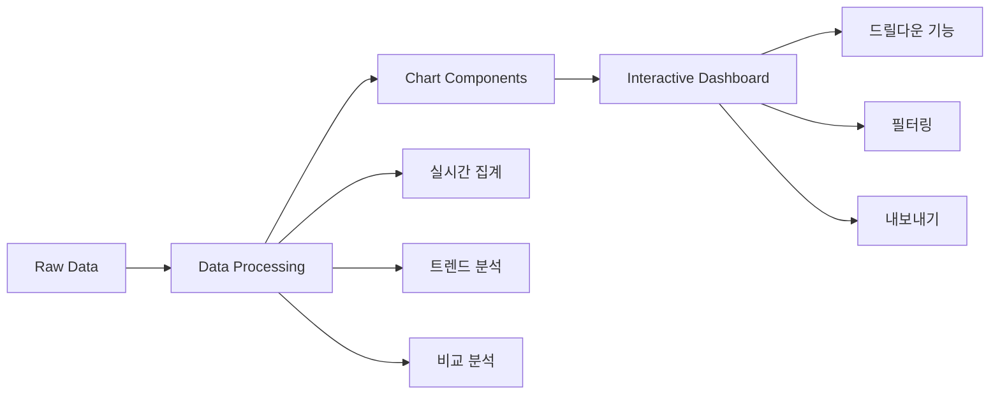

#### 1.2 필수 차트 유형 구현

| 차트 유형 | 용도 | 우선순위 |
|-----------|------|----------|
| **라인 차트** | 학습 진도 트렌드 추적 | 🔥 High |
| **히트맵** | 일별/시간대별 학습 패턴 | 🔥 High |
| **레이더 차트** | 역량별 성취도 분석 | ⭐ Medium |
| **산점도** | 이해도-집중도 상관관계 | ⭐ Medium |
| **간트 차트** | 학습 목표 달성 현황 | 💡 Low |

### 🔍 실시간 인사이트 엔진

#### 1.3 AI 기반 학습 패턴 분석

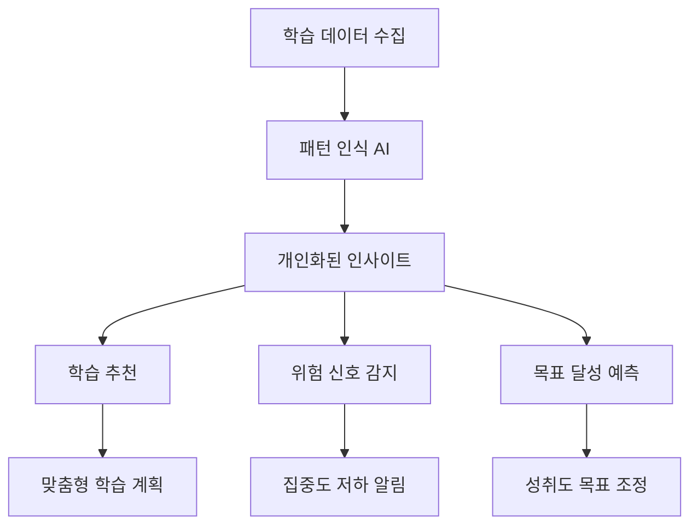

**구현 기능:**
1. **학습 효율성 지표**: 시간대별 최적 학습 시간 추천
2. **취약점 분석**: 반복적으로 어려워하는 주제 식별
3. **동기부여 알고리즘**: 성취감 향상을 위한 마일스톤 제안

---

## 🎨 2단계: 사용자 경험 혁신 (Phase 2)

### 🎪 인터랙티브 대시보드 구현

#### 2.1 반응형 레이아웃 시스템

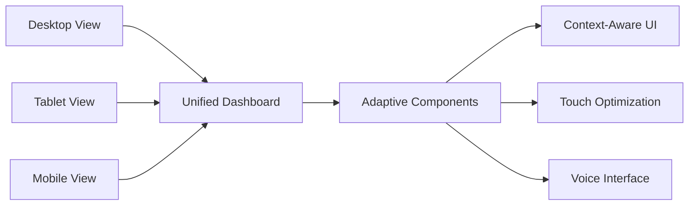

#### 2.2 개인화 기능 강화

| 기능 영역 | 설명 | 기술 구현 |
|-----------|------|-----------|
| **커스텀 위젯** | 사용자 정의 대시보드 레이아웃 | Drag & Drop API |
| **테마 시스템** | 다크/라이트 모드, 색상 커스터마이징 | CSS Variables + localStorage |
| **알림 센터** | 맞춤형 학습 리마인더 | Web Push API |
| **목표 설정** | SMART 목표 관리 시스템 | Goal Tracking Algorithm |

### 🤖 지능형 분석 기능

#### 2.3 고급 분석 대시보드

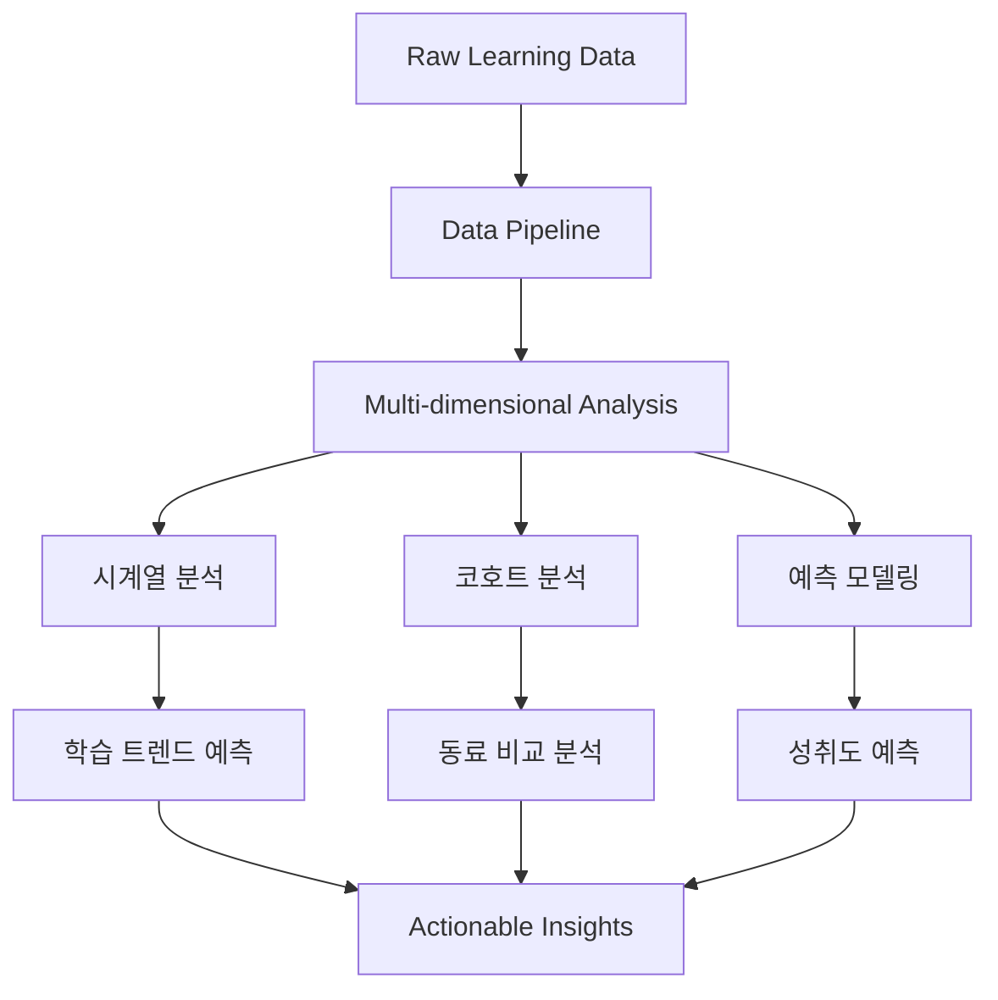

---

## 🌟 3단계: 차세대 기능 (Phase 3)

### 🧠 AI 학습 어시스턴트

#### 3.1 개인 맞춤형 학습 코치

**핵심 기능:**
1. **적응형 학습 경로**: 개인의 학습 스타일에 맞춘 커리큘럼 추천
2. **실시간 질의응답**: 학습 중 궁금한 점 즉시 해결
3. **감정 인식**: 학습 상태에 따른 동기부여 메시지 제공
4. **진로 가이드**: 학습 성향 기반 커리어 로드맵 제시

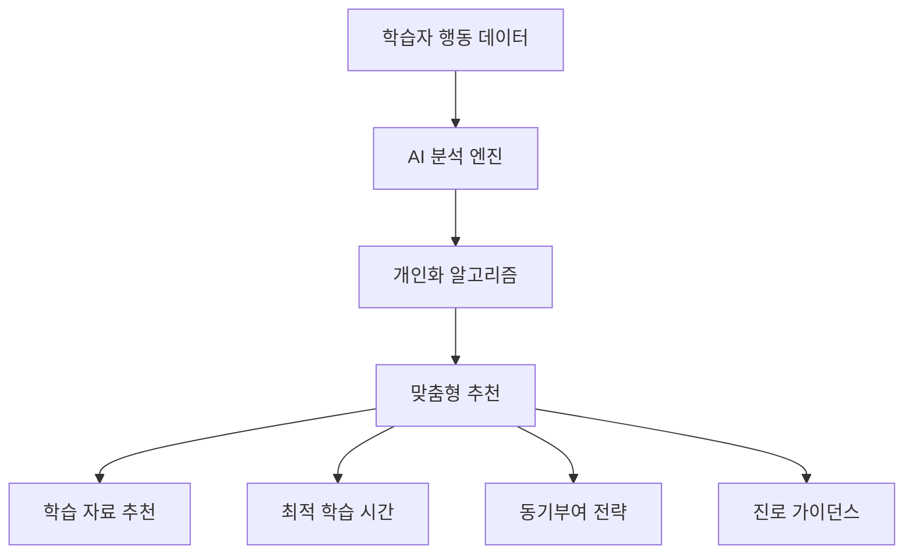

### 🌐 소셜 학습 플랫폼

#### 3.2 협업 학습 생태계

| 기능 | 설명 | 예상 효과 |
|------|------|-----------|
| **스터디 그룹** | 관심사 기반 학습 커뮤니티 형성 | 학습 동기 향상 |
| **멘토링 매칭** | AI 기반 멘토-멘티 연결 | 학습 효율성 증대 |
| **경쟁 시스템** | 건전한 경쟁을 통한 동기부여 | 참여도 향상 |
| **지식 공유** | 학습 노트 및 팁 공유 플랫폼 | 집단 지성 활용 |

---

## 📋 구현 우선순위 매트릭스

### 🎯 Impact vs Effort 분석

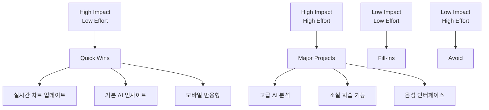

### 📅 타임라인 로드맵

| Phase | 기간 | 주요 기능 | 예상 리소스 |
|-------|------|-----------|-------------|
| **Phase 1** | 2-3개월 | 고급 시각화, 실시간 분석 | Frontend 개발자 2명 |
| **Phase 2** | 3-4개월 | UX/UI 혁신, 개인화 기능 | Full-stack 개발자 3명 |
| **Phase 3** | 6-8개월 | AI 어시스턴트, 소셜 기능 | AI 엔지니어 + 팀 확장 |

---

## 🛠️ 기술 스택 추천

### 💻 Frontend 기술

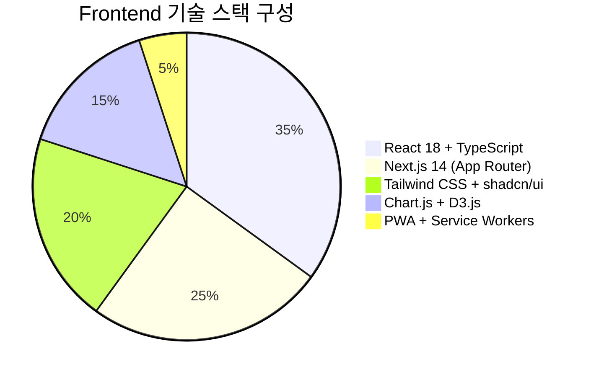

### 🔧 Backend & Infrastructure

| 기술 영역 | 추천 기술 | 이유 |
|-----------|-----------|------|
| **데이터베이스** | Supabase + Redis Cache | 현재 스택 활용 + 성능 향상 |
| **AI/ML** | OpenAI API + LangChain | 빠른 프로토타이핑 가능 |
| **실시간 통신** | WebSocket + Server-Sent Events | 실시간 업데이트 지원 |
| **배포/운영** | Vercel + Docker | 간편한 배포 + 확장성 |

### 🔍 모니터링 & 분석

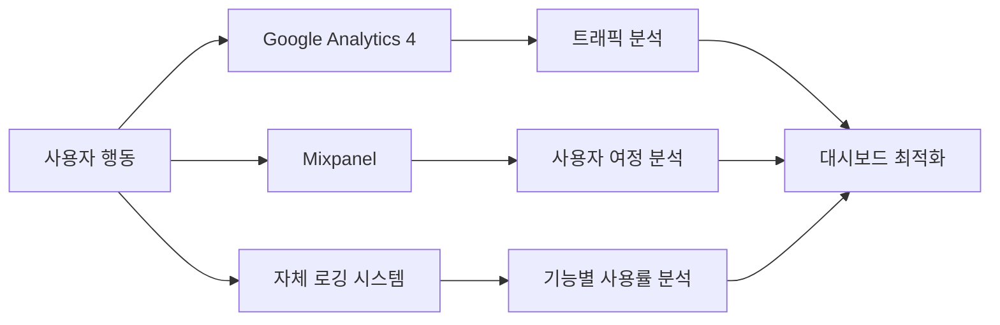

---

## 📊 예상 성과 지표

### 🎯 핵심 성과 지표 (KPI)

| 지표 카테고리 | 측정 항목 | 목표치 | 현재 상태 |
|---------------|-----------|--------|-----------|
| **사용자 참여도** | 일일 활성 사용자 | +150% | Baseline |
| **학습 효과** | 학습 목표 달성률 | +80% | 측정 필요 |
| **시스템 성능** | 페이지 로딩 시간 | <2초 | 측정 필요 |
| **사용자 만족도** | NPS 점수 | 70+ | 조사 필요 |

### 📈 ROI 예측 분석

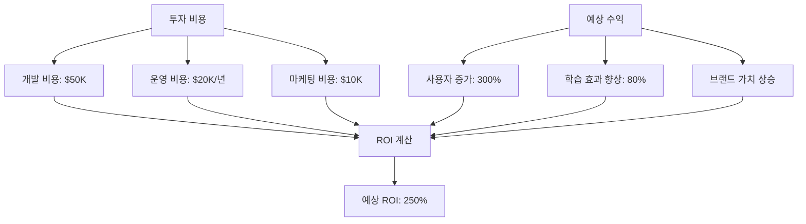

---

## 🚧 리스크 분석 및 대응 방안

### ⚠️ 주요 리스크 요소

| 리스크 | 발생 확률 | 영향도 | 대응 방안 |
|--------|-----------|--------|-----------|
| **기술적 복잡성** | High | Medium | 단계적 구현, MVP 접근 |
| **사용자 수용성** | Medium | High | 사용자 피드백 루프 강화 |
| **데이터 프라이버시** | Low | High | GDPR 준수, 투명한 정책 |
| **경쟁자 등장** | Medium | Medium | 차별화된 AI 기능 집중 |

### 🛡️ 위험 완화 전략

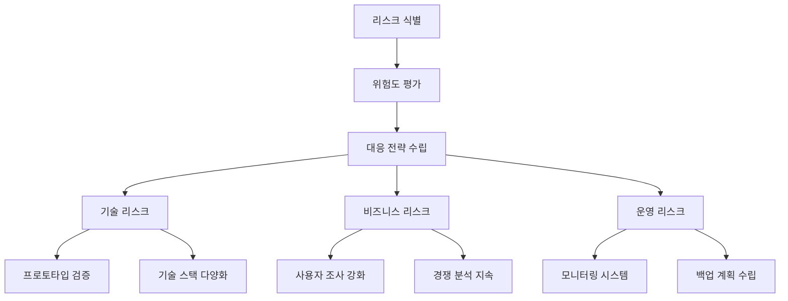

---

## 🎯 결론 및 다음 단계

### 💡 핵심 추천사항

1. **단계적 접근**: Phase 1부터 체계적으로 구현하여 리스크 최소화
2. **사용자 중심**: 모든 기능 개발 시 사용자 피드백을 최우선으로 고려
3. **데이터 기반**: 분석 결과를 바탕으로 한 지속적인 개선
4. **미래 대비**: AI 기술 발전을 고려한 확장 가능한 아키텍처 구축

### 🚀 즉시 시작 가능한 액션 아이템

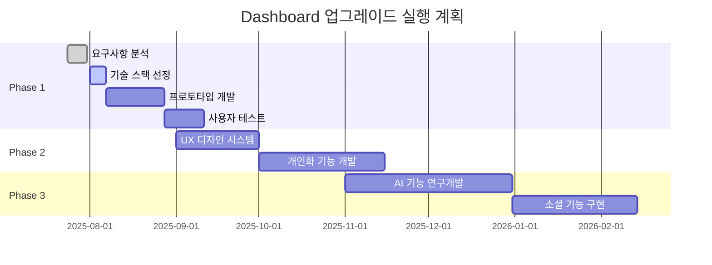

### 🏁 성공을 위한 핵심 요소

1. **팀 역량 강화**: 최신 기술 스택에 대한 지속적인 학습
2. **사용자 커뮤니티**: 활발한 피드백 수집 및 반영 체계
3. **기술 파트너십**: AI, 클라우드 서비스 업체와의 협력
4. **지속적 혁신**: 교육 기술 트렌드에 대한 지속적인 모니터링

---

*이 로드맵은 현재 대시보드의 강점을 활용하면서도 미래 지향적인 기능을 체계적으로 도입하여, 차세대 학습 플랫폼으로 발전시키기 위한 종합적인 계획입니다. 단계별 구현을 통해 안정적이면서도 혁신적인 발전을 도모할 수 있을 것입니다.*

**📧 Contact**: 추가 문의사항이나 세부 구현 계획이 필요하시면 언제든 말씀해 주세요!
