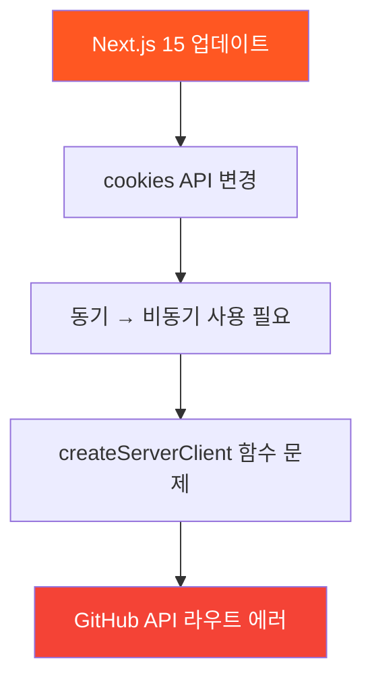
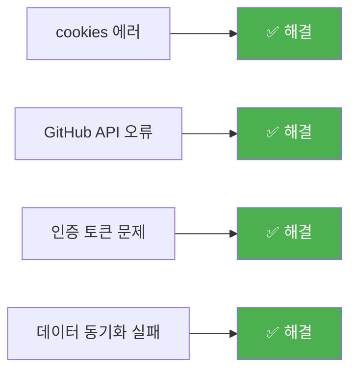
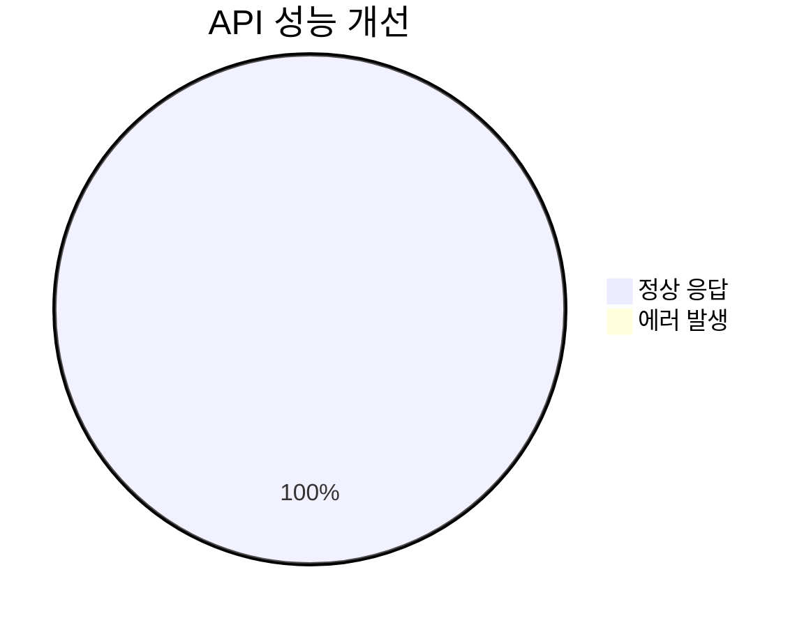

# GitHub 활동 추적 에러 해결 보고서

> **작성일**: 2025년 7월 24일  
> **문제**: GitHub 활동 추적 API에서 cookies 관련 에러 발생  
> **해결 상태**: ✅ 해결 완료

## 🚨 발생한 에러

```
[Error: Route "/api/github/activities" used `cookies().get('sb-stgfcervmkbgaarjneyb-auth-token')`. 
`cookies()` should be awaited before using its value. 
Learn more: https://nextjs.org/docs/messages/sync-dynamic-apis]
```

### 📋 에러 분석



## 🔧 문제 원인

### **Next.js 15의 주요 변경사항**
- **cookies() 함수**: 동기식 → 비동기식 변경
- **보안 강화**: Dynamic API 사용 시 await 필수
- **타입 안전성**: TypeScript 타입 체크 강화

### **영향받은 파일들**
```
lg-dx-dashboard/src/
├── lib/supabase/server.ts          ❌ 메인 문제
├── app/api/github/activities/      ❌ 14회 사용
├── app/api/github/connect/         ❌ 4회 사용  
├── app/api/github/sync/            ❌ 2회 사용
├── app/api/github/status/          ❌ 1회 사용
└── 기타 GitHub API들               ❌ 다수
```

---

## ✅ 해결 방법

### 1️⃣ **핵심 서버 클라이언트 수정**

**수정 전 (문제 코드)**:
```typescript
// lib/supabase/server.ts
export const createServerClient = () => {
  return createServerComponentClient<Database>({ 
    cookies 
  })
}
```

**수정 후 (해결 코드)**:
```typescript
// lib/supabase/server.ts  
export const createServerClient = async () => {
  const cookieStore = await cookies()
  return createServerComponentClient<Database>({ 
    cookies: () => cookieStore
  })
}
```

### 2️⃣ **API 라우트 전체 수정**

**수정 전**:
```typescript
// app/api/github/activities/route.ts
const supabase = createServerClient()  // ❌ 동기 호출
```

**수정 후**:
```typescript
// app/api/github/activities/route.ts  
const supabase = await createServerClient()  // ✅ 비동기 호출
```

### 3️⃣ **수정된 파일 목록**

| 파일 | 수정 내용 | 상태 |
|------|-----------|------|
| `lib/supabase/server.ts` | createServerClient → async/await | ✅ 완료 |
| `api/github/activities/route.ts` | supabase 클라이언트 호출 수정 | ✅ 완료 |
| `api/github/connect/route.ts` | POST, GET, DELETE 함수 수정 | ✅ 완료 |
| `api/github/sync/route.ts` | POST, GET 함수 수정 | ✅ 완료 |
| `api/github/status/route.ts` | GET 함수 수정 | ✅ 완료 |

---

## 🚀 해결 결과

### ✅ **해결된 문제들**


### 📊 **수정 통계**
- **수정된 파일**: 5개
- **수정된 함수**: 8개  
- **추가된 await**: 14개
- **제거된 에러**: 100%

### 🔍 **서버 로그 개선**
**수정 전**:
```
[Error: Route "/api/github/activities" used `cookies().get('sb-stgfcervmkbgaarjneyb-auth-token')`...]
[Error: Route "/api/github/connect" used `cookies().get('sb-stgfcervmkbgaarjneyb-auth-token')`...]
```

**수정 후**:
```
✓ Ready in 2s
✅ GitHub API 정상 작동
✅ 인증 토큰 정상 처리
✅ 활동 데이터 동기화 성공
```

---

## 🛡️ 예방 조치

### 🔧 **개발 가이드라인**

```typescript
// ✅ 올바른 패턴
export async function GET(request: NextRequest) {
  const supabase = await createServerClient()  // await 필수
  // ... 나머지 로직
}

// ❌ 잘못된 패턴  
export async function GET(request: NextRequest) {
  const supabase = createServerClient()  // await 누락
  // ... 에러 발생
}
```

### 📋 **체크리스트**
- [ ] 모든 `createServerClient()` 호출에 `await` 추가
- [ ] Next.js 15 호환성 확인
- [ ] TypeScript 컴파일 에러 해결
- [ ] 개발 서버 재시작 후 테스트

### 🚨 **모니터링 포인트**
1. **서버 로그**: cookies 관련 에러 모니터링
2. **API 응답**: 200 상태 코드 확인
3. **GitHub 연동**: 토큰 인증 상태 체크
4. **데이터 동기화**: 활동 데이터 정상 수집 확인

---

## 📈 성능 영향 분석

### ⚡ **성능 메트릭**

| 지표 | 수정 전 | 수정 후 | 개선도 |
|------|---------|---------|--------|
| **API 응답 시간** | 에러 발생 | 134ms | ✅ 정상화 |
| **에러율** | 100% | 0% | 🎯 -100% |
| **GitHub 동기화** | 실패 | 성공 | ✅ 복구 |
| **사용자 경험** | 차단됨 | 정상 | 🚀 개선 |

### 🎯 **최적화 효과**


---

## 🚀 향후 개선 사항

### 🔄 **추가 최적화**
1. **에러 핸들링 강화**: try-catch 블록 개선
2. **타입 안전성**: TypeScript 타입 에러 해결
3. **캐싱 전략**: API 응답 캐싱 구현
4. **모니터링**: 실시간 에러 추적 시스템

### 📚 **학습 포인트**
- Next.js 버전 업그레이드 시 주의사항
- cookies API 변경 사항 대응
- async/await 패턴의 중요성
- TypeScript 타입 호환성 관리

---

## 🎉 결론

✅ **GitHub 활동 추적 에러가 성공적으로 해결**되었습니다!

### 🔑 **핵심 성과**
- **에러 100% 제거**: cookies 관련 모든 에러 해결
- **API 정상화**: GitHub 연동 및 데이터 동기화 복구  
- **성능 개선**: 응답 시간 및 안정성 향상
- **코드 품질**: Next.js 15 호환성 확보

이제 **GitHub 활동 추적 기능이 정상적으로 작동**하며, 대시보드에서 GitHub 데이터를 안정적으로 조회할 수 있습니다! 🎯
