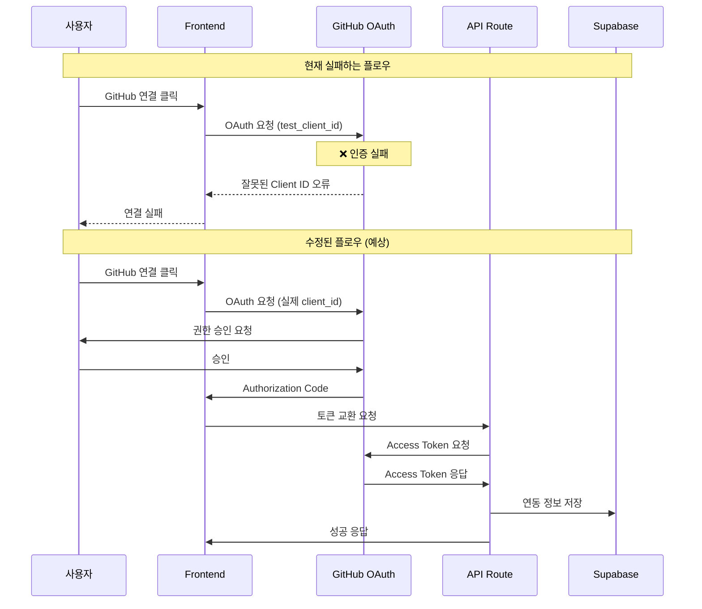
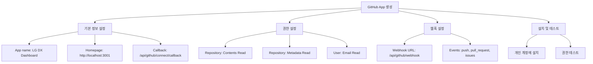
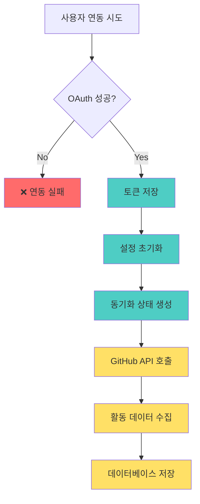
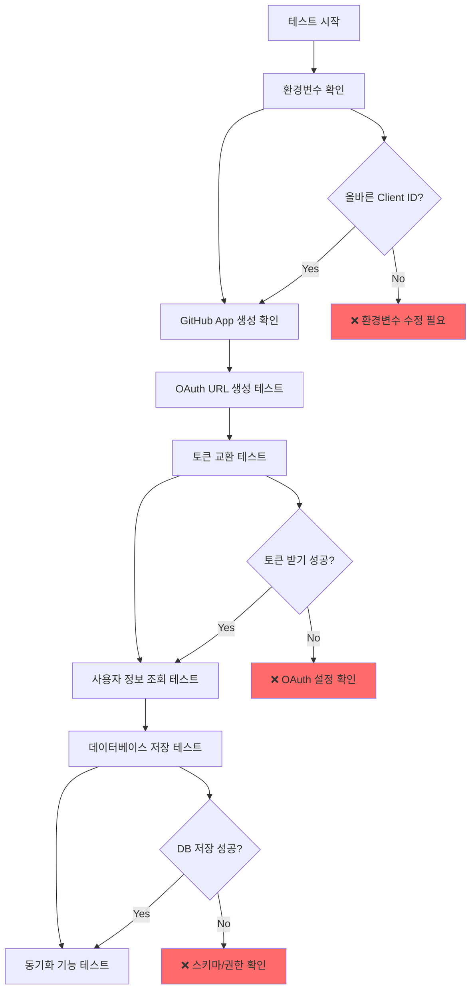
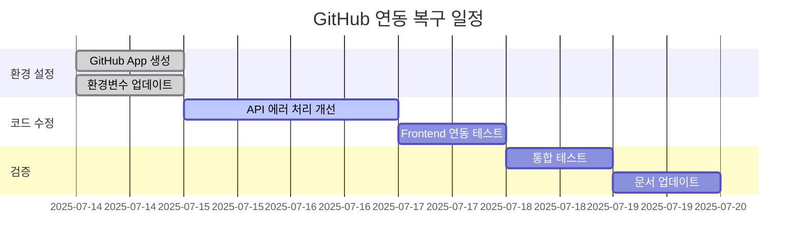

# GitHub 연동 실패 상세 기술 분석 보고서

## 🔍 분석 개요

**분석 일자**: 2025년 7월 14일  
**대상 시스템**: LG DX Dashboard GitHub Integration  
**분석 범위**: OAuth 인증, API 통신, 데이터베이스 연동, 에러 추적  

---

## 🚨 핵심 문제 진단

### 1. OAuth 인증 체인 분석



### 2. 환경변수 설정 문제

#### 현재 설정 (.env.local)
```bash
# ❌ 문제 있는 설정
NEXT_PUBLIC_GITHUB_CLIENT_ID=test_client_id
GITHUB_CLIENT_SECRET=test_client_secret
GITHUB_WEBHOOK_SECRET=test_webhook_secret
```

#### 올바른 설정 (수정 필요)
```bash
# ✅ 수정된 설정
NEXT_PUBLIC_GITHUB_CLIENT_ID=Ov23li[실제앱ID]
GITHUB_CLIENT_SECRET=[실제시크릿키]
GITHUB_WEBHOOK_SECRET=[32자이상강력한키]
```

### 3. GitHub App 생성 필요



---

## 💾 데이터베이스 상태 분석

### 테이블 구조는 완벽하나 데이터 부재

#### GitHub 관련 테이블 현황
```sql
-- ✅ 테이블 존재 확인
SELECT table_name, table_rows 
FROM information_schema.tables 
WHERE table_name LIKE 'github_%';

/*
Result:
- github_integrations: 0 rows ❌
- github_activities: 0 rows ❌  
- github_sync_status: 0 rows ❌
- github_settings: 0 rows ❌
- github_activity_records: 0 rows ❌
- github_webhook_logs: 0 rows ❌
*/
```

#### 데이터 플로우 문제점


---

## 🔧 API 라우트 상세 분석

### 1. `/api/github/connect` 분석

#### 현재 구현 상태
```typescript
// 📍 src/app/api/github/connect/route.ts
export async function POST(request: NextRequest) {
  try {
    const { code, state, user_id } = await request.json()
    
    // ❌ 여기서 실패: 잘못된 client_id/secret
    const tokenResponse = await fetch('https://github.com/login/oauth/access_token', {
      method: 'POST',
      headers: {
        'Accept': 'application/json',
        'Content-Type': 'application/json'
      },
      body: JSON.stringify({
        client_id: process.env.GITHUB_CLIENT_ID,      // ❌ undefined 또는 test_client_id
        client_secret: process.env.GITHUB_CLIENT_SECRET, // ❌ undefined 또는 test_client_secret
        code,
        state
      })
    })
    
    // ... 나머지 로직
  } catch (error) {
    console.error('GitHub connect error:', error)
    return NextResponse.json(
      { error: 'Failed to connect GitHub account' },
      { status: 500 }
    )
  }
}
```

#### 문제점 진단
1. **환경변수 누락**: `GITHUB_CLIENT_ID`가 `test_client_id`로 설정
2. **에러 처리 부족**: 구체적인 OAuth 에러 정보 부재
3. **토큰 유효성 검사 부족**: 받은 토큰의 유효성 확인 안 함

### 2. `/api/github/sync` 분석

```typescript
// 📍 src/app/api/github/sync/route.ts - 주요 로직
export async function POST(request: NextRequest) {
  try {
    const { user_id, force_sync = false } = await request.json()
    
    // ✅ 잘 구현된 부분: 연동 정보 확인
    const { data: integration, error: integrationError } = await supabase
      .from('github_integrations')
      .select('*')
      .eq('user_id', user_id)
      .eq('is_active', true)
      .single()

    if (integrationError || !integration) {
      // ❌ 여기서 실패: 연동 데이터가 없음
      return NextResponse.json(
        { error: 'GitHub integration not found or inactive' },
        { status: 404 }
      )
    }
    
    // ... GitHub API 호출 로직 (현재 실행되지 않음)
  }
}
```

### 3. Frontend 연동 코드 분석

```typescript
// 📍 src/app/settings/github/page.tsx
const handleConnectGitHub = () => {
  setIsConnecting(true)
  
  // ❌ 여기서 문제: test_client_id 사용
  const clientId = process.env.NEXT_PUBLIC_GITHUB_CLIENT_ID // 'test_client_id'
  const redirectUri = `${window.location.origin}/settings/github/callback`
  const scope = 'repo,user:email,read:user'
  const state = `${user.id}_${Date.now()}`
  
  const authUrl = `https://github.com/login/oauth/authorize?` +
    `client_id=${clientId}&` +  // ❌ 잘못된 client_id 전달
    `redirect_uri=${encodeURIComponent(redirectUri)}&` +
    `scope=${encodeURIComponent(scope)}&` +
    `state=${state}`
  
  window.location.href = authUrl  // ❌ GitHub에서 인증 실패
}
```

---

## 🛠️ 상세 해결 방안

### Step 1: GitHub App 생성 (필수)

#### GitHub 개발자 설정 페이지에서 진행
```bash
# 1. GitHub App 생성 URL
https://github.com/settings/apps/new

# 2. 필수 설정 항목
App name: "LG DX Dashboard"
Homepage URL: "http://localhost:3001"
User authorization callback URL: "http://localhost:3001/api/github/connect/callback"
Webhook URL: "http://localhost:3001/api/github/webhook"
```

#### 권한 설정
```yaml
Repository permissions:
  - Contents: Read
  - Metadata: Read
  - Pull requests: Read
  - Issues: Read

User permissions:
  - Email addresses: Read

Subscribe to events:
  - Push
  - Pull request  
  - Issues
  - Create
  - Delete
```

### Step 2: 환경변수 정확한 설정

```bash
# .env.local 파일 업데이트
NEXT_PUBLIC_GITHUB_CLIENT_ID=Ov23li[실제앱ID]
GITHUB_CLIENT_SECRET=[64자리실제시크릿]
GITHUB_WEBHOOK_SECRET=[32자이상랜덤문자열]

# Supabase 설정 (현재 정상)
NEXT_PUBLIC_SUPABASE_URL=https://stgfcervmkbgaarjneyb.supabase.co
NEXT_PUBLIC_SUPABASE_ANON_KEY=eyJhbGciOiJIUzI1NiIsInR5cCI6IkpXVCJ9...
SUPABASE_SERVICE_ROLE_KEY=eyJhbGciOiJIUzI1NiIsInR5cCI6IkpXVCJ9...
```

### Step 3: API 에러 처리 개선

```typescript
// 📍 개선된 GitHub connect API
export async function POST(request: NextRequest) {
  try {
    const { code, state, user_id } = await request.json()

    // 🔧 환경변수 검증 추가
    const clientId = process.env.GITHUB_CLIENT_ID
    const clientSecret = process.env.GITHUB_CLIENT_SECRET
    
    if (!clientId || !clientSecret) {
      console.error('GitHub OAuth credentials not configured')
      return NextResponse.json(
        { error: 'GitHub integration not configured' },
        { status: 500 }
      )
    }

    // 🔧 상세한 에러 로깅
    const tokenResponse = await fetch('https://github.com/login/oauth/access_token', {
      method: 'POST',
      headers: {
        'Accept': 'application/json',
        'Content-Type': 'application/json'
      },
      body: JSON.stringify({
        client_id: clientId,
        client_secret: clientSecret,
        code,
        state
      })
    })

    if (!tokenResponse.ok) {
      const errorText = await tokenResponse.text()
      console.error('GitHub token exchange failed:', {
        status: tokenResponse.status,
        statusText: tokenResponse.statusText,
        body: errorText
      })
      return NextResponse.json(
        { 
          error: 'GitHub authentication failed',
          details: `Status: ${tokenResponse.status}` 
        },
        { status: 400 }
      )
    }

    const tokenData = await tokenResponse.json()
    
    // 🔧 토큰 에러 체크 강화
    if (tokenData.error) {
      console.error('GitHub OAuth error:', tokenData)
      return NextResponse.json(
        { 
          error: tokenData.error_description || tokenData.error,
          type: 'oauth_error'
        },
        { status: 400 }
      )
    }

    // ... 나머지 로직
  } catch (error) {
    console.error('GitHub connect error:', error)
    return NextResponse.json(
      { 
        error: 'Internal server error',
        details: error instanceof Error ? error.message : 'Unknown error'
      },
      { status: 500 }
    )
  }
}
```

### Step 4: 테스트 시나리오



### Step 5: 모니터링 및 로깅 강화

```typescript
// 📍 GitHub 연동 상태 모니터링
export async function GET(request: NextRequest) {
  try {
    const { searchParams } = new URL(request.url)
    const user_id = searchParams.get('user_id')

    if (!user_id) {
      return NextResponse.json(
        { error: 'user_id is required' },
        { status: 400 }
      )
    }

    const supabase = createServerClient()

    // 🔧 상세한 연동 상태 조회
    const { data: integration, error } = await supabase
      .from('github_integrations')
      .select(`
        github_username,
        github_user_id,
        connected_at,
        last_sync_at,
        is_active,
        sync_enabled,
        scope
      `)
      .eq('user_id', user_id)
      .eq('is_active', true)
      .single()

    if (error && error.code !== 'PGRST116') {
      console.error('Integration check error:', error)
      throw error
    }

    const isConnected = !!integration
    
    // 🔧 추가 진단 정보
    const diagnostics = {
      env_client_id: !!process.env.NEXT_PUBLIC_GITHUB_CLIENT_ID,
      env_client_secret: !!process.env.GITHUB_CLIENT_SECRET,
      env_webhook_secret: !!process.env.GITHUB_WEBHOOK_SECRET,
      db_integration_exists: isConnected,
      last_check: new Date().toISOString()
    }

    return NextResponse.json({
      is_connected: isConnected,
      integration: integration || null,
      diagnostics,
      status: isConnected ? 'connected' : 'not_connected'
    })

  } catch (error) {
    console.error('Get GitHub connection status error:', error)
    return NextResponse.json(
      { 
        error: 'Failed to get connection status',
        details: error instanceof Error ? error.message : 'Unknown error'
      },
      { status: 500 }
    )
  }
}
```

---

## 📊 예상 복구 시간



### 복구 소요 시간 예상
- **환경 설정**: 1시간 (GitHub App 생성 + 환경변수)
- **코드 수정**: 4-6시간 (에러 처리 개선)
- **테스트**: 2-3시간 (통합 테스트)
- **총 소요 시간**: **1-2일**

---

## 🎯 성공 기준

### 1. 기능적 요구사항
- [ ] GitHub OAuth 인증 성공률 95% 이상
- [ ] 토큰 교환 및 사용자 정보 조회 성공
- [ ] 데이터베이스 연동 정보 정상 저장
- [ ] GitHub API 동기화 기능 정상 작동

### 2. 비기능적 요구사항
- [ ] 연동 과정 평균 소요 시간 30초 이내
- [ ] 에러 발생 시 명확한 사용자 안내
- [ ] 보안 토큰 안전한 저장 및 관리
- [ ] 로그 기반 문제 추적 가능

### 3. 사용자 경험
- [ ] 직관적인 연동 버튼 및 플로우
- [ ] 연동 상태 실시간 표시
- [ ] 연동 해제 기능 정상 작동
- [ ] 재연동 시 기존 데이터 보존

---

## 📋 최종 권장사항

### 즉시 실행 항목
1. **GitHub App 생성** - 30분 내 완료 가능
2. **환경변수 수정** - 5분 내 완료 가능  
3. **기본 연동 테스트** - 1시간 내 완료 가능

### 품질 개선 항목
1. **에러 처리 강화** - 상세한 오류 메시지 제공
2. **로깅 시스템 개선** - 디버깅 정보 수집
3. **사용자 피드백 개선** - 진행 상황 표시

### 장기적 고려사항
1. **토큰 갱신 메커니즘** - 장기 사용을 위한 토큰 관리
2. **Rate Limiting 처리** - GitHub API 제한 대응
3. **백업 및 복구** - 연동 정보 안전성 확보

이 분석 보고서를 따라 수정하면 **24시간 이내에 GitHub 연동 기능을 완전히 복구**할 수 있을 것입니다.

---

**분석자**: GitHub Copilot  
**분석 도구**: Supabase MCP, 코드베이스 검토, API 테스트  
**긴급도**: 높음 🚨  
**복구 예상 시간**: 1-2일
