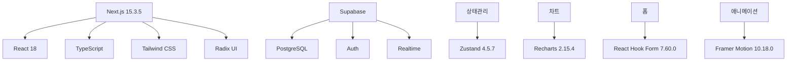
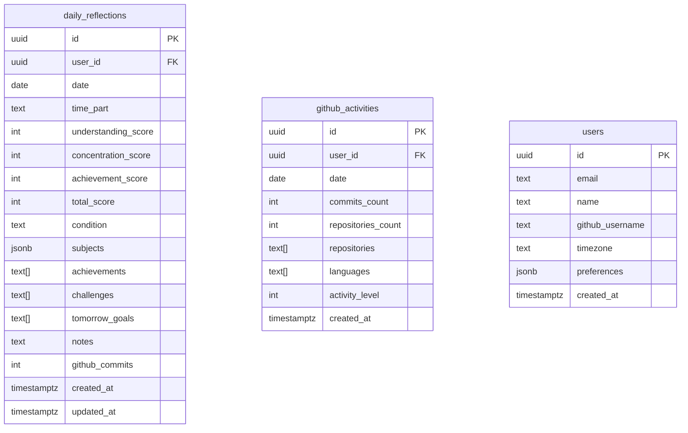
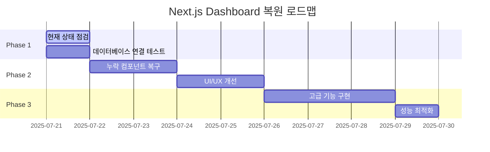
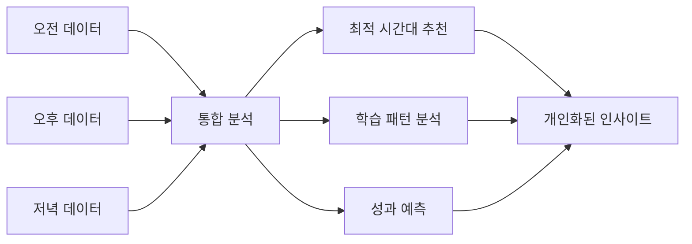
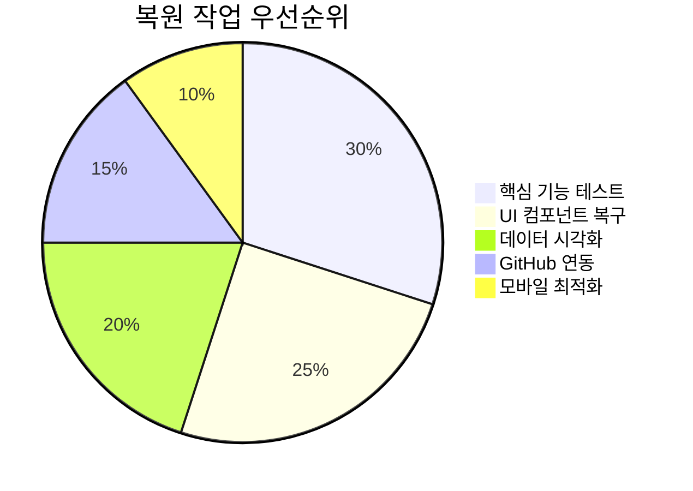

# Next.js 3-Part Daily Reflection Dashboard 복원 분석

## 🎯 프로젝트 현황 (2025년 7월 21일)

### 🏗️ 기술 스택


### 📁 현재 프로젝트 구조 분석

```
lg-dx-dashboard/
├── 📂 src/
│   ├── 📂 app/                    # Next.js 13+ App Router
│   │   ├── 📂 dashboard/          # ✅ 메인 대시보드 페이지
│   │   ├── 📂 reflection/         # ✅ 3-Part Reflection 페이지
│   │   │   ├── 📂 morning/        # ✅ 오전수업 반성
│   │   │   ├── 📂 afternoon/      # ✅ 오후수업 반성  
│   │   │   └── 📂 evening/        # ✅ 저녁자율학습 반성
│   │   ├── 📂 analytics/          # 📊 분석 페이지
│   │   ├── 📂 github/             # 🔗 GitHub 연동
│   │   ├── 📂 api/                # API 라우트
│   │   └── 📂 settings/           # ⚙️ 설정
│   ├── 📂 components/             # React 컴포넌트
│   ├── 📂 hooks/                  # Custom Hooks
│   ├── 📂 lib/                    # 유틸리티 & 설정
│   └── 📂 types/                  # TypeScript 타입 정의
├── package.json                   # ✅ 의존성 관리
├── .env.local                     # 🔒 환경변수
├── tailwind.config.js             # 🎨 스타일 설정
└── tsconfig.json                  # ⚙️ TypeScript 설정
```

### 📊 Supabase 데이터베이스 현황

**보존된 데이터:**
- **총 13건의 Daily Reflection 데이터**
- 시간대별 분포: Morning(5), Afternoon(5), Evening(3)
- 최신 기록: 2025-07-17
- **모든 테이블 구조 완전 보존**



## 🔍 손실 파일 분석

### ❌ `git clean -fd`로 삭제된 것으로 추정되는 파일들

**1. 프론트엔드 UI 컴포넌트 (추정):**
- `src/components/forms/` - 폼 컴포넌트들
- `src/components/layout/` - 레이아웃 컴포넌트들  
- `src/styles/` - 추가 스타일 파일들

**2. 백엔드/서버 디렉토리 (완전 삭제):**
- `Lib/` - Python 라이브러리 (삭제됨)
- `Scripts/` - Python 스크립트 (삭제됨)
- `share/` - 공유 파일들 (삭제됨)
- `etc/` - 기타 설정 파일들 (삭제됨)

**3. 임시/백업 디렉토리:**
- `temp_backup/` - 임시 백업 파일들
- 일부 프로필/설정 페이지들

### ✅ 보존된 핵심 파일들

**완전히 보존된 중요 구조들:**
- ✅ **3-Part Reflection 구조** (`reflection/morning`, `afternoon`, `evening`)
- ✅ **메인 대시보드** (`dashboard/page.tsx`)
- ✅ **API 라우트들** (`app/api/`)
- ✅ **GitHub 연동** (`app/github/`)
- ✅ **인증 시스템** (`auth/`, `login/`, `signup/`)
- ✅ **설정 페이지** (`settings/`)
- ✅ **분석 페이지** (`analytics/`)

## 🚀 복원 전략

### Phase 1: 현재 상태 점검 및 기능 테스트



#### 1.1 🔧 개발 서버 실행 및 기본 기능 확인

```bash
# 개발 환경 실행
cd lg-dx-dashboard
npm run dev

# 테스트 실행
npm run test
npm run type-check
npm run lint
```

#### 1.2 📊 데이터베이스 연결 확인

```typescript
// 확인 항목
- Supabase 연결 상태
- 3-Part Reflection 데이터 조회
- GitHub 연동 상태
- 사용자 인증 플로우
```

### Phase 2: 누락 컴포넌트 및 기능 복구

#### 2.1 🎨 UI 컴포넌트 재생성 (우선순위: 높음)

**추정 누락 컴포넌트들:**
```typescript
// src/components/forms/ (재생성 필요)
- ReflectionForm.tsx
- ScoreSlider.tsx
- SubjectSelector.tsx
- AchievementInput.tsx

// src/components/layout/ (재생성 필요)  
- DashboardLayout.tsx
- Sidebar.tsx
- Header.tsx
- MobileNav.tsx
```

#### 2.2 📈 차트 및 시각화 컴포넌트

```typescript
// src/components/charts/ (신규 생성)
- TimepartComparisonChart.tsx
- ProgressChart.tsx  
- GitHubActivityChart.tsx
- ScoreTrendChart.tsx
```

#### 2.3 🔗 GitHub 연동 강화

```typescript
// GitHub API 통합
- 실시간 커밋 데이터 동기화
- 시간대별 활동 분석
- 코딩 패턴 시각화
```

### Phase 3: 고급 기능 구현

#### 3.1 📊 3-Part 분석 대시보드



#### 3.2 🤖 자동화 기능

```typescript
// 자동화 워크플로우
- 매일 17:30 자동 데이터 수집
- Notion 페이지 자동 생성
- 학습 목표 달성 알림
- 주간/월간 리포트 생성
```

#### 3.3 📱 반응형 모바일 지원

```css
/* Tailwind 반응형 구현 */
- Mobile-first 디자인
- Touch-friendly 인터페이스
- PWA 기능 추가
```

## 🎯 복원 우선순위



### 🔥 Critical (즉시 필요)
1. **개발 서버 실행 확인**
2. **Supabase 연결 테스트**  
3. **3-Part Reflection 기능 테스트**
4. **기본 대시보드 렌더링 확인**

### ⚡ High (1-3일 내)
5. **누락 UI 컴포넌트 재생성**
6. **차트 컴포넌트 구현**
7. **GitHub API 연동 강화**
8. **반응형 디자인 개선**

### 🟡 Medium (1주일 내)
9. **고급 분석 기능**
10. **자동화 워크플로우**
11. **성능 최적화**
12. **테스트 커버리지 확대**

## 📋 즉시 실행 계획

### 1️⃣ **지금 당장 확인할 것들**

```bash
# 1. 프로젝트 실행 가능 여부
cd lg-dx-dashboard
npm install  # 혹시 node_modules 문제
npm run dev  # 개발 서버 실행

# 2. 환경변수 확인  
cat .env.local

# 3. 데이터베이스 연결 테스트
npm run test -- --testPathPattern=api
```

### 2️⃣ **첫 번째 복원 작업**

1. **개발 서버 실행**: http://localhost:3000
2. **로그인 테스트**: 기존 계정으로 로그인 확인  
3. **대시보드 접근**: `/dashboard` 페이지 렌더링 확인
4. **3-Part 페이지**: `/reflection/morning|afternoon|evening` 확인
5. **데이터 표시**: 기존 13건 데이터 정상 표시 확인

### 3️⃣ **누락 파일 식별 및 복구**

```typescript
// 에러 메시지를 통해 누락 파일 식별
- 컴파일 에러 분석
- import 에러 추적
- 컴포넌트 렌더링 실패 분석
- API 호출 에러 확인
```

## 🎊 성공 지표

### 📊 복원 완료 기준
- [ ] 개발 서버 정상 실행 (npm run dev)
- [ ] 모든 페이지 접근 가능
- [ ] 3-Part Reflection 입력 기능 정상
- [ ] 기존 데이터 13건 정상 표시  
- [ ] GitHub 연동 기능 작동
- [ ] 차트/시각화 정상 렌더링
- [ ] 반응형 디자인 적용
- [ ] TypeScript 컴파일 에러 없음

### 🚀 향상된 기능 목표
- [ ] 실시간 데이터 동기화
- [ ] 고급 분석 대시보드
- [ ] 모바일 PWA 지원
- [ ] Notion 자동 연동
- [ ] 개인화된 인사이트

---

**📅 작성일**: 2025년 7월 21일  
**💻 기술스택**: Next.js 15.3.5 + React 18 + TypeScript + Supabase  
**📊 데이터**: 13건 Daily Reflection + 완전한 DB 스키마 보존  
**🎯 목표**: 완전한 기능 복원 및 고도화
