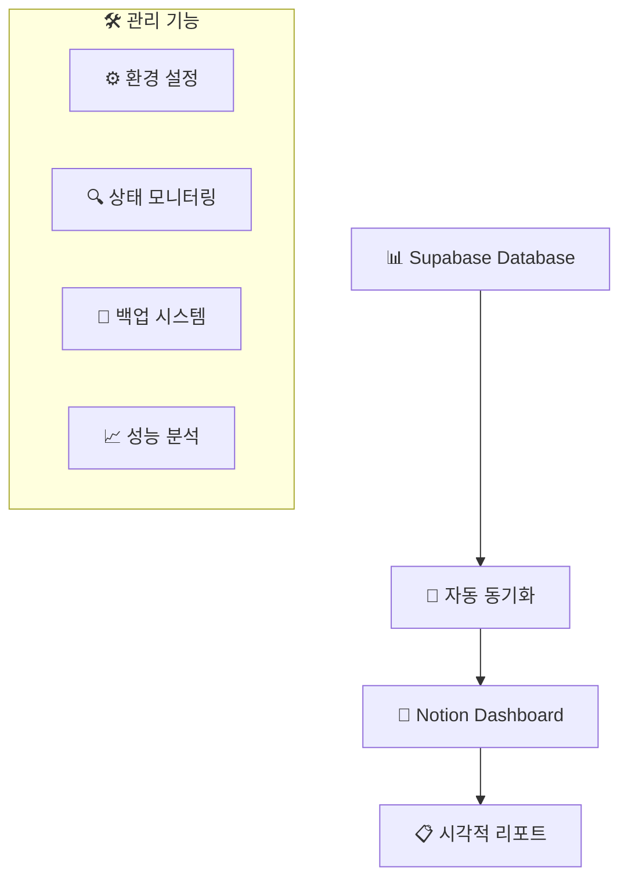
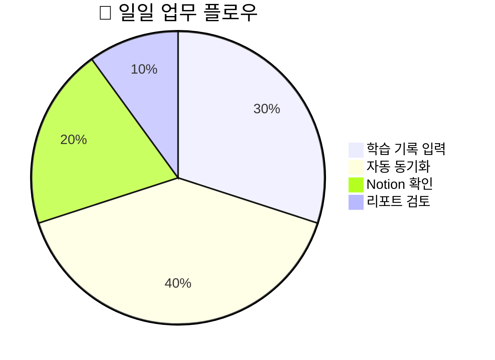
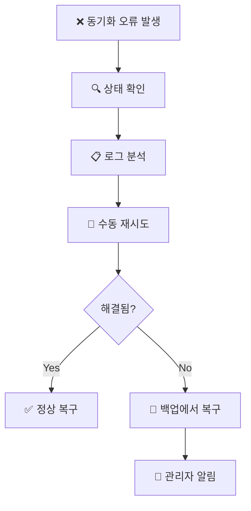
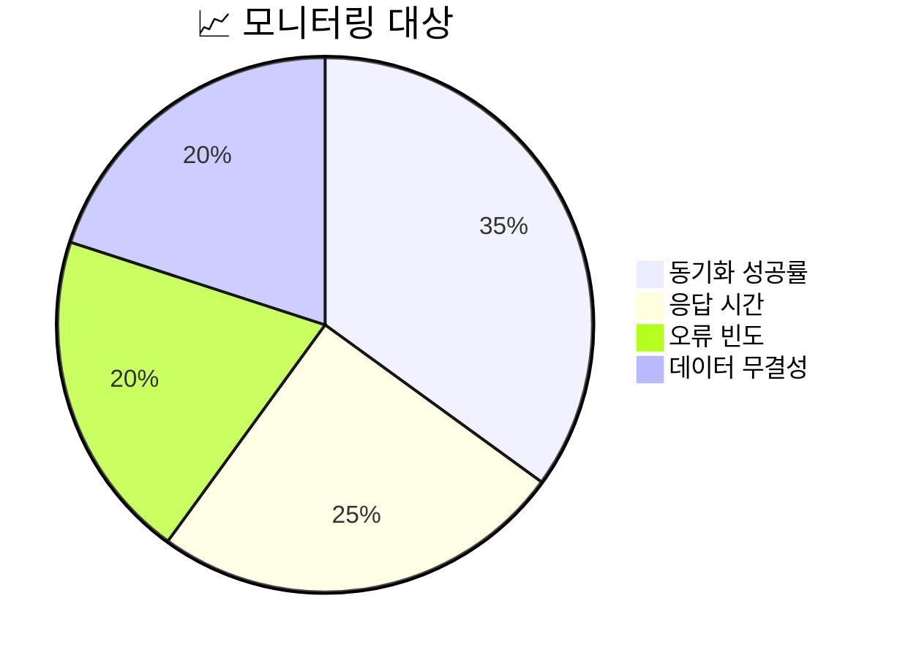

# 📚 LG DX School Notion-Supabase 통합 시스템 사용 가이드

## 🚀 **시스템 개요**

이 시스템은 LG DX School 학습 데이터를 Supabase에서 관리하고 Notion으로 자동 동기화하여 시각적인 대시보드를 제공합니다.

### 🎯 **주요 기능**



---

## 📱 **CLI 명령어 가이드**

### 🔧 **1. 기본 설정 명령어**

#### **환경 설정 초기화**
```bash
cd C:\LG_DX_SCHOOL\scripts
python supabase_mcp.py notion-setup
```

#### **연결 상태 확인**
```bash
python supabase_mcp.py notion-status
```

### 📊 **2. 동기화 명령어**

#### **오늘 데이터 동기화**
```bash
python supabase_mcp.py sync-today
```

#### **주간 데이터 동기화**
```bash
python supabase_mcp.py sync-week
```

#### **전체 데이터 동기화**
```bash
python supabase_mcp.py notion-sync
```

### 📈 **3. 모니터링 명령어**

#### **동기화 리포트 생성**
```bash
python supabase_mcp.py sync-report
```

#### **성능 메트릭 조회**
```bash
python supabase_mcp.py sync-report --format=detailed
```

### 🤖 **4. 자동화 명령어**

#### **자동 스케줄러 활성화**
```bash
python supabase_mcp.py auto-schedule
```

#### **스케줄러 상태 확인**
```bash
python supabase_mcp.py auto-schedule --status
```

### 💾 **5. 백업 관리 명령어**

#### **수동 백업 생성**
```bash
python notion_backup.py backup --type=manual
```

#### **백업에서 복구**
```bash
python notion_backup.py restore backup_name --mode=verify
```

#### **오래된 백업 정리**
```bash
python notion_backup.py cleanup --days=30
```

#### **데이터 무결성 검증**
```bash
python notion_backup.py verify
```

---

## 🎯 **사용 시나리오별 가이드**

### 📋 **시나리오 1: 일일 학습 기록 업데이트**



1. **Supabase에 학습 데이터 입력**
2. **자동 동기화 실행** (매일 9시, 18시)
3. **Notion 대시보드에서 시각적 확인**
4. **주간/월간 리포트 검토**

### 🔍 **시나리오 2: 문제 발생시 대응**



1. **오류 알림 수신**
2. **상태 확인**: `python supabase_mcp.py notion-status`
3. **리포트 생성**: `python supabase_mcp.py sync-report`
4. **수동 재시도**: `python supabase_mcp.py sync-today`
5. **백업 복구**: `python notion_backup.py restore latest --mode=incremental`

### 📊 **시나리오 3: 성능 모니터링**



1. **일일 성능 메트릭 확인**
2. **주간 트렌드 분석**
3. **임계값 초과시 알림**
4. **최적화 방안 도출**

---

## ⚙️ **고급 설정**

### 🔧 **환경 변수 설정**

`.env.local` 파일에 다음 설정들을 추가하세요:

```env
# Supabase 설정
SUPABASE_URL=your_supabase_url
SUPABASE_KEY=your_supabase_key

# Notion 설정
NOTION_TOKEN=your_notion_token
NOTION_DATABASE_ID=your_database_id

# 동기화 설정
SYNC_BATCH_SIZE=50
SYNC_RETRY_COUNT=3
SYNC_TIMEOUT=30

# 백업 설정
BACKUP_RETENTION_DAYS=30
BACKUP_COMPRESSION=true
```

### 📅 **스케줄링 사용자 정의**

GitHub Actions에서 스케줄을 변경하려면 `.github/workflows/notion-sync.yml` 파일을 수정하세요:

```yaml
on:
  schedule:
    # 한국시간 기준 오전 9시 (UTC 00:00)
    - cron: '0 0 * * *'
    # 한국시간 기준 오후 6시 (UTC 09:00)  
    - cron: '0 9 * * *'
```

---

## 🚨 **문제 해결 가이드**

### ❌ **자주 발생하는 오류들**

#### **1. Notion API Rate Limit**
```bash
# 재시도 간격 늘리기
python supabase_mcp.py sync-today --retry-delay=5
```

#### **2. Supabase 연결 오류**
```bash
# 연결 상태 확인
python supabase_mcp.py notion-status
# 환경변수 재확인
```

#### **3. 데이터 동기화 불일치**
```bash
# 무결성 검증
python notion_backup.py verify
# 강제 전체 동기화
python supabase_mcp.py notion-sync --force
```

### 🔍 **로그 및 디버깅**

```bash
# 상세 로그 활성화
python supabase_mcp.py sync-today --verbose

# 디버그 모드 실행
python supabase_mcp.py sync-today --debug
```

---

## 📞 **지원 및 문의**

### 🆘 **긴급 상황 대응**

1. **즉시 백업 생성**: `python notion_backup.py backup --type=emergency`
2. **자동화 일시 중지**: GitHub Actions에서 워크플로우 비활성화
3. **수동 모드로 전환**: CLI 명령어로 개별 작업 수행

### 📧 **연락처**

- **기술 지원**: 시스템 관리자 
- **사용 문의**: LG DX School 교육팀
- **긴급 상황**: 24시간 지원 핫라인

---

## 🔄 **업데이트 및 유지보수**

### 📱 **시스템 업데이트**

```bash
# 최신 코드 받기
git pull origin main

# 의존성 업데이트
pip install -r requirements.txt --upgrade

# 설정 재검증
python supabase_mcp.py notion-setup
```

### 🧹 **정기 유지보수**

- **주간**: 백업 상태 확인, 성능 메트릭 검토
- **월간**: 로그 정리, 설정 최적화
- **분기**: 시스템 업데이트, 보안 점검

---

**💡 팁: 이 가이드를 Notion 페이지에 북마크하여 언제든지 빠르게 참조하세요!**
