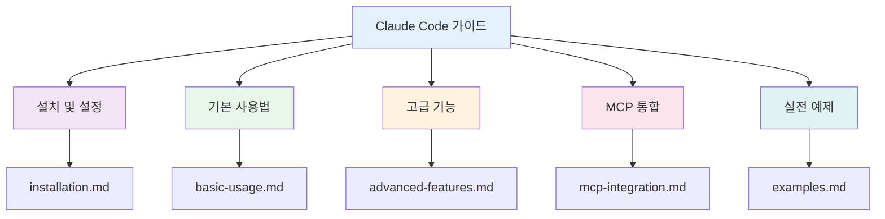
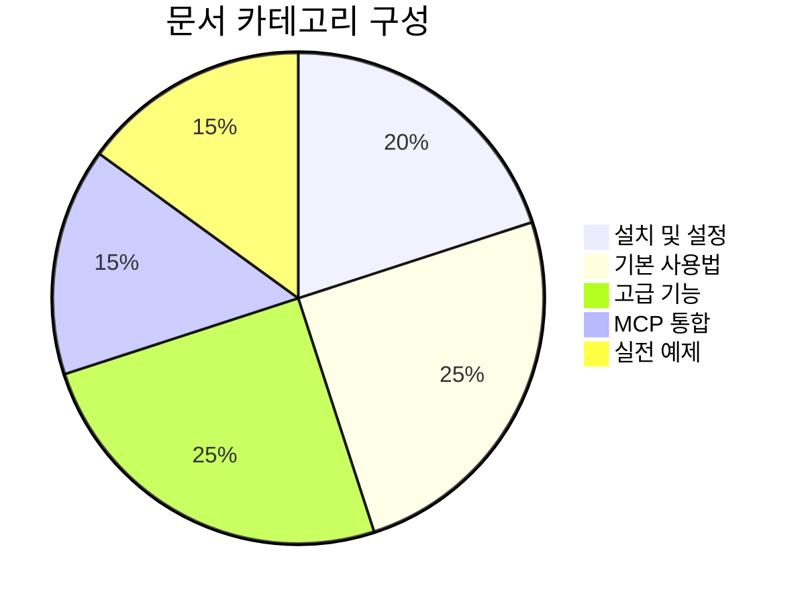
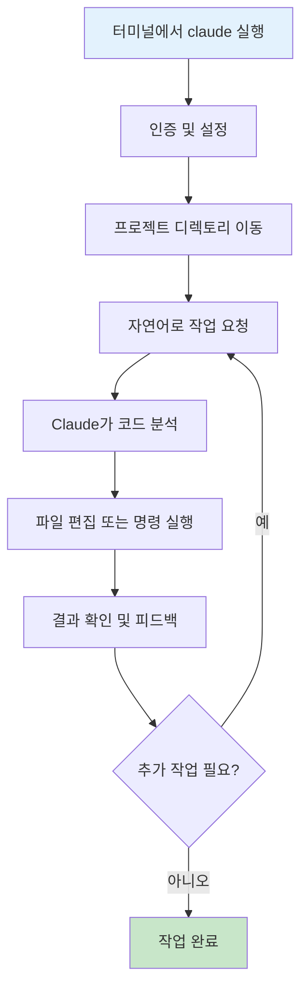
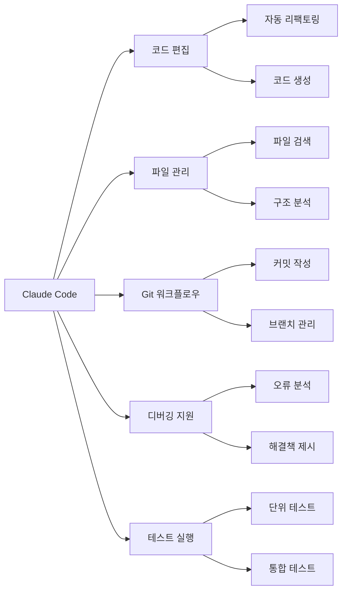
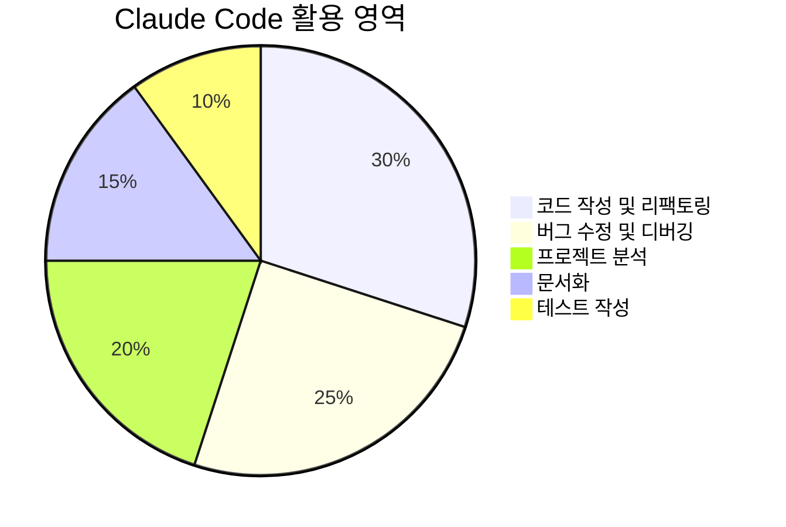

# Claude Code 완전 가이드

Claude Code는 Anthropic에서 개발한 AI 기반 코딩 도구로, 터미널에서 직접 작동하며 자연어 명령을 통해 코딩 작업을 지원합니다.

## 📊 문서 구조 개요



## 📋 문서 목차



### 📚 주요 문서

1. **[설치 및 설정](./installation.md)** - Claude Code 설치부터 초기 설정까지
2. **[기본 사용법](./basic-usage.md)** - 기본 명령어와 일반적인 사용 패턴
3. **[고급 기능](./advanced-features.md)** - 고급 기능과 도구 활용법
4. **[MCP 통합](./mcp-integration.md)** - Model Context Protocol 서버 연동
5. **[실전 예제](./examples.md)** - 실제 프로젝트에서 활용할 수 있는 예제들

## 🚀 빠른 시작

### 설치
```bash
npm install -g @anthropic-ai/claude-code
```

### 기본 사용
```bash
claude
```

## 📈 Claude Code 워크플로우



## 🛠️ 주요 기능



## 🎯 사용 사례

### 개발자를 위한 핵심 기능



1. **코드 작성**: "이 API 엔드포인트에 대한 테스트 케이스를 작성해줘"
2. **리팩토링**: "이 함수를 더 읽기 쉽게 개선해줘"
3. **버그 수정**: "이 오류를 분석하고 수정해줘"
4. **프로젝트 분석**: "이 프로젝트의 구조를 분석해줘"

## 📖 추가 자료

- [Anthropic 공식 문서](https://docs.anthropic.com/claude/docs/claude-code)
- [GitHub 저장소](https://github.com/anthropics/claude-code)
- [커뮤니티 포럼](https://community.anthropic.com)

---

**참고**: 이 가이드는 Claude Code v1.0+ 기준으로 작성되었습니다.
