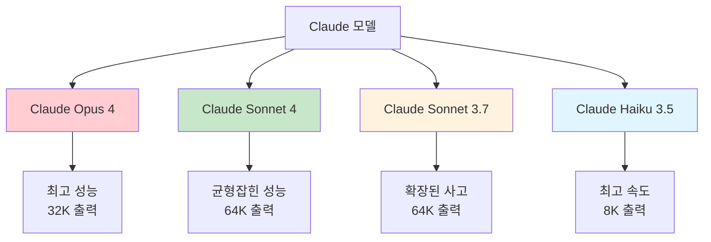
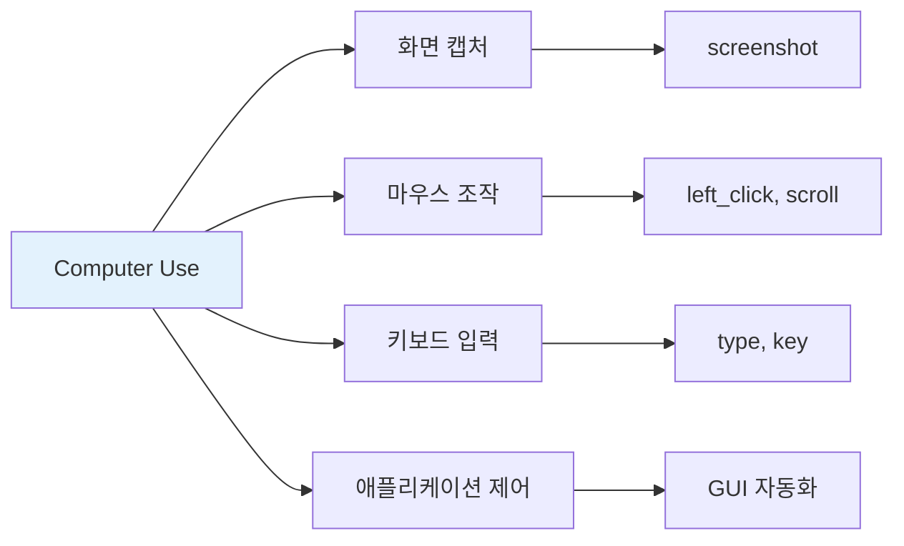
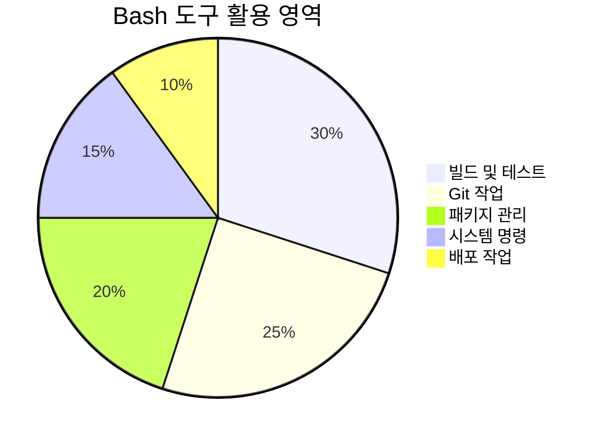
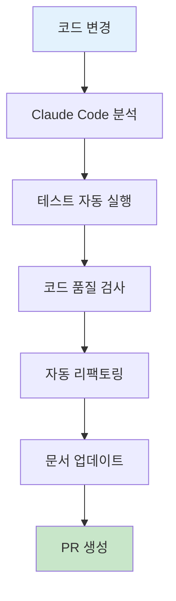
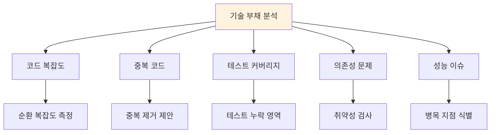
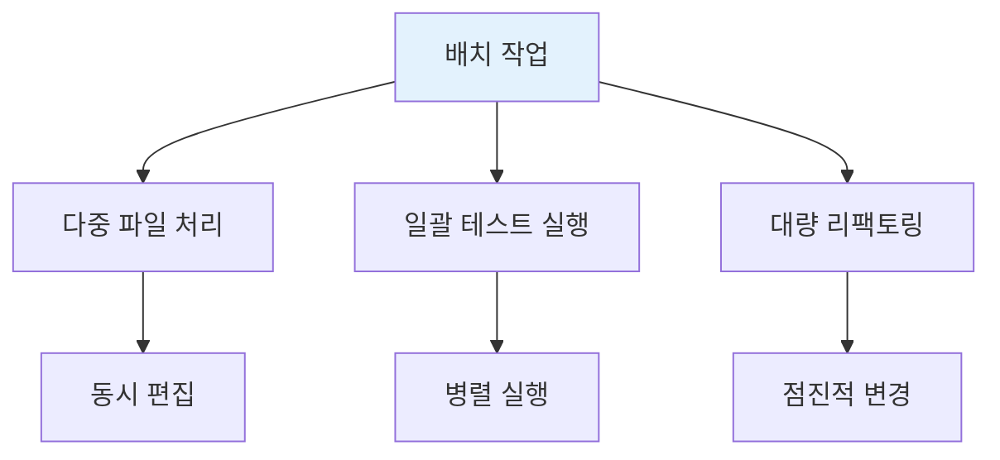
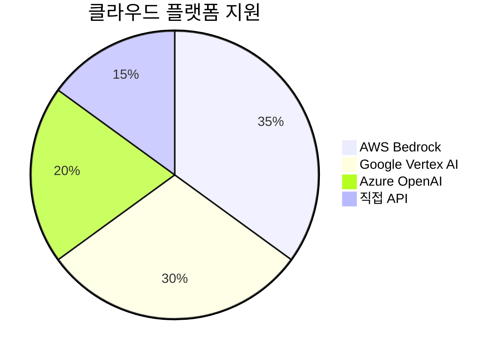
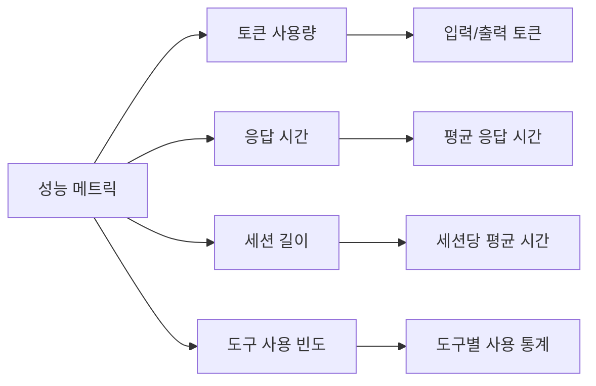

# Claude Code 고급 기능

Claude Code의 고급 기능들을 활용하여 개발 효율성을 극대화하는 방법을 다룹니다.

## 🧠 모델 선택 및 설정

### 사용 가능한 모델



### 모델별 특성

| 모델 | API 이름 | 강점 | 속도 | 토큰 한계 |
|------|----------|------|------|-----------|
| Opus 4 | `claude-opus-4-20250514` | 최고 지능 | 보통 | 32K |
| Sonnet 4 | `claude-sonnet-4-20250514` | 균형 | 빠름 | 64K |
| Sonnet 3.7 | `claude-3-7-sonnet-20250219` | 확장 사고 | 빠름 | 64K |
| Haiku 3.5 | `claude-3-5-haiku-20241022` | 속도 | 매우 빠름 | 8K |

### 모델 설정

```bash
# 명령줄에서 모델 지정
claude --model claude-sonnet-4-20250514

# 프로젝트 설정 파일에서
# .claude.json
{
  "model": "claude-sonnet-4-20250514",
  "max_tokens": 4096
}
```

## 🛠️ 고급 도구 활용

### Computer Use 도구



**사용 예시:**
```python
import anthropic

client = anthropic.Anthropic()
response = client.beta.messages.create(
    model="claude-sonnet-4-20250514",
    max_tokens=1024,
    tools=[
        {
            "type": "computer_20250124",
            "name": "computer",
            "display_width_px": 1024,
            "display_height_px": 768,
            "display_number": 1
        }
    ],
    messages=[{"role": "user", "content": "Take a screenshot and analyze the current screen"}],
    betas=["computer-use-2025-01-24"]
)
```

### 텍스트 에디터 도구

고급 파일 편집 기능:

```bash
# 복잡한 리팩토링 요청
> Refactor the entire user authentication system to use JWT tokens instead of sessions. Update all related files and ensure backward compatibility.

# 다중 파일 편집
> Update the API endpoints in routes/, the corresponding tests in tests/, and the documentation in docs/ to support the new user roles feature.
```

### Bash 도구 고급 활용



**복합 명령 실행:**
```bash
> Run the full CI pipeline: install dependencies, run tests, build the project, and check for security vulnerabilities
```

Claude가 실행할 명령들:
```bash
npm install
npm run test
npm run build
npm audit
```

## 🔄 워크플로우 자동화

### GitHub Actions 통합

```bash
# GitHub App 설정
> /install-github-app

# 자동 PR 생성
> Create a pull request for the feature branch with a comprehensive description of the changes made
```

### 지속적 통합 워크플로우



### 자동화 스크립트 예시

```bash
> Create a script that:
1. Runs all tests
2. Checks code coverage (minimum 80%)
3. Performs static analysis
4. Updates CHANGELOG.md
5. Creates a release tag if all checks pass
```

## 📊 고급 분석 기능

### 코드 품질 분석

```bash
# 전체 프로젝트 품질 분석
> Perform a comprehensive code quality analysis including:
- Code complexity metrics
- Security vulnerability assessment
- Performance bottleneck identification
- Architecture pattern compliance
- Test coverage analysis
```

### 기술 부채 식별



### 리팩토링 제안

```bash
> Analyze this codebase and provide a prioritized list of refactoring opportunities with:
- Impact assessment (high/medium/low)
- Estimated effort required
- Business value of each refactoring
- Step-by-step implementation plan
```

## 🎯 고급 프롬프팅 기법

### 체인 오브 생각 (Chain of Thought)

복잡한 문제 해결을 위한 단계별 접근:

```bash
> I need to migrate our monolithic application to microservices. Please:
1. First analyze the current architecture
2. Identify bounded contexts
3. Suggest service boundaries
4. Plan the migration strategy
5. Estimate risks and mitigation strategies
6. Provide a detailed implementation timeline
```

### 컨텍스트 확장


**컨텍스트 제공 예시:**
```bash
> Context: We're a fintech startup with strict security requirements. Our team follows TDD practices and uses TypeScript exclusively. We need to implement a payment processing system that:
- Handles 10,000+ transactions per minute
- Complies with PCI DSS standards
- Integrates with multiple payment providers
- Supports international currencies
- Has 99.99% uptime requirement

Task: Design and implement the core payment processing service.
```

## 🔧 사용자 정의 도구

### 커스텀 도구 정의

프로젝트별 특화 도구를 정의할 수 있습니다:

```json
{
  "custom_tools": {
    "deploy_staging": {
      "command": "npm run deploy:staging",
      "description": "Deploy to staging environment",
      "requires_confirmation": true
    },
    "run_integration_tests": {
      "command": "npm run test:integration",
      "description": "Run full integration test suite",
      "timeout": 300
    }
  }
}
```

### 도구 체이닝

여러 도구를 연결하여 복합 작업 수행:

```bash
> Execute the following workflow:
1. Run unit tests (if they pass, continue)
2. Build the application
3. Run integration tests
4. Deploy to staging
5. Run smoke tests on staging
6. If all tests pass, create a release candidate
```

## 📈 성능 최적화

### 프롬프트 캐싱

반복적인 컨텍스트를 캐싱하여 성능 향상:

```bash
# 캐시 활용 예시
claude --cache-context "This is our project structure and coding standards..."
```

### 배치 처리



### 비동기 작업

```bash
# 백그라운드 작업 실행
> Start a background analysis of code quality while I continue with other tasks

# 작업 상태 확인
> Check the status of the background analysis
```

## 🔒 고급 보안 기능

### 민감 정보 보호

```bash
# 보안 스캔 요청
> Scan this codebase for:
- Hardcoded secrets and API keys
- SQL injection vulnerabilities
- XSS vulnerabilities
- Insecure dependencies
- Authentication flaws
```

### 권한 세분화

```json
{
  "security_policies": {
    "file_access": {
      "allowed_paths": ["src/**", "tests/**", "docs/**"],
      "forbidden_paths": [".env", "secrets/**", "private/**"]
    },
    "command_execution": {
      "allowed_commands": ["npm", "git", "node"],
      "forbidden_commands": ["rm", "sudo", "chmod"]
    }
  }
}
```

## 🌐 다중 플랫폼 지원

### 클라우드 플랫폼 통합



### AWS Bedrock 설정

```bash
# AWS 자격 증명 설정
aws configure

# Bedrock 모델 목록 확인
aws bedrock list-foundation-models --region us-west-2 --by-provider anthropic

# Claude Code에서 Bedrock 사용
claude --provider bedrock --region us-west-2
```

### Google Vertex AI 설정

```bash
# gcloud 설정
gcloud config set project YOUR-PROJECT-ID
gcloud services enable aiplatform.googleapis.com

# Claude Code에서 Vertex AI 사용
claude --provider vertex --project YOUR-PROJECT-ID
```

## 📊 모니터링 및 분석

### 사용량 모니터링

OpenTelemetry를 통한 상세 모니터링:

```bash
# 환경 변수 설정
export CLAUDE_CODE_ENABLE_TELEMETRY=1
export OTEL_METRICS_EXPORTER=prometheus
export OTEL_EXPORTER_OTLP_ENDPOINT=http://localhost:4317
```

### 성능 메트릭



### 비용 최적화

```bash
# 비용 분석 요청
> Analyze my Claude Code usage patterns and suggest ways to optimize costs while maintaining productivity
```

---

**다음 단계**: [MCP 통합](./mcp-integration.md)에서 Model Context Protocol을 활용한 확장 기능을 알아보세요.
