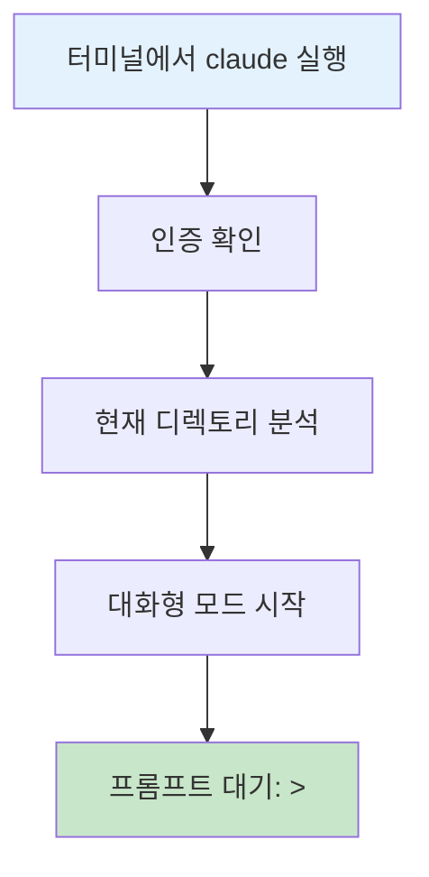
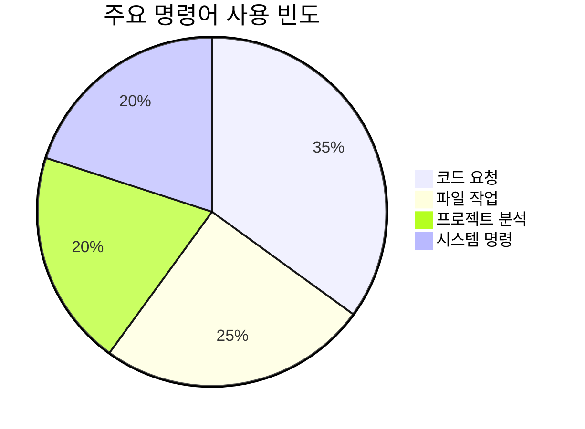
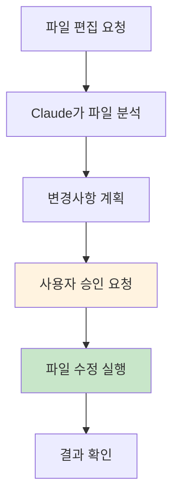
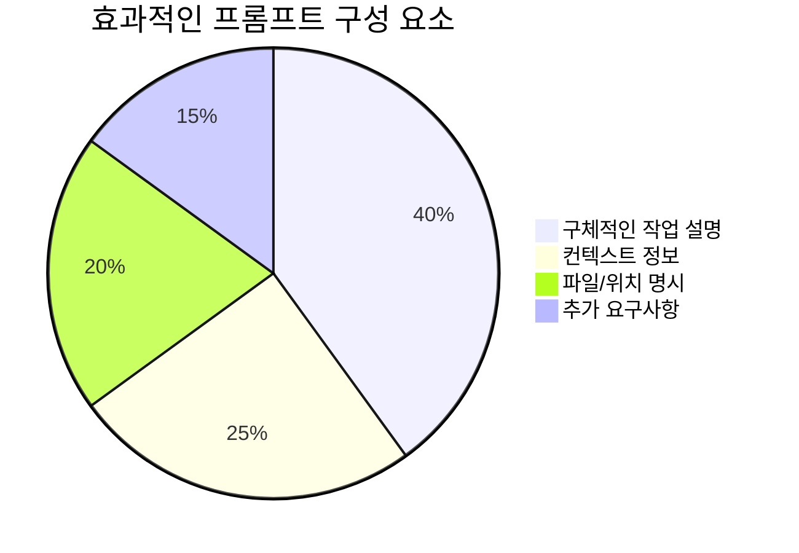
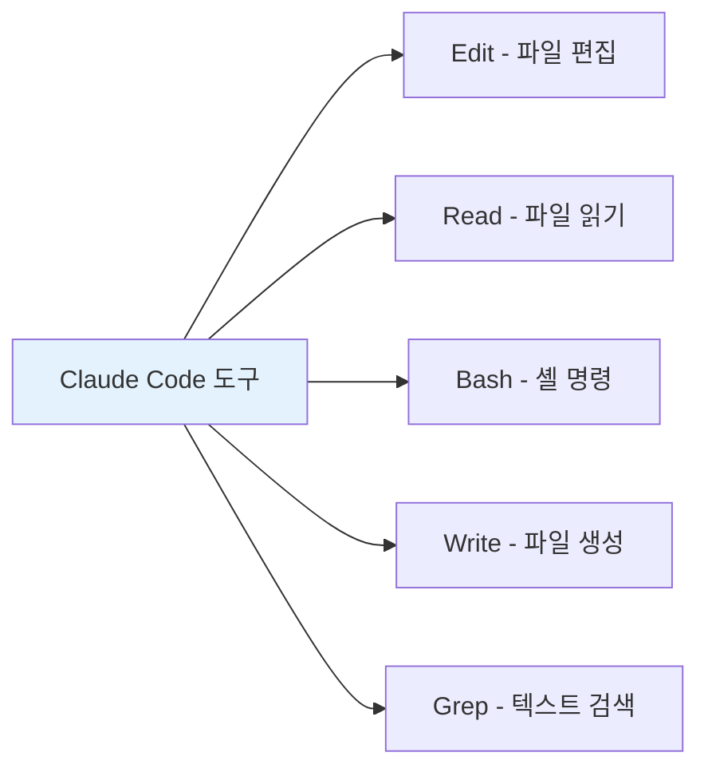
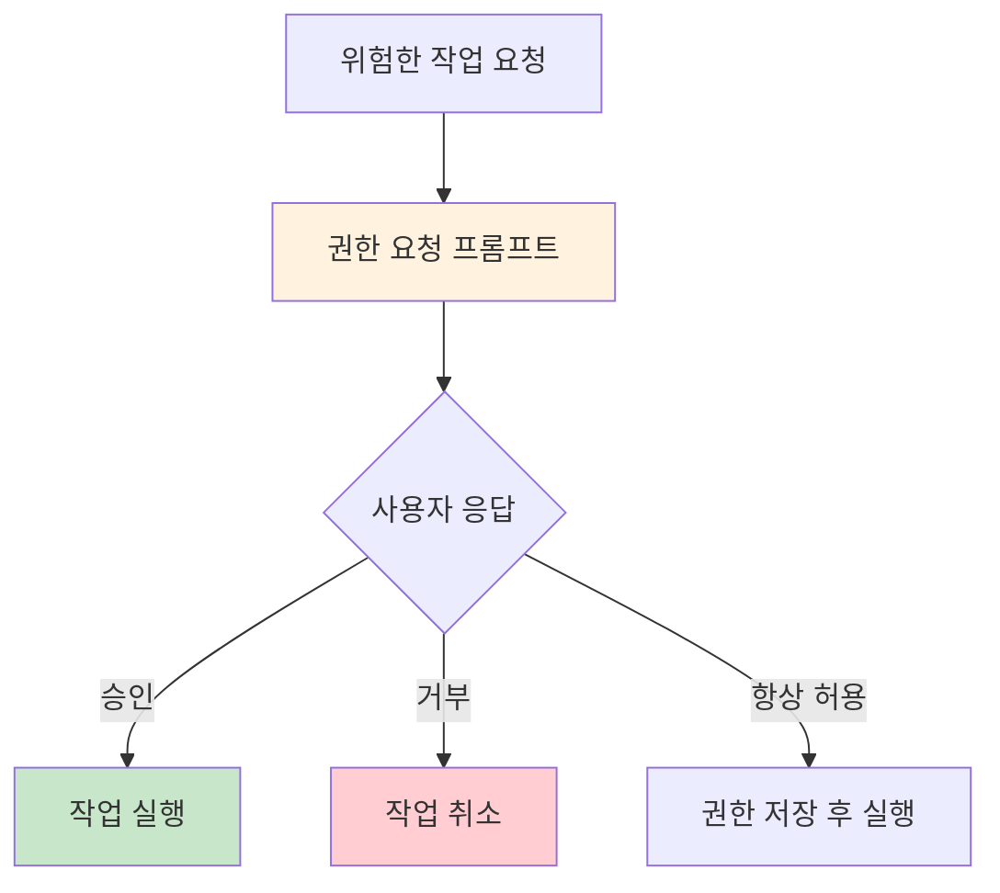
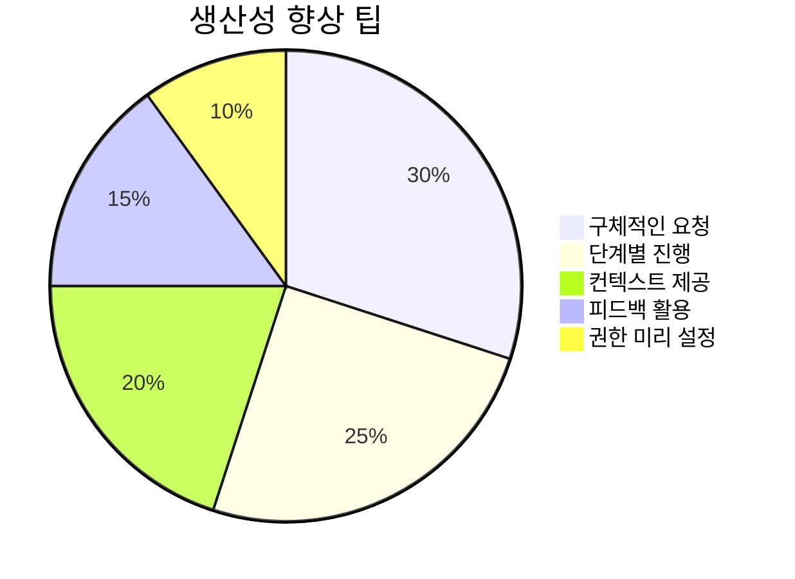

# Claude Code 기본 사용법

Claude Code의 기본적인 사용 방법과 핵심 명령어들을 다룹니다.

## 🚀 시작하기

### Claude Code 실행

```bash
claude
```



### 기본 인터페이스

Claude Code가 시작되면 다음과 같은 프롬프트가 나타납니다:

```
Claude Code v1.0.0
Ready to help with your code.

> 
```

## 📋 기본 명령어

### 대화형 명령어



#### 시스템 명령어 (/ 로 시작)

| 명령어 | 설명 | 예시 |
|--------|------|------|
| `/help` | 도움말 표시 | `/help` |
| `/exit` | Claude Code 종료 | `/exit` |
| `/clear` | 대화 기록 초기화 | `/clear` |
| `/status` | 현재 상태 확인 | `/status` |
| `/init` | 프로젝트 초기화 | `/init` |

#### 프로젝트 관리 명령어

```bash
# 프로젝트 개요 생성
> /init

# 현재 프로젝트 상태 확인
> /status

# 세션 요약
> summarize this project
```

## 💬 자연어 상호작용

### 코드 작성 요청


**기본 패턴:**
```
> [작업 설명] + [파일/위치 정보] + [추가 요구사항]
```

### 실제 사용 예시

#### 1. 새 파일 생성
```
> Create a Python function that calculates the factorial of a number
```

#### 2. 기존 파일 수정
```
> Add error handling to the login function in auth.py
```

#### 3. 프로젝트 분석
```
> Analyze the structure of this Node.js project and suggest improvements
```

#### 4. 버그 수정
```
> Fix the TypeError in the user registration process
```

## 🔧 CLI 모드 사용법

### 비대화형 모드

```bash
# 단일 명령 실행
claude -p "Create a README.md for this project"

# JSON 출력 형식
claude -p --output-format json "Analyze this code structure"

# 최대 턴 수 제한
claude -p --max-turns 3 "Implement user authentication"
```

### 출력 형식 옵션

```mermaid
graph TD
    A[출력 형식] --> B[text (기본값)]
    A --> C[json]
    A --> D[stream-json]
    
    B --> B1[일반 텍스트 형태]
    C --> C1[구조화된 JSON]
    D --> D1[스트리밍 JSON]
    
    style A fill:#e3f2fd
```

## 📁 파일 및 프로젝트 작업

### 파일 읽기 및 분석

```bash
# 특정 파일 분석
> Explain what this function does in utils.py

# 여러 파일 비교
> Compare the implementations in old_api.py and new_api.py

# 프로젝트 전체 구조 분석
> Give me an overview of this entire codebase
```

### 파일 편집



**편집 요청 예시:**
```
> Refactor the user_service.py to use async/await pattern
> Add unit tests for the Calculator class
> Update the API documentation in README.md
```

## 🎯 효과적인 프롬프트 작성법

### 명확한 요청하기



#### ✅ 좋은 예시
```
> Create a React component for a user profile card that displays name, email, and avatar. The component should be responsive and use TypeScript. Place it in src/components/UserProfile.tsx
```

#### ❌ 나쁜 예시
```
> Make a component
```

### 단계별 작업 요청

복잡한 작업은 단계별로 나누어 요청하세요:

```
1. > First, create the database schema for user management
2. > Now implement the user model with validation
3. > Add the API endpoints for CRUD operations
4. > Finally, create unit tests for the user service
```

## 🛠️ 도구 사용

Claude Code는 다양한 내장 도구를 제공합니다:



### 도구별 용도

| 도구 | 기능 | 권한 필요 |
|------|------|-----------|
| Read | 파일 내용 읽기 | ❌ |
| Edit | 파일 수정 | ✅ |
| Write | 새 파일 생성 | ✅ |
| Bash | 셸 명령 실행 | ✅ |
| Grep | 텍스트 패턴 검색 | ❌ |

## 🔒 권한 관리

### 권한 요청 처리

Claude Code는 안전성을 위해 특정 작업에 대해 권한을 요청합니다:



### 권한 설정 파일

`.claude-permissions.json`에서 권한을 미리 설정할 수 있습니다:

```json
{
  "allowed_tools": [
    "Edit(src/**)",
    "Write(tests/**)",
    "Bash(npm test)",
    "Bash(git add .)",
    "Bash(git commit -m *)"
  ],
  "denied_tools": [
    "Bash(rm -rf *)",
    "Bash(sudo *)"
  ]
}
```

## 📊 세션 관리

### 대화 이력 관리

```bash
# 이전 세션 계속하기
claude --continue

# 특정 세션 재개
claude --resume session_id_here

# 현재 세션 정보 확인
> /status
```

### 세션 저장 및 불러오기


## 🎨 사용자 정의

### CLAUDE.md 파일

프로젝트 루트에 `CLAUDE.md` 파일을 생성하여 프로젝트별 컨텍스트를 제공:

```markdown
# 프로젝트 개요
이 프로젝트는 사용자 관리 시스템입니다.

## 기술 스택
- Node.js
- Express.js
- MongoDB
- React

## 코딩 규칙
- TypeScript 사용
- ESLint 규칙 준수
- Jest로 테스트 작성

## 자주 사용하는 명령어
- `npm test` - 테스트 실행
- `npm run build` - 빌드
- `npm run dev` - 개발 서버 시작
```

### 프로젝트 초기화

```bash
> /init
```

이 명령어는 자동으로 `CLAUDE.md` 파일을 생성하고 프로젝트 구조를 분석합니다.

## 💡 사용 팁

### 효율적인 작업 패턴



1. **명확한 요청**: 원하는 결과를 구체적으로 설명
2. **컨텍스트 제공**: 프로젝트 배경과 제약사항 설명
3. **단계별 진행**: 복잡한 작업을 작은 단위로 분할
4. **즉시 피드백**: 결과를 확인하고 필요시 수정 요청
5. **권한 관리**: 자주 사용하는 작업에 대한 권한 미리 설정

### 자주 사용하는 패턴

```bash
# 코드 리뷰 요청
> Review this pull request and suggest improvements

# 리팩토링 요청
> Refactor this function to improve readability and performance

# 테스트 작성
> Write unit tests for the UserService class

# 문서화
> Generate API documentation for the endpoints in routes/api.js

# 버그 수정
> Debug and fix the memory leak in the data processing pipeline
```

---

**다음 단계**: [고급 기능](./advanced-features.md)에서 더 강력한 기능들을 알아보세요.
