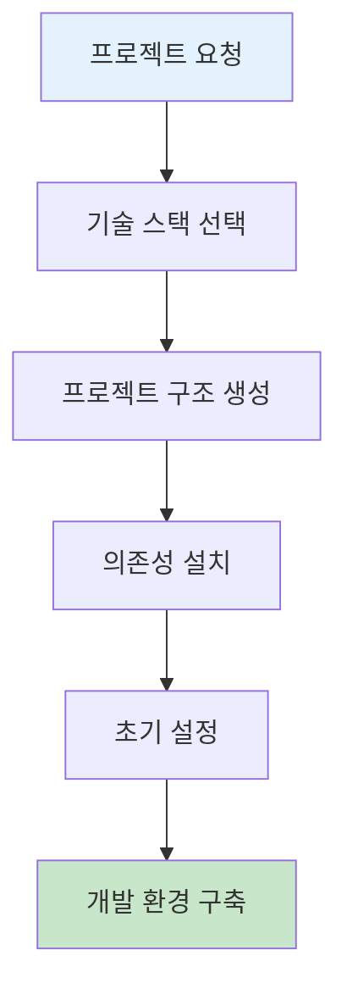
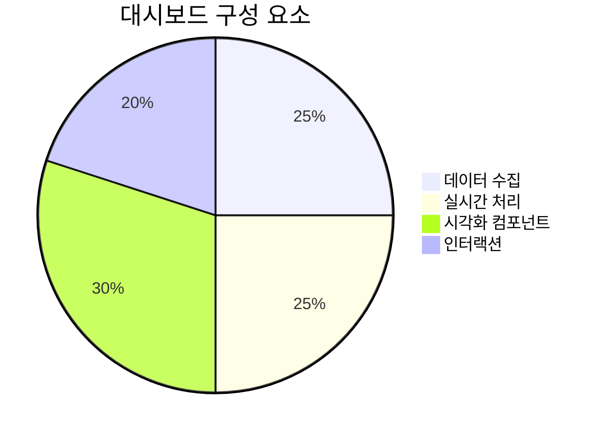
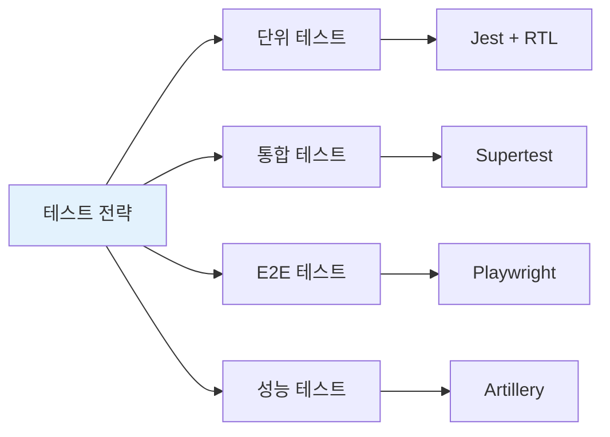
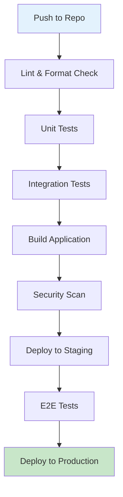
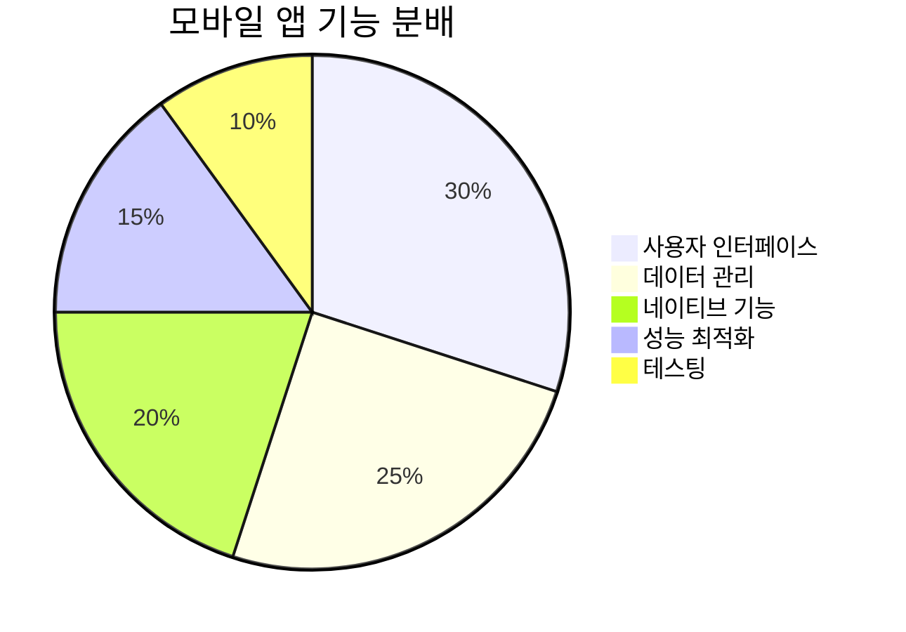
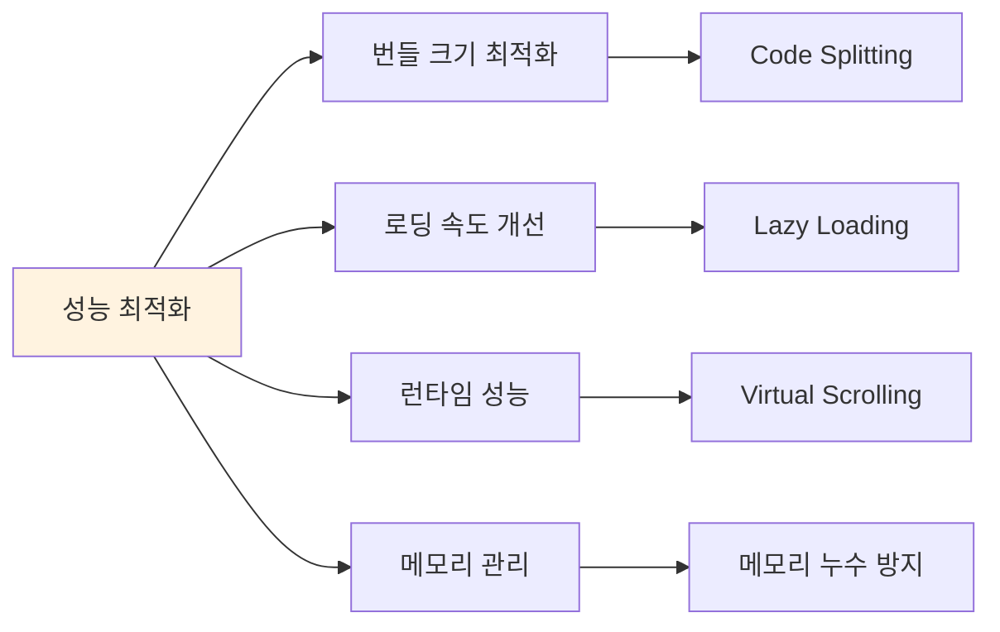
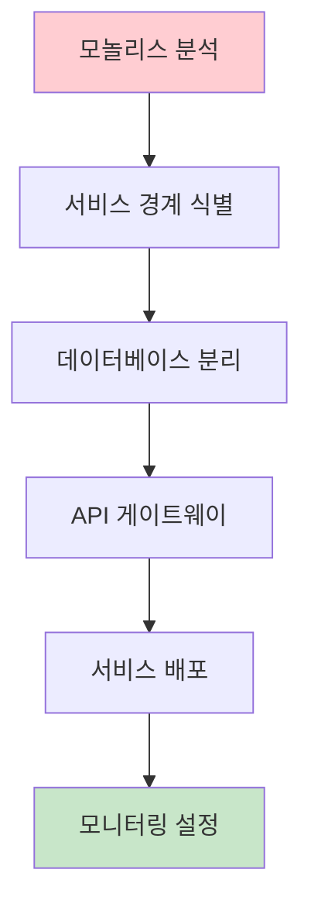
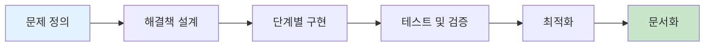

# Claude Code 실전 예제

실제 프로젝트에서 Claude Code를 활용하는 구체적인 예제들을 단계별로 소개합니다.

## 🚀 프로젝트 시작하기

### 새 React 프로젝트 생성



**Claude Code와의 대화:**
```bash
> Create a new React project with TypeScript, Tailwind CSS, and React Router. Include:
- Modern project structure
- ESLint and Prettier configuration
- Jest testing setup
- CI/CD workflow for GitHub Actions
- Responsive design components
```

**예상 결과:**
- 완전한 프로젝트 구조
- 설정 파일들 자동 생성
- 기본 컴포넌트 및 페이지
- 테스트 템플릿

## 📊 데이터 시각화 대시보드

### 실시간 분석 대시보드 구축



**프로젝트 요구사항:**
```bash
> Build a real-time analytics dashboard that:
1. Connects to a PostgreSQL database
2. Displays user engagement metrics
3. Shows real-time updates using WebSocket
4. Includes interactive charts (Chart.js)
5. Has responsive design for mobile devices
6. Implements user authentication
```

**단계별 구현:**

#### 1단계: 데이터베이스 설계
```bash
> Design a PostgreSQL schema for user analytics including:
- Users table with demographics
- Events table for user actions
- Sessions table for tracking
- Aggregated metrics views
```

#### 2단계: 백엔드 API 개발
```bash
> Create a Node.js Express API with:
- JWT authentication
- RESTful endpoints for analytics data
- WebSocket server for real-time updates
- Rate limiting and security middleware
- Database connection pooling
```

#### 3단계: 프론트엔드 컴포넌트
```bash
> Develop React components for:
- Login/logout functionality
- Dashboard layout with sidebar navigation
- Real-time metrics cards
- Interactive charts (line, bar, pie)
- Data filtering and date range selection
```

#### 4단계: 실시간 기능
```bash
> Implement WebSocket integration:
- Connect to WebSocket server on mount
- Handle real-time data updates
- Update charts without page refresh
- Show connection status indicator
- Graceful error handling and reconnection
```

## 🧪 테스트 자동화

### 포괄적인 테스트 스위트 구축



**테스트 환경 구축:**
```bash
> Set up a comprehensive testing environment including:
1. Unit tests for all React components using Jest and React Testing Library
2. API integration tests with Supertest
3. End-to-end tests using Playwright
4. Performance testing with Artillery
5. Test coverage reporting
6. Automated test runs in CI/CD pipeline
```

**예시 테스트 코드 요청:**
```bash
> Create unit tests for the UserProfile component that verify:
- Renders user information correctly
- Handles loading states
- Shows error messages appropriately
- Calls edit function when button is clicked
- Validates form input before submission
```

## 🔄 CI/CD 파이프라인

### GitHub Actions 워크플로우



**워크플로우 생성 요청:**
```bash
> Create a GitHub Actions workflow that:
1. Runs on every push and pull request
2. Performs code quality checks (ESLint, Prettier)
3. Runs all test suites with coverage reporting
4. Builds the application
5. Scans for security vulnerabilities
6. Deploys to staging environment
7. Runs smoke tests
8. Deploys to production (only on main branch)
9. Sends notifications to Slack
```

## 🛡️ 보안 강화

### 인증 및 권한 관리 시스템

```bash
> Implement a robust authentication system with:
1. JWT token-based authentication
2. Role-based access control (RBAC)
3. Password hashing with bcrypt
4. Rate limiting for login attempts
5. Two-factor authentication option
6. Session management
7. Password reset functionality
8. OAuth integration (Google, GitHub)
```

**보안 미들웨어 구현:**
```bash
> Create Express middleware for:
- Input validation and sanitization
- CORS configuration
- Helmet for security headers
- Request logging
- Error handling without information leakage
- API rate limiting per user/IP
```

## 📱 모바일 앱 개발

### React Native 크로스플랫폼 앱



**앱 개발 요청:**
```bash
> Create a React Native application that:
1. Shares code with the web version
2. Uses React Navigation for screen management
3. Implements offline data synchronization
4. Accesses device camera and gallery
5. Sends push notifications
6. Uses AsyncStorage for local data
7. Integrates with device biometric authentication
8. Supports both iOS and Android platforms
```

**상태 관리 구현:**
```bash
> Set up Redux Toolkit for state management with:
- User authentication state
- Data caching and synchronization
- Offline queue for API requests
- Error handling and retry logic
- Loading states for better UX
```

## 🚀 성능 최적화

### 웹 앱 성능 튜닝



**성능 분석 및 최적화:**
```bash
> Analyze and optimize the application performance by:
1. Implementing code splitting with React.lazy
2. Adding lazy loading for images and components
3. Optimizing bundle size with Webpack analysis
4. Implementing virtual scrolling for large lists
5. Adding service worker for caching
6. Optimizing database queries
7. Implementing CDN for static assets
8. Adding performance monitoring
```

**메모리 최적화:**
```bash
> Identify and fix memory leaks by:
- Analyzing component re-renders with React DevTools
- Implementing proper cleanup in useEffect
- Optimizing large list rendering
- Reducing unnecessary state updates
- Implementing proper image lazy loading
```

## 🔍 모니터링 및 로깅

### 종합적인 모니터링 시스템

```bash
> Set up comprehensive monitoring and logging:
1. Application performance monitoring (APM)
2. Error tracking with stack traces
3. User behavior analytics
4. Server resource monitoring
5. Database performance metrics
6. Custom business metrics dashboards
7. Alert system for critical issues
8. Log aggregation and search
```

**실시간 알림 시스템:**
```bash
> Create an alerting system that:
- Monitors application health
- Sends notifications via email/Slack
- Escalates critical issues
- Provides performance metrics
- Tracks user engagement
- Monitors security events
```

## 🏗️ 마이크로서비스 아키텍처

### 모놀리스에서 마이크로서비스로 마이그레이션



**마이그레이션 계획:**
```bash
> Plan a migration from monolith to microservices:
1. Analyze current application architecture
2. Identify bounded contexts and service boundaries
3. Design service communication patterns
4. Plan database decomposition strategy
5. Implement API gateway with Kong/Nginx
6. Set up service discovery
7. Implement distributed tracing
8. Create deployment pipeline for each service
```

**서비스별 구현:**
```bash
> Create the following microservices:
- User Service (authentication, profile management)
- Product Service (catalog, inventory)
- Order Service (order processing, payment)
- Notification Service (email, SMS, push)
- Analytics Service (metrics, reporting)

Each service should have:
- Own database
- RESTful API
- Health check endpoints
- Logging and monitoring
- Unit and integration tests
```

## 🎯 실제 비즈니스 문제 해결

### 전자상거래 플랫폼 구축

```bash
> Build a complete e-commerce platform with:

Frontend (React):
- Product catalog with search and filters
- Shopping cart and checkout process
- User account and order history
- Admin dashboard for inventory management
- Responsive design for mobile commerce

Backend (Node.js):
- Product and inventory management API
- Order processing and payment integration
- User authentication and authorization
- Email notifications and order tracking
- Analytics and reporting endpoints

Database (PostgreSQL):
- Products, categories, and inventory
- Users, orders, and payments
- Reviews and ratings
- Analytics and metrics

Integrations:
- Payment gateway (Stripe/PayPal)
- Shipping providers
- Email service (SendGrid)
- Cloud storage for images (AWS S3)
```

### 콘텐츠 관리 시스템 (CMS)

```bash
> Develop a flexible CMS that supports:
1. Multiple content types (articles, pages, media)
2. Rich text editor with media uploads
3. SEO optimization features
4. Multi-language support
5. Role-based content approval workflow
6. Version control for content
7. API for headless CMS usage
8. Plugin architecture for extensions
```

## 📈 데이터 과학 프로젝트

### 머신러닝 파이프라인

```bash
> Create a machine learning pipeline for customer churn prediction:

Data Processing:
- Data cleaning and preprocessing scripts
- Feature engineering pipeline
- Data validation and quality checks
- Automated data pipeline with Airflow

Model Development:
- Exploratory data analysis notebook
- Multiple model training (Random Forest, XGBoost, Neural Networks)
- Hyperparameter tuning with Grid Search
- Model evaluation and comparison

Deployment:
- Model serving API with Flask/FastAPI
- Model versioning with MLflow
- A/B testing framework
- Monitoring and retraining pipeline

Frontend:
- Dashboard for model predictions
- Feature importance visualization
- Model performance metrics
- Data drift detection alerts
```

## 🎮 실시간 애플리케이션

### 멀티플레이어 게임 서버

```bash
> Build a real-time multiplayer game with:

Game Server (Node.js + Socket.io):
- Real-time player connections
- Game state synchronization
- Collision detection
- Leaderboard management
- Anti-cheat mechanisms

Client (React):
- Game rendering with Canvas
- Real-time input handling
- Smooth animation and interpolation
- Sound effects and music
- Responsive game UI

Features:
- Multiple game rooms
- Spectator mode
- Chat system
- Player profiles and stats
- Tournament system
```

## 💡 문제 해결 패턴

### 일반적인 개발 패턴



**효과적인 Claude Code 활용법:**

1. **명확한 요구사항 정의**
   ```bash
   > I need to implement [specific feature] for [business context] with these requirements: [detailed list]
   ```

2. **단계별 접근**
   ```bash
   > Let's break this down into phases:
   1. [Phase 1 description]
   2. [Phase 2 description]
   3. [Phase 3 description]
   ```

3. **품질 보장**
   ```bash
   > For each component, include:
   - Unit tests with good coverage
   - Error handling
   - Input validation
   - Performance considerations
   - Security best practices
   ```

4. **문서화**
   ```bash
   > Create comprehensive documentation including:
   - API documentation
   - Setup instructions
   - Usage examples
   - Troubleshooting guide
   ```

---

이 예제들을 통해 Claude Code의 강력한 기능들을 실제 프로젝트에 적용해보세요. 각 예제는 시작점일 뿐이며, 프로젝트의 구체적인 요구사항에 맞게 조정하여 사용할 수 있습니다.
