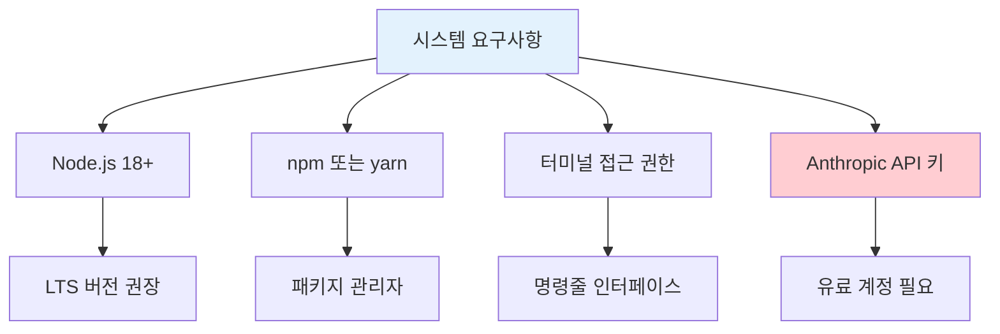
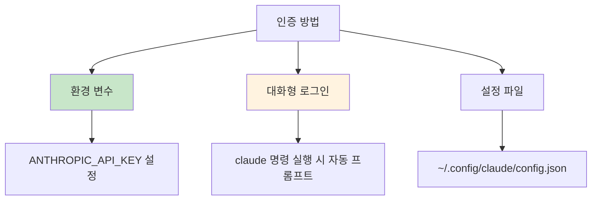
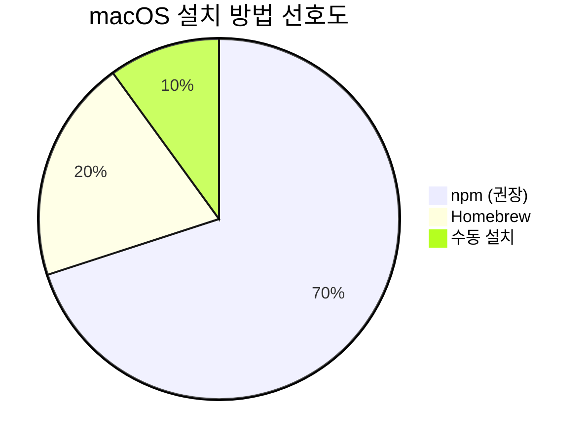
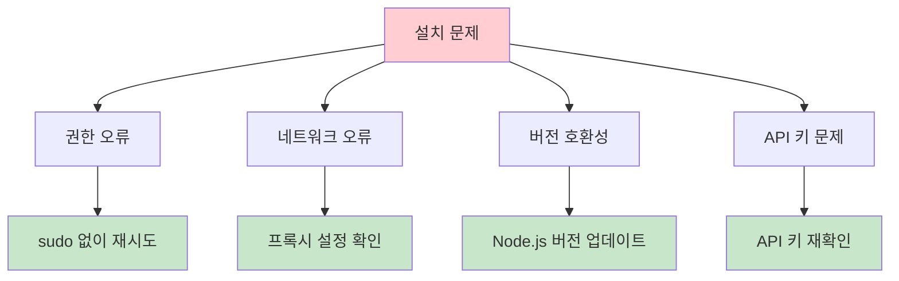
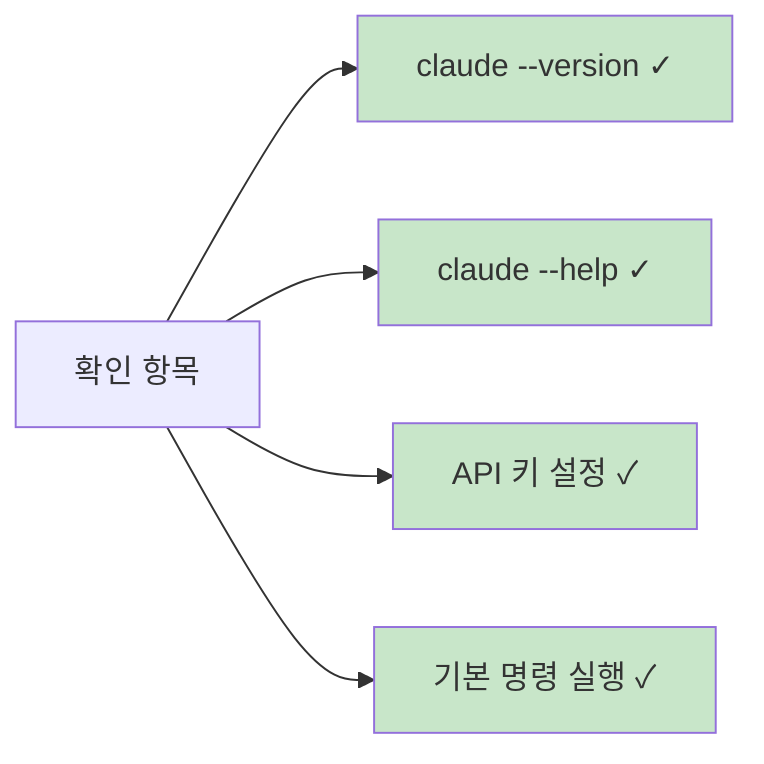

# Claude Code 설치 및 설정

Claude Code를 설치하고 설정하는 완전한 가이드입니다.

## 📋 시스템 요구사항



### 필수 조건
- **Node.js**: 18.0 이상 (LTS 버전 권장)
- **npm**: Node.js와 함께 설치됨
- **Anthropic API 키**: [Anthropic Console](https://console.anthropic.com)에서 발급

## 🚀 설치 과정

### 1단계: Claude Code CLI 설치

```bash
npm install -g @anthropic-ai/claude-code
```

**참고**: `sudo` 사용을 피하세요. 권한 문제가 발생할 수 있습니다.

### 2단계: 설치 확인

```bash
claude --version
```

### 3단계: 초기 실행

```bash
claude
```

## 🔐 인증 설정



### 방법 1: 환경 변수 설정

**macOS/Linux:**
```bash
export ANTHROPIC_API_KEY='your-api-key-here'
```

**Windows (PowerShell):**
```powershell
$env:ANTHROPIC_API_KEY = "your-api-key-here"
```

**Windows (명령 프롬프트):**
```cmd
set ANTHROPIC_API_KEY=your-api-key-here
```

### 방법 2: 대화형 인증

Claude Code를 처음 실행하면 자동으로 API 키 입력을 요청합니다:

```bash
claude
# API 키 입력 프롬프트가 나타남
```

## ⚙️ 고급 설정

### 프로젝트별 설정

각 프로젝트에 `.claude.json` 파일을 생성하여 프로젝트별 설정을 관리할 수 있습니다:

```json
{
  "model": "claude-sonnet-4-20250514",
  "max_tokens": 4096,
  "temperature": 0.7,
  "tools": {
    "bash": true,
    "edit": true,
    "read": true
  }
}
```

### 글로벌 설정

글로벌 설정 파일 위치:
- **macOS/Linux**: `~/.config/claude/config.json`
- **Windows**: `%APPDATA%\Claude\config.json`

```json
{
  "default_model": "claude-sonnet-4-20250514",
  "auto_save": true,
  "verbose": false,
  "max_turns": 10
}
```

## 🛠️ 플랫폼별 설정

### macOS 설정



**Homebrew 사용자:**
```bash
# Node.js 설치 (필요한 경우)
brew install node

# Claude Code 설치
npm install -g @anthropic-ai/claude-code
```

### Windows 설정

**Node.js 설치:**
1. [Node.js 공식 사이트](https://nodejs.org)에서 LTS 버전 다운로드
2. 설치 마법사 실행
3. PowerShell 또는 명령 프롬프트에서 설치 확인

**PowerShell 실행 정책 설정 (필요한 경우):**
```powershell
Set-ExecutionPolicy -ExecutionPolicy RemoteSigned -Scope CurrentUser
```

### Linux 설정

**Ubuntu/Debian:**
```bash
# Node.js 최신 버전 설치
curl -fsSL https://deb.nodesource.com/setup_lts.x | sudo -E bash -
sudo apt-get install -y nodejs

# Claude Code 설치
npm install -g @anthropic-ai/claude-code
```

**CentOS/RHEL:**
```bash
# Node.js 설치
curl -fsSL https://rpm.nodesource.com/setup_lts.x | sudo bash -
sudo yum install -y nodejs

# Claude Code 설치
npm install -g @anthropic-ai/claude-code
```

## 🔍 설치 문제 해결

### 일반적인 문제들



### 권한 오류

**문제**: `EACCES` 권한 오류
**해결책**:
```bash
# npm 전역 패키지 디렉토리 변경
mkdir ~/.npm-global
npm config set prefix '~/.npm-global'
echo 'export PATH=~/.npm-global/bin:$PATH' >> ~/.bashrc
source ~/.bashrc
```

### 네트워크 연결 문제

**회사 프록시 환경:**
```bash
npm config set proxy http://proxy.company.com:8080
npm config set https-proxy http://proxy.company.com:8080
```

### Node.js 버전 문제

**Node Version Manager (nvm) 사용:**
```bash
# nvm 설치 (Linux/macOS)
curl -o- https://raw.githubusercontent.com/nvm-sh/nvm/v0.39.0/install.sh | bash

# 최신 LTS 버전 설치
nvm install --lts
nvm use --lts
```

## ✅ 설치 완료 확인

설치가 성공적으로 완료되었는지 확인하는 체크리스트:



### 확인 명령어

```bash
# 버전 확인
claude --version

# 도움말 확인
claude --help

# 기본 실행 테스트
claude -p "hello world"

# 설정 상태 확인
claude /status
```

## 🔄 업데이트

Claude Code를 최신 버전으로 업데이트:

```bash
npm update -g @anthropic-ai/claude-code
```

## 🗑️ 제거

Claude Code 완전 제거:

```bash
# 패키지 제거
npm uninstall -g @anthropic-ai/claude-code

# 설정 파일 제거 (선택사항)
rm -rf ~/.config/claude
```

---

**다음 단계**: [기본 사용법](./basic-usage.md)에서 Claude Code 사용 방법을 알아보세요.
