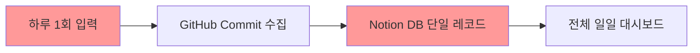
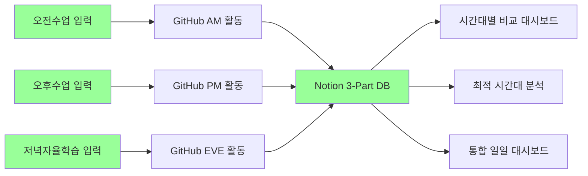
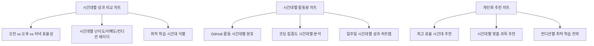

# 현재 코드베이스 → 3-Part Daily Reflection 시스템 업그레이드 분석

---

## 📊 현재 vs 목표 시스템 비교

### 🔴 현재 시스템 (Single Daily Entry)


### 🟢 목표 시스템 (3-Part Daily Reflection)


---

## 🔧 필수 변경 사항 상세 분석

### 1️⃣ 데이터 모델 변경 (가장 중요한 변경)

#### 현재 Notion DB 스키마:
```python
# sync_dashboard.py 현재 스키마 (추정)
{
    "Name": "자동화된 학습 리포트 - 2024-01-15",
    "Date": "2024-01-15",
    "Commit Count": 5,
    "Commit Messages": "오늘의 커밋 메시지들...",
    "난이도": 3,      # 전체 하루 난이도
    "이해도": 4,      # 전체 하루 이해도
    "컨디션": 4       # 전체 하루 컨디션
}
```

#### 목표 3-Part DB 스키마:
```python
# 새로운 3-Part 스키마
{
    "Name": "오전수업 리포트 - 2024-01-15",
    "Date": "2024-01-15",
    "Time_Part": "오전수업",  # 🆕 NEW: 오전/오후/저녁 구분
    "Start_Time": "09:00",   # 🆕 NEW: 시간대 시작
    "End_Time": "12:00",     # 🆕 NEW: 시간대 종료
    "Subject": "파이썬 기초", # 🆕 NEW: 해당 시간 과목/주제
    "Difficulty": 3,         # 시간대별 난이도
    "Understanding": 4,      # 시간대별 이해도
    "Condition": 4,          # 시간대별 컨디션
    "Commit_Count": 2,       # 해당 시간대 커밋 수
    "GitHub_Activities": "...", # 해당 시간대 GitHub 활동
    "Key_Learning": "...",   # 🆕 NEW: 해당 시간 핵심 학습 내용
    "Challenges": "...",     # 🆕 NEW: 해당 시간 어려웠던 점
    "Reflection": "..."      # 🆕 NEW: 해당 시간 반성/개선점
}
```

### 2️⃣ GitHub 활동 시간대별 분류 로직

#### 현재 GitHub 수집 방식:
```python
# 현재: 하루 전체 커밋 수집
def get_today_commits(owner, repo, token):
    today_start = datetime.now().replace(hour=0, minute=0, second=0, microsecond=0)
    # 00:00 ~ 23:59 전체 커밋 수집
```

#### 목표: 시간대별 GitHub 활동 분류
```python
# 새로운: 시간대별 GitHub 활동 분류
def get_time_part_activities(owner, repo, token, time_part):
    if time_part == "오전수업":
        start_hour, end_hour = 9, 12
    elif time_part == "오후수업":
        start_hour, end_hour = 13, 17
    elif time_part == "저녁자율학습":
        start_hour, end_hour = 19, 22
    
    # 해당 시간대의 커밋, 이슈, PR 활동 수집
    return {
        "commits": get_commits_by_time_range(start_hour, end_hour),
        "issues": get_issues_by_time_range(start_hour, end_hour),
        "pull_requests": get_prs_by_time_range(start_hour, end_hour)
    }
```

### 3️⃣ 입력 스크립트 3배화

#### 현재: 단일 실행 스크립트
```bash
# 현재: 하루 1회 실행
python src/notion_automation/sync_dashboard.py
```

#### 목표: 3번 실행 스크립트 시스템
```bash
# 새로운: 시간대별 3회 실행
python src/notion_automation/morning_reflection.py   # 오전수업 후
python src/notion_automation/afternoon_reflection.py # 오후수업 후  
python src/notion_automation/evening_reflection.py   # 저녁자율학습 후
```

### 4️⃣ 대시보드 시각화 로직 확장

#### 현재: 단순 일일 차트
- 전체 학습 진행 현황 (Pie)
- 난이도/이해도/컨디션 트렌드 (Flowchart)
- 일별 학습량 변화 (Flowchart)
- 커밋/과제 현황 (Pie)

#### 목표: 3-Part 비교 + 시간대별 최적화 차트


---

## 🚀 단계별 구현 우선순위

### Phase 1: 코어 데이터 모델 변경 (최우선)
1. **Notion DB 스키마 3-Part 확장**
2. **시간대별 GitHub 활동 분류 함수 구현**
3. **기존 `sync_dashboard.py` → 3개 스크립트 분할**

### Phase 2: 자동화 스크립트 구현
1. **시간대별 입력 CLI 인터페이스**
2. **자동 스케줄링 시스템**
3. **데이터 검증 및 에러 핸들링**

### Phase 3: 고급 시각화 및 분석
1. **시간대별 비교 대시보드**
2. **최적 시간대 식별 알고리즘**
3. **개인화 추천 시스템**

---

## 📂 새로운 파일 구조 (목표)

```
LG_DX_School/
├── src/
│   ├── notion_automation/
│   │   ├── __init__.py
│   │   ├── core/
│   │   │   ├── time_part_classifier.py    # 🆕 시간대 분류 로직
│   │   │   ├── github_time_analyzer.py    # 🆕 GitHub 시간대별 분석
│   │   │   └── notion_3part_client.py     # 🆕 3-Part Notion 클라이언트
│   │   ├── scripts/
│   │   │   ├── morning_reflection.py      # 🆕 오전수업 반성
│   │   │   ├── afternoon_reflection.py    # 🆕 오후수업 반성
│   │   │   ├── evening_reflection.py      # 🆕 저녁자율학습 반성
│   │   │   └── daily_summary.py           # 🆕 일일 통합 요약
│   │   ├── dashboard/
│   │   │   ├── time_part_visualizer.py    # 🆕 시간대별 시각화
│   │   │   ├── optimal_time_analyzer.py   # 🆕 최적 시간대 분석
│   │   │   └── comparison_charts.py       # 🆕 시간대 비교 차트
│   │   └── sync_dashboard.py              # 🔄 레거시 (리팩토링 예정)
│   └── utils/
│       ├── time_helpers.py                # 🆕 시간 관련 유틸리티
│       └── validation.py                  # 🆕 데이터 검증
├── config/
│   ├── time_schedules.json               # 🆕 시간대 설정
│   └── subjects_mapping.json             # 🆕 과목-시간대 매핑
└── tests/
    ├── test_time_classification.py       # 🆕 시간대 분류 테스트
    └── test_3part_integration.py         # 🆕 3-Part 통합 테스트
```

---

## ⚡ 즉시 실행 가능한 첫 번째 액션 아이템

### 🎯 Action Item #1: Notion DB 스키마 확장
- **목표**: 현재 단일 DB → 3-Part 스키마로 확장
- **예상 소요시간**: 1-2시간
- **구체적 작업**:
  1. Time_Part 필드 추가 (Select: 오전수업/오후수업/저녁자율학습)
  2. Start_Time, End_Time 필드 추가
  3. Subject, Key_Learning, Challenges, Reflection 필드 추가
  4. 기존 데이터 마이그레이션 스크립트 작성

### 🎯 Action Item #2: GitHub 시간대 분류 함수 구현
- **목표**: GitHub API로 시간대별 활동 수집
- **예상 소요시간**: 2-3시간
- **구체적 작업**:
  1. `get_time_part_activities()` 함수 구현
  2. 커밋 시간 파싱 및 시간대 분류 로직
  3. 이슈, PR 활동도 시간대별 분류

### 🎯 Action Item #3: 기존 코드 3-Part 분할
- **목표**: `sync_dashboard.py` → 3개 시간대별 스크립트
- **예상 소요시간**: 3-4시간
- **구체적 작업**:
  1. `morning_reflection.py` 생성
  2. `afternoon_reflection.py` 생성  
  3. `evening_reflection.py` 생성
  4. 공통 로직은 `core/` 모듈로 분리

---

## 💡 다음 질문 및 결정 사항

1. **어떤 Action Item부터 시작하시겠습니까?**
2. **기존 Notion DB 데이터를 유지하면서 확장할지, 새로 생성할지?**
3. **GitHub 활동 시간대 분류 기준을 어떻게 설정할지? (커밋 시간 vs 작업 시간)**
4. **3-Part 스크립트를 자동 스케줄링할지, 수동 실행할지?**

이 분석을 바탕으로 구체적인 구현을 시작하시겠습니까?
