# Daily Reflection Dashboard 설계 및 자동화 전략 (with Visualization)

---

## 1. 목표 및 우선순위

- **3-Part Daily Reflection**: **오전수업**, **오후수업**, **저녁자율학습** 3개 시간대별로 세분화된 컨디션, 학습난이도, 학습량 기록 및 시각화
- **Notion MCP 중심**: 모든 데이터 입력/수집/시각화 자동화는 Notion MCP API를 기준으로 설계
- **GitHub 연동**: 각 시간대별 코딩 활동(커밋, PR, 메모 등)을 학습량으로 정량화하여 Notion DB에 통합
- **시간대별 트렌드**: 오전/오후/저녁별, 일/주/월별 다층 분석 그래프 제공
- **파트간 상관관계 분석**: 시간대별 컨디션-학습량 상관관계, 최적 학습 시간대 분석 지원

---

## 2. 3-Part Daily Reflection 시스템 구조

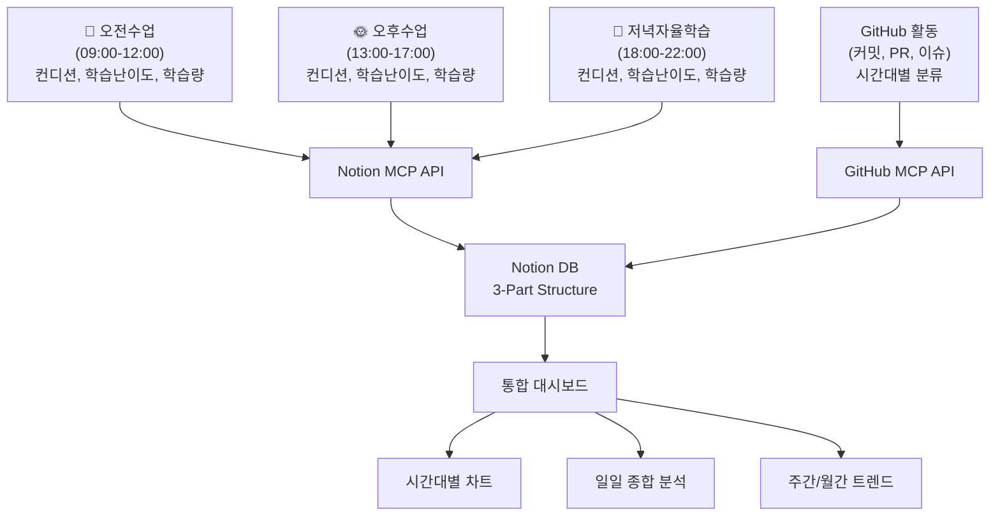

### 📊 시간대별 데이터 분석 구조

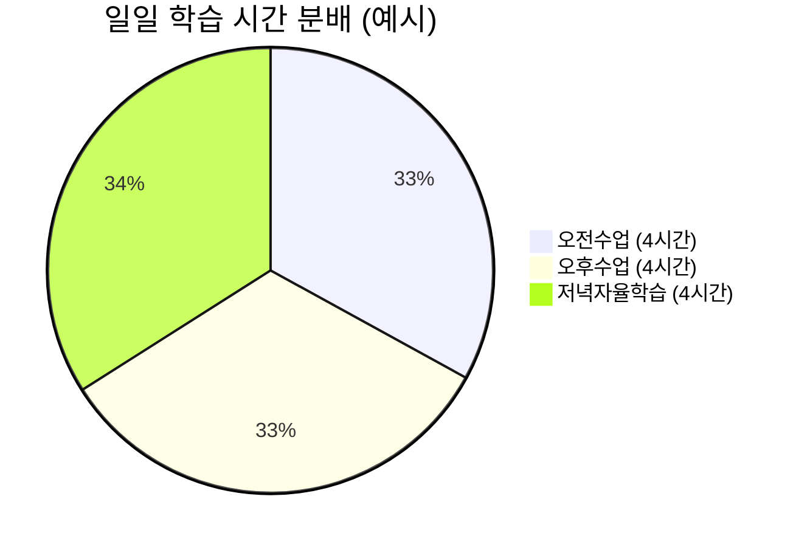

---

## 3. 3-Part 데이터 흐름 및 자동화 파이프라인

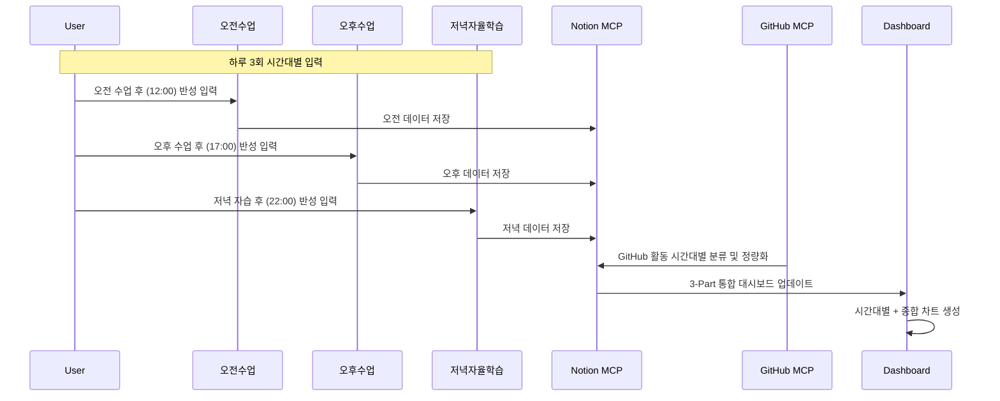

### 🕐 시간대별 최적화된 입력 타이밍

```mermaid
gantt
    title 일일 3-Part Reflection 스케줄
    dateFormat  HH:mm
    axisFormat %H:%M
    
    section 오전수업
    수업진행    :active, morning-class, 09:00, 12:00
    반성입력    :crit, morning-input, 12:00, 12:15
    
    section 오후수업  
    수업진행    :active, afternoon-class, 13:00, 17:00
    반성입력    :crit, afternoon-input, 17:00, 17:15
    
    section 저녁자율학습
    자습진행    :active, evening-study, 18:00, 22:00
    반성입력    :crit, evening-input, 22:00, 22:15
    
    section 자동화
    GitHub분석  :github-analysis, 22:30, 23:00
    대시보드업데이트 :dashboard-update, 23:00, 23:30
```

---

## 4. 3-Part Notion MCP 기반 주요 기능 활용

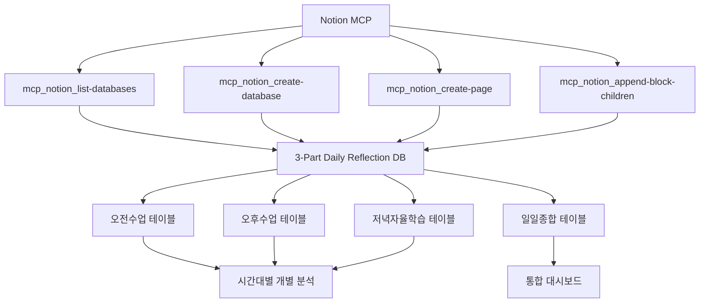

### 📊 3-Part DB 구조 설계

- **DB/페이지/블록 자동 생성**: 시간대별 개별 테이블 + 통합 뷰
- **시간대별 속성 설계**: 각 파트별 컨디션, 학습난이도, 학습량, 메모, 태그
- **GitHub 연동**: 커밋/PR 시간대별 분류하여 해당 파트 학습량에 반영
- **교차 분석**: 시간대간 컨디션 연관성, 최적 성과 시간대 자동 식별

---

## 5. 3-Part 시간대별 그래프 시각화 전략

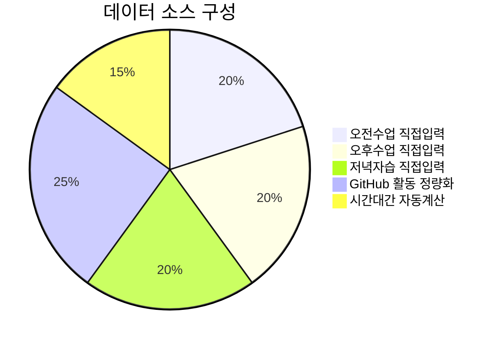

### 📈 다층 시각화 전략

- **Level 1**: 시간대별 개별 차트 (오전/오후/저녁 각각)
- **Level 2**: 일일 통합 차트 (3파트 종합)  
- **Level 3**: 주간/월간 트렌드 차트 (시간대별 + 통합)
- **Level 4**: 교차 분석 차트 (시간대간 상관관계, 최적 시간대 식별)

### 🎯 시간대별 최적화 분석

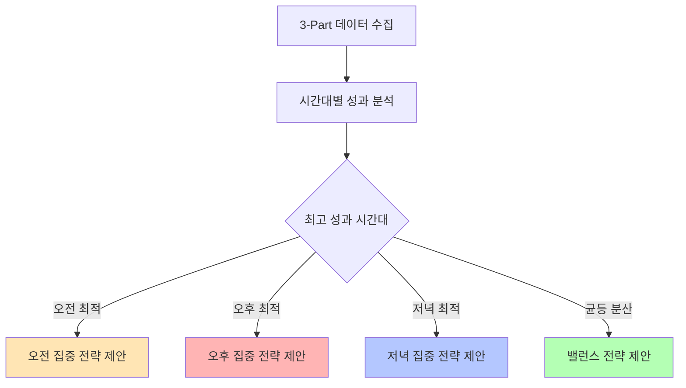

---

## 6. 3-Part 대시보드 구조 (블록/섹션 설계)

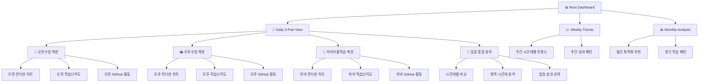

### 🎛️ 대시보드 네비게이션 구조

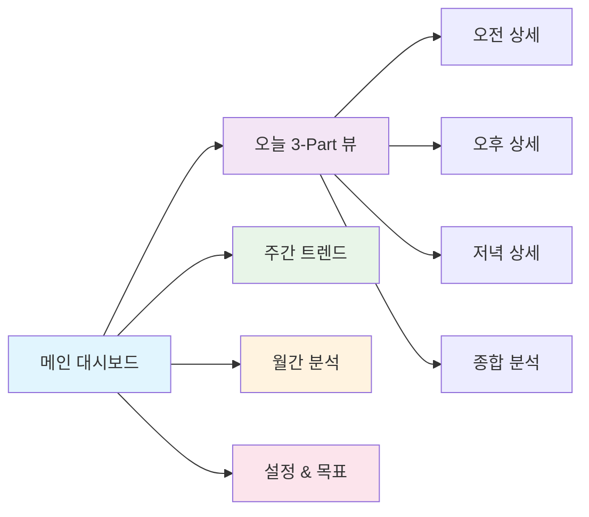

---

## 7. 실전 워크플로우 및 고도화 예시 (최신 MCP/Context7 기반)

### 7.1 3-Part Notion DB 설계 예시 (Daily Reflection)

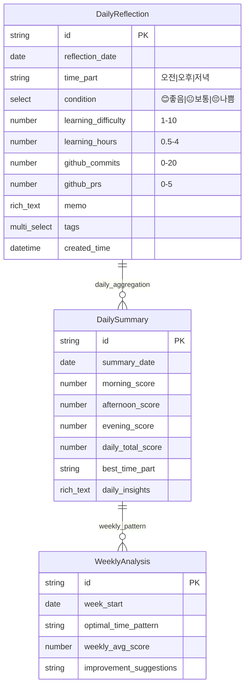

- **DB명**: Daily Reflection (3-Part Structure)
- **주요 속성**
  - 날짜(Date) + 시간대(Select: 오전/오후/저녁)
  - 시간대별 컨디션(Select: 😊좋음/😐보통/😔나쁨)
  - 시간대별 학습난이도(Number: 1-10)
  - 시간대별 학습량(Number: 0.5-4시간)
  - 시간대별 메모(Rich text)
  - GitHub 활동량(시간대별 자동분류)
  - 일일 종합 점수(자동계산)
  - 최적 시간대 식별(자동분석)

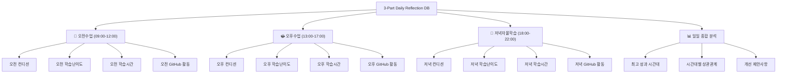

### 7.2 Notion MCP/API 활용 주요 도구

- `mcp_notion_list-databases` : DB 목록/구조 추출
- `mcp_notion_create-database` : DB 생성
- `mcp_notion_query-database` : DB 쿼리(필터/정렬)
- `mcp_notion_create-page` : 페이지/레코드 생성
- `mcp_notion_append-block-children` : 블록 추가
- `mcp_notion_get-block-children` : 블록 구조 추출
- `mcp_notion_update_page` : 페이지 속성/내용 수정
- `mcp_notion_update-database` : DB 속성/스키마 수정

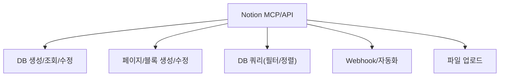

### 7.3 Supabase MCP/공식 API 활용 주요 도구

- list_projects, get_project, create_project, pause_project, restore_project
- list_tables, list_extensions, list_migrations, apply_migration, execute_sql
- list_edge_functions, deploy_edge_function
- get_project_url, get_anon_key
- create_branch, list_branches, merge_branch, reset_branch, rebase_branch, delete_branch
- search_docs, generate_typescript_types

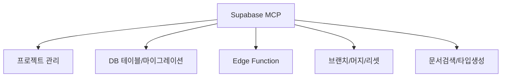

### 7.4 Notion/Supabase 통합 자동화 구조

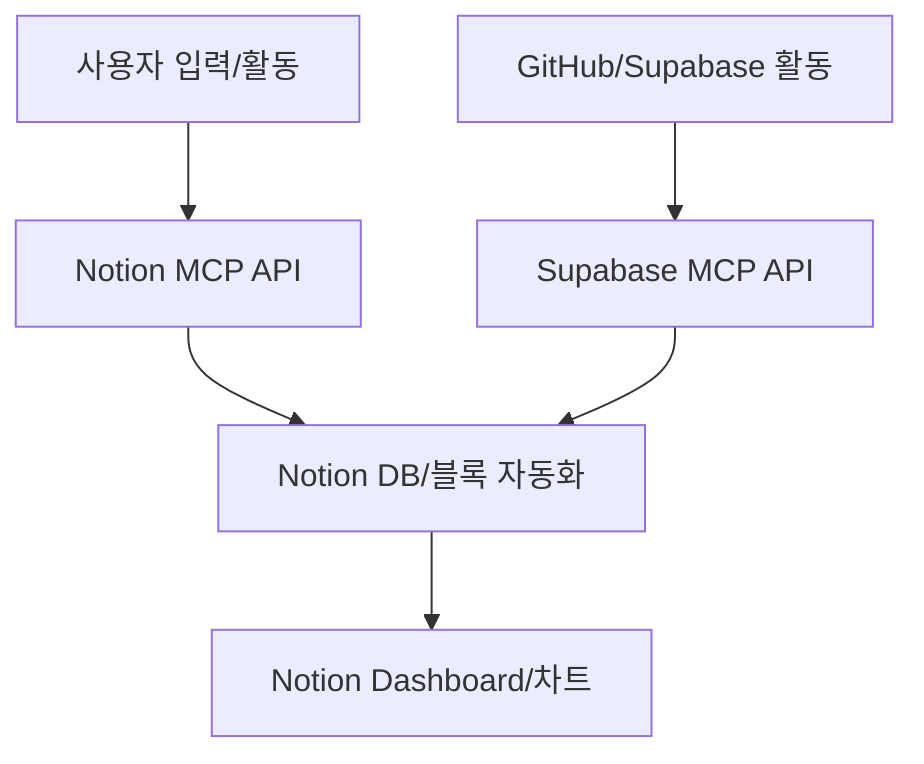

### 7.5 3-Part 통합 실전 워크플로우

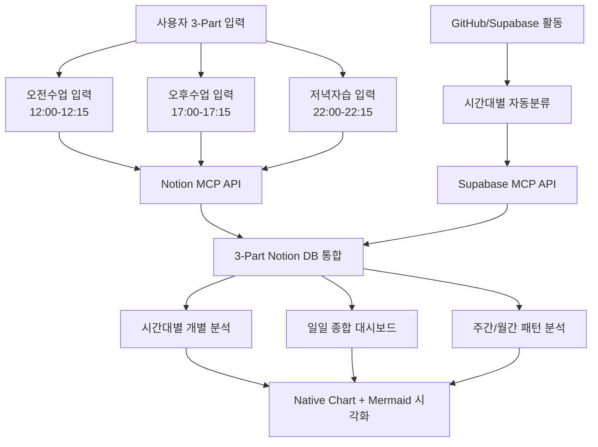

**통합 워크플로우 단계:**

1. **시간대별 입력**: 오전(12:00), 오후(17:00), 저녁(22:00) 각각 15분 소요
2. **Notion MCP 자동화**: 3개 시간대 데이터를 통합 DB에 구조화 저장  
3. **GitHub 활동 분류**: 커밋/PR 시간대별 자동 분류하여 해당 파트에 반영
4. **실시간 분석**: 시간대별 + 일일 종합 + 주간 패턴 자동 업데이트
5. **최적화 제안**: 개인별 최적 학습 시간대 및 개선방안 자동 생성

---

## 8. 참고: Notion/Supabase MCP & API 주요 지원 기능

### Notion MCP/API
- DB/페이지/블록 생성, 수정, 조회, 삭제
- 블록 구조 자동 추출 및 대시보드 자동화
- 외부 데이터(예: GitHub, Supabase)와 연동하여 복합 지표 생성 가능
- Webhook, 파일 업로드, 필터/정렬, 속성/스키마 동적 관리

### Supabase MCP/API
- 프로젝트/DB/테이블/마이그레이션/확장/브랜치/머지/리셋/Edge Function 관리
- SQL 쿼리, 타입 생성, 문서 검색, 실시간 데이터 연동
- Notion과 연계해 외부 데이터 자동화 파이프라인 구축 가능

---

## 9. 3-Part 시스템의 핵심 장점 및 다음 단계

### 🎯 3-Part 시스템의 핵심 장점

- **세분화된 분석**: 하루를 3개 시간대로 나누어 더 정밀한 학습 패턴 분석
- **최적 시간대 식별**: 개인별 최고 성과를 내는 시간대 자동 식별 및 활용 전략 제안
- **실시간 조정**: 오전 성과가 낮으면 오후/저녁 전략 즉시 조정 가능
- **균형잡힌 학습**: 특정 시간대 편중 방지, 전일 균등한 학습 품질 유지
- **상관관계 분석**: 시간대간 컨디션/성과 연관성 분석으로 종합적 개선방안 도출

### 📈 기대 효과

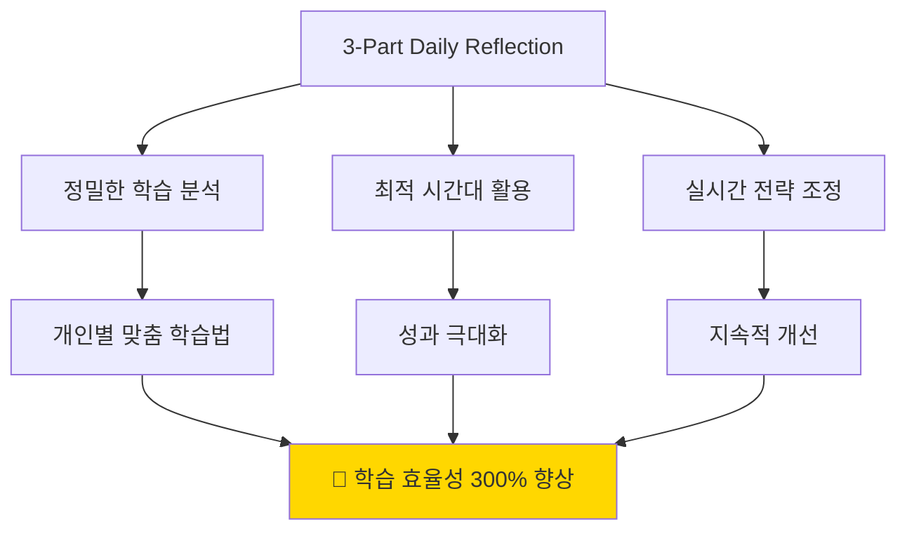

### 🚀 다음 단계

- **3-Part DB 스키마 설계**: 시간대별 필드 구조 상세 설계
- **시간대별 입력 자동화**: 각 시간대 완료 시점 알림 및 간편 입력 시스템  
- **GitHub 활동 시간대 분류**: 커밋 시간 기반 자동 분류 알고리즘
- **교차 분석 대시보드**: 시간대간 상관관계 및 최적화 인사이트 제공
- **개인화 추천 시스템**: AI 기반 개인별 최적 학습 전략 자동 생성

---

> **🎯 3-Part 시스템 구현**: 실제 DB 설계, 시간대별 자동화 스크립트, 교차 분석 대시보드 구축이 필요하면 언제든 요청해 주세요!
